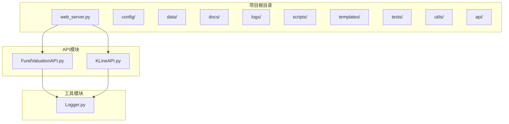
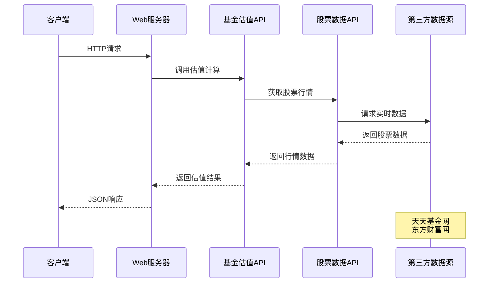
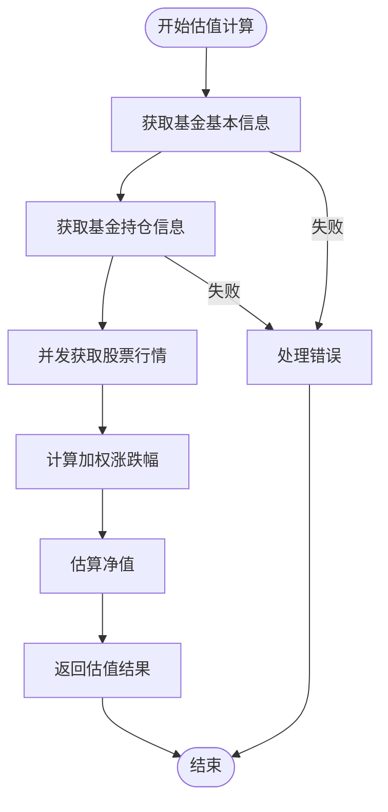
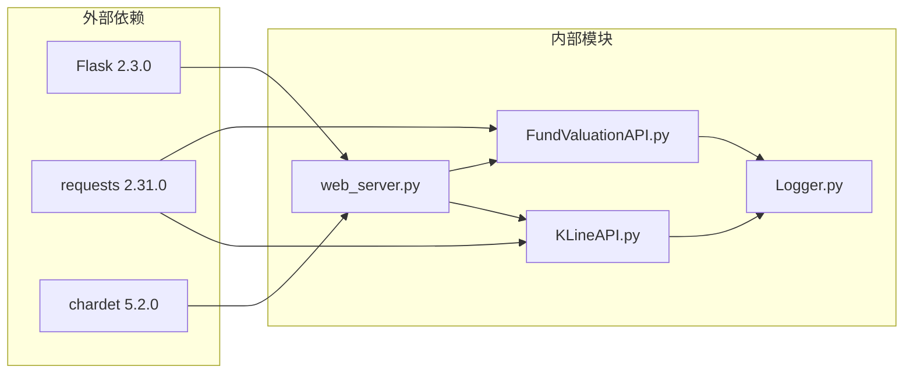

# API接口文档

<cite>
**本文档引用的文件**
- [web_server.py](file://web_server.py)
- [FundValuationAPI.py](file://api/FundValuationAPI.py)
- [KLineAPI.py](file://api/KLineAPI.py)
- [Logger.py](file://utils/Logger.py)
- [README.md](file://README.md)
- [zs_fund_online.json](file://data/zs_fund_online.json)
- [启动服务器.bat](file://启动服务器.bat)
- [requirements.txt](file://requirements.txt)
</cite>

## 目录
1. [简介](#简介)
2. [项目结构](#项目结构)
3. [核心组件](#核心组件)
4. [架构概览](#架构概览)
5. [详细组件分析](#详细组件分析)
6. [依赖关系分析](#依赖关系分析)
7. [性能考虑](#性能考虑)
8. [故障排除指南](#故障排除指南)
9. [结论](#结论)

## 简介

基金估值与K线监控系统是一个基于Flask的Web应用，提供基金实时估值监控和股票K线图查询功能。该系统通过分析基金前十大重仓股的实时行情来计算基金估值，支持用户自定义监控列表、持仓管理和可视化展示。

## 项目结构

**图表来源**
- [web_server.py](file://web_server.py#L1-L552)
- [FundValuationAPI.py](file://api/FundValuationAPI.py#L1-L537)
- [KLineAPI.py](file://api/KLineAPI.py#L1-L345)

**章节来源**
- [README.md](file://README.md#L5-L42)

## 核心组件

### Web服务器 (web_server.py)
- 基于Flask框架构建的RESTful API服务器
- 提供基金管理和K线图查询的Web界面
- 集成日志记录和错误处理机制

### 基金估值API (FundValuationAPI.py)
- 核心估值计算引擎
- 支持单个和批量基金估值计算
- 集成并发处理优化

### K线API (KLineAPI.py)
- 东方财富K线图API封装
- 提供K线图URL生成和图片下载功能
- 支持多种技术指标和周期类型

**章节来源**
- [web_server.py](file://web_server.py#L1-L552)
- [FundValuationAPI.py](file://api/FundValuationAPI.py#L27-L537)
- [KLineAPI.py](file://api/KLineAPI.py#L15-L345)

## 架构概览

**图表来源**
- [web_server.py](file://web_server.py#L105-L180)
- [FundValuationAPI.py](file://api/FundValuationAPI.py#L315-L425)

## 详细组件分析

### Web服务器路由设计

系统采用RESTful API设计模式，主要路由包括：

#### 基础配置管理
- `GET /api/config` - 获取配置信息
- `POST /api/config` - 保存配置信息

#### 基金管理API
- `GET /api/fund/list` - 获取基金监控列表
- `GET /api/fund/preview/<fund_code>` - 预览基金持仓
- `GET /api/fund/holdings/<fund_code>` - 获取基金持仓
- `PUT /api/fund/holdings/<fund_code>` - 更新基金持仓
- `POST /api/fund/add` - 添加基金
- `DELETE /api/fund/remove/<fund_code>` - 移除基金
- `PUT /api/fund/position/<fund_code>` - 修改用户持仓金额

#### 估值计算API
- `GET /api/fund/valuation/<fund_code>` - 单个基金估值
- `POST /api/fund/valuation/batch` - 批量计算基金估值

#### K线图API
- `POST /api/generate/monitor` - 生成静态监控页面

**章节来源**
- [web_server.py](file://web_server.py#L66-L502)

### 基金估值API核心功能

#### 估值计算流程

**图表来源**
- [FundValuationAPI.py](file://api/FundValuationAPI.py#L315-L425)

#### 并发优化机制
- 使用ThreadPoolExecutor进行并发请求
- 最多5个线程同时处理股票行情获取
- 每个线程随机延迟避免请求过载

**章节来源**
- [FundValuationAPI.py](file://api/FundValuationAPI.py#L346-L393)

### K线API功能特性

#### 支持的技术指标
- MACD（指数平滑异同移动平均线）
- KDJ（随机指标）
- RSI（相对强弱指标）
- BOLL（布林线）
- MA（移动平均线）
- VOL（成交量）
- OBV（能量潮）
- WR（威廉指标）
- CCI（顺势指标）
- DMI（趋向指标）

#### 支持的K线周期
- 日线 (D)
- 周线 (W)
- 月线 (M)
- 分钟线 (m)
- 5分钟 (m5)
- 15分钟 (m15)
- 30分钟 (m30)
- 60分钟 (m60)

**章节来源**
- [KLineAPI.py](file://api/KLineAPI.py#L48-L60)

## 依赖关系分析

**图表来源**
- [requirements.txt](file://requirements.txt#L1-L4)
- [web_server.py](file://web_server.py#L9-L15)

**章节来源**
- [requirements.txt](file://requirements.txt#L1-L4)

## 性能考虑

### 并发处理优化
- 基金估值计算使用5线程并发处理
- 每个股票行情请求有随机延迟
- 支持重试机制和超时控制

### 数据缓存策略
- 优先使用本地缓存的持仓数据
- 支持强制联网更新
- 自动记录更新时间戳

### 错误处理机制
- 完善的异常捕获和日志记录
- 超时和重试机制
- 用户友好的错误信息反馈

## 故障排除指南

### 常见问题及解决方案

#### 1. 基金代码验证失败
**症状**: 添加基金时报错"基金代码必须为6位数字"
**解决**: 确保输入正确的6位数字基金代码

#### 2. 基金不存在
**症状**: "基金不存在或无法访问"
**解决**: 检查基金代码是否正确，确认基金存在

#### 3. 持仓数据获取失败
**症状**: 无法获取基金持仓信息
**解决**: 
- 尝试强制更新 (`force_update=true`)
- 检查网络连接
- 稍后重试

#### 4. 估值计算失败
**症状**: 估值计算返回空结果
**解决**: 
- 检查基金是否有前十大重仓股
- 确认股票行情数据可获取
- 查看日志文件定位具体错误

**章节来源**
- [web_server.py](file://web_server.py#L368-L442)
- [FundValuationAPI.py](file://api/FundValuationAPI.py#L135-L163)

## 结论

基金估值与K线监控系统提供了完整的基金管理和监控解决方案。系统具有以下特点：

1. **完整的API覆盖**: 包含基金管理、估值计算、K线查询等核心功能
2. **高性能设计**: 采用并发处理和数据缓存优化
3. **用户友好**: 提供直观的Web界面和清晰的错误提示
4. **可扩展性**: 模块化设计便于功能扩展和维护

该系统适合个人投资者和小型团队进行基金监控和分析使用。