# K线图生成API

<cite>
**本文档引用的文件**
- [KLineAPI.py](file://api/KLineAPI.py)
- [web_server.py](file://web_server.py)
- [README.md](file://README.md)
- [requirements.txt](file://requirements.txt)
- [FundValuationAPI.py](file://api/FundValuationAPI.py)
- [monitor.html](file://templates/monitor.html)
- [test_config.json](file://config/test_config.json)
- [zs_online.json](file://data/zs_online.json)
- [zs_fund_online.json](file://data/zs_fund_online.json)
</cite>

## 目录
1. [简介](#简介)
2. [项目结构](#项目结构)
3. [核心组件](#核心组件)
4. [架构概览](#架构概览)
5. [详细组件分析](#详细组件分析)
6. [依赖关系分析](#依赖关系分析)
7. [性能考虑](#性能考虑)
8. [故障排除指南](#故障排除指南)
9. [结论](#结论)
10. [附录](#附录)

## 简介

K线图生成API是一个基于Python的股票K线图查询和下载系统，主要功能包括：
- 生成东方财富网的K线图URL
- 下载K线图片到本地
- 批量处理多个股票的K线图
- 提供HTML图片标签生成
- 支持多种技术指标和时间周期

该系统通过封装东方财富网的K线图API，为开发者提供了简单易用的接口来获取和处理股票K线数据。

## 项目结构

项目采用模块化设计，主要包含以下核心模块：

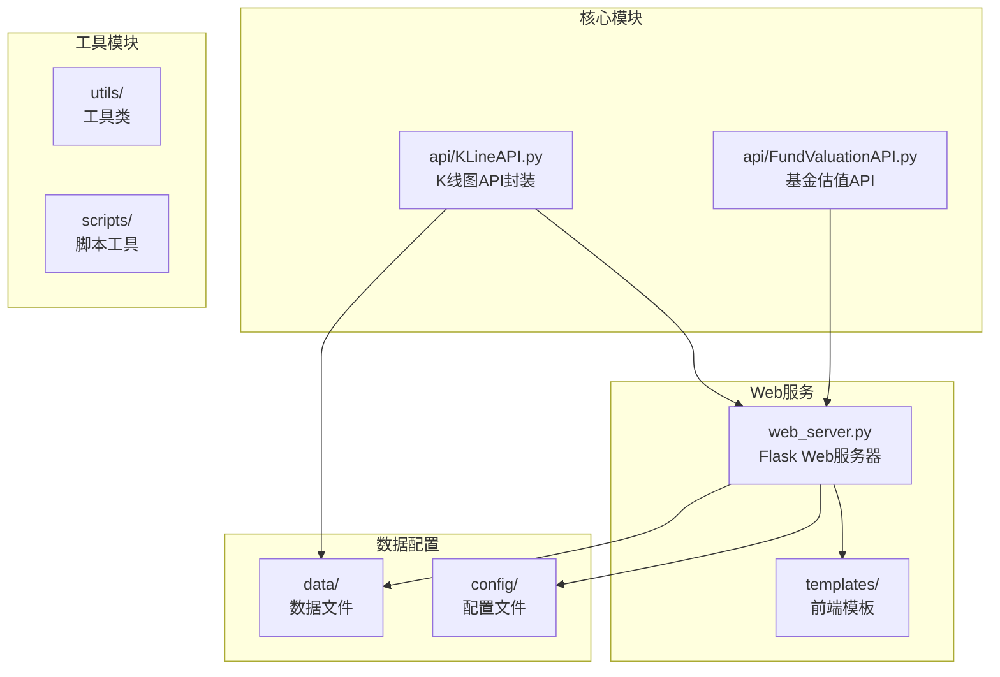

**图表来源**
- [web_server.py](file://web_server.py#L1-L562)
- [KLineAPI.py](file://api/KLineAPI.py#L1-L345)

**章节来源**
- [README.md](file://README.md#L1-L193)
- [requirements.txt](file://requirements.txt#L1-L4)

## 核心组件

### KLineAPI类

KLineAPI是整个系统的核心类，提供了完整的K线图生成功能：

#### 主要功能特性
- **URL生成**: 生成指向东方财富网K线图的完整URL
- **图片下载**: 直接下载K线图片到本地文件系统
- **批量处理**: 支持批量下载多个股票的K线图
- **HTML集成**: 生成可在网页中直接使用的HTML图片标签
- **参数验证**: 内置参数验证和默认值处理

#### 关键配置参数

| 参数名 | 类型 | 默认值 | 描述 |
|--------|------|--------|------|
| stock_code | str | 必填 | 证券代码，格式如 '1.000300' |
| period | str | 'D' | K线周期类型 |
| indicator | str | 'MACD' | 技术指标类型 |
| unit_width | int | -5 | 图片单元宽度 |
| show_volume | bool | True | 是否显示成交量 |
| image_type | str | 'KXL' | 图片类型 |

**章节来源**
- [KLineAPI.py](file://api/KLineAPI.py#L62-L264)

## 架构概览

系统采用分层架构设计，清晰分离了业务逻辑、数据访问和用户界面：

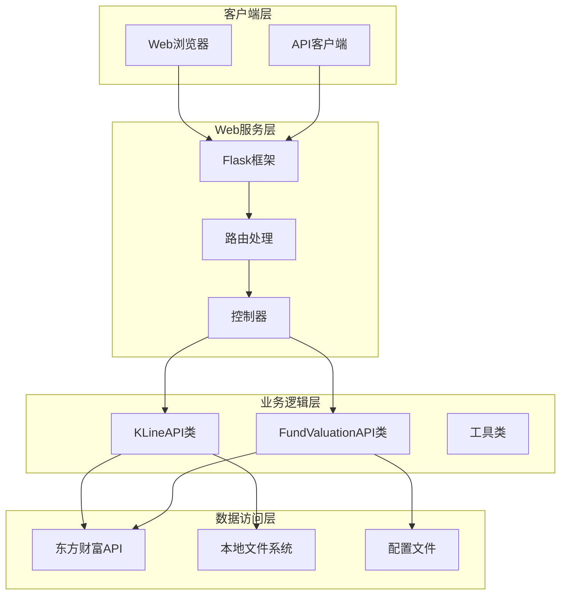

**图表来源**
- [web_server.py](file://web_server.py#L20-L562)
- [KLineAPI.py](file://api/KLineAPI.py#L15-L264)

## 详细组件分析

### KLineAPI类详细分析

#### 类结构图

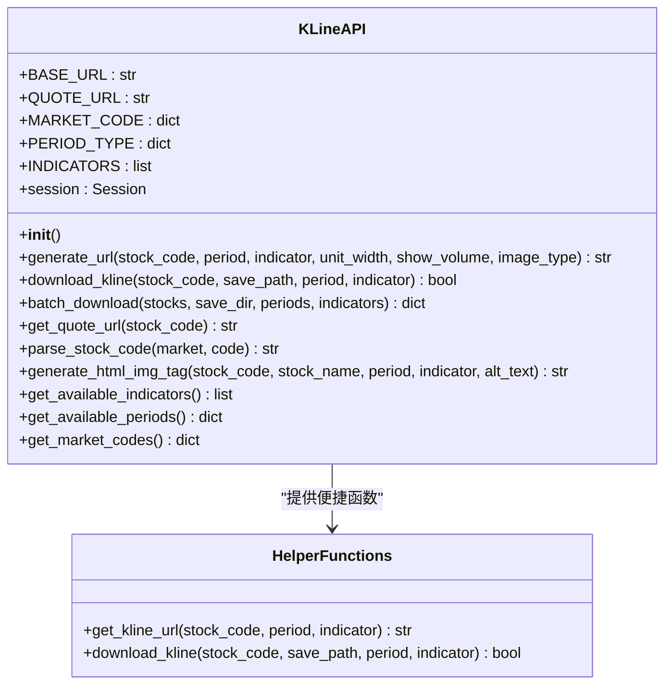

**图表来源**
- [KLineAPI.py](file://api/KLineAPI.py#L15-L345)

#### URL生成流程

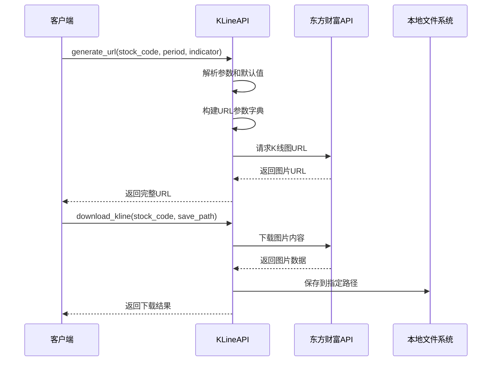

**图表来源**
- [KLineAPI.py](file://api/KLineAPI.py#L69-L150)

#### 批量下载流程

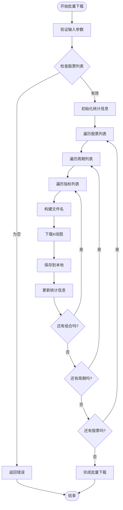

**图表来源**
- [KLineAPI.py](file://api/KLineAPI.py#L151-L194)

**章节来源**
- [KLineAPI.py](file://api/KLineAPI.py#L62-L345)

### Web服务器集成

#### API路由设计

系统通过Flask框架提供RESTful API接口：

| 路由 | 方法 | 功能 | 请求参数 | 响应 |
|------|------|------|----------|------|
| `/api/kline/url` | POST | 生成K线图URL | stock_code, period, indicator | URL字符串 |
| `/api/kline/download` | POST | 下载K线图 | stock_code, save_path, period, indicator | 下载结果 |
| `/api/kline/batch` | POST | 批量下载K线图 | stocks, save_dir, periods, indicators | 统计结果 |

#### Web界面集成

系统集成了完整的Web界面，支持实时K线图显示：

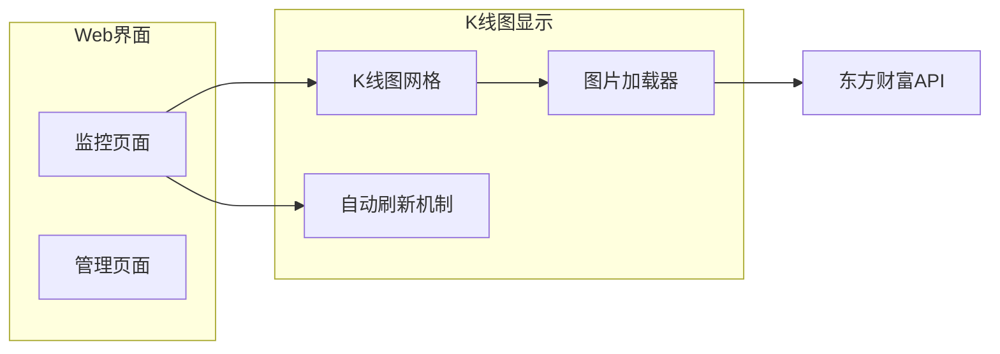

**图表来源**
- [monitor.html](file://templates/monitor.html#L373-L398)
- [web_server.py](file://web_server.py#L54-L58)

**章节来源**
- [web_server.py](file://web_server.py#L20-L562)
- [monitor.html](file://templates/monitor.html#L1-L918)

### 技术指标说明

系统支持多种技术指标，每种指标都有其特定的应用场景：

#### 支持的技术指标

| 指标名称 | 英文全称 | 描述 | 应用场景 |
|----------|----------|------|----------|
| MACD | Moving Average Convergence Divergence | 指数平滑异同移动平均线 | 趋势判断、买卖信号 |
| KDJ | 随机指标 | 随机震荡指标 | 超买超卖判断 |
| RSI | Relative Strength Index | 相对强弱指标 | 动能分析 |
| BOLL | Bollinger Bands | 布林线 | 波动性分析 |
| MA | Moving Average | 移动平均线 | 趋势识别 |
| VOL | Volume | 成交量 | 量价关系分析 |
| OBV | On Balance Volume | 能量潮指标 | 资金流向分析 |
| WR | Williams %R | 威廉指标 | 超买超卖判断 |
| CCI | Commodity Channel Index | 顺势指标 | 趋势强度分析 |
| DMI | Directional Movement Index | 趋向指标 | 趋势方向判断 |

**章节来源**
- [KLineAPI.py](file://api/KLineAPI.py#L48-L60)

### 数据配置管理

#### 配置文件结构

系统使用JSON格式的配置文件来管理数据：

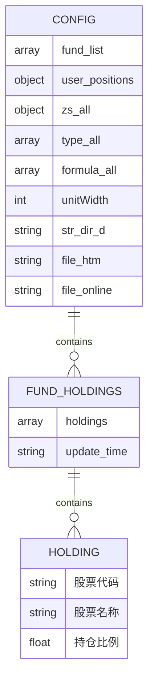

**图表来源**
- [zs_fund_online.json](file://data/zs_fund_online.json#L1-L238)

**章节来源**
- [zs_online.json](file://data/zs_online.json#L1-L58)
- [test_config.json](file://config/test_config.json#L1-L59)

## 依赖关系分析

### 外部依赖

系统依赖以下主要外部库：

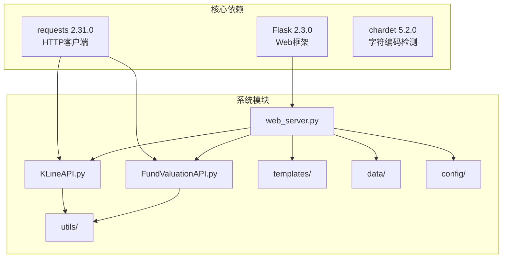

**图表来源**
- [requirements.txt](file://requirements.txt#L1-L4)
- [web_server.py](file://web_server.py#L9-L18)

### 内部模块依赖

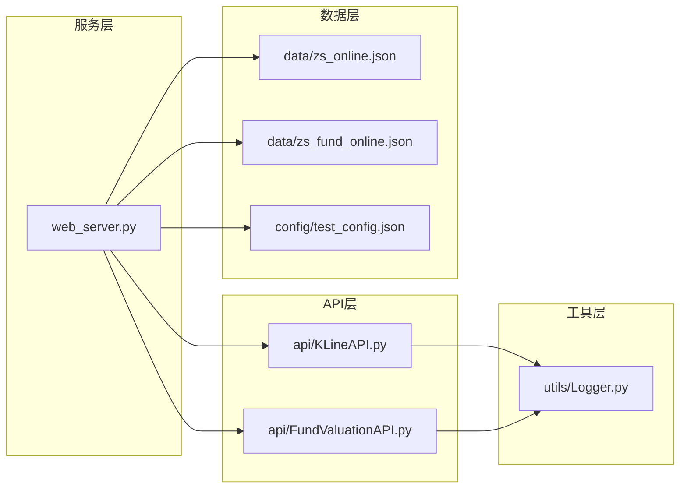

**图表来源**
- [web_server.py](file://web_server.py#L9-L27)
- [KLineAPI.py](file://api/KLineAPI.py#L9-L12)

**章节来源**
- [requirements.txt](file://requirements.txt#L1-L4)

## 性能考虑

### 并发处理

系统在多个层面实现了性能优化：

#### 1. HTTP连接池
- 使用requests.Session()建立持久连接
- 减少TCP连接开销
- 支持连接复用

#### 2. 批量处理优化
- 支持批量下载多个股票的K线图
- 减少重复的网络请求
- 统一的错误处理机制

#### 3. 缓存策略
- 配置文件缓存持仓数据
- 避免重复的网络请求
- 支持强制更新机制

### 性能监控

系统内置了性能监控功能：

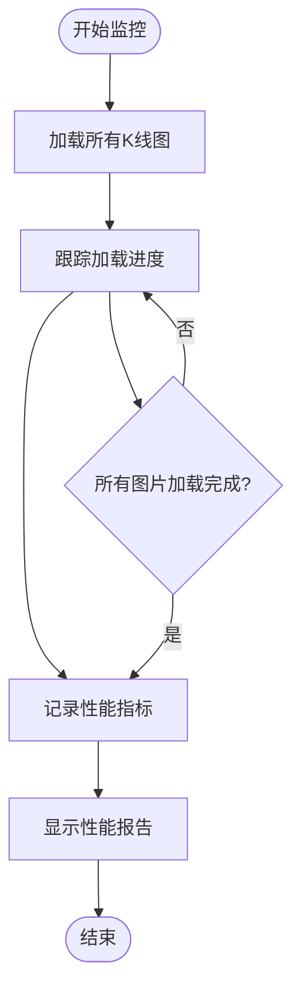

**图表来源**
- [monitor.html](file://templates/monitor.html#L485-L534)

## 故障排除指南

### 常见问题及解决方案

#### 1. 网络连接问题
**症状**: 下载失败，返回False
**原因**: 网络超时或服务器不可达
**解决方案**: 
- 检查网络连接状态
- 增加timeout参数
- 验证东方财富API可用性

#### 2. 股票代码格式错误
**症状**: URL生成失败或返回空结果
**原因**: 股票代码格式不符合要求
**解决方案**:
- 确保股票代码格式正确
- 使用parse_stock_code方法
- 验证市场代码映射

#### 3. 权限问题
**症状**: 文件保存失败
**原因**: 目录权限不足或磁盘空间不足
**解决方案**:
- 检查目标目录权限
- 确保磁盘空间充足
- 使用绝对路径

#### 4. API限制
**症状**: 请求被拒绝或返回错误
**原因**: 频繁请求触发API限制
**解决方案**:
- 实现请求间隔控制
- 使用代理服务器
- 降低请求频率

**章节来源**
- [KLineAPI.py](file://api/KLineAPI.py#L132-L149)

### 错误处理机制

系统实现了完善的错误处理机制：

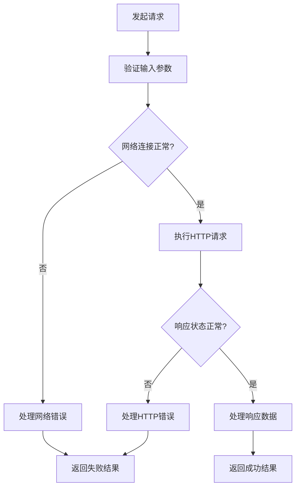

**图表来源**
- [KLineAPI.py](file://api/KLineAPI.py#L132-L149)

## 结论

K线图生成API是一个功能完整、设计合理的股票数据处理系统。其主要优势包括：

### 核心优势
1. **简洁易用**: 提供直观的API接口和便捷函数
2. **功能全面**: 支持多种技术指标和时间周期
3. **性能优化**: 实现了连接池和批量处理
4. **错误处理**: 完善的异常处理和恢复机制
5. **Web集成**: 提供完整的Web界面和API接口

### 技术特色
- 基于Flask的轻量级Web服务
- 支持多种技术指标的K线图生成
- 内置性能监控和错误处理
- 配置文件驱动的数据管理
- 批量处理和并发优化

### 应用场景
- 股票分析平台
- 量化交易系统
- 投资决策支持
- 金融数据可视化
- 教育和研究用途

该系统为开发者提供了强大的K线图生成和处理能力，是构建股票分析应用的理想选择。

## 附录

### API使用示例

#### 基本使用
```python
from api.KLineAPI import KLineAPI

# 创建API实例
api = KLineAPI()

# 生成K线图URL
url = api.generate_url('1.000300', period='D', indicator='MACD')
print(f"K线图URL: {url}")

# 下载K线图
success = api.download_kline('1.000300', './charts/hs300.png', 'D', 'MACD')
print(f"下载结果: {success}")
```

#### 批量处理
```python
# 批量下载多个股票
stocks = {
    '1.000300': '沪深300',
    '0.399006': '创业板指',
    '1.000016': '上证50'
}

results = api.batch_download(
    stocks, 
    './charts', 
    periods=['D', 'W'], 
    indicators=['MACD']
)
print(f"批量下载结果: {results}")
```

#### Web集成
```python
# 在Flask应用中使用
from flask import Flask, jsonify
from api.KLineAPI import KLineAPI

app = Flask(__name__)

@app.route('/api/kline/url', methods=['POST'])
def generate_kline_url():
    data = request.get_json()
    api = KLineAPI()
    url = api.generate_url(
        data['stock_code'],
        data.get('period', 'D'),
        data.get('indicator', 'MACD')
    )
    return jsonify({'url': url})
```

### 配置说明

#### 基础配置
- **fund_list**: 监控的基金代码列表
- **user_positions**: 用户持仓金额配置
- **zs_all**: 股票指数配置
- **type_all**: 支持的时间周期
- **formula_all**: 支持的技术指标
- **unitWidth**: 图片宽度设置

#### 数据格式示例
```json
{
  "fund_list": ["001593", "015752"],
  "user_positions": {
    "001593": 10000,
    "015752": 5000
  },
  "zs_all": {
    "1.000300": ["沪深300", "007045,005918"]
  }
}
```

**章节来源**
- [README.md](file://README.md#L132-L173)
- [zs_fund_online.json](file://data/zs_fund_online.json#L1-L238)