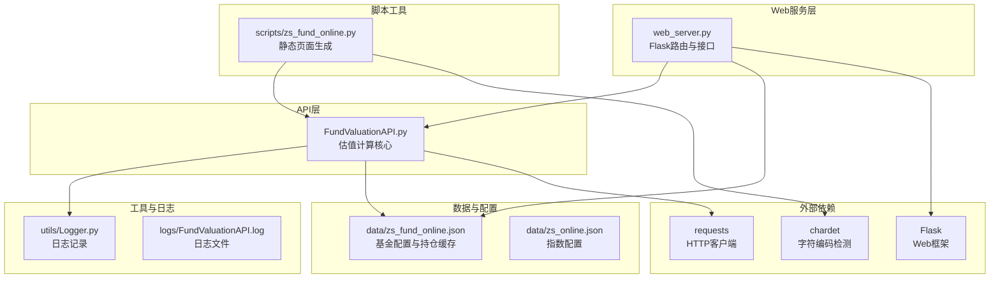
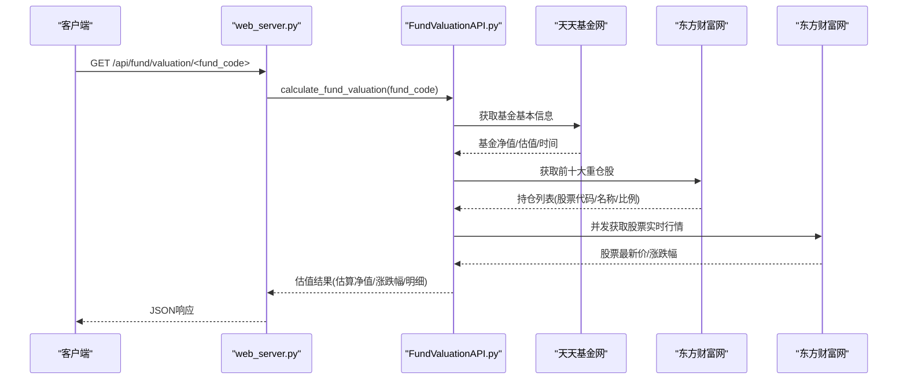
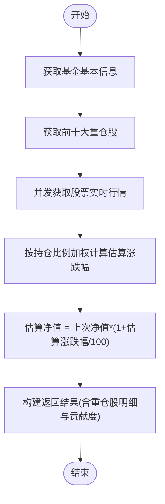
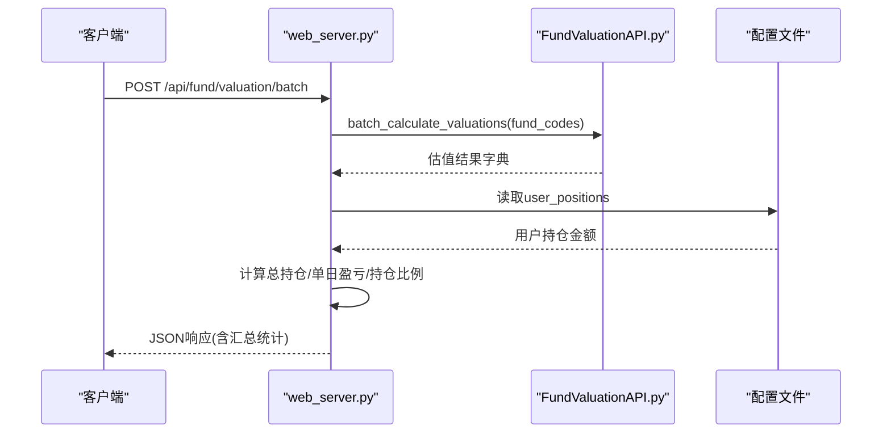
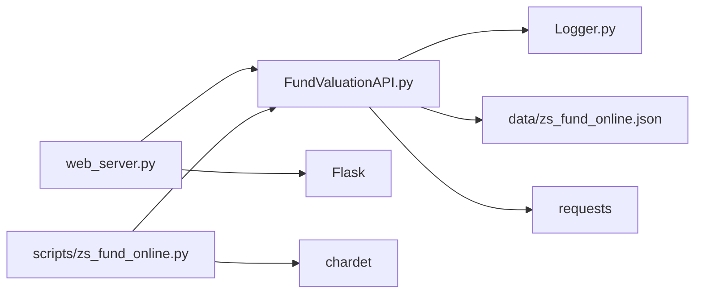

# 估值计算API

<cite>
**本文引用的文件**
- [FundValuationAPI.py](file://api/FundValuationAPI.py)
- [web_server.py](file://web_server.py)
- [Logger.py](file://utils/Logger.py)
- [zs_fund_online.py](file://scripts/zs_fund_online.py)
- [README.md](file://README.md)
- [FundValuationAPI.log](file://logs/FundValuationAPI.log)
- [zs_fund_online.json](file://data/zs_fund_online.json)
- [requirements.txt](file://requirements.txt)
</cite>

## 目录
1. [简介](#简介)
2. [项目结构](#项目结构)
3. [核心组件](#核心组件)
4. [架构概览](#架构概览)
5. [详细组件分析](#详细组件分析)
6. [依赖关系分析](#依赖关系分析)
7. [性能考量](#性能考量)
8. [故障排查指南](#故障排查指南)
9. [结论](#结论)
10. [附录](#附录)

## 简介
本项目提供基金实时估值计算API，支持单个基金估值计算与批量估值计算。系统通过抓取基金前十大重仓股的实时涨跌，结合持仓权重，估算当前交易日的基金净值与涨跌幅。API采用并发请求优化，具备本地持仓缓存、数据验证与日志记录能力，便于集成到Web应用或自动化脚本中。

## 项目结构
项目采用模块化设计，核心API位于api目录，Web服务位于根目录，数据与配置位于data目录，工具与日志位于utils目录，脚本位于scripts目录。

**图表来源**
- [FundValuationAPI.py](file://api/FundValuationAPI.py#L1-L537)
- [web_server.py](file://web_server.py#L1-L552)
- [Logger.py](file://utils/Logger.py#L1-L86)
- [zs_fund_online.py](file://scripts/zs_fund_online.py#L1-L281)
- [requirements.txt](file://requirements.txt#L1-L4)

**章节来源**
- [README.md](file://README.md#L1-L193)

## 核心组件
- FundValuationAPI：封装估值计算、持仓获取、股票行情获取、并发请求与结果聚合。
- web_server：提供REST接口，暴露单基金融估、批量估值、持仓管理、配置管理等API。
- Logger：统一日志记录，支持文件轮转与控制台输出。
- 配置文件：data/zs_fund_online.json，存储基金列表、用户持仓金额、持仓缓存与注释说明。

**章节来源**
- [FundValuationAPI.py](file://api/FundValuationAPI.py#L27-L537)
- [web_server.py](file://web_server.py#L1-L552)
- [Logger.py](file://utils/Logger.py#L1-L86)
- [zs_fund_online.json](file://data/zs_fund_online.json#L1-L1356)

## 架构概览
系统采用“API + Web服务 + 配置缓存”的分层架构：
- API层负责数据抓取与估值计算；
- Web服务层提供HTTP接口与前端模板；
- 配置层持久化基金列表与持仓缓存；
- 工具层提供日志与静态页面生成。

**图表来源**
- [web_server.py](file://web_server.py#L160-L181)
- [FundValuationAPI.py](file://api/FundValuationAPI.py#L315-L426)

## 详细组件分析

### 单个基金估值计算API
- 接口路径：GET /api/fund/valuation/<fund_code>
- 功能：计算指定基金的实时估值，返回估算净值、估算涨跌幅、估算时间、重仓股明细等。
- 关键流程：
  1) 获取基金基本信息（单位净值、估值、估值时间等）；
  2) 获取前十大重仓股（优先使用本地缓存，否则联网抓取并保存）；
  3) 并发请求股票实时行情（最多5线程，随机延迟避免同时请求）；
  4) 按持仓比例加权计算估算涨跌幅，再推导估算净值；
  5) 返回包含重仓股明细与贡献度的完整结果。

**图表来源**
- [FundValuationAPI.py](file://api/FundValuationAPI.py#L315-L426)

**章节来源**
- [web_server.py](file://web_server.py#L160-L181)
- [FundValuationAPI.py](file://api/FundValuationAPI.py#L88-L134)
- [FundValuationAPI.py](file://api/FundValuationAPI.py#L135-L164)
- [FundValuationAPI.py](file://api/FundValuationAPI.py#L254-L314)
- [FundValuationAPI.py](file://api/FundValuationAPI.py#L315-L426)

### 批量估值计算API
- 接口路径：POST /api/fund/valuation/batch
- 请求体：{"fund_codes": ["001593","001549","004742"]}
- 功能：对多个基金进行估值计算，并结合用户持仓金额计算单日盈亏与持仓比例。
- 关键流程：
  1) 调用批量估值函数；
  2) 读取用户持仓配置；
  3) 计算总持仓金额；
  4) 为每个基金添加“持仓金额”、“持仓比例”、“单日盈亏”字段；
  5) 返回批量结果与总持仓金额。

**图表来源**
- [web_server.py](file://web_server.py#L183-L227)
- [FundValuationAPI.py](file://api/FundValuationAPI.py#L427-L452)

**章节来源**
- [web_server.py](file://web_server.py#L183-L227)
- [FundValuationAPI.py](file://api/FundValuationAPI.py#L427-L452)

### 数据来源与算法
- 基金基本信息：天天基金网（JSONP格式，解析为字典）。
- 基金持仓：东方财富网（HTML表格解析，提取前十大重仓股及持仓比例）。
- 股票实时行情：东方财富网（REST接口，返回最新价、涨跌幅等）。
- 估值算法：
  - 估算涨跌幅 = Σ(股票涨跌幅 × 持仓比例 / 100)
  - 估算净值 = 上次净值 × (1 + 估算涨跌幅 / 100)
  - 贡献度 = 股票涨跌幅 × 持仓比例 / 100

**章节来源**
- [FundValuationAPI.py](file://api/FundValuationAPI.py#L35-L41)
- [FundValuationAPI.py](file://api/FundValuationAPI.py#L88-L134)
- [FundValuationAPI.py](file://api/FundValuationAPI.py#L165-L234)
- [FundValuationAPI.py](file://api/FundValuationAPI.py#L254-L314)
- [FundValuationAPI.py](file://api/FundValuationAPI.py#L394-L421)

### 返回值格式与数据结构
- 单个估值返回字段：
  - 基金代码、基金名称、上次净值、净值日期、估算净值、估算涨跌幅、估算时间、重仓股数量、持仓比例合计、重仓股明细。
  - 重仓股明细包含：股票代码、股票名称、持仓比例、最新价、涨跌幅、贡献度。
- 批量估值返回字段：
  - 在单个估值基础上，增加“持仓金额”、“持仓比例”、“单日盈亏”，以及“total_position”。

**章节来源**
- [FundValuationAPI.py](file://api/FundValuationAPI.py#L403-L414)
- [web_server.py](file://web_server.py#L217-L221)

### 配置与缓存策略
- 配置文件：data/zs_fund_online.json
  - fund_list：监控的基金列表
  - user_positions：用户持仓金额（用于批量估值时计算单日盈亏）
  - fund_holdings：本地持仓缓存（包含holdings与update_time）
  - 注释说明：包含使用说明、格式说明与示例
- 缓存策略：
  - 优先使用本地缓存；若无或强制更新，则联网抓取并保存至配置文件。

**章节来源**
- [web_server.py](file://web_server.py#L24-L27)
- [FundValuationAPI.py](file://api/FundValuationAPI.py#L56-L87)
- [FundValuationAPI.py](file://api/FundValuationAPI.py#L235-L252)
- [FundValuationAPI.py](file://api/FundValuationAPI.py#L135-L164)
- [zs_fund_online.json](file://data/zs_fund_online.json#L192-L238)

### 错误处理与数据验证
- 基金代码格式验证（6位数字）
- 联网获取失败时的重试与延迟
- 持仓比例总和验证（超过100%发出警告）
- 异常捕获与日志记录

**章节来源**
- [web_server.py](file://web_server.py#L300-L358)
- [web_server.py](file://web_server.py#L105-L140)
- [FundValuationAPI.py](file://api/FundValuationAPI.py#L268-L314)

## 依赖关系分析
- 外部依赖：Flask、requests、chardet
- 内部依赖：API依赖Logger进行日志记录；Web服务依赖API进行估值计算；脚本依赖API生成静态页面。

**图表来源**
- [web_server.py](file://web_server.py#L1-L552)
- [FundValuationAPI.py](file://api/FundValuationAPI.py#L1-L537)
- [Logger.py](file://utils/Logger.py#L1-L86)
- [requirements.txt](file://requirements.txt#L1-L4)

**章节来源**
- [requirements.txt](file://requirements.txt#L1-L4)
- [web_server.py](file://web_server.py#L9-L18)
- [FundValuationAPI.py](file://api/FundValuationAPI.py#L10-L21)

## 性能考量
- 并发优化：使用ThreadPoolExecutor并发获取股票行情，最多5个线程，降低整体延迟。
- 请求限流：线程内随机延迟，避免同时请求导致被限制。
- 缓存策略：优先使用本地缓存，减少网络请求次数。
- 超时设置：HTTP请求设置合理超时，防止阻塞。
- 日志级别：生产环境建议使用info级别，避免过多日志影响性能。

**章节来源**
- [FundValuationAPI.py](file://api/FundValuationAPI.py#L367-L393)
- [FundValuationAPI.py](file://api/FundValuationAPI.py#L268-L314)
- [FundValuationAPI.py](file://api/FundValuationAPI.py#L98-L134)
- [README.md](file://README.md#L155-L156)

## 故障排查指南
- 日志定位：查看日志文件 logs/FundValuationAPI.log，定位错误发生的具体步骤。
- 网络问题：确认外网可达，检查代理与防火墙设置。
- 基金代码：确保为6位数字，且在天天基金网可查询。
- 持仓异常：若持仓比例超过100%，系统会给出警告，需检查配置或手动修正。
- 接口调用：使用浏览器或curl测试接口，确认返回格式与状态码。

**章节来源**
- [Logger.py](file://utils/Logger.py#L1-L86)
- [FundValuationAPI.log](file://logs/FundValuationAPI.log#L1-L100)
- [web_server.py](file://web_server.py#L105-L140)
- [web_server.py](file://web_server.py#L300-L358)

## 结论
本项目提供了稳定、可扩展的基金估值计算API，具备并发优化、本地缓存与完善的错误处理机制。通过REST接口与配置文件，开发者可轻松集成单基金融估与批量估值功能，并结合用户持仓金额计算单日盈亏，满足日常监控与自动化场景的需求。

## 附录

### API参考
- 单个估值：GET /api/fund/valuation/<fund_code>
- 批量估值：POST /api/fund/valuation/batch
- 获取配置：GET /api/config
- 保存配置：POST /api/config
- 获取持仓：GET /api/fund/holdings/<fund_code>?force_update=false
- 更新持仓：PUT /api/fund/holdings/<fund_code>
- 添加基金：POST /api/fund/add
- 移除基金：DELETE /api/fund/remove/<fund_code>
- 修改持仓金额：PUT /api/fund/position/<fund_code>
- 预览基金：GET /api/fund/preview/<fund_code>
- 获取基金列表：GET /api/fund/list

**章节来源**
- [web_server.py](file://web_server.py#L66-L296)
- [README.md](file://README.md#L132-L149)

### 使用示例
- 单个基金估值：调用单个估值接口，解析返回的估算净值与估算涨跌幅。
- 批量估值：提交基金代码数组，获取批量结果并计算总持仓金额与单日盈亏。
- 静态页面：运行脚本生成包含基金估值与指数K线的HTML页面。

**章节来源**
- [FundValuationAPI.py](file://api/FundValuationAPI.py#L501-L537)
- [web_server.py](file://web_server.py#L183-L227)
- [zs_fund_online.py](file://scripts/zs_fund_online.py#L180-L226)