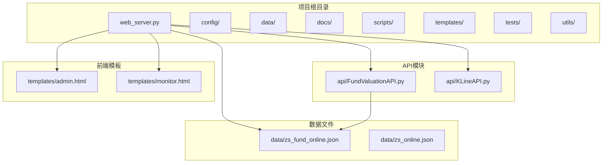
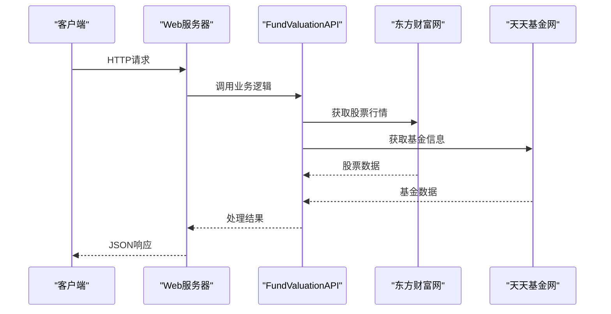
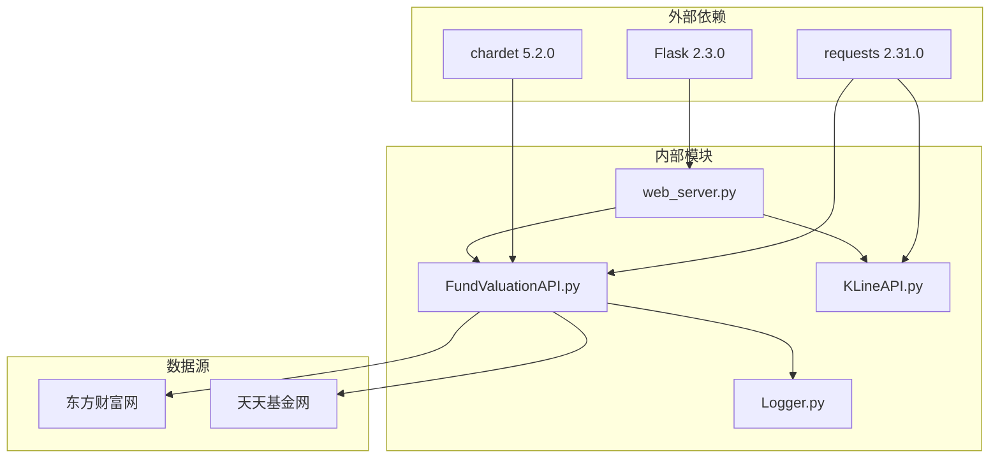

# 基金管理系统API

<cite>
**本文档引用的文件**
- [web_server.py](file://web_server.py)
- [FundValuationAPI.py](file://api/FundValuationAPI.py)
- [KLineAPI.py](file://api/KLineAPI.py)
- [README.md](file://README.md)
- [zs_fund_online.json](file://data/zs_fund_online.json)
- [admin.html](file://templates/admin.html)
- [monitor.html](file://templates/monitor.html)
- [test_fund_config.py](file://tests/test_fund_config.py)
- [requirements.txt](file://requirements.txt)
</cite>

## 目录
1. [简介](#简介)
2. [项目结构](#项目结构)
3. [核心组件](#核心组件)
4. [架构概览](#架构概览)
5. [详细组件分析](#详细组件分析)
6. [依赖关系分析](#依赖关系分析)
7. [性能考虑](#性能考虑)
8. [故障排除指南](#故障排除指南)
9. [结论](#结论)

## 简介

基金管理系统是一个基于Flask的Web应用，提供基金实时估值监控和股票K线图查询功能。该系统支持基金列表管理、持仓管理、用户持仓金额管理等核心功能，通过API接口实现前后端交互。

## 项目结构



**图表来源**
- [web_server.py](file://web_server.py#L1-L552)
- [FundValuationAPI.py](file://api/FundValuationAPI.py#L1-L537)
- [KLineAPI.py](file://api/KLineAPI.py#L1-L345)

**章节来源**
- [README.md](file://README.md#L1-L193)
- [web_server.py](file://web_server.py#L1-L50)

## 核心组件

### Web服务器 (web_server.py)
- Flask应用入口点，提供RESTful API接口
- 管理基金列表、持仓信息、用户配置
- 集成前端模板渲染和静态文件服务

### 基金估值API (FundValuationAPI.py)
- 核心业务逻辑实现
- 基金基本信息获取、持仓分析、实时估值计算
- 并发处理和数据缓存机制

### K线API (KLineAPI.py)
- 股票K线图生成和下载
- 支持多种技术指标和时间周期
- URL构建和批量处理功能

**章节来源**
- [web_server.py](file://web_server.py#L20-L28)
- [FundValuationAPI.py](file://api/FundValuationAPI.py#L27-L55)
- [KLineAPI.py](file://api/KLineAPI.py#L15-L68)

## 架构概览



**图表来源**
- [web_server.py](file://web_server.py#L105-L180)
- [FundValuationAPI.py](file://api/FundValuationAPI.py#L88-L134)

## 详细组件分析

### 基金列表管理API

#### 获取基金列表
- **HTTP方法**: GET
- **URL路径**: `/api/fund/list`
- **请求参数**: 无
- **响应格式**:
```json
{
  "success": true,
  "data": [
    {
      "code": "001593",
      "name": "天弘创业板ETF联接C",
      "has_holdings": true,
      "update_time": "2026-02-08 17:30:00",
      "holdings_count": 10
    }
  ]
}
```
- **错误处理**: 返回错误信息和状态码

#### 预览基金持仓
- **HTTP方法**: GET
- **URL路径**: `/api/fund/preview/{fund_code}`
- **请求参数**: 
  - `fund_code`: 基金代码（6位数字）
- **响应格式**:
```json
{
  "success": true,
  "data": {
    "fund_code": "001593",
    "fund_name": "天弘创业板ETF联接C",
    "holdings": [
      {
        "股票代码": "300750",
        "股票名称": "宁德时代",
        "持仓比例": 0.21
      }
    ],
    "holdings_count": 10,
    "total_ratio": 8.5
  }
}
```
- **验证规则**:
  - 基金代码必须为6位数字
  - 基金必须存在且可访问
  - 不会添加到监控列表

#### 添加基金到监控列表
- **HTTP方法**: POST
- **URL路径**: `/api/fund/add`
- **请求体**:
```json
{
  "fund_code": "001593"
}
```
- **响应格式**:
```json
{
  "success": true,
  "message": "基金 天弘创业板ETF联接C (001593) 添加成功！\n已自动获取 10 只重仓股票信息",
  "data": {
    "fund_code": "001593",
    "fund_name": "天弘创业板ETF联接C",
    "holdings_count": 10
  }
}
```
- **验证规则**:
  - 基金代码格式验证（6位数字）
  - 基金存在性验证（联网检查）
  - 防重复添加检查
  - 自动初始化用户持仓金额为0

#### 从监控列表移除基金
- **HTTP方法**: DELETE
- **URL路径**: `/api/fund/remove/{fund_code}`
- **请求参数**: 
  - `fund_code`: 基金代码
- **响应格式**:
```json
{
  "success": true,
  "message": "基金 001593 已移除"
}
```
- **清理范围**:
  - 从监控列表移除
  - 删除持仓数据
  - 删除用户持仓金额
  - 删除名称映射

**章节来源**
- [web_server.py](file://web_server.py#L259-L443)
- [web_server.py](file://web_server.py#L445-L502)

### 基金持仓管理API

#### 获取基金持仓信息
- **HTTP方法**: GET
- **URL路径**: `/api/fund/holdings/{fund_code}`
- **查询参数**:
  - `force_update`: 是否强制更新（true/false）
- **响应格式**:
```json
{
  "success": true,
  "data": {
    "fund_code": "001593",
    "holdings": [
      {
        "股票代码": "300750",
        "股票名称": "宁德时代",
        "持仓比例": 0.21
      }
    ]
  },
  "total_ratio": 8.5,
  "warning": "警告：持仓总比例超过100% (108.50%)，可能存在数据错误！"
}
```
- **数据验证**:
  - 自动计算持仓比例总和
  - 超过100%时返回警告信息

#### 更新基金持仓信息
- **HTTP方法**: PUT
- **URL路径**: `/api/fund/holdings/{fund_code}`
- **请求体**:
```json
{
  "holdings": [
    {
      "股票代码": "300750",
      "股票名称": "宁德时代",
      "持仓比例": 0.21
    }
  ]
}
```
- **响应格式**:
```json
{
  "success": true,
  "message": "持仓信息已更新"
}
```

**章节来源**
- [web_server.py](file://web_server.py#L105-L158)
- [FundValuationAPI.py](file://api/FundValuationAPI.py#L135-L253)

### 用户持仓管理API

#### 修改用户持仓金额
- **HTTP方法**: PUT
- **URL路径**: `/api/fund/position/{fund_code}`
- **请求体**:
```json
{
  "position_amount": 5000
}
```
- **响应格式**:
```json
{
  "success": true,
  "message": "基金 001593 持仓金额已更新为 5000 元"
}
```
- **验证规则**:
  - 持仓金额必须为非负数字
  - 支持整数和浮点数

#### 批量计算基金估值
- **HTTP方法**: POST
- **URL路径**: `/api/fund/valuation/batch`
- **请求体**:
```json
{
  "fund_codes": ["001593", "001549"]
}
```
- **响应格式**:
```json
{
  "success": true,
  "data": {
    "001593": {
      "基金代码": "001593",
      "基金名称": "天弘创业板ETF联接C",
      "估算净值": 1.2345,
      "估算涨跌幅": 0.56,
      "持仓金额": 5000,
      "持仓比例": 25.0,
      "单日盈亏": 28.0
    }
  },
  "total_position": 15000
}
```
- **计算逻辑**:
  - 自动添加用户持仓信息
  - 计算总持仓金额
  - 计算单日盈亏 = 持仓金额 × 估算涨跌幅%

**章节来源**
- [web_server.py](file://web_server.py#L504-L539)
- [web_server.py](file://web_server.py#L183-L227)

### 配置管理API

#### 获取配置信息
- **HTTP方法**: GET
- **URL路径**: `/api/config`
- **响应格式**:
```json
{
  "success": true,
  "data": {
    "fund_list": ["001593"],
    "user_positions": {
      "001593": 5000
    },
    "fund_holdings": {
      "001593": {
        "holdings": [...],
        "update_time": "2026-02-08 17:30:00"
      }
    }
  }
}
```

#### 保存配置信息
- **HTTP方法**: POST
- **URL路径**: `/api/config`
- **请求体**: 完整配置对象
- **响应格式**:
```json
{
  "success": true,
  "message": "配置保存成功"
}
```

**章节来源**
- [web_server.py](file://web_server.py#L66-L103)

### 数据结构定义

#### 基金配置文件结构
```json
{
  "fund_list": ["001593", "015752"],
  "user_positions": {
    "001593": 10000,
    "015752": 5000
  },
  "fund_holdings": {
    "001593": {
      "holdings": [
        {
          "股票代码": "300750",
          "股票名称": "宁德时代",
          "持仓比例": 0.21
        }
      ],
      "update_time": "2026-02-08 17:30:00"
    }
  }
}
```

#### 基金持仓数据结构
```json
{
  "股票代码": "300750",
  "股票名称": "宁德时代",
  "持仓比例": 0.21
}
```

#### 基金估值结果结构
```json
{
  "基金代码": "001593",
  "基金名称": "天弘创业板ETF联接C",
  "上次净值": 1.2345,
  "估算净值": 1.2398,
  "估算涨跌幅": 0.56,
  "估算时间": "2026-02-08 17:30:00",
  "重仓股数量": 10,
  "持仓比例合计": 8.5,
  "重仓股明细": [
    {
      "股票代码": "300750",
      "股票名称": "宁德时代",
      "持仓比例": 0.21,
      "最新价": 123.45,
      "涨跌幅": 0.56,
      "贡献度": 0.012
    }
  ]
}
```

**章节来源**
- [README.md](file://README.md#L105-L131)
- [FundValuationAPI.py](file://api/FundValuationAPI.py#L315-L426)

## 依赖关系分析



**图表来源**
- [requirements.txt](file://requirements.txt#L1-L4)
- [web_server.py](file://web_server.py#L9-L15)
- [FundValuationAPI.py](file://api/FundValuationAPI.py#L10-L21)

**章节来源**
- [requirements.txt](file://requirements.txt#L1-L4)
- [web_server.py](file://web_server.py#L9-L18)

## 性能考虑

### 并发处理优化
- 使用ThreadPoolExecutor进行并发股票行情获取
- 最大5个线程并发处理，提升5倍性能
- 每个线程随机延迟0-0.2秒，避免同时请求

### 数据缓存策略
- 优先使用本地缓存的持仓数据
- 支持手动刷新强制联网更新
- 自动记录更新时间戳

### 请求限制和超时
- HTTP请求超时设置为10秒
- 股票行情请求超时设置为5秒
- 支持重试机制（最多2次）

## 故障排除指南

### 常见错误场景

#### 基金代码验证失败
- **错误信息**: "基金代码必须为6位数字"
- **解决方法**: 确保输入正确的6位数字基金代码

#### 基金不存在
- **错误信息**: "基金 {code} 不存在或无法访问"
- **解决方法**: 检查基金代码是否正确，网络连接是否正常

#### 持仓比例异常
- **警告信息**: "持仓总比例超过100%，可能存在数据错误"
- **解决方法**: 检查持仓数据完整性，必要时手动调整

#### 网络请求失败
- **错误信息**: HTTP状态码或网络异常
- **解决方法**: 检查网络连接，稍后重试

### 调试建议

1. **启用详细日志**: 检查logs目录下的日志文件
2. **验证数据源**: 确认东方财富网和天天基金网可访问
3. **检查配置文件**: 确保JSON格式正确，字段完整
4. **测试单个API**: 使用curl或Postman单独测试API接口

**章节来源**
- [web_server.py](file://web_server.py#L304-L358)
- [FundValuationAPI.py](file://api/FundValuationAPI.py#L102-L133)

## 结论

基金管理系统提供了完整的基金管理和估值监控功能，具有以下特点：

### 核心优势
- **完整的API覆盖**: 包含基金列表管理、持仓管理、用户配置等所有核心功能
- **数据验证机制**: 多层验证确保数据准确性和完整性
- **性能优化**: 并发处理和缓存策略提升系统响应速度
- **用户友好**: 清晰的错误信息和完善的验证规则

### 技术特色
- **模块化设计**: API模块独立，易于维护和扩展
- **数据持久化**: 配置文件存储，支持断电恢复
- **实时监控**: 自动刷新机制，保持数据时效性
- **可视化界面**: 前端模板提供直观的操作界面

### 扩展建议
- 增加API版本控制
- 添加更多技术指标支持
- 实现用户权限管理
- 增强数据导入导出功能

该系统为个人投资者提供了便捷的基金管理和监控工具，通过标准化的API接口便于集成和二次开发。