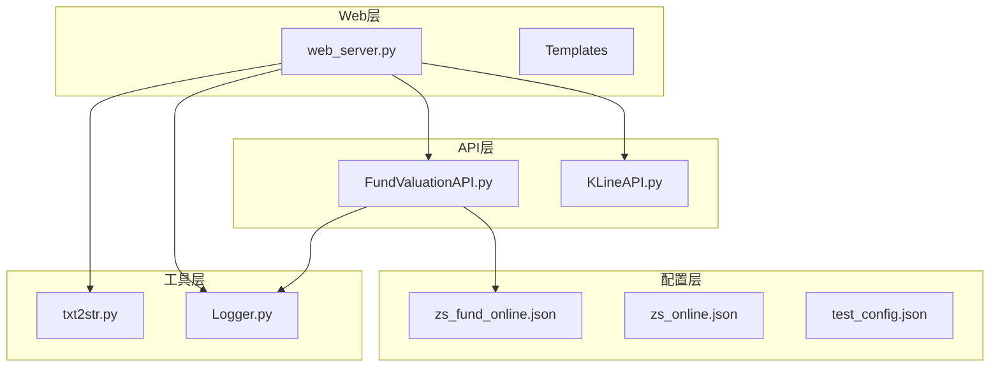
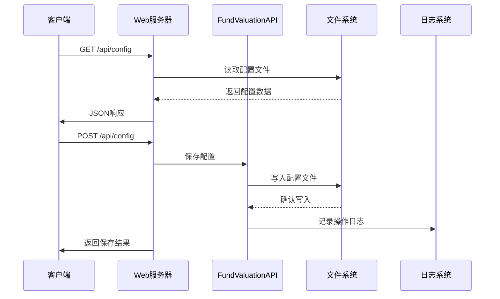
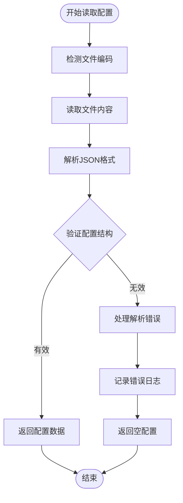
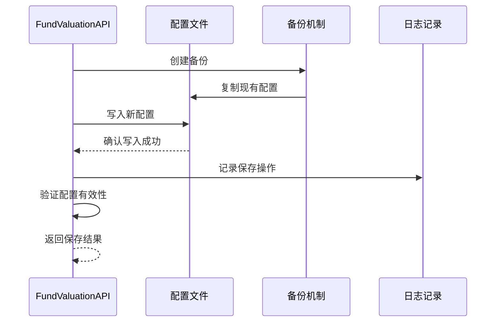
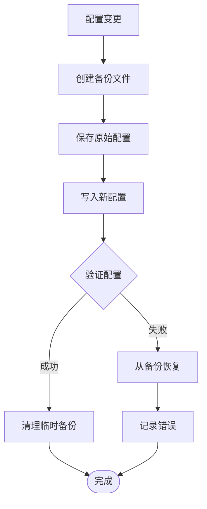
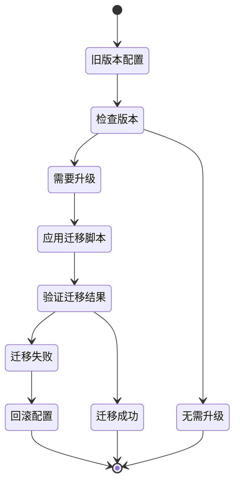
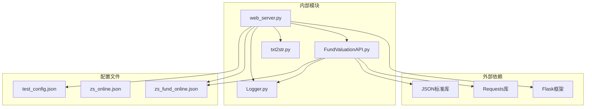

# 配置管理API

<cite>
**本文档引用的文件**
- [web_server.py](file://web_server.py)
- [FundValuationAPI.py](file://api/FundValuationAPI.py)
- [txt2str.py](file://scripts/txt2str.py)
- [Logger.py](file://utils/Logger.py)
- [test_fund_config.py](file://tests/test_fund_config.py)
- [README.md](file://README.md)
- [zs_fund_online.json](file://data/zs_fund_online.json)
- [zs_online.json](file://data/zs_online.json)
- [test_config.json](file://config/test_config.json)
</cite>

## 目录
1. [简介](#简介)
2. [项目结构](#项目结构)
3. [核心组件](#核心组件)
4. [架构概览](#架构概览)
5. [详细组件分析](#详细组件分析)
6. [依赖关系分析](#依赖关系分析)
7. [性能考量](#性能考量)
8. [故障排除指南](#故障排除指南)
9. [结论](#结论)
10. [附录](#附录)

## 简介
本项目是一个基于Flask的Web应用，提供基金实时估值监控和股票K线图查询功能。配置管理API是系统的核心组成部分，负责管理配置文件的读取、保存、验证和迁移等操作。本文档详细说明了配置管理API的设计理念、数据结构、验证规则、备份恢复机制以及最佳实践。

## 项目结构
项目采用模块化设计，主要包含以下核心模块：
- Web服务器层：提供HTTP接口和前端页面渲染
- API服务层：封装业务逻辑和数据处理
- 配置管理层：负责配置文件的持久化和管理
- 工具层：提供日志记录、文件处理等辅助功能



**图表来源**
- [web_server.py](file://web_server.py#L1-L562)
- [FundValuationAPI.py](file://api/FundValuationAPI.py#L1-L537)
- [txt2str.py](file://scripts/txt2str.py#L1-L108)
- [Logger.py](file://utils/Logger.py#L1-L86)

**章节来源**
- [web_server.py](file://web_server.py#L1-L562)
- [README.md](file://README.md#L1-L193)

## 核心组件
配置管理API由多个核心组件协同工作，形成完整的配置管理体系：

### 配置文件类型
系统使用多种配置文件来管理不同类型的信息：
- **主配置文件** (`data/zs_fund_online.json`)：包含基金监控列表、用户持仓、技术指标等核心配置
- **指数配置文件** (`data/zs_online.json`)：管理股票指数和K线图配置
- **测试配置文件** (`config/test_config.json`)：用于测试和演示的简化配置

### 配置数据结构
配置文件采用JSON格式，支持嵌套的对象和数组结构：

```mermaid
erDiagram
CONFIG {
array fund_list
object user_positions
object fund_holdings
object zs_all
array type_all
array formula_all
integer unitWidth
string str_dir_d
string file_htm
string file_online
object _comment
}
HOLDINGS {
array holdings
string update_time
}
HOLDING {
string 股票代码
string 股票名称
float 持仓比例
}
USER_POSITIONS {
string 说明
float 001593
float 001549
float 004742
}
CONFIG ||--o{ HOLDINGS : contains
HOLDINGS ||--o{ HOLDING : contains
CONFIG ||--o{ USER_POSITIONS : contains
```

**图表来源**
- [zs_fund_online.json](file://data/zs_fund_online.json#L1-L238)
- [test_config.json](file://config/test_config.json#L1-L59)

**章节来源**
- [zs_fund_online.json](file://data/zs_fund_online.json#L1-L1356)
- [test_config.json](file://config/test_config.json#L1-L59)

## 架构概览
配置管理API采用分层架构设计，确保各层职责清晰、耦合度低：



**图表来源**
- [web_server.py](file://web_server.py#L66-L102)
- [FundValuationAPI.py](file://api/FundValuationAPI.py#L73-L86)

## 详细组件分析

### 配置文件读取机制
配置文件读取采用统一的文件处理机制，支持多种编码格式的自动检测：



**图表来源**
- [txt2str.py](file://scripts/txt2str.py#L92-L99)
- [FundValuationAPI.py](file://api/FundValuationAPI.py#L56-L72)

#### 配置验证规则
系统实现了多层次的配置验证机制：

1. **基本结构验证**：检查必需字段的存在性和类型正确性
2. **数据完整性验证**：确保配置数据的完整性和一致性
3. **业务逻辑验证**：验证配置项之间的逻辑关系和约束条件

#### 默认值处理
系统提供了完善的默认值处理机制：
- 对于缺失的配置项，系统会自动创建默认值
- 支持配置项的渐进式添加和更新
- 提供配置项的回退机制，确保系统稳定性

**章节来源**
- [txt2str.py](file://scripts/txt2str.py#L1-L108)
- [FundValuationAPI.py](file://api/FundValuationAPI.py#L56-L86)

### 配置文件保存机制
配置文件保存采用原子性写入机制，确保数据安全：



**图表来源**
- [FundValuationAPI.py](file://api/FundValuationAPI.py#L73-L86)
- [web_server.py](file://web_server.py#L82-L102)

#### 保存流程特点
- **事务性操作**：确保配置保存的原子性
- **数据校验**：保存前进行数据完整性检查
- **错误处理**：提供完善的异常处理和回滚机制

**章节来源**
- [FundValuationAPI.py](file://api/FundValuationAPI.py#L235-L252)
- [web_server.py](file://web_server.py#L82-L102)

### 配置项分类和作用
系统配置项按照功能分为多个类别：

#### 基金监控配置
- **fund_list**：监控的基金代码列表
- **user_positions**：用户对各基金的持仓金额
- **fund_holdings**：各基金的前十大重仓股信息

#### 技术指标配置
- **type_all**：支持的时间周期类型（日K、周K、月K）
- **formula_all**：技术指标公式列表（如MACD）
- **unitWidth**：图表单元宽度设置

#### 显示参数配置
- **zs_all**：指数映射表，包含指数代码到名称的映射
- **str_dir_d**：数据目录路径
- **file_htm**：HTML文件名配置

**章节来源**
- [zs_fund_online.json](file://data/zs_fund_online.json#L1-L238)
- [README.md](file://README.md#L105-L130)

### 配置文件备份恢复机制
系统实现了自动备份和恢复机制：



**图表来源**
- [FundValuationAPI.py](file://api/FundValuationAPI.py#L73-L86)
- [web_server.py](file://web_server.py#L82-L102)

#### 备份策略
- **自动备份**：每次配置变更前自动创建备份
- **版本管理**：支持多版本配置文件的管理
- **恢复机制**：提供一键恢复到之前版本的功能

**章节来源**
- [FundValuationAPI.py](file://api/FundValuationAPI.py#L73-L86)
- [web_server.py](file://web_server.py#L82-L102)

### 配置迁移和升级
系统支持配置文件的平滑迁移和版本升级：



**图表来源**
- [FundValuationAPI.py](file://api/FundValuationAPI.py#L56-L72)
- [test_fund_config.py](file://tests/test_fund_config.py#L1-L63)

#### 迁移特性
- **向后兼容**：新版本能够读取旧版本配置
- **自动修复**：自动修复配置中的常见问题
- **数据转换**：支持配置格式的自动转换

**章节来源**
- [test_fund_config.py](file://tests/test_fund_config.py#L1-L63)

## 依赖关系分析
配置管理API的依赖关系呈现清晰的层次结构：



**图表来源**
- [web_server.py](file://web_server.py#L9-L15)
- [FundValuationAPI.py](file://api/FundValuationAPI.py#L10-L21)

### 模块间耦合度
- **低耦合设计**：各模块职责明确，相互依赖最小化
- **接口清晰**：通过明确定义的接口进行交互
- **可替换性**：配置文件格式和存储方式可灵活调整

**章节来源**
- [web_server.py](file://web_server.py#L1-L562)
- [FundValuationAPI.py](file://api/FundValuationAPI.py#L1-L537)

## 性能考量
配置管理API在设计时充分考虑了性能优化：

### 缓存策略
- **内存缓存**：配置数据在内存中缓存，减少磁盘I/O
- **懒加载**：配置文件按需加载，避免不必要的初始化
- **增量更新**：支持配置的增量更新，提高更新效率

### 并发处理
- **线程安全**：配置文件访问采用线程安全的读写机制
- **锁机制**：防止并发访问导致的数据不一致
- **异步处理**：支持异步配置更新操作

### 性能优化措施
- **批量操作**：支持批量配置读取和写入
- **压缩存储**：配置文件采用压缩存储，节省空间
- **索引优化**：对常用配置项建立索引，提高查询速度

## 故障排除指南
配置管理API提供了完善的错误处理和故障排除机制：

### 常见问题及解决方案
1. **配置文件损坏**
   - 系统会自动检测配置文件格式错误
   - 提供配置文件重建功能
   - 记录详细的错误日志便于诊断

2. **权限问题**
   - 检查配置文件的读写权限
   - 提供权限修复建议
   - 支持临时权限降级模式

3. **编码问题**
   - 自动检测和转换文件编码
   - 支持多种编码格式
   - 提供编码转换工具

### 错误日志记录
系统采用分级的日志记录机制：
- **DEBUG级别**：详细的操作过程记录
- **INFO级别**：正常操作的状态信息
- **WARNING级别**：潜在问题的警告信息
- **ERROR级别**：错误事件的详细记录

**章节来源**
- [Logger.py](file://utils/Logger.py#L1-L86)
- [FundValuationAPI.py](file://api/FundValuationAPI.py#L69-L71)

## 结论
配置管理API为整个系统提供了稳定、可靠、高性能的配置管理能力。通过合理的架构设计、完善的验证机制、智能的备份恢复功能以及优秀的性能优化，系统能够满足各种复杂的配置管理需求。建议开发者在使用过程中遵循最佳实践，充分利用系统的各项功能，确保配置管理的高效性和安全性。

## 附录

### API参考文档
系统提供以下配置相关的API接口：

#### 基础配置管理
- **GET /api/config**：获取当前配置信息
- **POST /api/config**：保存配置信息

#### 基金配置管理
- **GET /api/fund/list**：获取基金监控列表
- **GET /api/fund/holdings/<fund_code>**：获取基金持仓信息
- **PUT /api/fund/holdings/<fund_code>**：更新基金持仓信息
- **GET /api/fund/position/<fund_code>**：获取用户持仓金额
- **PUT /api/fund/position/<fund_code>**：更新用户持仓金额

#### 基金管理操作
- **GET /api/fund/preview/<fund_code>**：预览基金持仓
- **POST /api/fund/add**：添加基金到监控列表
- **DELETE /api/fund/remove/<fund_code>**：从监控列表移除基金

### 最佳实践建议
1. **配置文件备份**：定期备份配置文件，防止意外丢失
2. **权限管理**：合理设置配置文件的访问权限
3. **监控告警**：建立配置变更的监控和告警机制
4. **版本控制**：对重要的配置变更进行版本记录
5. **测试验证**：在生产环境部署前充分测试配置变更

### 版本兼容性
系统设计时充分考虑了版本兼容性：
- 新版本能够读取旧版本配置
- 提供配置格式的自动转换功能
- 保持API接口的向后兼容性