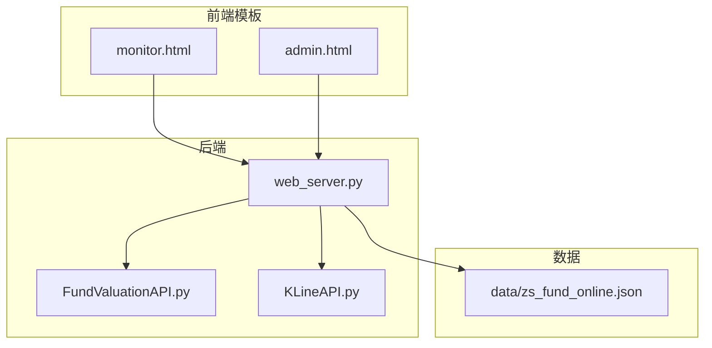
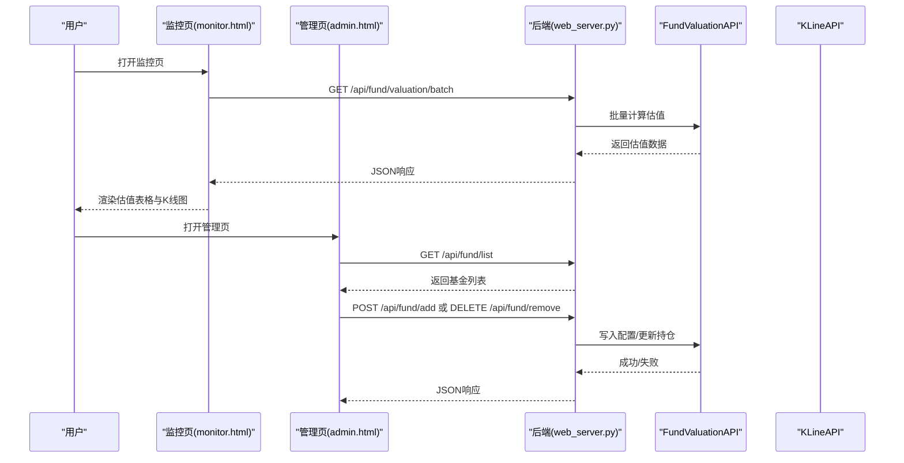
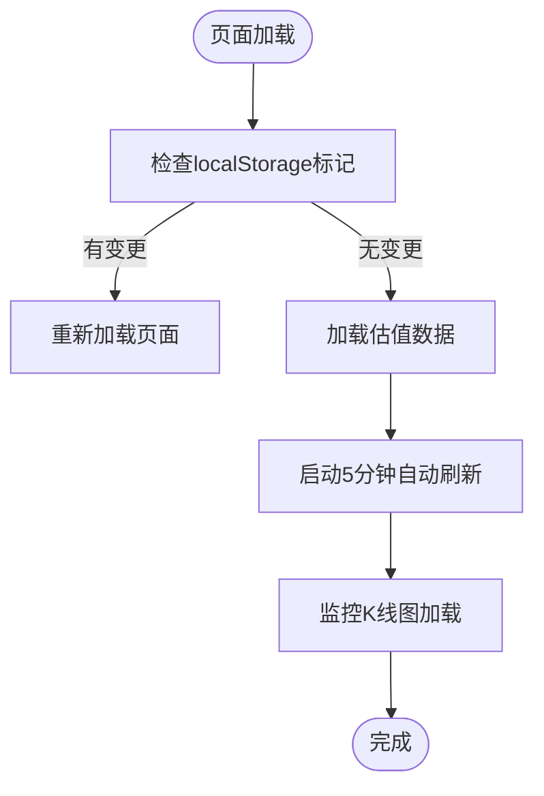
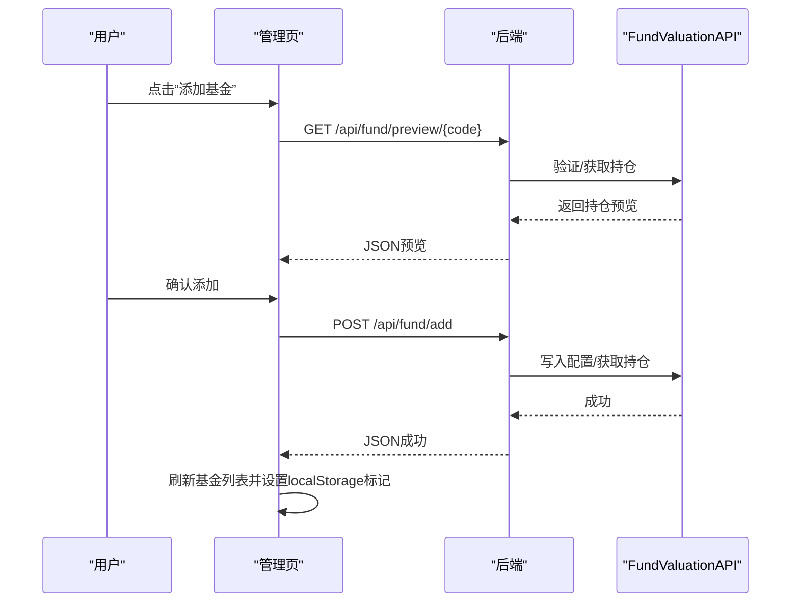
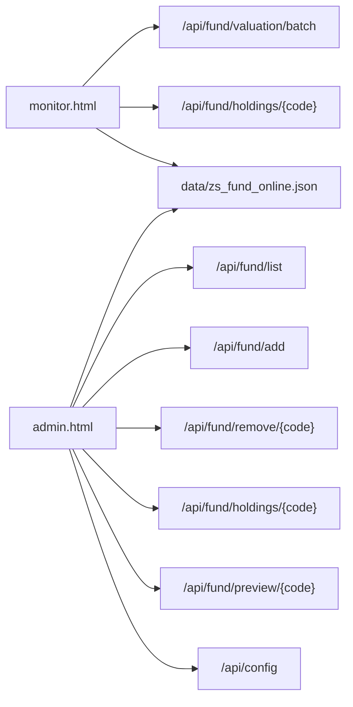

# 前端界面设计

<cite>
**本文引用的文件**
- [templates/monitor.html](file://templates/monitor.html)
- [templates/admin.html](file://templates/admin.html)
- [web_server.py](file://web_server.py)
- [api/FundValuationAPI.py](file://api/FundValuationAPI.py)
- [api/KLineAPI.py](file://api/KLineAPI.py)
- [data/zs_fund_online.json](file://data/zs_fund_online.json)
- [README.md](file://README.md)
</cite>

## 目录
1. [简介](#简介)
2. [项目结构](#项目结构)
3. [核心组件](#核心组件)
4. [架构总览](#架构总览)
5. [详细组件分析](#详细组件分析)
6. [依赖关系分析](#依赖关系分析)
7. [性能考虑](#性能考虑)
8. [故障排查指南](#故障排查指南)
9. [结论](#结论)
10. [附录](#附录)

## 简介
本文件面向前端开发者，系统化梳理“基金估值与K线监控系统”的前端界面设计，重点覆盖监控页面（monitor.html）与管理页面（admin.html）的功能布局、交互流程、响应式设计与跨浏览器兼容性、导航结构、数据展示逻辑、状态反馈机制、与后端API的交互方式、界面定制与主题修改指导，以及性能优化与用户体验改进建议。目标是为前端实现提供完整参考。

## 项目结构
- 前端模板位于 templates/，包含监控页与管理页两个HTML模板
- 后端使用Flask路由渲染模板并提供REST API
- 基金估值与K线API分别封装在 api/ 中
- 配置数据位于 data/，包含基金列表、用户持仓、指数配置等

图表来源
- [templates/monitor.html](file://templates/monitor.html#L1-L918)
- [templates/admin.html](file://templates/admin.html#L1-L1049)
- [web_server.py](file://web_server.py#L1-L552)
- [api/FundValuationAPI.py](file://api/FundValuationAPI.py#L1-L200)
- [api/KLineAPI.py](file://api/KLineAPI.py#L1-L200)
- [data/zs_fund_online.json](file://data/zs_fund_online.json#L1-L238)

章节来源
- [README.md](file://README.md#L1-L193)
- [web_server.py](file://web_server.py#L54-L63)

## 核心组件
- 监控页面（monitor.html）
  - 基金实时估值表格：支持手动刷新、自动刷新（5分钟）、单日盈亏计算、总持仓汇总
  - K线图区域：基于指数配置动态生成多周期、多指标的K线图
  - 弹窗：查看/编辑持仓、编辑用户持仓金额
  - 性能监控：记录页面加载、K线图加载、估值刷新耗时
- 管理页面（admin.html）
  - 基金管理：添加/移除基金、查看基金列表与状态
  - 持仓获取/编辑：从配置读取或联网更新，支持编辑持仓
  - 估值计算：批量计算估值并可视化展示
  - 生成监控页面：触发后端生成静态监控页
- 后端API
  - 基金估值：批量估值、单只估值、用户持仓金额更新
  - 持仓管理：获取/更新持仓、预览新增基金
  - 配置管理：获取/保存配置
  - K线图：生成K线URL（用于监控页）

章节来源
- [templates/monitor.html](file://templates/monitor.html#L320-L918)
- [templates/admin.html](file://templates/admin.html#L382-L1049)
- [web_server.py](file://web_server.py#L105-L296)

## 架构总览
前端通过AJAX调用后端API，后端根据配置文件（data/zs_fund_online.json）进行数据处理与展示。监控页与管理页共享同一套API，但职责不同：监控页侧重实时展示，管理页侧重配置与维护。

图表来源
- [web_server.py](file://web_server.py#L183-L226)
- [web_server.py](file://web_server.py#L259-L296)
- [web_server.py](file://web_server.py#L362-L442)
- [api/FundValuationAPI.py](file://api/FundValuationAPI.py#L135-L163)

## 详细组件分析

### 监控页面（monitor.html）
- 导航与布局
  - 页面顶部包含标题、更新时间、自动刷新提示与“管理后台”链接
  - 分两大部分：基金实时估值表格、K线图区域
- 基金估值表格
  - 表头包含基金名称、上次净值、估算净值、估算涨跌、持仓金额、持仓比例、重仓股占比、单日盈亏、估算时间、操作按钮
  - 行内操作：查看持仓、编辑持仓、编辑用户持仓金额
  - 自动刷新：每5分钟一次；手动刷新按钮
  - 总持仓汇总：显示总持仓金额、今日总盈亏、盈亏比例
- K线图区域
  - 基于配置文件中的指数列表与周期/指标组合生成多图
  - 图片加载完成后记录耗时与错误数量
- 弹窗交互
  - 查看/编辑持仓：支持联网更新与本地编辑，保存后刷新
  - 编辑用户持仓金额：弹出输入框，校验后PUT到后端
- 性能监控
  - 记录页面总加载时间、K线图加载耗时、估值刷新耗时
- 响应式与跨浏览器
  - 使用viewport meta、CSS Grid、Flex布局，适配不同屏幕尺寸
  - 字体与颜色采用渐变背景，提升可读性与一致性

图表来源
- [templates/monitor.html](file://templates/monitor.html#L449-L468)
- [templates/monitor.html](file://templates/monitor.html#L485-L534)

章节来源
- [templates/monitor.html](file://templates/monitor.html#L314-L468)
- [templates/monitor.html](file://templates/monitor.html#L543-L670)
- [templates/monitor.html](file://templates/monitor.html#L672-L747)
- [templates/monitor.html](file://templates/monitor.html#L808-L847)
- [templates/monitor.html](file://templates/monitor.html#L849-L888)
- [templates/monitor.html](file://templates/monitor.html#L890-L915)

### 管理页面（admin.html）
- 控制面板
  - 四个功能卡片：基金管理、持仓获取、持仓编辑、估值计算、生成监控页面、查看监控
- 基金管理
  - 添加基金：输入6位代码，预览前十重仓股，确认后添加并自动获取持仓
  - 移除基金：删除监控列表与相关数据
  - 查看基金：弹窗展示持仓详情
- 持仓获取/编辑
  - 从配置读取或联网更新，支持编辑与保存
- 估值计算
  - 批量计算并以卡片形式展示估值结果
- 生成监控页面
  - 调用后端生成静态监控页，支持一键打开

图表来源
- [templates/admin.html](file://templates/admin.html#L550-L587)
- [templates/admin.html](file://templates/admin.html#L639-L694)
- [templates/admin.html](file://templates/admin.html#L696-L724)
- [web_server.py](file://web_server.py#L299-L357)
- [web_server.py](file://web_server.py#L362-L442)

章节来源
- [templates/admin.html](file://templates/admin.html#L382-L424)
- [templates/admin.html](file://templates/admin.html#L550-L766)
- [templates/admin.html](file://templates/admin.html#L768-L832)
- [templates/admin.html](file://templates/admin.html#L834-L937)
- [templates/admin.html](file://templates/admin.html#L944-L1013)
- [templates/admin.html](file://templates/admin.html#L1015-L1038)

### 后端API与数据流
- 基金估值
  - 批量估值：POST /api/fund/valuation/batch，返回估值数据与用户持仓金额、总持仓、单日盈亏
  - 单只估值：GET /api/fund/valuation/{code}
  - 用户持仓金额更新：PUT /api/fund/position/{code}
- 持仓管理
  - 获取持仓：GET /api/fund/holdings/{code}?force_update=...
  - 更新持仓：PUT /api/fund/holdings/{code}
  - 预览新增基金：GET /api/fund/preview/{code}
  - 添加/移除基金：POST /api/fund/add、DELETE /api/fund/remove/{code}
- 配置管理
  - 获取配置：GET /api/config
  - 保存配置：POST /api/config
- K线图
  - 监控页通过模板渲染K线URL，后端提供URL生成能力（KLineAPI）

章节来源
- [web_server.py](file://web_server.py#L105-L158)
- [web_server.py](file://web_server.py#L183-L226)
- [web_server.py](file://web_server.py#L504-L539)
- [web_server.py](file://web_server.py#L105-L158)
- [api/KLineAPI.py](file://api/KLineAPI.py#L69-L110)

## 依赖关系分析
- 前端依赖后端提供的API接口，监控页依赖估值与K线数据，管理页依赖配置与基金数据
- 配置文件（data/zs_fund_online.json）是前后端共同的数据源，包含：
  - fund_list：监控的基金列表
  - user_positions：用户对各基金的持仓金额
  - fund_holdings：各基金的前十大重仓股及其更新时间
  - zs_all、type_all、formula_all、unitWidth：K线图配置

图表来源
- [web_server.py](file://web_server.py#L183-L226)
- [web_server.py](file://web_server.py#L259-L296)
- [web_server.py](file://web_server.py#L362-L442)
- [web_server.py](file://web_server.py#L299-L357)
- [web_server.py](file://web_server.py#L66-L103)
- [data/zs_fund_online.json](file://data/zs_fund_online.json#L1-L238)

章节来源
- [data/zs_fund_online.json](file://data/zs_fund_online.json#L1-L238)
- [web_server.py](file://web_server.py#L26-L51)

## 性能考虑
- 自动刷新策略
  - 监控页默认每5分钟刷新一次估值，手动刷新时先停止自动刷新，完成后重启，避免并发冲突
- K线图加载监控
  - 统计图片数量、加载耗时与失败数量，便于定位网络问题
- 前端性能优化建议
  - 将图片懒加载与分批渲染结合，减少首屏压力
  - 对频繁DOM操作（如编辑持仓）使用虚拟滚动或分页
  - 对弹窗内容进行按需渲染，避免一次性插入大量节点
- 后端性能优化
  - 估值计算已具备并发能力（见README），前端可考虑合并请求或节流
  - K线图URL生成可缓存热点指数，减少重复请求

章节来源
- [templates/monitor.html](file://templates/monitor.html#L470-L483)
- [templates/monitor.html](file://templates/monitor.html#L536-L541)
- [templates/monitor.html](file://templates/monitor.html#L485-L534)
- [README.md](file://README.md#L155-L156)

## 故障排查指南
- 估值加载失败
  - 检查后端返回的success字段与错误信息
  - 确认fund_list非空且配置文件存在
- K线图加载失败
  - 查看控制台输出的失败计数与图片索引
  - 确认网络可达与图片URL有效
- 管理页操作失败
  - 添加/移除基金时检查预览与确认流程
  - 编辑持仓时确保至少保留一条记录
- 用户持仓金额更新失败
  - 确保输入为非负数值
  - 检查后端PUT接口返回的错误信息

章节来源
- [templates/monitor.html](file://templates/monitor.html#L577-L584)
- [templates/monitor.html](file://templates/monitor.html#L517-L523)
- [templates/admin.html](file://templates/admin.html#L773-L831)
- [templates/admin.html](file://templates/admin.html#L901-L936)
- [web_server.py](file://web_server.py#L504-L539)

## 结论
该系统前端以监控页与管理页为核心，配合后端API实现“配置驱动”的数据展示与管理。监控页强调实时性与可读性，管理页强调可维护性与可扩展性。通过合理的响应式设计、状态反馈与性能监控，能够满足日常使用场景。后续可在前端引入更丰富的交互与可视化组件，进一步提升用户体验。

## 附录

### 响应式设计与跨浏览器兼容性
- 响应式布局
  - 使用CSS Grid与Flex布局，配合媒体查询适配移动端
  - viewport meta确保移动端缩放一致
- 跨浏览器兼容
  - 使用标准CSS属性，避免过时特性
  - JavaScript使用现代语法，必要时添加polyfill
- 字体与颜色
  - 使用系统字体栈，保证在不同系统上的一致性
  - 渐变背景与对比色提升可读性

章节来源
- [templates/monitor.html](file://templates/monitor.html#L4-L18)
- [templates/admin.html](file://templates/admin.html#L4-L19)

### 用户界面导航与交互流程
- 导航结构
  - 监控页顶部提供“管理后台”链接直达管理页
  - 管理页顶部提供“查看监控”按钮打开监控页
- 交互流程
  - 基金管理：预览-确认-添加/移除
  - 持仓管理：读取/联网更新-编辑-保存
  - 估值计算：批量计算-结果展示
  - 监控页：自动刷新-手动刷新-弹窗编辑

章节来源
- [templates/monitor.html](file://templates/monitor.html#L317-L327)
- [templates/admin.html](file://templates/admin.html#L418-L423)
- [templates/admin.html](file://templates/admin.html#L1035-L1038)

### 前端与后端API交互方式
- 监控页
  - 批量估值：POST /api/fund/valuation/batch
  - 获取/更新持仓：GET /api/fund/holdings/{code}、PUT /api/fund/holdings/{code}
  - 更新用户持仓金额：PUT /api/fund/position/{code}
- 管理页
  - 基金列表：GET /api/fund/list
  - 添加/移除基金：POST /api/fund/add、DELETE /api/fund/remove/{code}
  - 预览新增基金：GET /api/fund/preview/{code}
  - 获取/保存配置：GET /api/config、POST /api/config

章节来源
- [web_server.py](file://web_server.py#L183-L226)
- [web_server.py](file://web_server.py#L105-L158)
- [web_server.py](file://web_server.py#L504-L539)
- [web_server.py](file://web_server.py#L259-L296)
- [web_server.py](file://web_server.py#L299-L357)
- [web_server.py](file://web_server.py#L66-L103)

### 数据展示逻辑
- 估值计算
  - 后端根据用户持仓金额与估算涨跌幅计算单日盈亏
  - 前端汇总显示总持仓金额、总盈亏、盈亏比例
- 持仓比例验证
  - 当前实现主要在后端进行验证与警告提示
  - 前端可增加输入校验与实时提示

章节来源
- [web_server.py](file://web_server.py#L183-L226)
- [templates/monitor.html](file://templates/monitor.html#L642-L670)

### 界面定制与主题修改指导
- 颜色与渐变
  - 基础颜色变量集中在CSS中，可统一替换主题色
- 字体与排版
  - 字体族与字号在头部样式中定义，可按品牌规范调整
- 布局与间距
  - Grid与Flex布局便于模块化调整，建议通过CSS变量集中管理
- 动效与反馈
  - 按钮hover、加载动画、消息提示等可按品牌风格微调

章节来源
- [templates/monitor.html](file://templates/monitor.html#L7-L312)
- [templates/admin.html](file://templates/admin.html#L7-L371)

### 用户操作指南与状态反馈机制
- 操作指南
  - 添加基金：输入6位代码，预览后确认
  - 编辑持仓：在弹窗中修改，保存后刷新
  - 手动刷新：监控页提供刷新按钮
- 状态反馈
  - 成功/失败消息提示框
  - 加载动画与占位符
  - 错误计数与性能日志

章节来源
- [templates/admin.html](file://templates/admin.html#L589-L637)
- [templates/admin.html](file://templates/admin.html#L768-L832)
- [templates/monitor.html](file://templates/monitor.html#L536-L541)
- [templates/monitor.html](file://templates/monitor.html#L894-L902)