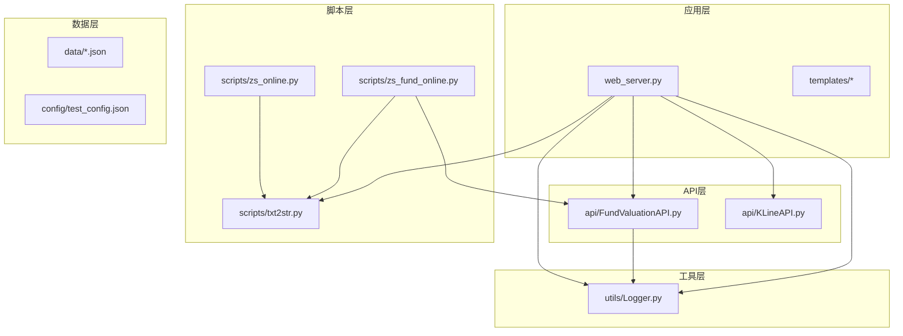
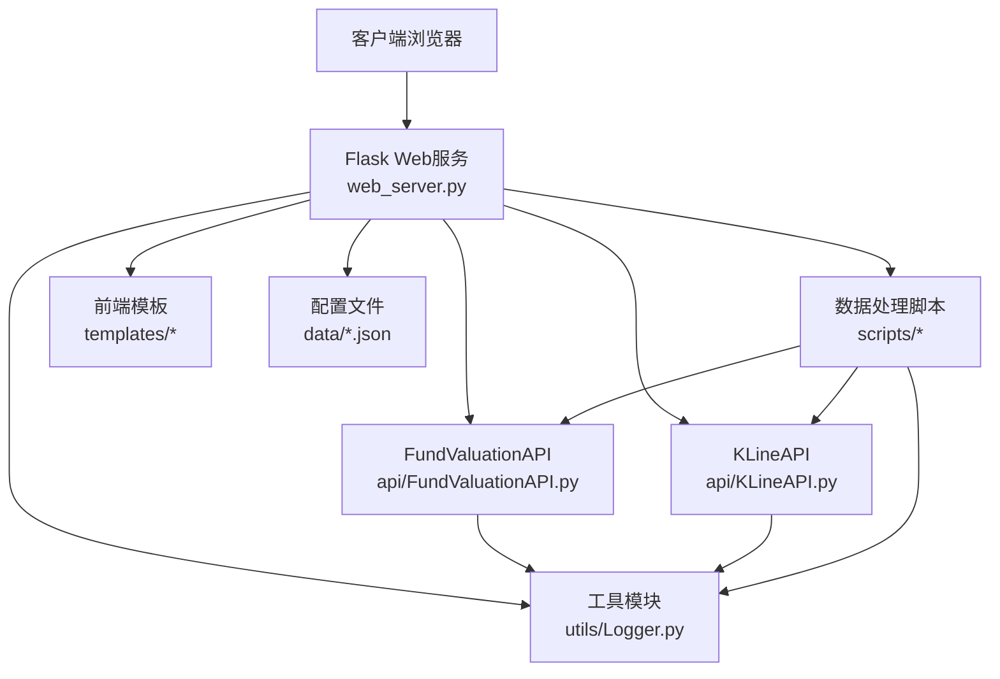
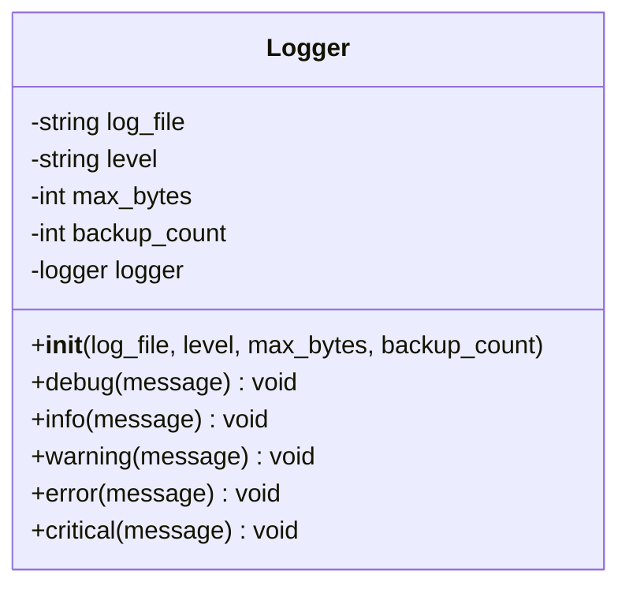
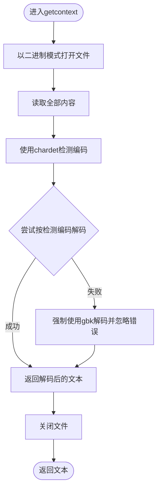
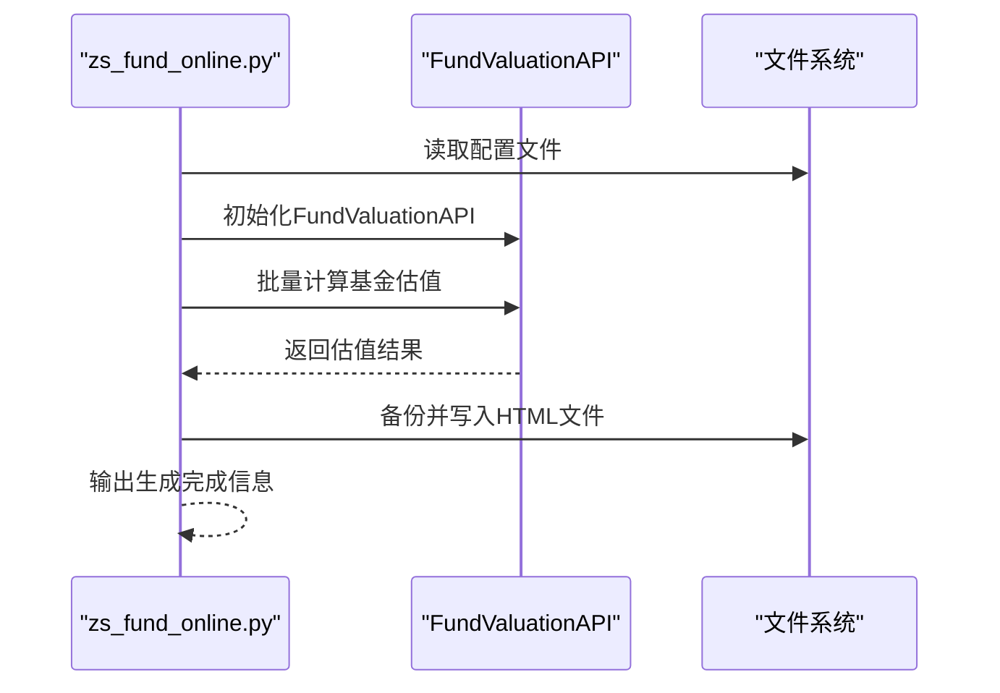
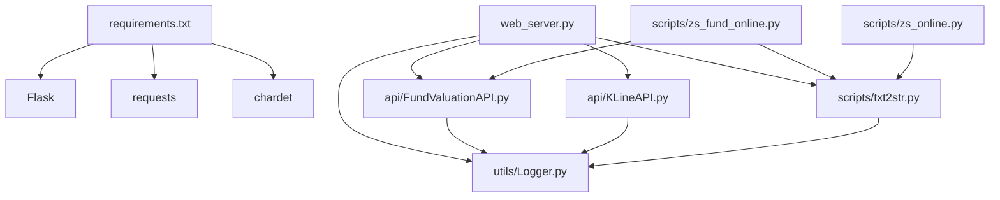

# 工具模块详解

<cite>
**本文档引用的文件**
- [README.md](file://README.md)
- [requirements.txt](file://requirements.txt)
- [utils/Logger.py](file://utils/Logger.py)
- [api/FundValuationAPI.py](file://api/FundValuationAPI.py)
- [api/KLineAPI.py](file://api/KLineAPI.py)
- [scripts/txt2str.py](file://scripts/txt2str.py)
- [scripts/zs_fund_online.py](file://scripts/zs_fund_online.py)
- [scripts/zs_online.py](file://scripts/zs_online.py)
- [web_server.py](file://web_server.py)
- [config/test_config.json](file://config/test_config.json)
- [data/zs_fund_online.json](file://data/zs_fund_online.json)
- [data/zs_online.json](file://data/zs_online.json)
- [tests/test_fund_config.py](file://tests/test_fund_config.py)
</cite>

## 目录
1. [简介](#简介)
2. [项目结构](#项目结构)
3. [核心组件](#核心组件)
4. [架构概览](#架构概览)
5. [详细组件分析](#详细组件分析)
6. [依赖关系分析](#依赖关系分析)
7. [性能考量](#性能考量)
8. [故障排查指南](#故障排查指南)
9. [结论](#结论)
10. [附录](#附录)

## 简介
本项目是一个基于Flask的Web应用，提供基金实时估值监控与股票K线图查询功能。系统包含日志工具模块、API接口层、数据处理脚本与Web服务，支持预览-确认添加机制、并发性能优化、数据缓存策略与数据验证等核心特性。本文档聚焦工具模块的实现细节，特别是Logger日志系统、数据处理脚本（txt2str.py）、字符编码处理（chardet）以及辅助函数库的设计理念与使用方法，并提供扩展开发指导与调试技巧。

## 项目结构
项目采用模块化组织，主要目录与文件如下：
- api/：API核心模块，包含FundValuationAPI与KLineAPI
- utils/：工具模块，包含Logger日志工具
- scripts/：数据处理脚本，包含txt2str.py、zs_fund_online.py、zs_online.py
- data/：配置与数据文件，包含JSON配置与HTML模板数据
- templates/：前端模板文件
- tests/：测试文件
- web_server.py：Web服务器入口
- requirements.txt：依赖包声明

**图表来源**
- [web_server.py](file://web_server.py#L1-L552)
- [api/FundValuationAPI.py](file://api/FundValuationAPI.py#L1-L537)
- [api/KLineAPI.py](file://api/KLineAPI.py#L1-L345)
- [utils/Logger.py](file://utils/Logger.py#L1-L86)
- [scripts/txt2str.py](file://scripts/txt2str.py#L1-L108)
- [scripts/zs_fund_online.py](file://scripts/zs_fund_online.py#L1-L281)
- [scripts/zs_online.py](file://scripts/zs_online.py#L1-L79)

**章节来源**
- [README.md](file://README.md#L1-L193)

## 核心组件
- Logger日志系统：提供多处理器（RotatingFileHandler、StreamHandler）的日志记录能力，支持级别控制与格式化输出，具备文件轮转与编码设置。
- FundValuationAPI：基金估值计算API，支持从天天基金网与东方财富网抓取数据，结合前十大重仓股实时行情计算估算净值与涨跌幅，并提供并发优化与缓存策略。
- KLineAPI：K线图API封装，提供URL生成、图片下载、批量处理与HTML标签生成等功能。
- 数据处理脚本：txt2str.py负责字符编码检测与文件内容读取；zs_fund_online.py与zs_online.py分别生成包含基金估值与K线图的HTML页面。
- Web服务：基于Flask提供RESTful API与前端页面渲染，集成日志记录与配置管理。

**章节来源**
- [utils/Logger.py](file://utils/Logger.py#L1-L86)
- [api/FundValuationAPI.py](file://api/FundValuationAPI.py#L1-L537)
- [api/KLineAPI.py](file://api/KLineAPI.py#L1-L345)
- [scripts/txt2str.py](file://scripts/txt2str.py#L1-L108)
- [scripts/zs_fund_online.py](file://scripts/zs_fund_online.py#L1-L281)
- [scripts/zs_online.py](file://scripts/zs_online.py#L1-L79)
- [web_server.py](file://web_server.py#L1-L552)

## 架构概览
系统采用分层架构，Web服务作为入口协调API层与脚本层，API层负责数据抓取与计算，工具层提供通用能力（日志、编码处理），脚本层负责离线数据处理与页面生成。

**图表来源**
- [web_server.py](file://web_server.py#L1-L552)
- [api/FundValuationAPI.py](file://api/FundValuationAPI.py#L1-L537)
- [api/KLineAPI.py](file://api/KLineAPI.py#L1-L345)
- [utils/Logger.py](file://utils/Logger.py#L1-L86)
- [scripts/txt2str.py](file://scripts/txt2str.py#L1-L108)
- [scripts/zs_fund_online.py](file://scripts/zs_fund_online.py#L1-L281)
- [scripts/zs_online.py](file://scripts/zs_online.py#L1-L79)

## 详细组件分析

### Logger日志系统
Logger类提供统一的日志记录能力，支持以下特性：
- 多处理器：文件处理器（RotatingFileHandler）与控制台处理器（StreamHandler），避免重复添加handler。
- 级别控制：支持debug、info、warning、error、critical五个级别，级别名称大小写不敏感。
- 格式化输出：统一的时间戳、记录器名称、级别与消息格式，日期格式为“年-月-日 时:分:秒”。
- 文件管理：支持单文件最大字节数与备份文件数量配置，编码统一为utf-8。
- 使用方式：通过构造函数指定日志文件路径、级别、最大字节数与备份数量，随后可通过debug、info、warning、error、critical方法记录日志。

**图表来源**
- [utils/Logger.py](file://utils/Logger.py#L6-L76)

**章节来源**
- [utils/Logger.py](file://utils/Logger.py#L1-L86)

### 数据处理脚本：txt2str.py
txt2str.py提供以下核心功能：
- 字符编码检测：使用chardet.detect识别文件编码，若解码失败则回退到gbk编码。
- UDL配置解析：从Udl文件中提取键值对，构建字典。
- JSON文件读取：将JSON字符串转换为Python对象并创建DataFrame。
- 数值类型判断与转换：提供is_num、try2float、try2int等辅助函数，确保数值安全转换。
- 错误处理：对配置文件内容或编码格式错误进行日志记录并退出。

**图表来源**
- [scripts/txt2str.py](file://scripts/txt2str.py#L17-L30)

**章节来源**
- [scripts/txt2str.py](file://scripts/txt2str.py#L1-L108)

### 基金数据脚本：zs_fund_online.py
该脚本用于生成包含基金实时估值与股票指数K线图的HTML页面，主要流程：
- 从同名JSON配置文件加载配置，解析基金列表、指数配置、周期与指标等参数。
- 初始化FundValuationAPI实例，批量计算基金估值并生成HTML表格。
- 遍历指数配置，生成K线图URL并嵌入HTML表格。
- 处理输出文件路径，若目标文件存在则备份，然后写入新HTML文件。

**图表来源**
- [scripts/zs_fund_online.py](file://scripts/zs_fund_online.py#L23-L281)
- [api/FundValuationAPI.py](file://api/FundValuationAPI.py#L427-L452)

**章节来源**
- [scripts/zs_fund_online.py](file://scripts/zs_fund_online.py#L1-L281)

### 股票数据脚本：zs_online.py
该脚本专注于生成股票指数K线图的HTML页面，流程相对简化：
- 从同名JSON配置文件加载指数列表、周期、指标与输出路径。
- 遍历指数配置，生成K线图URL并嵌入HTML表格。
- 处理输出文件路径，备份并写入新HTML文件。

**章节来源**
- [scripts/zs_online.py](file://scripts/zs_online.py#L1-L79)

### 字符编码处理（chardet）应用场景与实现
- 应用场景：在读取外部文本文件（如UDL配置、JSON文件）时，不同编码可能导致乱码或解码异常，需要自动识别并正确解码。
- 实现方式：使用chardet.detect检测文件编码，优先尝试检测到的编码解码；若失败则回退到gbk编码并忽略错误字符，确保程序稳定运行。
- 与Logger集成：脚本通过Logger记录编码检测与解码过程，便于问题定位与调试。

**章节来源**
- [scripts/txt2str.py](file://scripts/txt2str.py#L1-L108)
- [utils/Logger.py](file://utils/Logger.py#L1-L86)

### 辅助函数库设计理念与使用指南
- 设计理念：提供轻量级、可复用的辅助函数，涵盖字符编码处理、数值类型判断与转换、配置文件读取等常见任务，降低重复代码并提高健壮性。
- 使用指南：
  - 在脚本中统一导入txt2str模块，利用其提供的函数处理文件读取与编码问题。
  - 对输入数据进行数值类型校验，使用try2float与try2int进行安全转换。
  - 在需要日志记录时，通过Logger创建日志器并记录关键步骤与错误信息。

**章节来源**
- [scripts/txt2str.py](file://scripts/txt2str.py#L1-L108)
- [utils/Logger.py](file://utils/Logger.py#L1-L86)

### 扩展开发指导与最佳实践
- 新增日志记录：在新增模块中初始化Logger实例，选择合适的日志级别与文件路径，确保关键操作与错误信息被记录。
- 数据处理扩展：在txt2str.py中增加新的解析函数或适配新的文件格式，注意字符编码检测与错误处理。
- API扩展：在FundValuationAPI或KLineAPI中新增方法时，遵循现有模式（请求头设置、超时处理、错误日志记录），并提供便捷函数。
- Web服务扩展：在web_server.py中新增路由时，确保参数校验、错误处理与日志记录完整，并与现有配置文件格式保持一致。

**章节来源**
- [utils/Logger.py](file://utils/Logger.py#L1-L86)
- [api/FundValuationAPI.py](file://api/FundValuationAPI.py#L1-L537)
- [api/KLineAPI.py](file://api/KLineAPI.py#L1-L345)
- [web_server.py](file://web_server.py#L1-L552)

## 依赖关系分析
系统依赖关系清晰，API层与脚本层均依赖工具层Logger，Web服务协调API层与脚本层并读取配置文件。

**图表来源**
- [requirements.txt](file://requirements.txt#L1-L4)
- [web_server.py](file://web_server.py#L1-L552)
- [api/FundValuationAPI.py](file://api/FundValuationAPI.py#L1-L537)
- [api/KLineAPI.py](file://api/KLineAPI.py#L1-L345)
- [scripts/txt2str.py](file://scripts/txt2str.py#L1-L108)
- [utils/Logger.py](file://utils/Logger.py#L1-L86)
- [scripts/zs_fund_online.py](file://scripts/zs_fund_online.py#L1-L281)
- [scripts/zs_online.py](file://scripts/zs_online.py#L1-L79)

**章节来源**
- [requirements.txt](file://requirements.txt#L1-L4)
- [web_server.py](file://web_server.py#L1-L552)

## 性能考量
- 并发优化：FundValuationAPI在计算基金估值时使用ThreadPoolExecutor并发获取股票实时行情，最多5个线程，显著提升性能。
- 缓存策略：优先使用本地缓存的持仓数据，减少网络请求；支持强制更新与自动记录更新时间。
- 请求头与超时：API层统一设置User-Agent与Referer，合理设置请求超时，避免阻塞。
- 日志轮转：Logger使用RotatingFileHandler，限制单文件大小与备份数量，避免日志文件过大影响性能。

**章节来源**
- [api/FundValuationAPI.py](file://api/FundValuationAPI.py#L367-L393)
- [utils/Logger.py](file://utils/Logger.py#L33-L55)

## 故障排查指南
- 日志查看：检查logs目录下的日志文件，关注错误级别日志以定位问题。
- 配置文件：确认data/*.json与config/test_config.json格式正确，字段齐全，特别是fund_list、user_positions、fund_holdings等关键节点。
- 网络请求：若出现HTTP状态码异常或返回HTML而非JSON，检查FundValuationAPI的响应状态与内容类型判断逻辑。
- 字符编码：若读取文件出现乱码或解码失败，检查txt2str.py的编码检测与回退逻辑。
- Web服务：通过web_server.py的API端点验证功能，逐步排查添加、移除、估值计算等流程。

**章节来源**
- [utils/Logger.py](file://utils/Logger.py#L1-L86)
- [api/FundValuationAPI.py](file://api/FundValuationAPI.py#L98-L133)
- [scripts/txt2str.py](file://scripts/txt2str.py#L22-L28)
- [web_server.py](file://web_server.py#L362-L443)

## 结论
本项目通过模块化设计实现了基金估值与K线监控的核心功能，工具模块（尤其是Logger与txt2str）提供了稳健的日志记录与数据处理能力。API层与脚本层的协作使得系统既能满足在线Web服务的需求，也能支持离线页面生成与数据处理。遵循本文档的扩展指导与最佳实践，开发者可以在此基础上进一步完善功能与提升稳定性。

## 附录
- 配置文件示例：data/zs_fund_online.json与data/zs_online.json展示了指数配置、周期、指标与输出路径等参数。
- 测试用例：tests/test_fund_config.py演示了配置文件的读取与估值计算流程。
- 依赖声明：requirements.txt明确了Flask、requests与chardet的版本要求。

**章节来源**
- [data/zs_fund_online.json](file://data/zs_fund_online.json#L1-L238)
- [data/zs_online.json](file://data/zs_online.json#L1-L58)
- [tests/test_fund_config.py](file://tests/test_fund_config.py#L1-L63)
- [requirements.txt](file://requirements.txt#L1-L4)