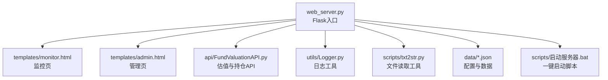
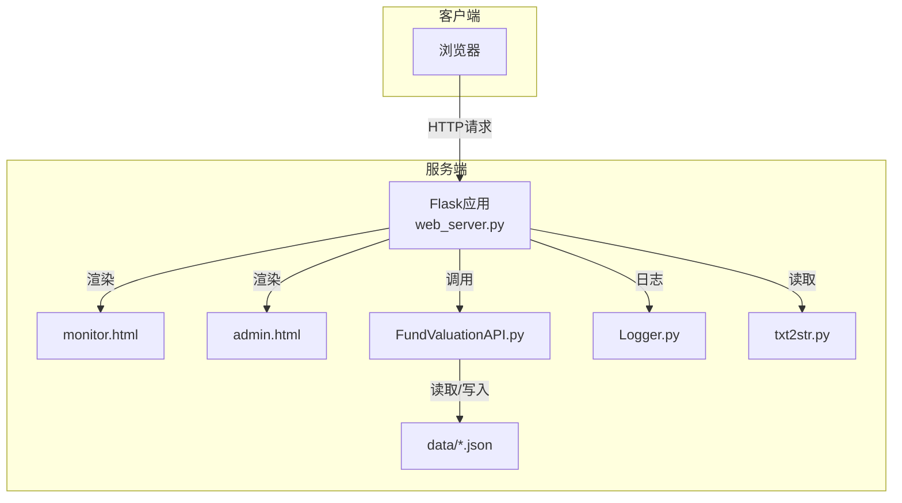
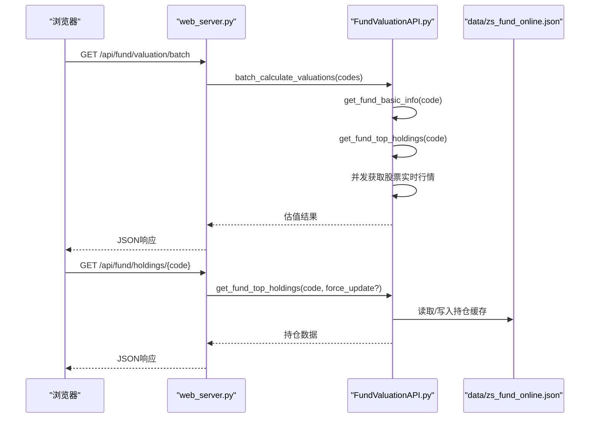
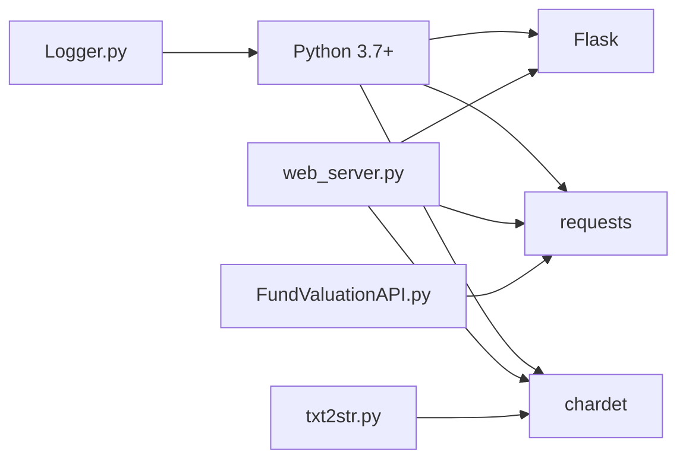

# 快速开始

<cite>
**本文引用的文件**
- [README.md](file://README.md)
- [requirements.txt](file://requirements.txt)
- [web_server.py](file://web_server.py)
- [启动服务器.bat](file://scripts/启动服务器.bat)
- [FundValuationAPI.py](file://api/FundValuationAPI.py)
- [monitor.html](file://templates/monitor.html)
- [admin.html](file://templates/admin.html)
- [Logger.py](file://utils/Logger.py)
- [txt2str.py](file://scripts/txt2str.py)
- [zs_fund_online.py](file://scripts/zs_fund_online.py)
- [zs_online.py](file://scripts/zs_online.py)
- [test_config.json](file://config/test_config.json)
- [zs_fund_online.json](file://data/zs_fund_online.json)
- [zs_online.json](file://data/zs_online.json)
</cite>

## 目录
1. [简介](#简介)
2. [项目结构](#项目结构)
3. [核心组件](#核心组件)
4. [架构总览](#架构总览)
5. [详细组件分析](#详细组件分析)
6. [依赖关系分析](#依赖关系分析)
7. [性能注意事项](#性能注意事项)
8. [故障排查指南](#故障排查指南)
9. [结论](#结论)
10. [附录](#附录)

## 简介
本指南面向首次接触“基金估值与K线监控系统”的用户，目标是在5分钟内完成环境准备、安装依赖、启动服务并访问系统，体验核心功能（基金估值与K线图）。系统基于Flask提供Web界面，支持：
- 基金实时估值（基于前十大重仓股）
- 股票/指数K线图查询
- 基金管理（添加/移除/编辑）
- 持仓管理与盈亏计算

## 项目结构
系统采用“Flask Web + API模块 + 模板 + 工具模块 + 配置数据”的组织方式，便于快速启动与扩展。

**图表来源**
- [web_server.py](file://web_server.py#L1-L552)
- [monitor.html](file://templates/monitor.html#L1-L918)
- [admin.html](file://templates/admin.html#L1-L1049)
- [FundValuationAPI.py](file://api/FundValuationAPI.py#L1-L537)
- [Logger.py](file://utils/Logger.py#L1-L86)
- [txt2str.py](file://scripts/txt2str.py#L1-L108)

**章节来源**
- [README.md](file://README.md#L5-L42)

## 核心组件
- Web服务器入口：负责路由、渲染模板、调用API、读取配置与日志。
- 基金估值API：封装对天天基金网、东方财富网的数据抓取与估值计算逻辑。
- 前端模板：监控页与管理页，提供交互与可视化展示。
- 工具模块：日志、文件读取、编码检测等。
- 配置与数据：基金列表、用户持仓、指数配置、历史持仓缓存。

**章节来源**
- [web_server.py](file://web_server.py#L1-L552)
- [FundValuationAPI.py](file://api/FundValuationAPI.py#L1-L537)
- [monitor.html](file://templates/monitor.html#L1-L918)
- [admin.html](file://templates/admin.html#L1-L1049)
- [Logger.py](file://utils/Logger.py#L1-L86)
- [txt2str.py](file://scripts/txt2str.py#L1-L108)

## 架构总览
系统采用前后端分离的轻量架构：前端模板由Flask渲染，后端通过API模块与第三方数据源交互，数据持久化在本地JSON文件中。

**图表来源**
- [web_server.py](file://web_server.py#L1-L552)
- [monitor.html](file://templates/monitor.html#L1-L918)
- [admin.html](file://templates/admin.html#L1-L1049)
- [FundValuationAPI.py](file://api/FundValuationAPI.py#L1-L537)
- [Logger.py](file://utils/Logger.py#L1-L86)
- [txt2str.py](file://scripts/txt2str.py#L1-L108)

## 详细组件分析

### 环境要求与安装
- Python版本：3.7及以上
- 依赖包：Flask、requests、chardet
- 安装命令（推荐使用虚拟环境）：
  - pip install flask requests chardet
- 依赖清单参考：requirements.txt

**章节来源**
- [README.md](file://README.md#L46-L55)
- [requirements.txt](file://requirements.txt#L1-L4)

### 启动方式
- 方式一：使用启动脚本（推荐）
  - 双击 scripts/启动服务器.bat，自动打开浏览器访问 http://localhost:5000
- 方式二：命令行启动
  - python web_server.py

启动脚本行为说明：
- 设置控制台编码为UTF-8
- 启动浏览器访问 http://localhost:5000
- 延迟1秒后启动Python服务

**章节来源**
- [README.md](file://README.md#L57-L66)
- [启动服务器.bat](file://scripts/启动服务器.bat#L1-L23)
- [web_server.py](file://web_server.py#L541-L552)

### 访问与默认端口
- 默认访问地址：http://localhost:5000
- 首次访问将打开监控主页面，自动加载基金估值与K线图。

**章节来源**
- [README.md](file://README.md#L68-L70)
- [web_server.py](file://web_server.py#L541-L552)

### 首次使用操作示例
以下步骤帮助你在5分钟内体验核心功能：

1) 在管理页添加一只基金
- 打开管理页：http://localhost:5000/admin
- 在“添加新基金”输入框输入6位基金代码，点击“➕ 添加”
- 系统将联网验证并预览前十大重仓股，确认后自动添加到监控列表

2) 查看估值与K线
- 回到首页 http://localhost:5000
- 页面将自动刷新加载估值与K线图；可点击“手动刷新”按钮立即更新

3) 编辑持仓与查看明细
- 在首页点击“查看持仓”或“编辑持仓”，可查看/修改重仓股比例
- 点击“联网更新”可强制从网络刷新持仓

4) 移除不需要的基金
- 在管理页点击“移除”即可从监控列表删除

**章节来源**
- [admin.html](file://templates/admin.html#L1-L1049)
- [monitor.html](file://templates/monitor.html#L1-L918)
- [web_server.py](file://web_server.py#L259-L539)

### API与数据流
系统主要API与数据流如下：

**图表来源**
- [web_server.py](file://web_server.py#L183-L227)
- [web_server.py](file://web_server.py#L105-L140)
- [FundValuationAPI.py](file://api/FundValuationAPI.py#L427-L453)
- [FundValuationAPI.py](file://api/FundValuationAPI.py#L135-L164)

**章节来源**
- [web_server.py](file://web_server.py#L183-L227)
- [web_server.py](file://web_server.py#L105-L140)
- [FundValuationAPI.py](file://api/FundValuationAPI.py#L135-L164)

### 配置文件说明
- 基金配置：data/zs_fund_online.json
  - fund_list：监控的基金代码列表
  - user_positions：用户持仓金额（元）
  - fund_holdings：本地缓存的前十大重仓股与更新时间
- 指数配置：data/zs_online.json
  - 包含指数代码、名称与默认K线参数

**章节来源**
- [README.md](file://README.md#L105-L131)
- [zs_fund_online.json](file://data/zs_fund_online.json#L1-L238)
- [zs_online.json](file://data/zs_online.json#L1-L58)

## 依赖关系分析
系统依赖关系简洁清晰，核心依赖集中在Flask与requests，字符集检测由chardet提供。

**图表来源**
- [requirements.txt](file://requirements.txt#L1-L4)
- [web_server.py](file://web_server.py#L9-L16)
- [FundValuationAPI.py](file://api/FundValuationAPI.py#L10-L17)
- [txt2str.py](file://scripts/txt2str.py#L1-L6)
- [Logger.py](file://utils/Logger.py#L1-L86)

**章节来源**
- [requirements.txt](file://requirements.txt#L1-L4)
- [web_server.py](file://web_server.py#L9-L16)

## 性能注意事项
- 并发获取股票行情：使用线程池并发请求，最多5线程，显著提升响应速度
- 自动缓存：优先使用本地缓存的持仓数据，减少网络请求
- 自动刷新：前端每5分钟自动刷新估值，兼顾实时性与性能

**章节来源**
- [FundValuationAPI.py](file://api/FundValuationAPI.py#L367-L393)
- [monitor.html](file://templates/monitor.html#L470-L475)

## 故障排查指南
- 启动后无法访问 http://localhost:5000
  - 检查端口占用：默认端口5000被占用会导致启动失败
  - 使用命令行启动：python web_server.py，观察控制台输出
- 依赖安装失败
  - 确保网络可访问PyPI；若需代理，先配置pip代理
  - 使用虚拟环境隔离依赖
- 估值数据为空或报错
  - 检查基金代码是否为6位数字且存在
  - 在管理页使用“联网更新”刷新持仓
- 字符集相关错误
  - 系统使用chardet自动检测编码；若仍报错，检查配置文件编码为UTF-8

**章节来源**
- [启动服务器.bat](file://scripts/启动服务器.bat#L1-L23)
- [web_server.py](file://web_server.py#L541-L552)
- [FundValuationAPI.py](file://api/FundValuationAPI.py#L100-L133)
- [txt2str.py](file://scripts/txt2str.py#L17-L31)

## 结论
通过本快速开始指南，你可以在5分钟内完成环境准备、安装依赖、启动服务并体验系统的核心功能。建议后续根据自身需求调整配置文件与监控列表，充分利用管理页进行精细化维护。

## 附录

### 常用API一览
- 获取基金监控列表：GET /api/fund/list
- 预览基金持仓：GET /api/fund/preview/{fund_code}
- 获取基金持仓：GET /api/fund/holdings/{fund_code}
- 添加基金：POST /api/fund/add
- 移除基金：DELETE /api/fund/remove/{fund_code}
- 更新持仓：POST /api/fund/update_holdings
- 更新用户持仓金额：POST /api/fund/update_position
- 批量估值：POST /api/fund/valuation/batch
- 单只估值：GET /api/fund/valuation/{fund_code}
- 生成K线图URL：POST /api/kline/url

**章节来源**
- [README.md](file://README.md#L132-L149)