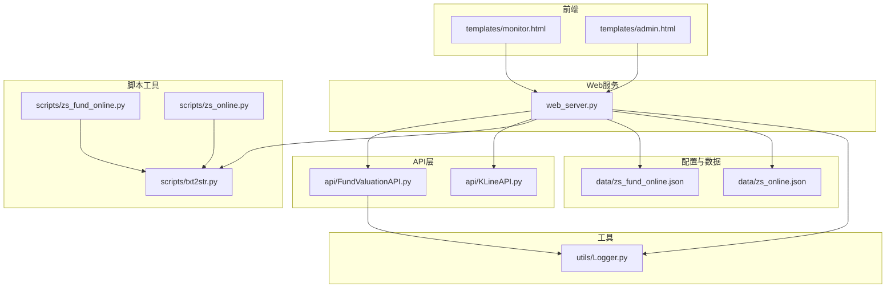
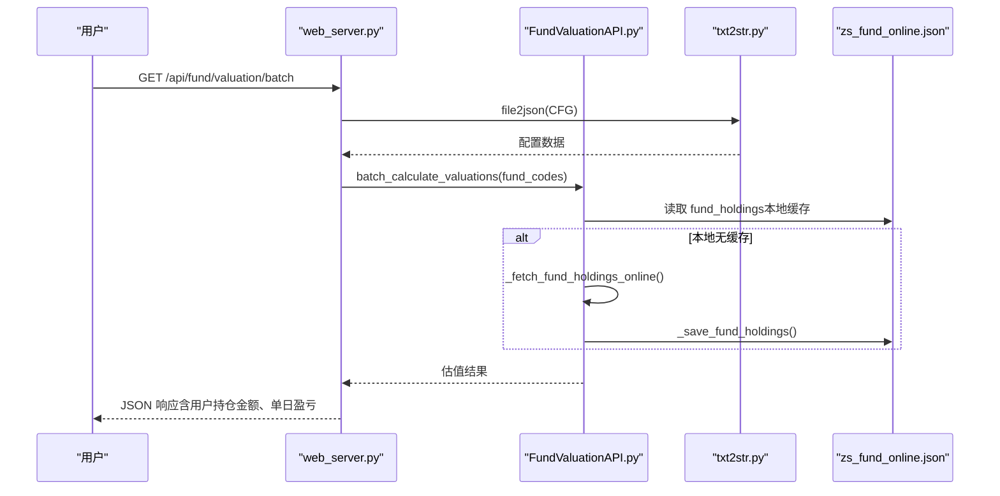
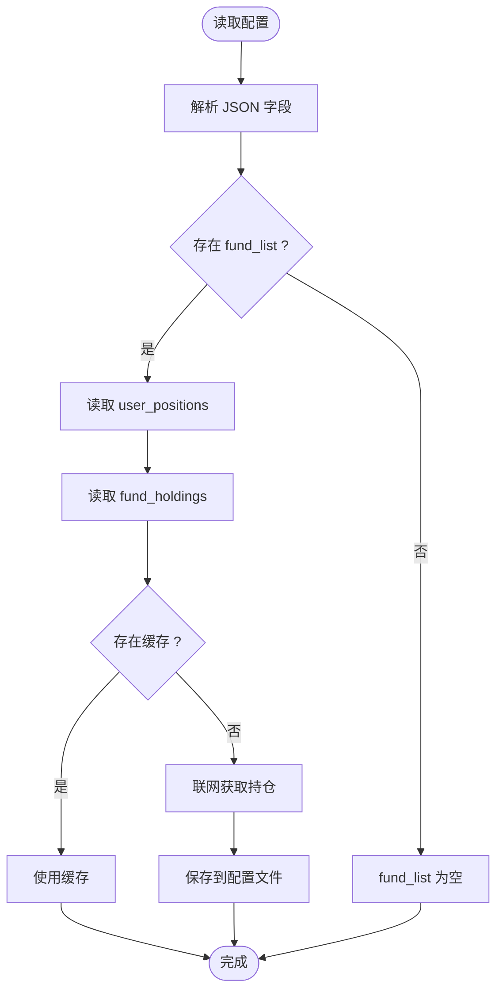
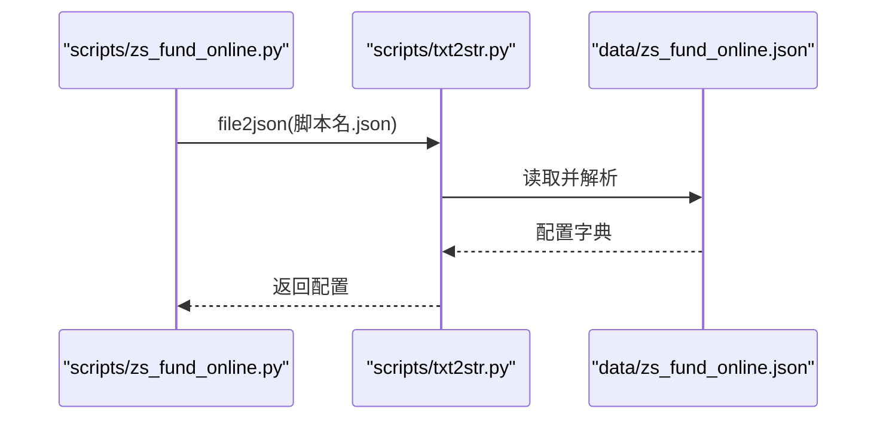
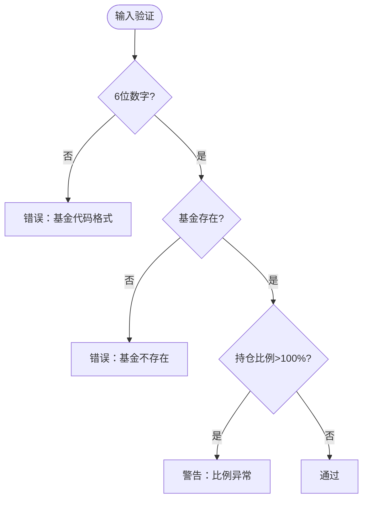
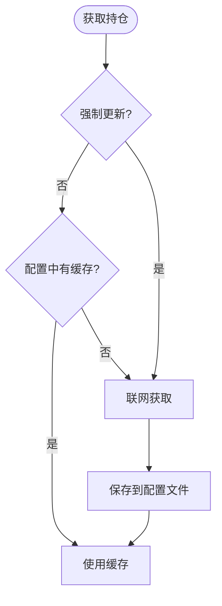
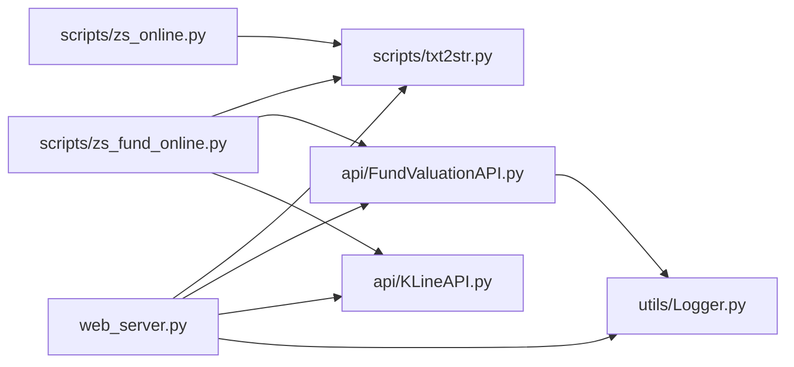

# 数据模型与配置

<cite>
**本文引用的文件**
- [data/zs_fund_online.json](file://data/zs_fund_online.json)
- [data/zs_online.json](file://data/zs_online.json)
- [scripts/zs_fund_online.py](file://scripts/zs_fund_online.py)
- [scripts/zs_online.py](file://scripts/zs_online.py)
- [api/FundValuationAPI.py](file://api/FundValuationAPI.py)
- [api/KLineAPI.py](file://api/KLineAPI.py)
- [scripts/txt2str.py](file://scripts/txt2str.py)
- [utils/Logger.py](file://utils/Logger.py)
- [web_server.py](file://web_server.py)
- [templates/admin.html](file://templates/admin.html)
- [templates/monitor.html](file://templates/monitor.html)
- [tests/test_fund_config.py](file://tests/test_fund_config.py)
- [config/test_config.json](file://config/test_config.json)
- [README.md](file://README.md)
</cite>

## 目录
1. [简介](#简介)
2. [项目结构](#项目结构)
3. [核心组件](#核心组件)
4. [架构总览](#架构总览)
5. [详细组件分析](#详细组件分析)
6. [依赖关系分析](#依赖关系分析)
7. [性能考量](#性能考量)
8. [故障排查指南](#故障排查指南)
9. [结论](#结论)
10. [附录](#附录)

## 简介
本文件聚焦“基金估值与K线监控系统”的数据模型与配置，系统通过配置文件驱动，实现：
- 基金实时估值（基于前十大重仓股）
- 股票指数K线图展示
- 基金管理、持仓编辑、估值计算的Web界面与API
- 配置文件的加载、校验、缓存与持久化

目标读者：系统管理员与开发者，帮助理解配置文件结构、加载机制、数据验证与缓存策略，并提供修改指南与最佳实践。

## 项目结构
系统采用分层组织：
- 配置与数据：data/ 下的 JSON 配置文件与 HTML 原始数据
- Web 服务：web_server.py 提供路由与业务逻辑
- API 层：api/ 中的 FundValuationAPI 与 KLineAPI
- 脚本工具：scripts/ 中的 JSON 读取与页面生成脚本
- 前端模板：templates/ 中的监控页与管理页
- 工具与日志：utils/Logger.py 提供日志能力
- 测试：tests/ 与 config/test_config.json 用于验证配置行为

**图表来源**
- [web_server.py](file://web_server.py#L20-L552)
- [api/FundValuationAPI.py](file://api/FundValuationAPI.py#L27-L537)
- [api/KLineAPI.py](file://api/KLineAPI.py#L15-L345)
- [scripts/txt2str.py](file://scripts/txt2str.py#L1-L108)
- [scripts/zs_fund_online.py](file://scripts/zs_fund_online.py#L1-L281)
- [scripts/zs_online.py](file://scripts/zs_online.py#L1-L79)
- [utils/Logger.py](file://utils/Logger.py#L6-L86)

**章节来源**
- [README.md](file://README.md#L5-L42)

## 核心组件
- 配置文件加载与解析：scripts/txt2str.file2json 读取 JSON，自动检测编码并解析
- 基金估值 API：api/FundValuationAPI 提供基金基本信息、持仓获取、实时行情并发抓取与估值计算
- K线 API：api/KLineAPI 提供 URL 生成、图片下载与批量处理
- Web 服务：web_server.py 提供监控页渲染、管理页、配置读写与估值计算 API
- 页面生成脚本：scripts/zs_fund_online.py 与 scripts/zs_online.py 用于生成静态 HTML

**章节来源**
- [scripts/txt2str.py](file://scripts/txt2str.py#L92-L108)
- [api/FundValuationAPI.py](file://api/FundValuationAPI.py#L42-L87)
- [api/KLineAPI.py](file://api/KLineAPI.py#L62-L109)
- [web_server.py](file://web_server.py#L30-L52)
- [scripts/zs_fund_online.py](file://scripts/zs_fund_online.py#L22-L31)
- [scripts/zs_online.py](file://scripts/zs_online.py#L19-L29)

## 架构总览
系统采用“配置驱动 + API 计算 + Web 渲染”的架构：
- 配置文件驱动：data/zs_fund_online.json 与 data/zs_online.json 决定监控范围与展示参数
- API 计算：FundValuationAPI 优先使用本地缓存（fund_holdings），缺失时联网获取并回写
- Web 渲染：Flask 路由根据配置渲染模板；也可通过脚本生成静态 HTML
- 数据持久化：配置文件作为唯一持久化介质；日志文件辅助问题定位

**图表来源**
- [web_server.py](file://web_server.py#L183-L227)
- [api/FundValuationAPI.py](file://api/FundValuationAPI.py#L135-L164)
- [scripts/txt2str.py](file://scripts/txt2str.py#L92-L108)

**章节来源**
- [web_server.py](file://web_server.py#L183-L227)
- [api/FundValuationAPI.py](file://api/FundValuationAPI.py#L135-L164)

## 详细组件分析

### 基金配置文件数据模型（data/zs_fund_online.json）
- fund_list：监控的基金代码列表
- user_positions：用户对各基金的持仓金额（单位：元），用于计算单日盈亏
- fund_holdings：本地缓存的基金前十大重仓股信息，包含 holdings 与 update_time
- zs_all：指数映射表，键为指数代码，值为 [指数名称, 股票代码串,...]
- type_all：K线周期集合（如 D/W/M）
- formula_all：技术指标集合（如 MACD）
- unitWidth、str_dir_d、file_htm、file_online：页面生成参数

字段说明与示例要点（以仓库文件为准）：
- fund_list：数组，元素为6位数字字符串
- user_positions：键为基金代码，值为数值（元）
- fund_holdings：键为基金代码，值为 {holdings:[{股票代码, 股票名称, 持仓比例}], update_time}
- zs_all：键为指数代码字符串，值为数组，首项为名称，其余为股票代码串
- type_all/formula_all：数组，元素为字符串
- unitWidth：整数，影响K线图宽度
- file_htm/file_online：字符串，HTML文件名

**图表来源**
- [data/zs_fund_online.json](file://data/zs_fund_online.json#L1-L238)
- [api/FundValuationAPI.py](file://api/FundValuationAPI.py#L135-L164)

**章节来源**
- [data/zs_fund_online.json](file://data/zs_fund_online.json#L1-L238)
- [api/FundValuationAPI.py](file://api/FundValuationAPI.py#L135-L164)

### 股票指数配置文件数据模型（data/zs_online.json）
- zs_all：指数映射表，键为指数代码，值为 [指数名称, 股票代码串,...]
- type_all：K线周期集合（如 D/W/M）
- formula_all：技术指标集合（如 MACD）
- unitWidth、str_dir_d、file_htm、file_online：页面生成参数
- _comment：注释说明（非必需）

字段说明与示例要点：
- zs_all：键为指数代码字符串，值为数组，首项为名称，其余为股票代码串
- type_all/formula_all：数组，元素为字符串
- 其余参数与生成页面相关

**章节来源**
- [data/zs_online.json](file://data/zs_online.json#L1-L58)

### 配置文件加载机制
- txt2str.file2json：统一读取 JSON，自动检测编码，异常时记录日志并退出
- web_server.py：通过 file2json 读取配置，渲染模板或返回 API 数据
- FundValuationAPI：构造时读取配置文件，支持保存与更新

**图表来源**
- [scripts/zs_fund_online.py](file://scripts/zs_fund_online.py#L22-L23)
- [scripts/txt2str.py](file://scripts/txt2str.py#L92-L108)

**章节来源**
- [scripts/zs_fund_online.py](file://scripts/zs_fund_online.py#L22-L23)
- [scripts/txt2str.py](file://scripts/txt2str.py#L92-L108)

### 数据验证规则
- 基金代码格式：6位数字
- 持仓比例总和：超过100%时返回警告
- 基金存在性：添加前联网验证
- 持仓金额：非负数值

**图表来源**
- [web_server.py](file://web_server.py#L368-L380)
- [web_server.py](file://web_server.py#L114-L119)

**章节来源**
- [web_server.py](file://web_server.py#L368-L380)
- [web_server.py](file://web_server.py#L114-L119)

### 缓存策略
- 优先使用本地缓存：FundValuationAPI.get_fund_top_holdings 优先从配置文件读取 fund_holdings
- 缺失或强制更新：联网获取并保存到配置文件
- 自动记录更新时间：_save_fund_holdings 写入 update_time
- 配置热更新：web_server 保存配置后重建 FundValuationAPI 实例

**图表来源**
- [api/FundValuationAPI.py](file://api/FundValuationAPI.py#L135-L164)
- [api/FundValuationAPI.py](file://api/FundValuationAPI.py#L235-L252)
- [web_server.py](file://web_server.py#L82-L103)

**章节来源**
- [api/FundValuationAPI.py](file://api/FundValuationAPI.py#L135-L164)
- [api/FundValuationAPI.py](file://api/FundValuationAPI.py#L235-L252)
- [web_server.py](file://web_server.py#L82-L103)

### 数据持久化与文件存储格式
- 配置文件：data/zs_fund_online.json 与 data/zs_online.json（JSON）
- 日志文件：logs/ 下的各类日志（文本）
- 页面文件：脚本生成的 HTML 文件（如 zs_fund_online.htm）

**章节来源**
- [README.md](file://README.md#L105-L131)
- [utils/Logger.py](file://utils/Logger.py#L12-L56)

### 数据更新机制与版本兼容性
- 更新机制：前端管理页支持“联网更新”“编辑保存”，后端通过 API 写回配置文件
- 版本兼容：配置文件结构稳定，新增字段不影响既有字段解析；FundValuationAPI 通过 get() 与默认值保证健壮性

**章节来源**
- [templates/admin.html](file://templates/admin.html#L729-L747)
- [web_server.py](file://web_server.py#L142-L158)
- [api/FundValuationAPI.py](file://api/FundValuationAPI.py#L56-L72)

### 配置文件修改指南与最佳实践
- 修改监控列表：在 fund_list 中添加/移除6位数字代码
- 编辑用户持仓金额：在 user_positions 中设置对应基金的金额（元）
- 编辑持仓比例：在 fund_holdings 中修改 holdings，或使用管理页“编辑持仓”
- 强制更新：在管理页选择“联网更新”，或删除对应基金的持仓节点触发自动联网
- 最佳实践：
  - 修改后保存，确保配置文件编码为 UTF-8
  - 持仓比例合计建议不超过100%，避免预警
  - 使用管理页的“预览-确认”机制添加新基金
  - 定期备份配置文件

**章节来源**
- [README.md](file://README.md#L105-L131)
- [templates/admin.html](file://templates/admin.html#L589-L637)
- [web_server.py](file://web_server.py#L445-L502)

## 依赖关系分析
- web_server.py 依赖 txt2str.file2json 读取配置，依赖 FundValuationAPI 进行估值计算
- FundValuationAPI 依赖 requests 与正则解析，依赖 Logger 记录日志
- 页面生成脚本依赖 txt2str 读取配置，调用 FundValuationAPI 与 KLineAPI
- 前端模板通过 AJAX 调用 web_server.py 的 API

**图表来源**
- [web_server.py](file://web_server.py#L9-L27)
- [api/FundValuationAPI.py](file://api/FundValuationAPI.py#L10-L24)
- [api/KLineAPI.py](file://api/KLineAPI.py#L9-L18)
- [scripts/zs_fund_online.py](file://scripts/zs_fund_online.py#L16-L17)
- [scripts/zs_online.py](file://scripts/zs_online.py#L16-L16)
- [utils/Logger.py](file://utils/Logger.py#L6-L25)

**章节来源**
- [web_server.py](file://web_server.py#L9-L27)
- [api/FundValuationAPI.py](file://api/FundValuationAPI.py#L10-L24)
- [api/KLineAPI.py](file://api/KLineAPI.py#L9-L18)
- [scripts/zs_fund_online.py](file://scripts/zs_fund_online.py#L16-L17)
- [scripts/zs_online.py](file://scripts/zs_online.py#L16-L16)
- [utils/Logger.py](file://utils/Logger.py#L6-L25)

## 性能考量
- 并发抓取：FundValuationAPI 使用线程池并发获取股票实时行情，提升性能
- 自动刷新：前端监控页每5分钟自动刷新估值，平衡实时性与请求频率
- K线图批量生成：脚本一次性生成多指数、多周期、多指标的K线图，减少重复请求

**章节来源**
- [api/FundValuationAPI.py](file://api/FundValuationAPI.py#L367-L369)
- [templates/monitor.html](file://templates/monitor.html#L470-L475)
- [scripts/zs_fund_online.py](file://scripts/zs_fund_online.py#L248-L256)

## 故障排查指南
- 配置文件编码错误：txt2str.file2json 检测并报错，需确保 UTF-8 编码
- 基金不存在或无法访问：web_server.preview_fund 与 add_fund 会返回明确错误
- 持仓比例异常：超过100%会返回警告，需检查 holdings
- 日志定位：查看 logs/ 下的日志文件，定位具体错误

**章节来源**
- [scripts/txt2str.py](file://scripts/txt2str.py#L92-L108)
- [web_server.py](file://web_server.py#L300-L358)
- [web_server.py](file://web_server.py#L114-L119)
- [utils/Logger.py](file://utils/Logger.py#L12-L56)

## 结论
本系统通过简洁稳定的 JSON 配置文件驱动，结合 FundValuationAPI 的本地缓存与并发计算能力，实现了高效、可维护的基金估值与K线监控。管理员与开发者可通过管理页与 API 对配置进行安全、可控的修改，配合日志与测试用例，能够快速定位与解决问题。

## 附录
- 配置文件示例与字段说明参见 README 的“配置说明”与 data/ 下的 JSON 文件
- 测试用例与配置验证参见 tests/test_fund_config.py 与 config/test_config.json

**章节来源**
- [README.md](file://README.md#L105-L131)
- [tests/test_fund_config.py](file://tests/test_fund_config.py#L1-L63)
- [config/test_config.json](file://config/test_config.json#L1-L59)