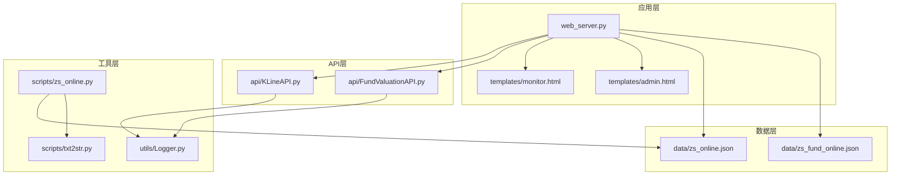
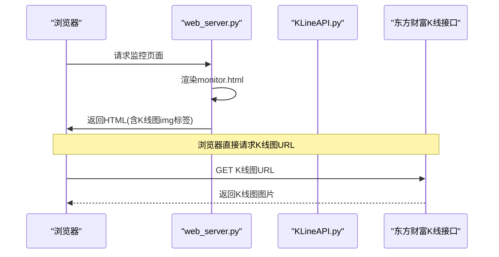
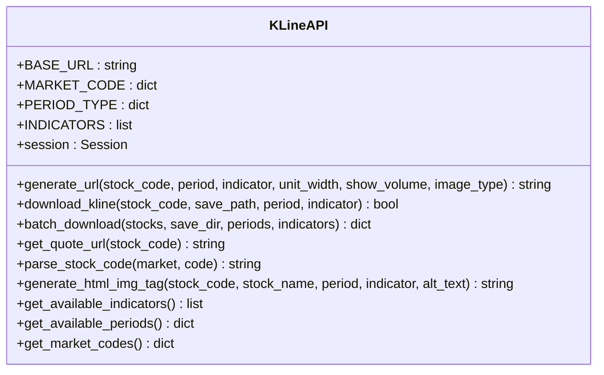
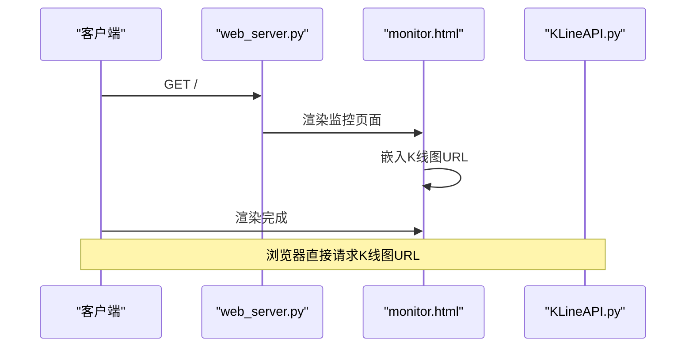
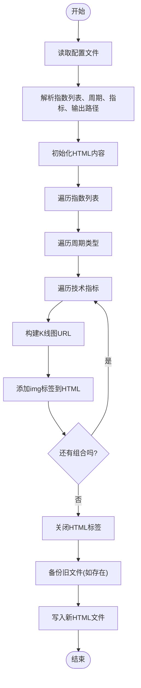
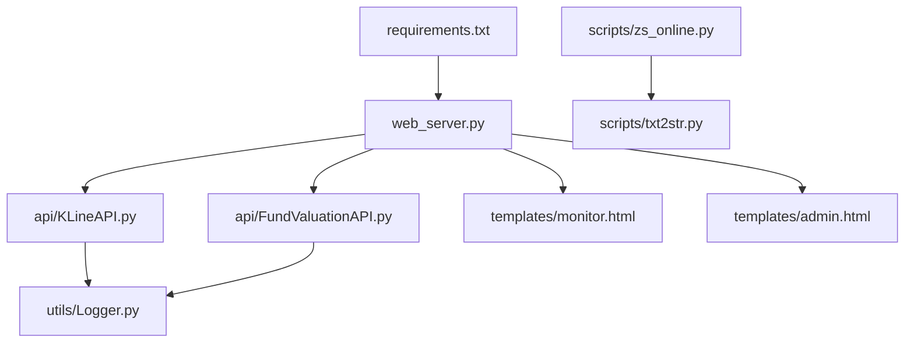

# K线图生成与处理

<cite>
**本文引用的文件**
- [README.md](file://README.md)
- [web_server.py](file://web_server.py)
- [api/KLineAPI.py](file://api/KLineAPI.py)
- [api/FundValuationAPI.py](file://api/FundValuationAPI.py)
- [templates/monitor.html](file://templates/monitor.html)
- [templates/admin.html](file://templates/admin.html)
- [utils/Logger.py](file://utils/Logger.py)
- [scripts/zs_online.py](file://scripts/zs_online.py)
- [scripts/txt2str.py](file://scripts/txt2str.py)
- [data/zs_online.json](file://data/zs_online.json)
- [data/zs_fund_online.json](file://data/zs_fund_online.json)
- [requirements.txt](file://requirements.txt)
</cite>

## 目录
1. [简介](#简介)
2. [项目结构](#项目结构)
3. [核心组件](#核心组件)
4. [架构总览](#架构总览)
5. [详细组件分析](#详细组件分析)
6. [依赖关系分析](#依赖关系分析)
7. [性能考量](#性能考量)
8. [故障排查指南](#故障排查指南)
9. [结论](#结论)
10. [附录](#附录)

## 简介
本项目是一个基于Flask的Web应用，提供基金实时估值监控与股票K线图查询功能。其中K线图生成与处理的核心能力由K线API模块提供，支持通过东方财富接口生成K线图URL、批量下载K线图、以及在前端模板中直接嵌入K线图。项目还包含前端模板，用于在监控页面中展示多指数、多周期、多指标的K线图，并提供管理后台用于配置与生成静态监控页面。

## 项目结构
项目采用模块化组织，主要目录与文件如下：
- api：核心业务API模块，包含K线API与基金估值API
- templates：前端模板，包含监控页面与管理页面
- utils：通用工具模块，包含日志记录器
- scripts：辅助脚本，包含指数K线HTML生成工具与文本文件读取工具
- data：数据配置文件，包含指数列表、用户配置等
- docs：项目文档
- tests：测试文件
- 其他：根目录下的启动脚本、README、依赖清单等

**图表来源**
- [web_server.py](file://web_server.py#L1-L562)
- [api/KLineAPI.py](file://api/KLineAPI.py#L1-L345)
- [api/FundValuationAPI.py](file://api/FundValuationAPI.py#L1-L200)
- [templates/monitor.html](file://templates/monitor.html#L1-L918)
- [templates/admin.html](file://templates/admin.html#L1-L1049)
- [utils/Logger.py](file://utils/Logger.py#L1-L86)
- [scripts/zs_online.py](file://scripts/zs_online.py#L1-L79)
- [scripts/txt2str.py](file://scripts/txt2str.py#L1-L108)
- [data/zs_online.json](file://data/zs_online.json#L1-L58)
- [data/zs_fund_online.json](file://data/zs_fund_online.json#L1-L800)

**章节来源**
- [README.md](file://README.md#L1-L193)
- [web_server.py](file://web_server.py#L1-L562)

## 核心组件
- K线API模块：提供K线图URL生成、图片下载、批量处理、HTML图片标签生成等能力；支持多种周期与技术指标。
- 基金估值API模块：提供基金基本信息获取、前十大重仓股获取、估值计算等能力。
- Web服务器：提供Flask路由、模板渲染、配置读取与保存、前端交互等。
- 前端模板：监控页面直接嵌入K线图URL，管理页面提供配置与生成静态页面的功能。
- 工具模块：日志记录器、文本文件读取与JSON解析工具。
- 脚本工具：指数K线HTML生成脚本，从配置文件读取指数列表并生成包含多指数、多周期、多指标的HTML页面。

**章节来源**
- [api/KLineAPI.py](file://api/KLineAPI.py#L1-L345)
- [api/FundValuationAPI.py](file://api/FundValuationAPI.py#L1-L200)
- [web_server.py](file://web_server.py#L1-L562)
- [templates/monitor.html](file://templates/monitor.html#L1-L918)
- [templates/admin.html](file://templates/admin.html#L1-L1049)
- [utils/Logger.py](file://utils/Logger.py#L1-L86)
- [scripts/zs_online.py](file://scripts/zs_online.py#L1-L79)
- [scripts/txt2str.py](file://scripts/txt2str.py#L1-L108)

## 架构总览
系统采用前后端分离的架构设计：
- 前端：通过Flask模板渲染生成页面，监控页面直接使用K线图URL嵌入图片；管理页面提供配置与生成静态页面功能。
- 后端：Web服务器负责路由与模板渲染，K线API模块负责与东方财富接口交互生成K线图URL；基金估值API模块负责获取基金与股票数据并计算估值。
- 数据：配置文件与JSON数据文件作为数据源，脚本工具负责从配置文件生成静态HTML页面。

**图表来源**
- [web_server.py](file://web_server.py#L30-L51)
- [templates/monitor.html](file://templates/monitor.html#L377-L398)
- [api/KLineAPI.py](file://api/KLineAPI.py#L69-L110)

**章节来源**
- [web_server.py](file://web_server.py#L30-L51)
- [templates/monitor.html](file://templates/monitor.html#L377-L398)
- [api/KLineAPI.py](file://api/KLineAPI.py#L69-L110)

## 详细组件分析

### K线API模块分析
K线API模块封装了与东方财富K线接口交互的能力，支持生成K线图URL、下载图片、批量处理、HTML图片标签生成等。

- 支持的周期类型：日线、周线、月线、分钟线、5分钟、15分钟、30分钟、60分钟。
- 支持的技术指标：MACD、KDJ、RSI、布林线、MA、成交量、能量潮、威廉指标、CCI、DMI等。
- URL生成：根据股票代码、周期、指标、成交量显示、图片类型等参数生成完整URL。
- 图片下载：通过HTTP请求获取图片并保存到本地。
- 批量下载：遍历股票、周期、指标组合，批量生成并下载K线图。
- HTML图片标签：生成img标签，便于在模板中直接嵌入。

**图表来源**
- [api/KLineAPI.py](file://api/KLineAPI.py#L15-L264)

**章节来源**
- [api/KLineAPI.py](file://api/KLineAPI.py#L15-L264)

### Web服务器与前端模板集成
Web服务器负责：
- 生成监控页面HTML，传递指数列表、周期类型、技术指标、单位宽度等参数。
- 提供API路由，包括配置读取与保存、基金估值、持仓管理等。
- 在监控页面模板中直接嵌入K线图URL，实现无需后端生成图片即可展示K线图。

**图表来源**
- [web_server.py](file://web_server.py#L30-L51)
- [templates/monitor.html](file://templates/monitor.html#L377-L398)
- [api/KLineAPI.py](file://api/KLineAPI.py#L69-L110)

**章节来源**
- [web_server.py](file://web_server.py#L30-L51)
- [templates/monitor.html](file://templates/monitor.html#L377-L398)

### 指数K线HTML生成脚本
指数K线HTML生成脚本从配置文件读取指数列表，生成包含多指数、多周期、多指标的HTML页面。该脚本展示了如何批量生成K线图URL并写入HTML文件，便于离线查看或分享。

**图表来源**
- [scripts/zs_online.py](file://scripts/zs_online.py#L21-L79)

**章节来源**
- [scripts/zs_online.py](file://scripts/zs_online.py#L1-L79)

### 基金估值API模块（与K线图的关系）
虽然基金估值API主要用于估值计算，但它与K线图展示存在间接关系：监控页面会同时展示K线图与基金估值，两者共同构成完整的监控视图。估值API负责获取基金与股票数据，而K线API负责生成K线图URL。

**章节来源**
- [api/FundValuationAPI.py](file://api/FundValuationAPI.py#L1-L200)
- [web_server.py](file://web_server.py#L160-L227)

## 依赖关系分析
- 运行时依赖：Flask、requests、chardet。
- 模块间依赖：web_server.py依赖api/KLineAPI.py与api/FundValuationAPI.py；模板依赖配置文件；脚本依赖配置文件与工具模块。
- 外部依赖：东方财富K线接口、基金与股票数据接口。

**图表来源**
- [requirements.txt](file://requirements.txt#L1-L4)
- [web_server.py](file://web_server.py#L9-L18)
- [api/KLineAPI.py](file://api/KLineAPI.py#L9-L12)
- [api/FundValuationAPI.py](file://api/FundValuationAPI.py#L10-L17)
- [utils/Logger.py](file://utils/Logger.py#L1-L86)
- [scripts/zs_online.py](file://scripts/zs_online.py#L8-L16)
- [scripts/txt2str.py](file://scripts/txt2str.py#L1-L10)

**章节来源**
- [requirements.txt](file://requirements.txt#L1-L4)
- [web_server.py](file://web_server.py#L9-L18)
- [api/KLineAPI.py](file://api/KLineAPI.py#L9-L12)
- [api/FundValuationAPI.py](file://api/FundValuationAPI.py#L10-L17)
- [utils/Logger.py](file://utils/Logger.py#L1-L86)
- [scripts/zs_online.py](file://scripts/zs_online.py#L8-L16)
- [scripts/txt2str.py](file://scripts/txt2str.py#L1-L10)

## 性能考量
- 并发性能：项目README中提到使用线程池并发获取股票行情，提升性能。虽然该特性在K线图模块中未直接体现，但在整体系统中提升了数据获取效率。
- 图片加载优化：前端模板直接嵌入K线图URL，浏览器负责图片加载与缓存，减少后端压力。
- 批量下载：K线API提供批量下载功能，适合一次性生成大量K线图。
- 日志记录：统一的日志记录器便于性能监控与问题定位。

**章节来源**
- [README.md](file://README.md#L155-L157)
- [utils/Logger.py](file://utils/Logger.py#L1-L86)
- [api/KLineAPI.py](file://api/KLineAPI.py#L151-L194)

## 故障排查指南
- K线图无法加载：检查K线图URL是否正确生成，确认网络可达性与接口返回状态。
- 配置文件读取失败：确认配置文件编码与格式正确，使用工具模块提供的file2json函数读取。
- 日志定位：通过日志记录器查看错误信息，定位问题发生的具体位置。
- 批量下载失败：检查保存路径权限与磁盘空间，确认网络连接稳定。

**章节来源**
- [utils/Logger.py](file://utils/Logger.py#L1-L86)
- [scripts/txt2str.py](file://scripts/txt2str.py#L92-L108)
- [api/KLineAPI.py](file://api/KLineAPI.py#L132-L149)

## 结论
本项目通过K线API模块与前端模板的结合，实现了K线图的生成与展示。系统具备良好的模块化设计与可扩展性，支持多种周期与技术指标，并提供了批量下载与静态页面生成能力。通过日志记录与配置管理，系统在稳定性与可维护性方面表现良好。开发者可根据需求扩展新的技术指标或周期类型，并通过配置文件灵活调整展示参数。

## 附录
- API说明（节选）：
  - K线相关API：POST /api/kline/url（生成K线图URL）
  - 基金相关API：GET /api/fund/list、GET /api/fund/holdings/<fund_code>、POST /api/fund/add、DELETE /api/fund/remove/<fund_code>、POST /api/fund/update_holdings、POST /api/fund/update_position、GET /api/valuation/batch、GET /api/valuation/<fund_code>
- 配置文件说明：
  - 指数配置：data/zs_online.json，包含指数列表、周期类型、技术指标、单位宽度、输出文件等
  - 基金配置：data/zs_fund_online.json，包含基金列表、指数列表、周期类型、技术指标、用户持仓金额、基金持仓信息等

**章节来源**
- [README.md](file://README.md#L132-L149)
- [data/zs_online.json](file://data/zs_online.json#L1-L58)
- [data/zs_fund_online.json](file://data/zs_fund_online.json#L1-L800)