# 基金估值算法实现

<cite>
**本文档引用的文件**
- [README.md](file://README.md)
- [web_server.py](file://web_server.py)
- [api/FundValuationAPI.py](file://api/FundValuationAPI.py)
- [scripts/zs_fund_online.py](file://scripts/zs_fund_online.py)
- [scripts/zs_online.py](file://scripts/zs_online.py)
- [config/test_config.json](file://config/test_config.json)
- [data/zs_fund_online.json](file://data/zs_fund_online.json)
- [data/zs_online.json](file://data/zs_online.json)
- [utils/Logger.py](file://utils/Logger.py)
- [requirements.txt](file://requirements.txt)
</cite>

## 目录
1. [简介](#简介)
2. [项目结构](#项目结构)
3. [核心组件](#核心组件)
4. [架构概览](#架构概览)
5. [详细组件分析](#详细组件分析)
6. [依赖关系分析](#依赖关系分析)
7. [性能考量](#性能考量)
8. [故障排除指南](#故障排除指南)
9. [结论](#结论)
10. [附录](#附录)

## 简介
本项目是一个基于Flask的Web应用，提供基金实时估值监控和股票K线图查询功能。核心功能是通过基金前十大重仓股的实时涨跌估算基金净值变化，支持并发处理机制和数据缓存策略，为用户提供实时的投资参考信息。

## 项目结构
项目采用模块化设计，主要包含以下核心模块：

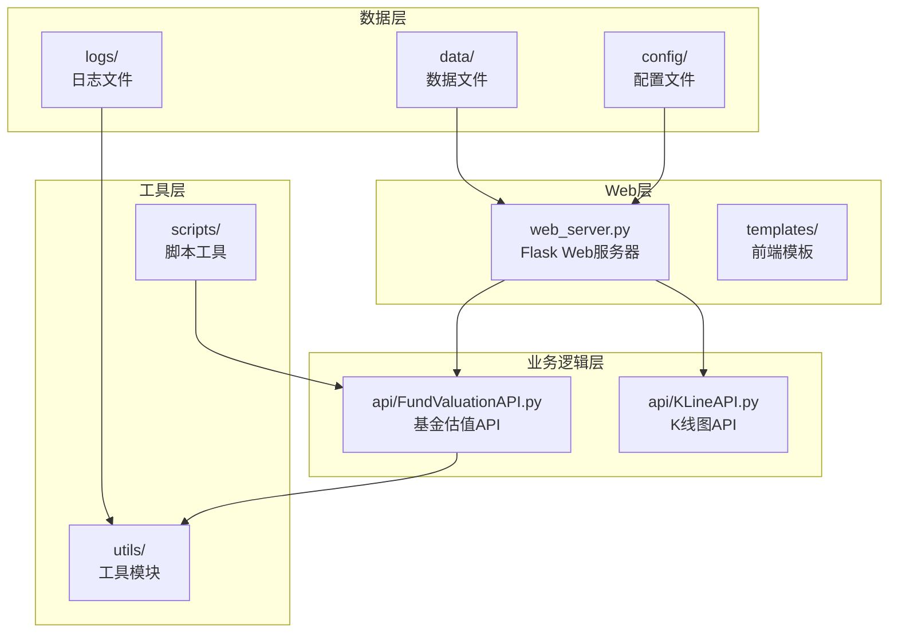

**图表来源**
- [web_server.py](file://web_server.py#L1-L552)
- [api/FundValuationAPI.py](file://api/FundValuationAPI.py#L1-L537)

**章节来源**
- [README.md](file://README.md#L5-L42)
- [requirements.txt](file://requirements.txt#L1-L4)

## 核心组件
项目包含以下核心组件：

### 1. Web服务器 (web_server.py)
- 基于Flask框架的Web应用入口
- 提供RESTful API接口
- 管理基金监控列表和用户配置
- 处理前端交互和数据展示

### 2. 基金估值API (FundValuationAPI)
- 实现基金估值计算的核心算法
- 处理数据获取和缓存管理
- 支持并发股票行情获取
- 提供便捷的估值计算接口

### 3. 数据脚本工具
- `zs_fund_online.py`: 生成包含基金估值和K线图的HTML页面
- `zs_online.py`: 生成纯K线图HTML页面
- 支持批量数据处理和页面生成

### 4. 配置管理系统
- JSON格式的配置文件
- 支持基金列表、用户持仓、指数配置等
- 自动缓存和持久化机制

**章节来源**
- [web_server.py](file://web_server.py#L20-L552)
- [api/FundValuationAPI.py](file://api/FundValuationAPI.py#L27-L537)
- [scripts/zs_fund_online.py](file://scripts/zs_fund_online.py#L1-L281)

## 架构概览
系统采用分层架构设计，各层职责明确：

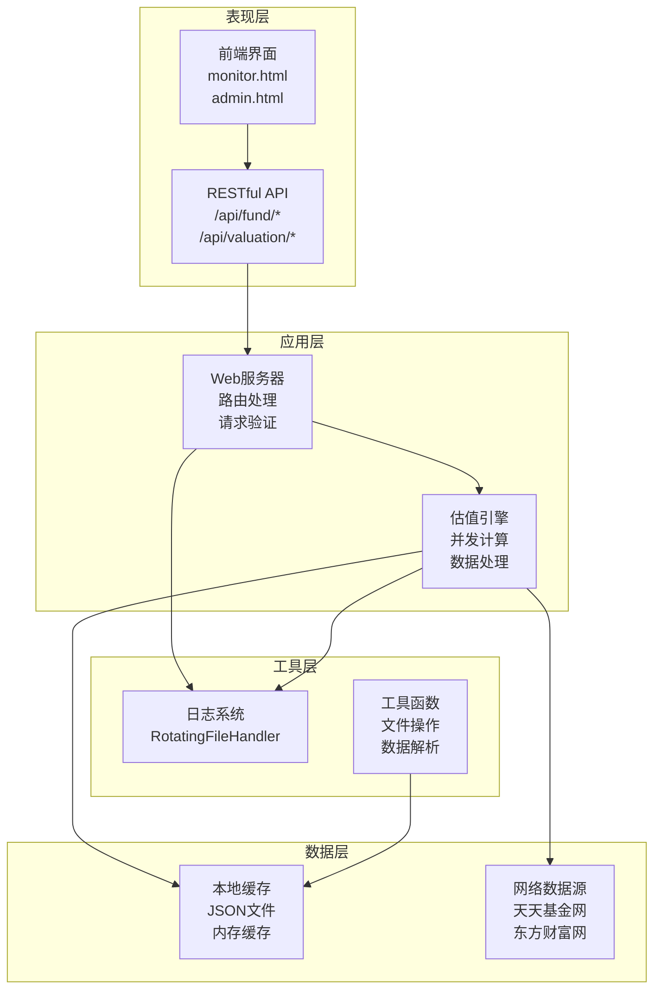

**图表来源**
- [web_server.py](file://web_server.py#L66-L296)
- [api/FundValuationAPI.py](file://api/FundValuationAPI.py#L88-L452)

## 详细组件分析

### 基金估值算法实现

#### 核心算法原理
基金估值算法基于前十大重仓股的实时涨跌进行加权平均计算：

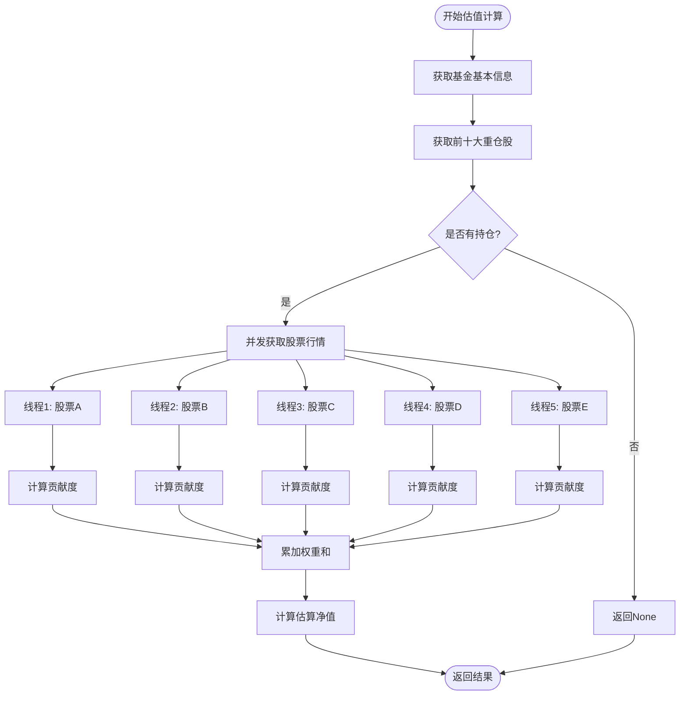

**图表来源**
- [api/FundValuationAPI.py](file://api/FundValuationAPI.py#L315-L425)

#### 加权平均涨跌幅计算方法
算法采用持仓比例作为权重，计算公式为：
- 估算涨跌幅 = Σ(股票涨跌幅 × 持仓比例) / 100
- 估算净值 = 上次净值 × (1 + 估算涨跌幅 / 100)

#### 持仓比例权重分配机制
1. **权重计算**: 每只股票的权重 = 该股票持仓比例
2. **贡献度计算**: 贡献度 = 股票涨跌幅 × 权重
3. **总权重验证**: 确保总权重不超过100%
4. **异常处理**: 当权重超过100%时发出警告

**章节来源**
- [api/FundValuationAPI.py](file://api/FundValuationAPI.py#L315-L425)

### 数据获取流程

#### 基金基本信息获取
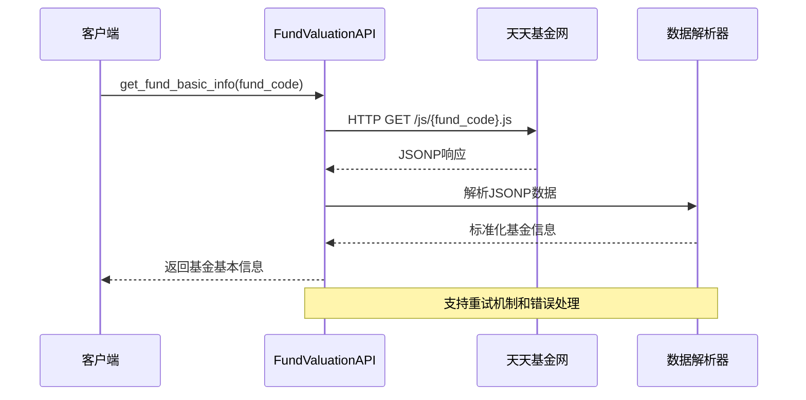

**图表来源**
- [api/FundValuationAPI.py](file://api/FundValuationAPI.py#L88-L134)

#### 重仓股持仓数据获取
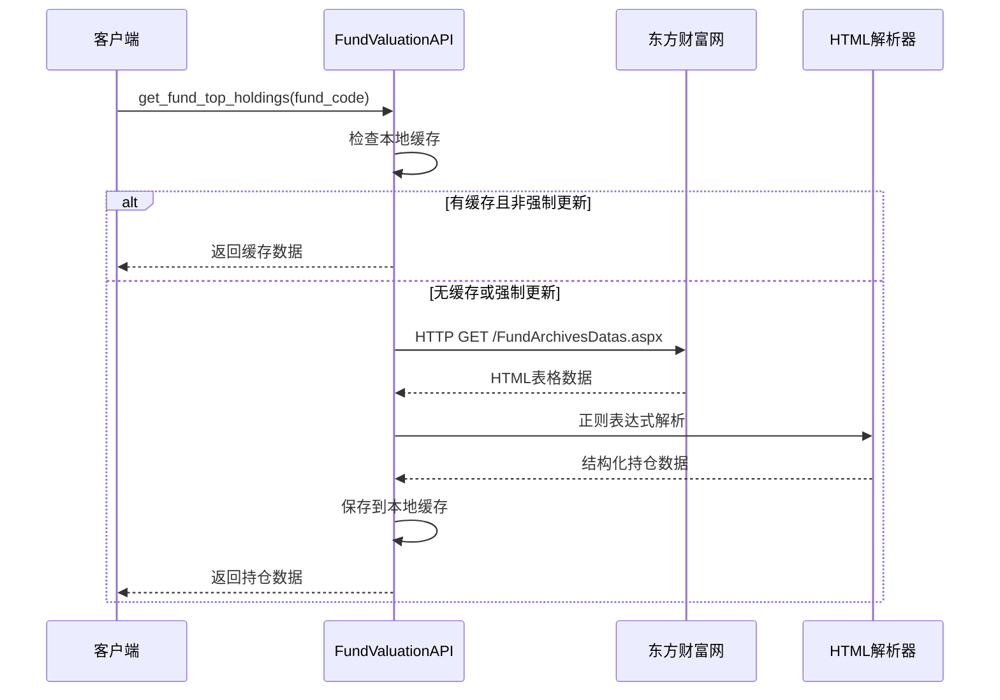

**图表来源**
- [api/FundValuationAPI.py](file://api/FundValuationAPI.py#L135-L252)

**章节来源**
- [api/FundValuationAPI.py](file://api/FundValuationAPI.py#L88-L252)

### 并发处理机制

#### ThreadPoolExecutor应用
系统使用ThreadPoolExecutor实现股票行情的并发获取：

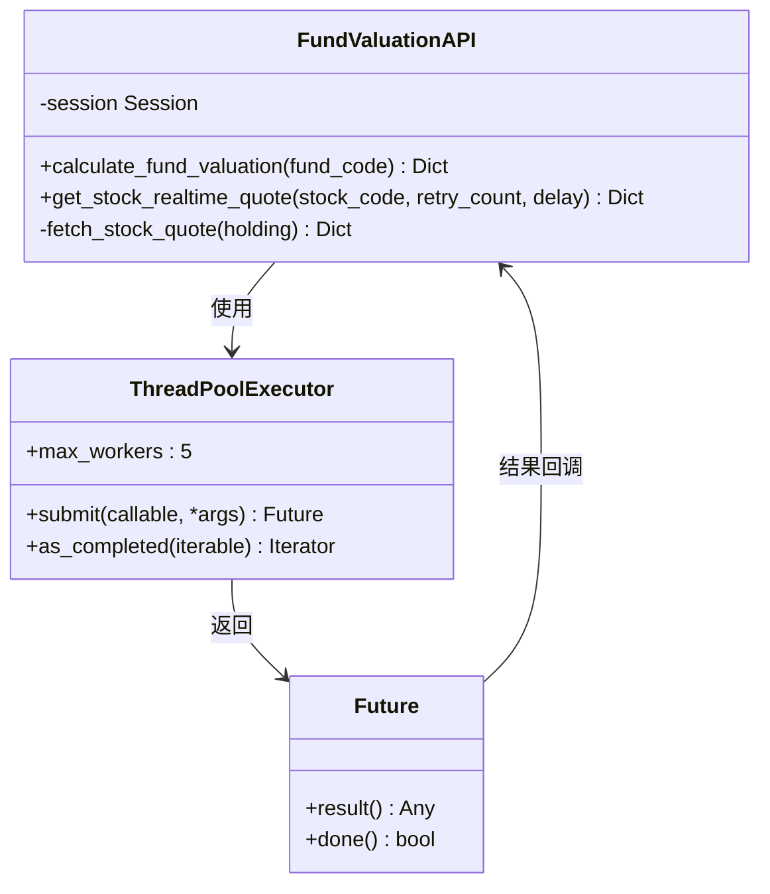

**图表来源**
- [api/FundValuationAPI.py](file://api/FundValuationAPI.py#L346-L393)

#### 线程池配置和优化策略
- **线程数量**: 5个并发线程，平衡性能和资源消耗
- **请求调度**: 每个线程随机延迟0-0.2秒，避免同时请求
- **重试机制**: 每个股票请求最多重试2次
- **超时控制**: 单个请求超时时间为5秒
- **异常处理**: 每个线程独立处理异常，不影响整体进度

**章节来源**
- [api/FundValuationAPI.py](file://api/FundValuationAPI.py#L346-L393)

### 数据缓存策略

#### 配置文件存储
系统采用JSON格式存储配置数据：

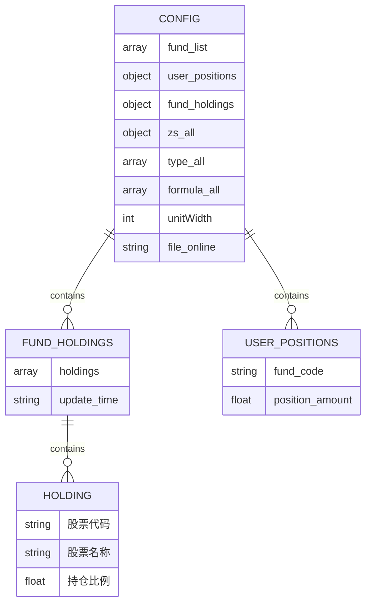

**图表来源**
- [data/zs_fund_online.json](file://data/zs_fund_online.json#L1-L238)

#### 本地缓存更新机制
1. **优先级**: 本地缓存优先于网络数据
2. **更新策略**: 支持强制更新和自动缓存
3. **时间戳**: 记录每次更新的时间
4. **数据验证**: 检查持仓比例总和不超过100%

**章节来源**
- [data/zs_fund_online.json](file://data/zs_fund_online.json#L1-L238)
- [config/test_config.json](file://config/test_config.json#L1-L59)

### 错误处理和重试机制

#### 多层次错误处理
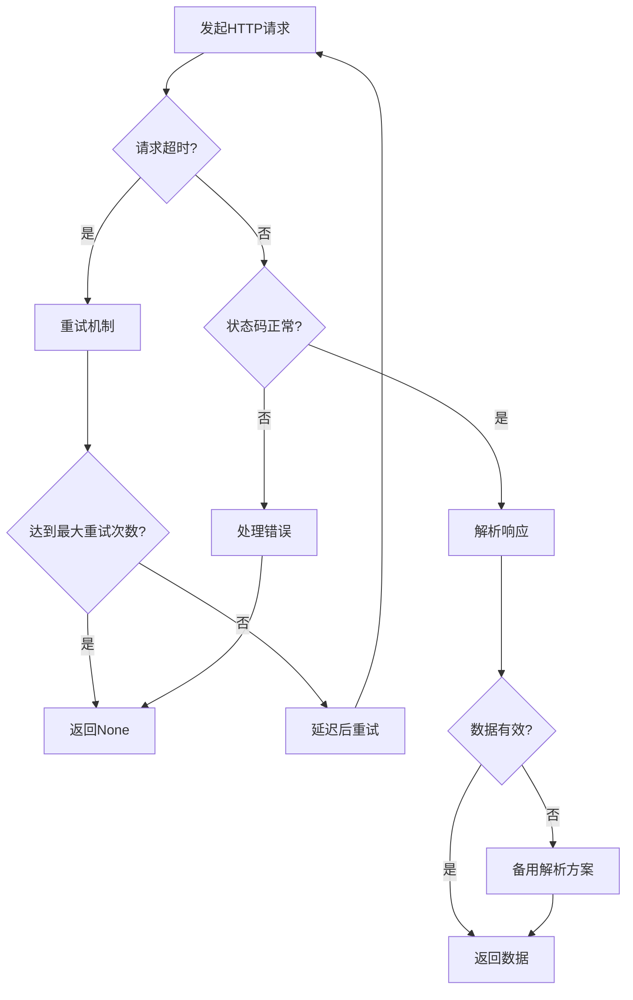

**图表来源**
- [api/FundValuationAPI.py](file://api/FundValuationAPI.py#L254-L313)

#### 异常恢复策略
- **网络异常**: 自动重试，最多2次
- **解析失败**: 使用备用解析方案
- **数据缺失**: 记录警告并继续处理
- **系统异常**: 记录错误日志并优雅降级

**章节来源**
- [api/FundValuationAPI.py](file://api/FundValuationAPI.py#L254-L313)

## 依赖关系分析

### 外部依赖
项目依赖以下核心库：

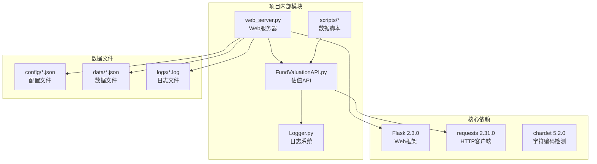

**图表来源**
- [requirements.txt](file://requirements.txt#L1-L4)
- [web_server.py](file://web_server.py#L9-L18)

### 内部模块依赖
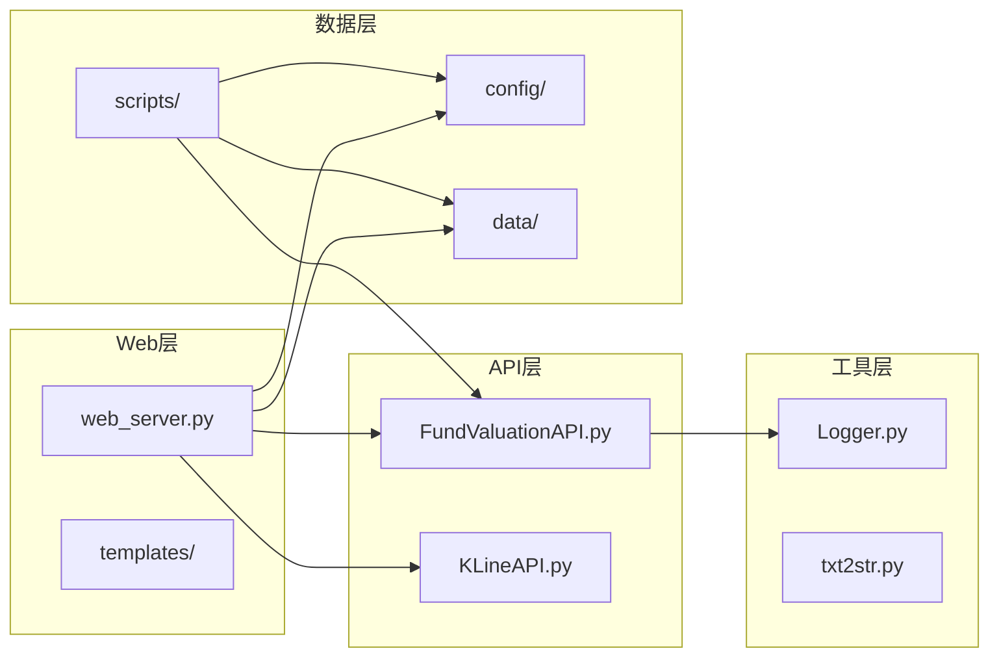

**图表来源**
- [web_server.py](file://web_server.py#L9-L12)
- [api/FundValuationAPI.py](file://api/FundValuationAPI.py#L19-L21)

**章节来源**
- [requirements.txt](file://requirements.txt#L1-L4)
- [web_server.py](file://web_server.py#L9-L18)

## 性能考量

### 并发性能优化
系统通过以下方式优化性能：

1. **并发请求**: 使用5个线程并发获取股票行情
2. **请求去抖**: 每个线程随机延迟0-0.2秒
3. **连接复用**: 使用requests.Session复用TCP连接
4. **超时控制**: 合理设置请求超时时间
5. **内存管理**: 及时释放不需要的数据

### 缓存策略优化
- **本地缓存**: 优先使用本地缓存数据
- **增量更新**: 支持选择性更新特定基金
- **自动清理**: 定期清理过期数据
- **批量处理**: 支持批量估值计算

### 网络请求优化
- **User-Agent伪装**: 设置合理的请求头
- **Referer设置**: 模拟真实浏览器行为
- **编码处理**: 自动检测和处理字符编码
- **错误重试**: 智能重试机制

## 故障排除指南

### 常见问题及解决方案

#### 1. 基金数据获取失败
**症状**: 无法获取基金基本信息或持仓数据
**原因分析**:
- 网络连接问题
- 数据源API变更
- 基金代码格式错误

**解决步骤**:
1. 检查网络连接状态
2. 验证基金代码格式（6位数字）
3. 查看日志文件获取详细错误信息
4. 尝试手动访问数据源URL验证可用性

#### 2. 股票行情获取异常
**症状**: 股票实时行情获取失败或数据不完整
**原因分析**:
- 请求过于频繁被限流
- 股票代码格式不正确
- 数据源API接口变更

**解决步骤**:
1. 检查请求频率是否过高
2. 验证股票代码格式（沪市以6开头，深市以0或3开头）
3. 查看重试日志了解具体失败原因
4. 调整并发线程数量

#### 3. 数据缓存问题
**症状**: 缓存数据不更新或显示过期
**原因分析**:
- 缓存文件权限问题
- 缓存数据格式错误
- 文件系统空间不足

**解决步骤**:
1. 检查配置文件权限
2. 验证JSON格式正确性
3. 清理磁盘空间
4. 重启应用服务

**章节来源**
- [utils/Logger.py](file://utils/Logger.py#L12-L55)
- [api/FundValuationAPI.py](file://api/FundValuationAPI.py#L135-L252)

### 日志分析
系统使用RotatingFileHandler进行日志管理：

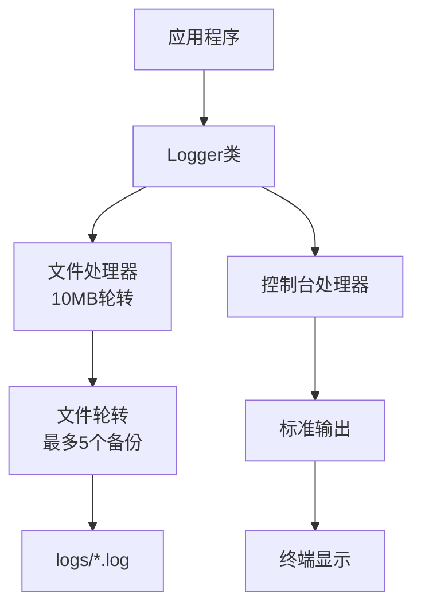

**图表来源**
- [utils/Logger.py](file://utils/Logger.py#L12-L55)

**章节来源**
- [utils/Logger.py](file://utils/Logger.py#L1-L86)

## 结论
本项目实现了完整的基金估值算法，具有以下特点：

1. **准确性**: 基于前十大重仓股的实时涨跌进行加权计算
2. **性能**: 通过并发处理机制显著提升数据获取效率
3. **可靠性**: 完善的错误处理和重试机制确保系统稳定性
4. **可维护性**: 模块化设计便于功能扩展和维护
5. **用户体验**: 提供直观的Web界面和丰富的配置选项

系统通过合理的架构设计和优化策略，为用户提供可靠的基金估值参考信息，满足日常投资决策的需求。

## 附录

### API接口说明
系统提供以下主要API接口：

| 接口 | 方法 | 描述 |
|------|------|------|
| `/api/fund/list` | GET | 获取基金监控列表 |
| `/api/fund/preview/<fund_code>` | GET | 预览基金持仓 |
| `/api/fund/holdings/<fund_code>` | GET | 获取基金持仓 |
| `/api/fund/add` | POST | 添加基金 |
| `/api/fund/remove/<fund_code>` | DELETE | 移除基金 |
| `/api/fund/valuation/<fund_code>` | GET | 单个基金估值 |
| `/api/fund/valuation/batch` | POST | 批量计算基金估值 |

### 配置文件格式
配置文件采用JSON格式，包含以下主要字段：

- `fund_list`: 基金代码列表
- `user_positions`: 用户持仓金额配置
- `fund_holdings`: 基金持仓信息缓存
- `zs_all`: 指数配置信息
- `type_all`: K线周期类型
- `formula_all`: 技术指标公式
- `unitWidth`: K线图宽度参数

### 开发环境要求
- Python 3.7+
- Flask 2.3.0
- requests 2.31.0
- chardet 5.2.0