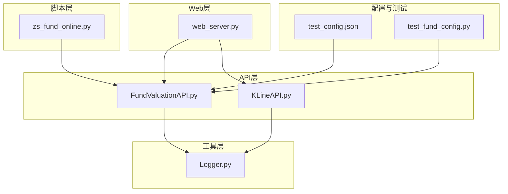
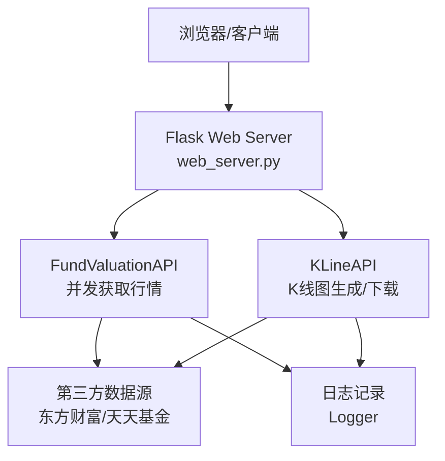
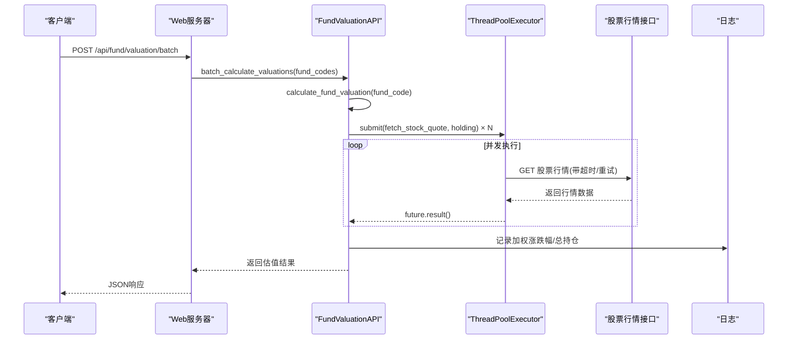
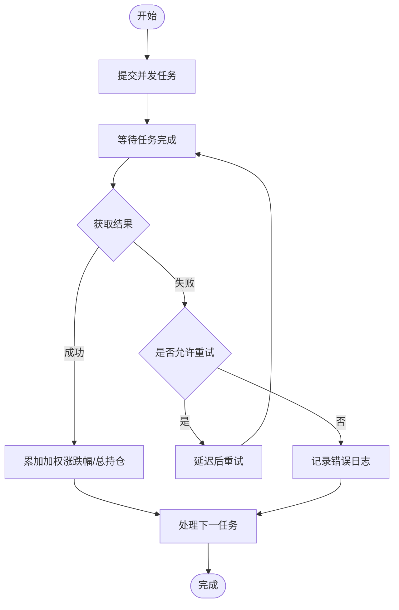
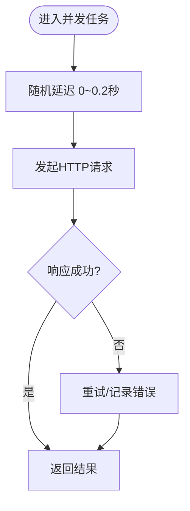
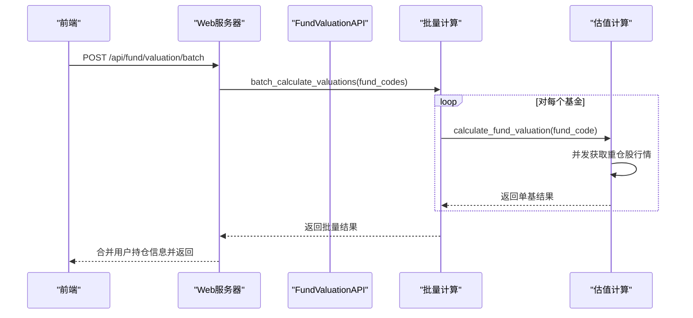
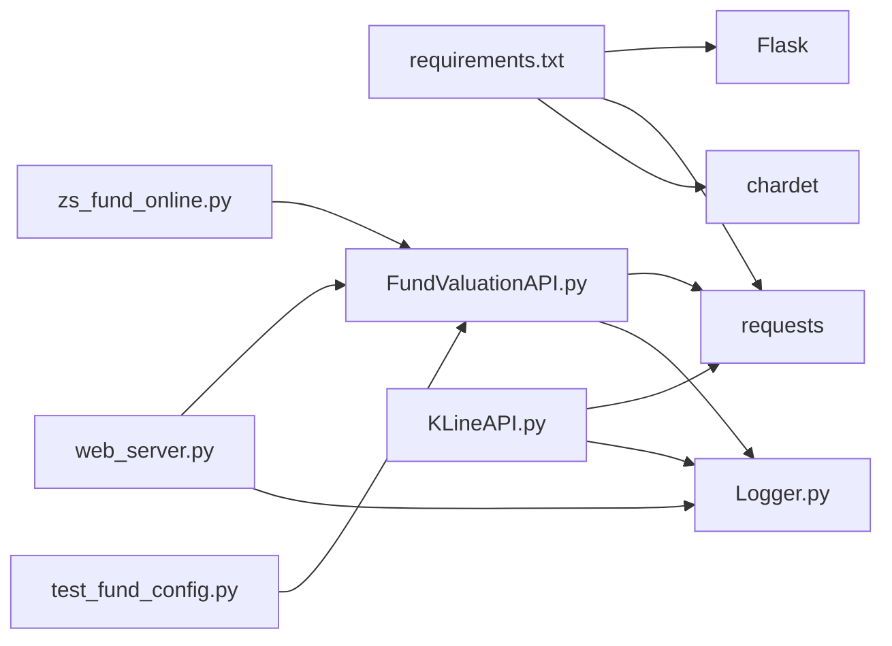

# 并发处理机制

<cite>
**本文引用的文件**
- [README.md](file://README.md)
- [web_server.py](file://web_server.py)
- [api/FundValuationAPI.py](file://api/FundValuationAPI.py)
- [api/KLineAPI.py](file://api/KLineAPI.py)
- [utils/Logger.py](file://utils/Logger.py)
- [scripts/zs_fund_online.py](file://scripts/zs_fund_online.py)
- [requirements.txt](file://requirements.txt)
- [config/test_config.json](file://config/test_config.json)
- [tests/test_fund_config.py](file://tests/test_fund_config.py)
</cite>

## 目录
1. [简介](#简介)
2. [项目结构](#项目结构)
3. [核心组件](#核心组件)
4. [架构概览](#架构概览)
5. [详细组件分析](#详细组件分析)
6. [依赖关系分析](#依赖关系分析)
7. [性能考量](#性能考量)
8. [故障排查指南](#故障排查指南)
9. [结论](#结论)
10. [附录](#附录)

## 简介
本技术文档围绕“并发处理机制”展开，重点解释ThreadPoolExecutor在线程池配置、任务调度与资源管理方面的应用，以及在股票行情获取与基金估值计算中的并发实现细节。文档还涵盖线程安全、异常处理、超时控制、随机延迟机制的设计目的与实现方式，并给出性能优化建议与最佳实践，帮助开发者在高并发场景下稳定高效地运行系统。

## 项目结构
该项目采用模块化设计，主要由以下模块组成：
- Web服务器层：提供REST API与前端页面渲染
- API层：封装基金估值与K线API
- 工具层：日志记录与通用工具
- 脚本层：离线页面生成与批量处理
- 配置与测试：配置文件与单元测试

**图表来源**
- [web_server.py](file://web_server.py#L1-L562)
- [api/FundValuationAPI.py](file://api/FundValuationAPI.py#L1-L537)
- [api/KLineAPI.py](file://api/KLineAPI.py#L1-L345)
- [utils/Logger.py](file://utils/Logger.py#L1-L86)
- [scripts/zs_fund_online.py](file://scripts/zs_fund_online.py#L1-L281)
- [config/test_config.json](file://config/test_config.json#L1-L59)
- [tests/test_fund_config.py](file://tests/test_fund_config.py#L1-L63)

**章节来源**
- [README.md](file://README.md#L1-L193)
- [web_server.py](file://web_server.py#L1-L562)

## 核心组件
- 线程池执行器：在基金估值计算中使用ThreadPoolExecutor并发获取股票行情，限制最大并发数为5，避免请求风暴与服务器限流。
- 随机延迟机制：在并发任务中为每个线程增加0-0.2秒的随机延迟，降低同时请求的概率，缓解服务器压力。
- 异常与超时处理：对HTTP请求设置合理超时，结合重试机制与日志记录，保证稳定性与可观测性。
- 资源管理：统一使用requests.Session复用连接，减少TCP握手开销；日志采用轮转文件，避免磁盘占用过大。

**章节来源**
- [api/FundValuationAPI.py](file://api/FundValuationAPI.py#L345-L393)
- [api/FundValuationAPI.py](file://api/FundValuationAPI.py#L254-L313)
- [utils/Logger.py](file://utils/Logger.py#L1-L86)

## 架构概览
系统采用“Web层-业务层-API层-数据源”的分层架构。Web层负责接收请求与渲染页面，业务层调用API层进行数据获取与计算，API层通过HTTP接口访问第三方数据源，并在必要时使用线程池并发请求以提升吞吐量。

**图表来源**
- [web_server.py](file://web_server.py#L1-L562)
- [api/FundValuationAPI.py](file://api/FundValuationAPI.py#L1-L537)
- [api/KLineAPI.py](file://api/KLineAPI.py#L1-L345)
- [utils/Logger.py](file://utils/Logger.py#L1-L86)

## 详细组件分析

### 线程池配置与任务调度
- 线程池大小：在基金估值计算中，使用ThreadPoolExecutor(max_workers=5)，限制并发请求数量，平衡吞吐与资源消耗。
- 任务提交：将每只重仓股的行情获取封装为独立任务，提交给线程池执行。
- 结果收集：使用as_completed遍历已完成的任务，逐条累加加权涨跌幅与总持仓比例，实现并行聚合。

**图表来源**
- [api/FundValuationAPI.py](file://api/FundValuationAPI.py#L345-L393)
- [api/FundValuationAPI.py](file://api/FundValuationAPI.py#L254-L313)
- [web_server.py](file://web_server.py#L183-L226)

**章节来源**
- [api/FundValuationAPI.py](file://api/FundValuationAPI.py#L345-L393)

### 线程安全与异常处理
- 线程安全：并发任务之间通过future.result()获取各自的结果，不共享可变状态；日志记录器在模块内初始化，避免跨线程竞争。
- 异常处理：对HTTP请求设置超时；在请求失败或数据为空时进行重试；最终失败记录错误日志并返回None，避免阻塞主线程。
- 超时控制：股票行情接口设置较短超时，防止慢请求拖垮整体性能。

**图表来源**
- [api/FundValuationAPI.py](file://api/FundValuationAPI.py#L254-L313)
- [api/FundValuationAPI.py](file://api/FundValuationAPI.py#L345-L393)

**章节来源**
- [api/FundValuationAPI.py](file://api/FundValuationAPI.py#L254-L313)

### 随机延迟机制
- 设计目的：避免大量线程在同一时刻发起请求，降低服务器限流风险，提高成功率与稳定性。
- 实现方式：在并发任务内部为每个线程增加0-0.2秒的随机延迟，使请求分布更均匀。

**图表来源**
- [api/FundValuationAPI.py](file://api/FundValuationAPI.py#L349-L365)

**章节来源**
- [api/FundValuationAPI.py](file://api/FundValuationAPI.py#L349-L365)

### 并发计算在基金估值中的应用
- 单只基金估值：获取基金基本信息与前十大重仓股，使用线程池并发获取每只股票的实时行情，按持仓比例加权计算估算涨跌幅与净值。
- 批量估值：Web层接收前端请求，调用API层批量计算多个基金的估值，并合并用户持仓信息，返回总持仓金额、持仓比例与单日盈亏。

**图表来源**
- [web_server.py](file://web_server.py#L183-L226)
- [api/FundValuationAPI.py](file://api/FundValuationAPI.py#L427-L452)
- [api/FundValuationAPI.py](file://api/FundValuationAPI.py#L315-L426)

**章节来源**
- [web_server.py](file://web_server.py#L183-L226)
- [api/FundValuationAPI.py](file://api/FundValuationAPI.py#L427-L452)
- [api/FundValuationAPI.py](file://api/FundValuationAPI.py#L315-L426)

### K线图API的并发与资源管理
- K线图生成：通过URL拼接生成K线图链接，支持多种周期与技术指标。
- 批量下载：提供批量下载能力，但未使用线程池并发；若需提升吞吐，可在批量下载逻辑中引入线程池与队列管理。
- 资源管理：统一使用requests.Session，设置User-Agent，避免频繁建立连接。

**章节来源**
- [api/KLineAPI.py](file://api/KLineAPI.py#L62-L68)
- [api/KLineAPI.py](file://api/KLineAPI.py#L151-L194)

## 依赖关系分析
- 运行时依赖：Flask、requests、chardet
- 模块依赖：web_server依赖FundValuationAPI与Logger；FundValuationAPI依赖requests与Logger；KLineAPI依赖requests；脚本依赖FundValuationAPI与配置文件。

**图表来源**
- [requirements.txt](file://requirements.txt#L1-L4)
- [web_server.py](file://web_server.py#L1-L562)
- [api/FundValuationAPI.py](file://api/FundValuationAPI.py#L1-L537)
- [api/KLineAPI.py](file://api/KLineAPI.py#L1-L345)
- [utils/Logger.py](file://utils/Logger.py#L1-L86)
- [scripts/zs_fund_online.py](file://scripts/zs_fund_online.py#L1-L281)
- [tests/test_fund_config.py](file://tests/test_fund_config.py#L1-L63)

**章节来源**
- [requirements.txt](file://requirements.txt#L1-L4)
- [web_server.py](file://web_server.py#L1-L562)

## 性能考量
- 线程数量配置：当前max_workers=5，适合中小规模并发；若重仓股较多且服务器限流明显，可适当降低以减轻压力，或根据CPU核数与I/O瓶颈动态调整。
- 内存管理：并发任务返回的数据结构简单，主要为字典与列表；注意及时释放不再使用的中间变量，避免内存泄漏。
- CPU利用率：并发I/O密集型任务对CPU压力较小；若后续引入CPU密集型计算（如复杂指标），应分离线程池与进程池。
- 网络与超时：合理设置HTTP超时与重试次数，避免慢请求拖垮整体性能；对第三方接口进行限速与退避策略。
- 日志与监控：使用轮转日志避免磁盘占用；在前端页面集成性能监控，记录刷新耗时与平均耗时，便于定位瓶颈。

**章节来源**
- [api/FundValuationAPI.py](file://api/FundValuationAPI.py#L345-L393)
- [utils/Logger.py](file://utils/Logger.py#L1-L86)
- [templates/monitor.html](file://templates/monitor.html#L419-L577)

## 故障排查指南
- 线程池相关问题
  - 症状：请求长时间无响应或偶发超时
  - 排查：检查max_workers是否过大导致服务器限流；确认随机延迟是否生效；查看日志中是否有大量重试与错误记录
- HTTP请求失败
  - 症状：返回状态码非200或响应类型为HTML
  - 排查：检查User-Agent与Referer头；确认目标接口URL与参数；观察重试机制是否触发
- 配置文件问题
  - 症状：持仓信息未更新或读取失败
  - 排查：确认配置文件路径与权限；使用测试脚本验证配置读写流程
- 日志与监控
  - 建议：启用详细日志级别，关注错误堆栈；在前端页面集成性能监控，记录刷新耗时

**章节来源**
- [api/FundValuationAPI.py](file://api/FundValuationAPI.py#L88-L133)
- [api/FundValuationAPI.py](file://api/FundValuationAPI.py#L135-L163)
- [tests/test_fund_config.py](file://tests/test_fund_config.py#L1-L63)
- [utils/Logger.py](file://utils/Logger.py#L1-L86)

## 结论
本项目通过ThreadPoolExecutor实现了对股票行情的并发获取，在保证稳定性的同时显著提升了性能。随机延迟与重试机制有效降低了服务器限流风险；统一的日志与超时控制增强了系统的可观测性与健壮性。建议在生产环境中根据实际负载与服务器能力动态调整线程池大小，并在后续版本中对K线图批量下载引入并发优化，进一步提升整体吞吐。

## 附录
- 配置文件示例：包含基金列表与持仓信息，支持强制更新与本地缓存
- 测试脚本：验证配置文件读写与估值计算流程

**章节来源**
- [config/test_config.json](file://config/test_config.json#L1-L59)
- [tests/test_fund_config.py](file://tests/test_fund_config.py#L1-L63)