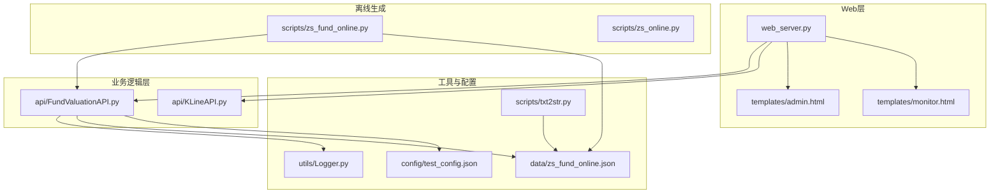
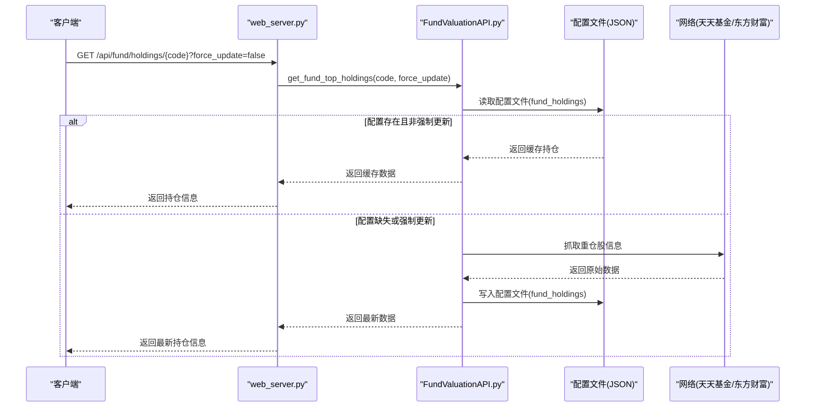
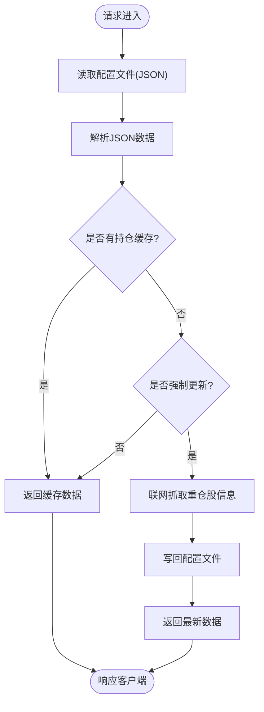
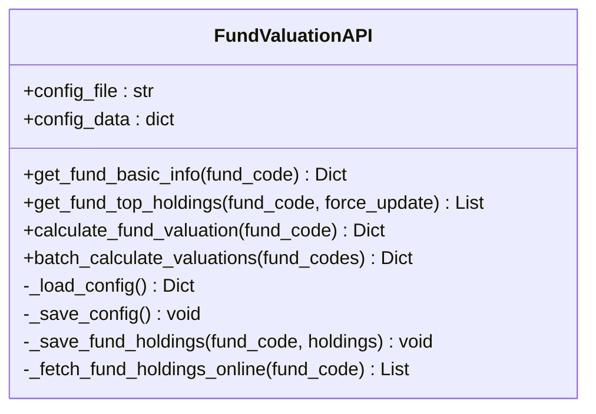
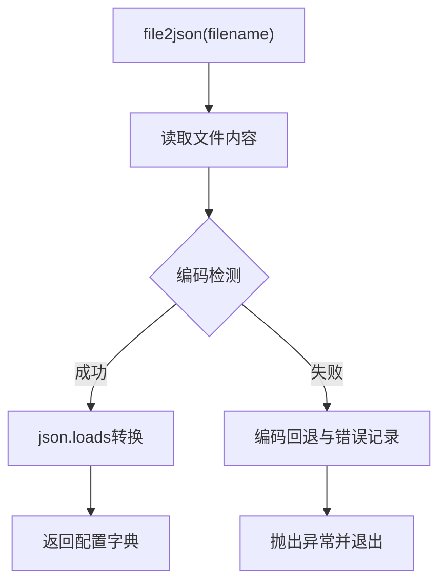
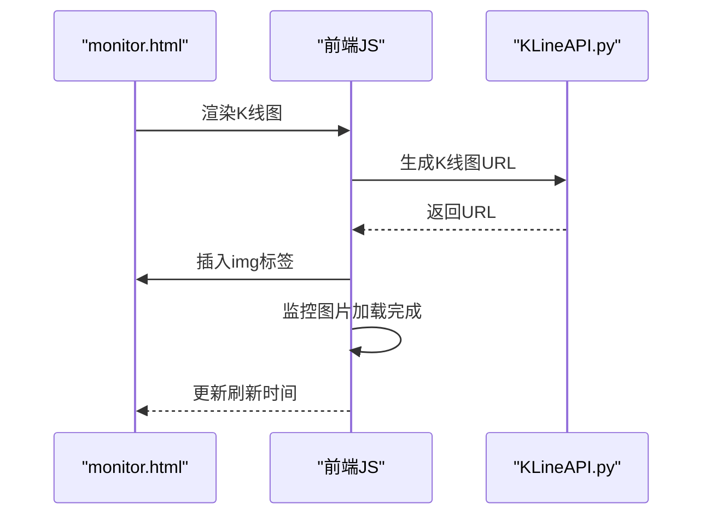
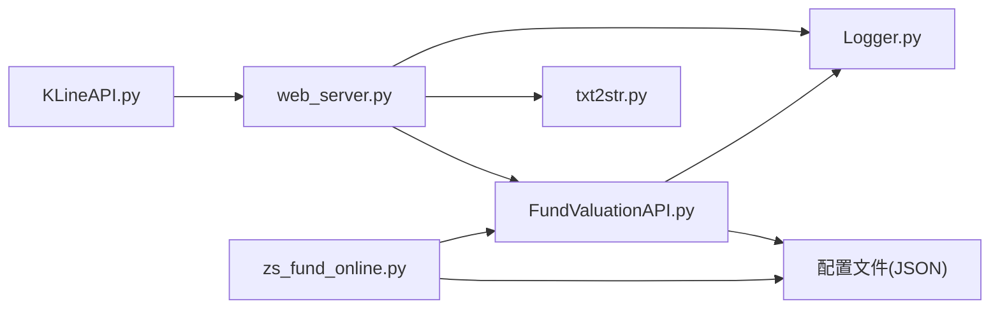

# 数据缓存策略

<cite>
**本文档引用的文件**
- [web_server.py](file://web_server.py)
- [FundValuationAPI.py](file://api/FundValuationAPI.py)
- [KLineAPI.py](file://api/KLineAPI.py)
- [txt2str.py](file://scripts/txt2str.py)
- [Logger.py](file://utils/Logger.py)
- [test_fund_config.py](file://tests/test_fund_config.py)
- [admin.html](file://templates/admin.html)
- [monitor.html](file://templates/monitor.html)
- [zs_fund_online.py](file://scripts/zs_fund_online.py)
- [test_config.json](file://config/test_config.json)
- [zs_fund_online.json](file://data/zs_fund_online.json)
</cite>

## 目录
1. [简介](#简介)
2. [项目结构](#项目结构)
3. [核心组件](#核心组件)
4. [架构概览](#架构概览)
5. [详细组件分析](#详细组件分析)
6. [依赖关系分析](#依赖关系分析)
7. [性能考量](#性能考量)
8. [故障排查指南](#故障排查指南)
9. [结论](#结论)
10. [附录](#附录)

## 简介
本项目实现了基于本地配置文件的轻量级数据缓存策略，重点服务于基金估值与K线监控系统。缓存策略围绕以下目标展开：
- 配置文件存储与持久化：以JSON格式存储基金列表、用户持仓金额、重仓股信息等关键数据，确保系统重启后仍可快速恢复状态。
- 持仓数据缓存：优先从本地配置文件读取基金前十大重仓股信息；当配置缺失或强制更新时，从网络抓取并回写至配置文件，形成“本地缓存 + 网络回源”的双通道机制。
- 缓存更新策略：支持手动触发（force_update参数）与自动回源（无缓存时自动联网），并记录更新时间戳便于后续审计与排障。
- 缓存一致性与错误恢复：通过统一的日志记录、异常捕获与配置文件原子性写入，保障缓存一致性与系统稳定性。
- 性能监控与调试：前端集成性能监控与自动刷新机制，后端提供日志记录与错误恢复能力。

## 项目结构
项目采用分层组织，核心模块包括Web服务、API封装、工具库与模板页面，配置文件位于data目录，便于持久化与版本管理。

**图表来源**
- [web_server.py](file://web_server.py#L1-L562)
- [FundValuationAPI.py](file://api/FundValuationAPI.py#L1-L537)
- [KLineAPI.py](file://api/KLineAPI.py#L1-L345)
- [txt2str.py](file://scripts/txt2str.py#L1-L108)
- [Logger.py](file://utils/Logger.py#L1-L86)
- [zs_fund_online.py](file://scripts/zs_fund_online.py#L1-L281)
- [zs_fund_online.json](file://data/zs_fund_online.json#L1-L1356)
- [test_config.json](file://config/test_config.json#L1-L59)

**章节来源**
- [web_server.py](file://web_server.py#L1-L562)
- [FundValuationAPI.py](file://api/FundValuationAPI.py#L1-L537)
- [KLineAPI.py](file://api/KLineAPI.py#L1-L345)
- [txt2str.py](file://scripts/txt2str.py#L1-L108)
- [Logger.py](file://utils/Logger.py#L1-L86)
- [zs_fund_online.py](file://scripts/zs_fund_online.py#L1-L281)
- [zs_fund_online.json](file://data/zs_fund_online.json#L1-L1356)
- [test_config.json](file://config/test_config.json#L1-L59)

## 核心组件
- Web服务器：提供REST接口与管理页面，负责配置读写、持仓查询与估值计算的入口。
- 基金估值API：封装基金基本信息、重仓股获取、实时行情与估值计算逻辑，内置本地缓存与网络回源。
- K线API：封装K线图URL生成与批量下载，支撑监控页面的可视化展示。
- 配置工具：提供JSON文件读取与编码检测，确保跨平台兼容性。
- 日志工具：统一日志记录，支持滚动文件与控制台输出，便于问题定位。
- 离线生成脚本：根据配置文件生成静态HTML页面，支持批量估值与K线展示。

**章节来源**
- [web_server.py](file://web_server.py#L66-L103)
- [FundValuationAPI.py](file://api/FundValuationAPI.py#L135-L164)
- [KLineAPI.py](file://api/KLineAPI.py#L69-L110)
- [txt2str.py](file://scripts/txt2str.py#L92-L100)
- [Logger.py](file://utils/Logger.py#L12-L56)
- [zs_fund_online.py](file://scripts/zs_fund_online.py#L180-L186)

## 架构概览
系统采用“Web服务 + 业务API + 配置文件缓存”的三层架构。Web层接收请求并调用业务API；业务API优先从配置文件读取数据，必要时联网抓取并回写；配置文件作为唯一事实来源，确保缓存一致性与可恢复性。

**图表来源**
- [web_server.py](file://web_server.py#L105-L140)
- [FundValuationAPI.py](file://api/FundValuationAPI.py#L135-L164)
- [FundValuationAPI.py](file://api/FundValuationAPI.py#L165-L215)
- [FundValuationAPI.py](file://api/FundValuationAPI.py#L235-L252)

**章节来源**
- [web_server.py](file://web_server.py#L105-L140)
- [FundValuationAPI.py](file://api/FundValuationAPI.py#L135-L164)
- [FundValuationAPI.py](file://api/FundValuationAPI.py#L165-L215)
- [FundValuationAPI.py](file://api/FundValuationAPI.py#L235-L252)

## 详细组件分析

### Web服务器与配置读写
- 配置读取：通过统一的JSON读取函数从配置文件加载数据，支持编码检测与错误恢复。
- 配置保存：POST /api/config 接口将前端提交的数据写回配置文件，并重建API实例以应用新配置。
- 持仓查询：GET /api/fund/holdings/{code} 支持强制更新参数，控制缓存策略。
- 批量估值：POST /api/fund/valuation/batch 结合用户持仓配置计算总收益与盈亏。

**图表来源**
- [web_server.py](file://web_server.py#L66-L103)
- [web_server.py](file://web_server.py#L105-L140)
- [FundValuationAPI.py](file://api/FundValuationAPI.py#L135-L164)
- [FundValuationAPI.py](file://api/FundValuationAPI.py#L165-L215)
- [FundValuationAPI.py](file://api/FundValuationAPI.py#L235-L252)

**章节来源**
- [web_server.py](file://web_server.py#L66-L103)
- [web_server.py](file://web_server.py#L105-L140)
- [FundValuationAPI.py](file://api/FundValuationAPI.py#L135-L164)
- [FundValuationAPI.py](file://api/FundValuationAPI.py#L165-L215)
- [FundValuationAPI.py](file://api/FundValuationAPI.py#L235-L252)

### 基金估值API与缓存机制
- 配置加载与保存：内部维护config_data字典，支持读取与写入配置文件，确保缓存一致性。
- 持仓缓存策略：优先从config_data中读取fund_holdings；若无或强制更新，则联网抓取并回写。
- 错误恢复：对网络请求与解析过程进行异常捕获，记录日志并返回安全值。
- 并发优化：估值计算阶段使用线程池并发获取股票实时行情，提升吞吐量。

**图表来源**
- [FundValuationAPI.py](file://api/FundValuationAPI.py#L27-L55)
- [FundValuationAPI.py](file://api/FundValuationAPI.py#L56-L87)
- [FundValuationAPI.py](file://api/FundValuationAPI.py#L135-L164)
- [FundValuationAPI.py](file://api/FundValuationAPI.py#L235-L252)

**章节来源**
- [FundValuationAPI.py](file://api/FundValuationAPI.py#L42-L55)
- [FundValuationAPI.py](file://api/FundValuationAPI.py#L56-L87)
- [FundValuationAPI.py](file://api/FundValuationAPI.py#L135-L164)
- [FundValuationAPI.py](file://api/FundValuationAPI.py#L235-L252)

### 配置文件读写与JSON处理
- JSON读取：统一使用file2json函数，结合编码检测与异常处理，确保跨平台兼容。
- JSON写入：Web层POST接口使用ensure_ascii=False与indent缩进，保证中文可读性与格式规范。
- 配置结构：包含fund_list、user_positions、fund_holdings等关键节点，支撑前端展示与估值计算。

**图表来源**
- [txt2str.py](file://scripts/txt2str.py#L92-L100)
- [web_server.py](file://web_server.py#L82-L103)

**章节来源**
- [txt2str.py](file://scripts/txt2str.py#L17-L31)
- [txt2str.py](file://scripts/txt2str.py#L92-L100)
- [web_server.py](file://web_server.py#L82-L103)

### K线API与可视化
- URL生成：根据股票代码、周期、指标等参数动态拼接URL，支持批量生成与下载。
- HTML集成：监控页面通过Jinja2模板渲染K线图，前端JavaScript监控图片加载性能并记录刷新时间。

**图表来源**
- [monitor.html](file://templates/monitor.html#L390-L400)
- [monitor.html](file://templates/monitor.html#L510-L558)
- [KLineAPI.py](file://api/KLineAPI.py#L69-L110)

**章节来源**
- [monitor.html](file://templates/monitor.html#L390-L400)
- [monitor.html](file://templates/monitor.html#L510-L558)
- [KLineAPI.py](file://api/KLineAPI.py#L69-L110)

### 离线生成与静态页面
- 离线脚本：根据配置文件批量计算基金估值并生成静态HTML，减少在线请求压力。
- 静态页面：包含K线图与估值信息，便于离线查看与分享。

**章节来源**
- [zs_fund_online.py](file://scripts/zs_fund_online.py#L180-L227)
- [zs_fund_online.py](file://scripts/zs_fund_online.py#L234-L256)

## 依赖关系分析
- web_server.py 依赖 FundValuationAPI 与 Logger，负责HTTP接口与配置文件读写。
- FundValuationAPI 依赖 Logger 与配置文件，负责数据抓取、缓存与估值计算。
- txt2str.py 提供通用JSON读取能力，被多个模块复用。
- KLineAPI 独立封装K线图生成与下载，供监控页面使用。
- 离线脚本依赖 FundValuationAPI 与配置文件，生成静态页面。

**图表来源**
- [web_server.py](file://web_server.py#L9-L18)
- [FundValuationAPI.py](file://api/FundValuationAPI.py#L19-L25)
- [txt2str.py](file://scripts/txt2str.py#L1-L10)
- [Logger.py](file://utils/Logger.py#L1-L86)
- [zs_fund_online.py](file://scripts/zs_fund_online.py#L14-L23)

**章节来源**
- [web_server.py](file://web_server.py#L9-L18)
- [FundValuationAPI.py](file://api/FundValuationAPI.py#L19-L25)
- [txt2str.py](file://scripts/txt2str.py#L1-L10)
- [Logger.py](file://utils/Logger.py#L1-L86)
- [zs_fund_online.py](file://scripts/zs_fund_online.py#L14-L23)

## 性能考量
- 缓存命中率优化
  - 本地缓存优先：首次联网抓取后立即写回配置文件，后续请求直接命中缓存。
  - 手动更新触发：强制更新参数允许用户在缓存异常时主动回源，避免长期使用过期数据。
  - 预热策略：离线脚本可在部署时批量生成静态页面，降低首次访问延迟。
- 并发与吞吐
  - 估值计算阶段使用线程池并发获取股票实时行情，减少总等待时间。
  - K线图批量生成与下载，配合前端图片加载监控，提升用户体验。
- IO与内存
  - 配置文件采用增量写入，避免频繁全量重写。
  - 日志采用滚动文件，控制单文件大小，防止磁盘占用过大。
- 监控与调试
  - 前端性能监控记录刷新耗时与图片加载情况，便于定位瓶颈。
  - 后端日志记录关键操作与异常，支持快速排障。

[本节为通用性能讨论，无需具体文件分析]

## 故障排查指南
- 配置文件读取失败
  - 现象：接口返回错误或页面空白。
  - 排查：检查配置文件编码与格式，确认JSON语法正确；查看日志文件定位异常。
- 缓存未更新
  - 现象：持仓比例长时间不变。
  - 排查：确认是否启用了强制更新；检查配置文件中fund_holdings节点是否正确写入；核对update_time字段。
- 网络请求异常
  - 现象：估值计算失败或重仓股信息为空。
  - 排查：检查网络连通性；查看日志中的HTTP状态码与异常堆栈；必要时调整请求头与超时设置。
- 日志与错误恢复
  - 建议：启用详细日志级别，定期清理滚动日志文件；对关键流程增加重试与降级逻辑。

**章节来源**
- [Logger.py](file://utils/Logger.py#L12-L56)
- [FundValuationAPI.py](file://api/FundValuationAPI.py#L100-L134)
- [FundValuationAPI.py](file://api/FundValuationAPI.py#L212-L215)

## 结论
本项目通过“配置文件缓存 + 网络回源”的双通道机制，实现了稳定、可恢复的本地缓存策略。Web层与业务API分工明确，配置工具与日志系统提供可靠支撑。前端性能监控与离线生成进一步提升了用户体验与系统鲁棒性。建议在生产环境中持续关注缓存一致性、网络稳定性与日志容量管理，以确保长期稳定运行。

[本节为总结性内容，无需具体文件分析]

## 附录
- 配置文件结构要点
  - fund_list：监控的基金列表。
  - user_positions：用户持仓金额，用于计算单日盈亏。
  - fund_holdings：缓存的重仓股信息，包含update_time。
- 测试用例参考
  - 通过测试脚本验证缓存读写与强制更新行为，确保配置文件正确持久化。

**章节来源**
- [test_fund_config.py](file://tests/test_fund_config.py#L13-L54)
- [zs_fund_online.json](file://data/zs_fund_online.json#L239-L238)
- [test_config.json](file://config/test_config.json#L1-L59)