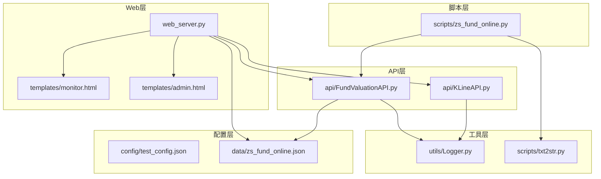
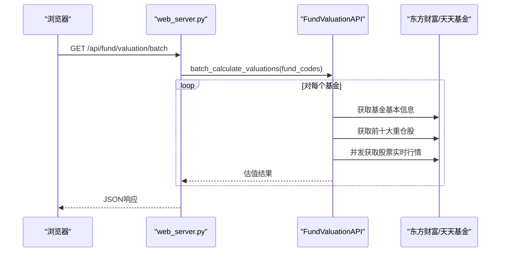
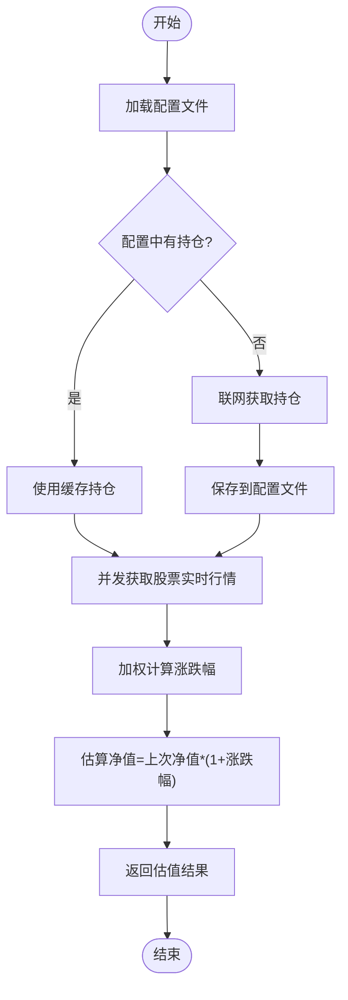
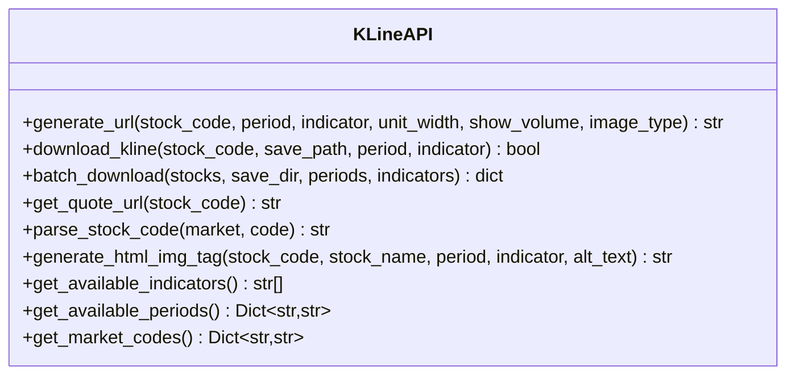
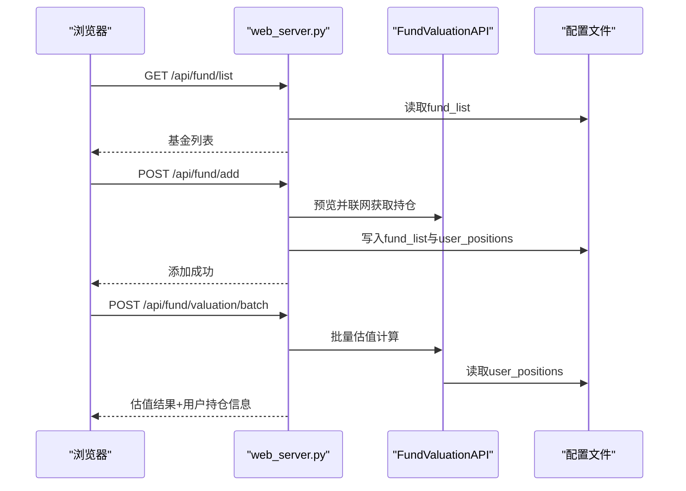
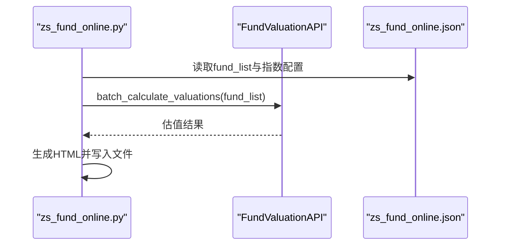
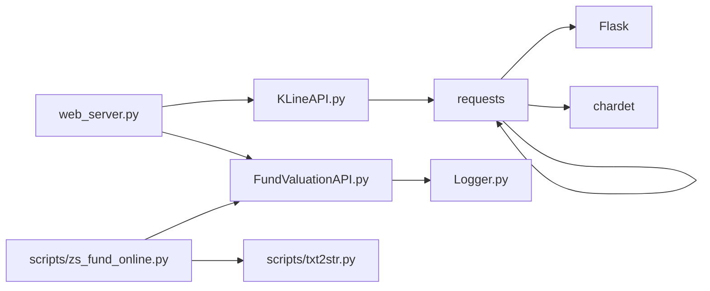

# 核心功能实现

<cite>
**本文引用的文件**
- [web_server.py](file://web_server.py)
- [FundValuationAPI.py](file://api/FundValuationAPI.py)
- [KLineAPI.py](file://api/KLineAPI.py)
- [Logger.py](file://utils/Logger.py)
- [zs_fund_online.py](file://scripts/zs_fund_online.py)
- [monitor.html](file://templates/monitor.html)
- [admin.html](file://templates/admin.html)
- [test_config.json](file://config/test_config.json)
- [zs_fund_online.json](file://data/zs_fund_online.json)
- [txt2str.py](file://scripts/txt2str.py)
- [README.md](file://README.md)
- [requirements.txt](file://requirements.txt)
- [启动服务器.bat](file://启动服务器.bat)
</cite>

## 目录
1. [简介](#简介)
2. [项目结构](#项目结构)
3. [核心组件](#核心组件)
4. [架构总览](#架构总览)
5. [详细组件分析](#详细组件分析)
6. [依赖关系分析](#依赖关系分析)
7. [性能考量](#性能考量)
8. [故障排查指南](#故障排查指南)
9. [结论](#结论)
10. [附录](#附录)

## 简介
本项目是一个基于Flask的Web应用，提供基金实时估值监控与股票K线图查询功能。系统通过抓取基金前十大重仓股的实时行情，计算基金的估算净值与涨跌幅；同时支持生成包含指数K线图与基金估值的静态监控页面，并提供可视化管理界面，支持添加/移除基金、查看与编辑持仓、设置用户持仓金额并计算单日盈亏。

## 项目结构
项目采用分层设计：
- Web层：Flask路由与模板渲染，负责对外HTTP接口与前端页面展示
- API层：封装基金估值与K线图API，提供数据获取与处理能力
- 工具层：日志记录、文件读取与编码检测等通用工具
- 脚本层：批量生成监控页面的离线脚本
- 配置层：JSON配置文件，存储基金列表、用户持仓、指数配置与历史持仓缓存

**图表来源**
- [web_server.py](file://web_server.py#L1-L552)
- [FundValuationAPI.py](file://api/FundValuationAPI.py#L1-L537)
- [KLineAPI.py](file://api/KLineAPI.py#L1-L345)
- [Logger.py](file://utils/Logger.py#L1-L86)
- [zs_fund_online.py](file://scripts/zs_fund_online.py#L1-L281)
- [monitor.html](file://templates/monitor.html#L1-L918)
- [admin.html](file://templates/admin.html#L1-L1049)
- [test_config.json](file://config/test_config.json#L1-L59)
- [zs_fund_online.json](file://data/zs_fund_online.json#L1-L1356)

**章节来源**
- [README.md](file://README.md#L1-L193)
- [启动服务器.bat](file://启动服务器.bat#L1-L19)

## 核心组件
- 基金估值API：封装基金基本信息、前十大重仓股获取、股票实时行情并发拉取与估值计算
- K线API：封装K线图URL生成、图片下载与批量处理
- Web服务器：Flask路由与模板渲染，提供REST接口与管理界面
- 日志工具：统一的日志记录与轮转
- 离线生成器：根据配置生成静态监控页面

**章节来源**
- [FundValuationAPI.py](file://api/FundValuationAPI.py#L27-L537)
- [KLineAPI.py](file://api/KLineAPI.py#L15-L345)
- [web_server.py](file://web_server.py#L1-L552)
- [Logger.py](file://utils/Logger.py#L6-L86)
- [zs_fund_online.py](file://scripts/zs_fund_online.py#L1-L281)

## 架构总览
系统采用“Web路由 + API封装 + 模板渲染”的三层架构。Web路由负责接收HTTP请求，调用API层进行数据处理，模板渲染负责生成HTML页面。API层内部通过并发线程池优化网络请求性能，并结合本地缓存减少重复抓取。

**图表来源**
- [web_server.py](file://web_server.py#L183-L226)
- [FundValuationAPI.py](file://api/FundValuationAPI.py#L427-L452)
- [FundValuationAPI.py](file://api/FundValuationAPI.py#L315-L425)

## 详细组件分析

### 基金估值算法实现
- 数据来源与流程
  - 基金基本信息：通过天天基金网获取当前净值、估值与涨跌幅
  - 前十大重仓股：从东方财富网抓取持仓表格，解析为结构化数据
  - 股票实时行情：通过东方财富行情接口获取最新价、涨跌幅等
  - 估值计算：加权平均涨跌幅 × 基金上次净值，得到估算净值

- 并发优化
  - 使用ThreadPoolExecutor并发请求股票实时行情，限制最大并发数为5
  - 每个线程随机延迟0-0.2秒，避免同时请求导致限流
  - 对网络异常进行重试与降级处理

- 数据缓存与本地存储
  - 优先使用配置文件中的持仓缓存，避免重复抓取
  - 支持强制更新模式，联网刷新并覆盖缓存
  - 自动记录更新时间，便于追踪数据新鲜度

- 数据验证与错误处理
  - 基金代码格式校验（6位数字）
  - 持仓比例总和校验（超过100%给出警告）
  - 联网获取失败时记录日志并返回空结果

**图表来源**
- [FundValuationAPI.py](file://api/FundValuationAPI.py#L135-L163)
- [FundValuationAPI.py](file://api/FundValuationAPI.py#L345-L425)

**章节来源**
- [FundValuationAPI.py](file://api/FundValuationAPI.py#L88-L134)
- [FundValuationAPI.py](file://api/FundValuationAPI.py#L135-L253)
- [FundValuationAPI.py](file://api/FundValuationAPI.py#L254-L314)
- [FundValuationAPI.py](file://api/FundValuationAPI.py#L315-L425)
- [FundValuationAPI.py](file://api/FundValuationAPI.py#L427-L452)

### K线图生成与下载逻辑
- URL生成
  - 支持多种周期（日线、周线、月线、分钟线等）与技术指标（MACD、KDJ、RSI等）
  - 参数包括：市场代码、周期、单位宽度、是否显示成交量、指标公式等
- 图片下载
  - 支持单张下载与批量下载
  - 自动创建保存目录，异常时记录错误并返回失败
- HTML集成
  - 模板中直接嵌入图片URL，支持自动刷新与性能监控

**图表来源**
- [KLineAPI.py](file://api/KLineAPI.py#L15-L345)

**章节来源**
- [KLineAPI.py](file://api/KLineAPI.py#L69-L110)
- [KLineAPI.py](file://api/KLineAPI.py#L111-L150)
- [KLineAPI.py](file://api/KLineAPI.py#L151-L194)
- [monitor.html](file://templates/monitor.html#L377-L398)

### Web服务器与前端交互
- REST接口
  - 基金管理：添加/移除、预览、查看与编辑持仓
  - 估值接口：单个与批量估值计算
  - 配置管理：获取与保存配置
- 前端模板
  - 主监控页：自动刷新、性能监控、持仓汇总
  - 管理页：基金列表、添加/移除、编辑持仓与估值计算

**图表来源**
- [web_server.py](file://web_server.py#L259-L296)
- [web_server.py](file://web_server.py#L362-L442)
- [web_server.py](file://web_server.py#L183-L226)
- [FundValuationAPI.py](file://api/FundValuationAPI.py#L427-L452)

**章节来源**
- [web_server.py](file://web_server.py#L66-L103)
- [web_server.py](file://web_server.py#L105-L158)
- [web_server.py](file://web_server.py#L259-L296)
- [web_server.py](file://web_server.py#L362-L442)
- [web_server.py](file://web_server.py#L445-L501)
- [web_server.py](file://web_server.py#L504-L539)
- [monitor.html](file://templates/monitor.html#L414-L670)
- [admin.html](file://templates/admin.html#L528-L766)

### 离线监控页面生成
- 读取配置文件，批量计算基金估值
- 生成包含指数K线图的HTML页面
- 支持备份旧文件与写入新文件

**图表来源**
- [zs_fund_online.py](file://scripts/zs_fund_online.py#L22-L31)
- [zs_fund_online.py](file://scripts/zs_fund_online.py#L180-L186)
- [zs_fund_online.py](file://scripts/zs_fund_online.py#L273-L276)

**章节来源**
- [zs_fund_online.py](file://scripts/zs_fund_online.py#L1-L281)
- [zs_fund_online.json](file://data/zs_fund_online.json#L1-L238)

## 依赖关系分析
- 运行时依赖
  - Flask：Web框架
  - requests：HTTP客户端
  - chardet：字符集检测
- 内部依赖
  - web_server依赖FundValuationAPI与KLineAPI
  - FundValuationAPI依赖Logger与配置文件
  - KLineAPI依赖requests
  - 离线脚本依赖FundValuationAPI与txt2str

**图表来源**
- [requirements.txt](file://requirements.txt#L1-L4)
- [web_server.py](file://web_server.py#L9-L18)
- [FundValuationAPI.py](file://api/FundValuationAPI.py#L10-L24)
- [KLineAPI.py](file://api/KLineAPI.py#L9-L13)
- [zs_fund_online.py](file://scripts/zs_fund_online.py#L9-L17)

**章节来源**
- [requirements.txt](file://requirements.txt#L1-L4)
- [web_server.py](file://web_server.py#L9-L18)
- [FundValuationAPI.py](file://api/FundValuationAPI.py#L10-L24)
- [KLineAPI.py](file://api/KLineAPI.py#L9-L13)
- [zs_fund_online.py](file://scripts/zs_fund_online.py#L9-L17)

## 性能考量
- 并发处理
  - ThreadPoolExecutor并发获取股票行情，最大5线程，避免请求过快被限流
  - 每线程随机延迟0-0.2秒，进一步降低并发压力
- 缓存策略
  - 优先使用本地缓存持仓，减少网络请求
  - 支持强制更新，确保数据新鲜度
- 错误与超时
  - 请求超时与异常捕获，避免阻塞主线程
  - 日志记录失败原因，便于定位问题
- 前端性能
  - 自动刷新（5分钟）与手动刷新按钮
  - K线图加载监控与失败统计

**章节来源**
- [FundValuationAPI.py](file://api/FundValuationAPI.py#L345-L393)
- [FundValuationAPI.py](file://api/FundValuationAPI.py#L254-L314)
- [monitor.html](file://templates/monitor.html#L418-L534)

## 故障排查指南
- 常见问题
  - 基金代码格式错误：需为6位数字
  - 基金不存在或网络异常：检查网络连通性与接口可用性
  - 持仓比例超过100%：检查配置文件中的持仓数据
  - K线图加载失败：检查URL参数与网络访问权限
- 日志定位
  - 使用Logger记录详细日志，定位具体错误位置
  - 查看logs目录下的日志文件
- 配置检查
  - 确认配置文件编码为UTF-8
  - 检查fund_list与user_positions字段完整性

**章节来源**
- [web_server.py](file://web_server.py#L368-L379)
- [web_server.py](file://web_server.py#L113-L119)
- [Logger.py](file://utils/Logger.py#L6-L86)
- [README.md](file://README.md#L105-L131)

## 结论
本系统通过合理的分层设计与并发优化，在保证数据实时性的前提下提升了用户体验。基金估值算法基于前十大重仓股的实时行情进行估算，K线图支持多周期与多指标，Web界面提供完善的管理与监控能力。通过本地缓存与错误处理机制，系统具备良好的稳定性与可维护性。

## 附录
- 快速启动
  - 双击启动脚本自动打开浏览器并启动服务
- API一览
  - 基金相关：获取列表、预览、获取/更新持仓、添加/移除、批量估值
  - K线相关：生成URL、下载图片、批量下载
- 扩展建议
  - 支持更多技术指标与周期
  - 增加数据校验与告警机制
  - 提供定时任务与邮件通知功能

**章节来源**
- [启动服务器.bat](file://启动服务器.bat#L1-L19)
- [README.md](file://README.md#L132-L149)
- [web_server.py](file://web_server.py#L541-L552)