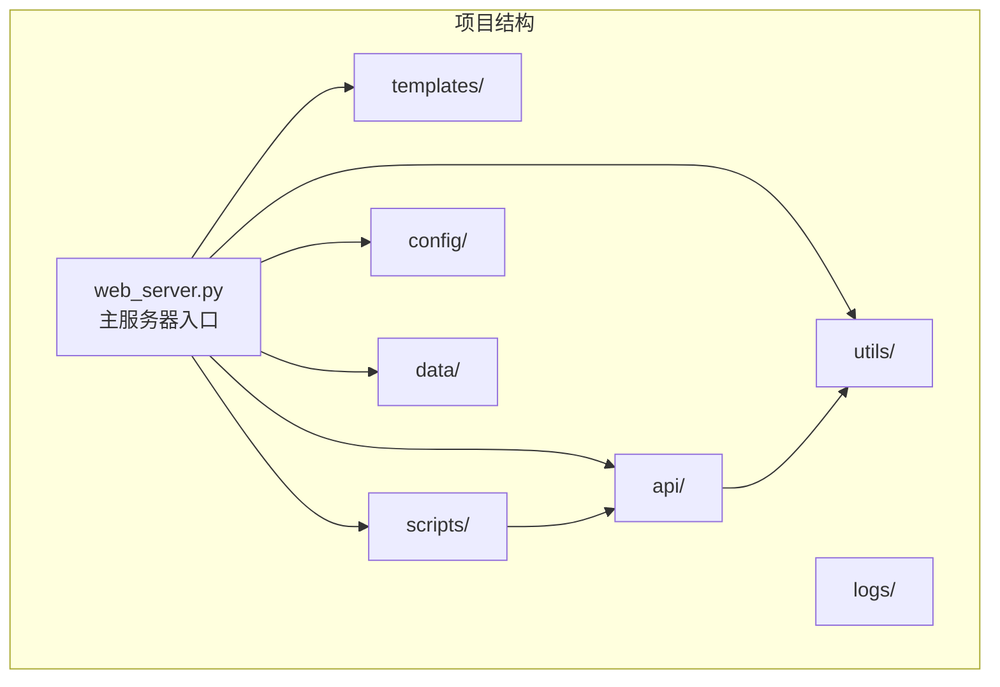
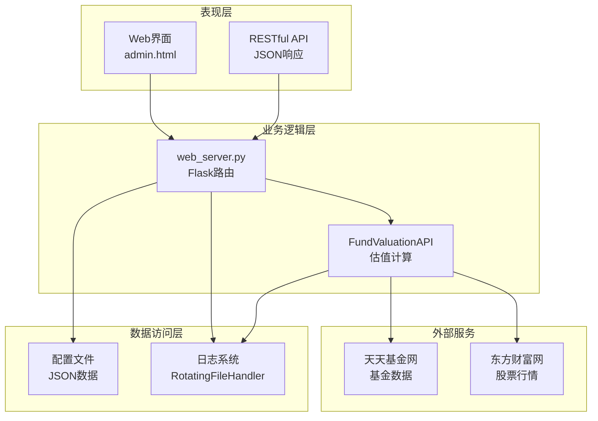
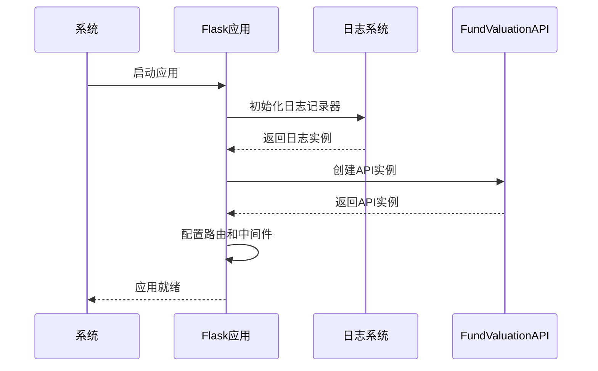
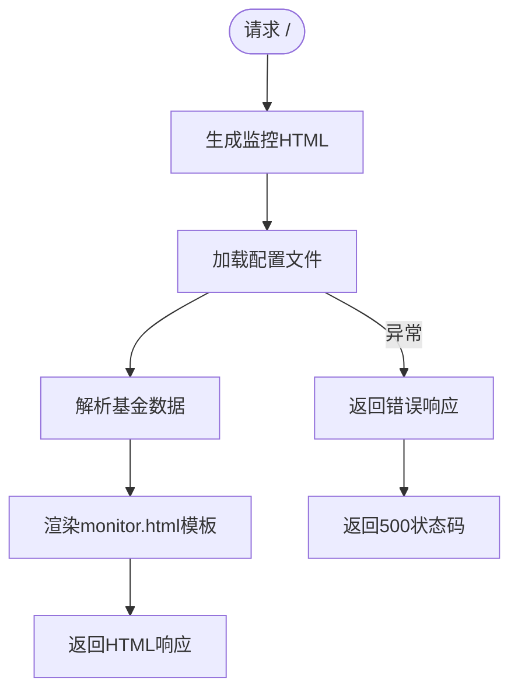
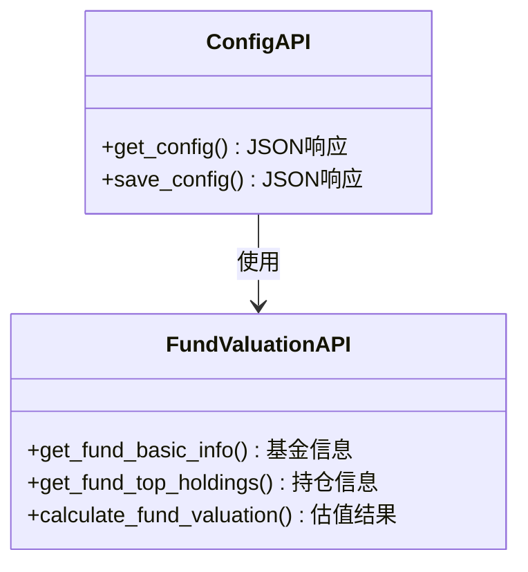
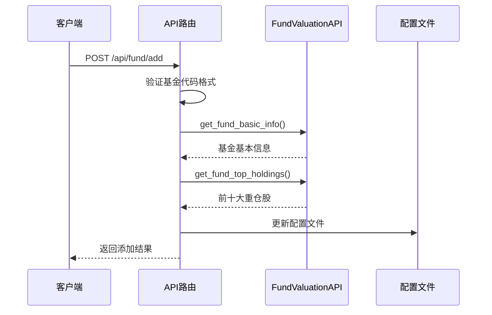
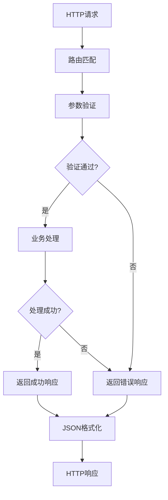
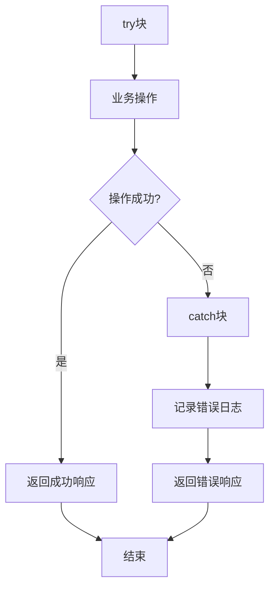
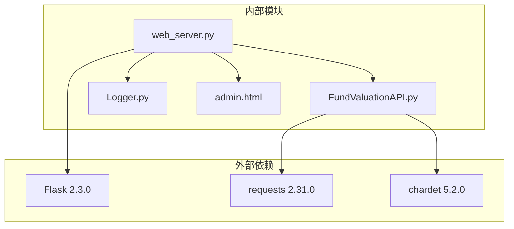
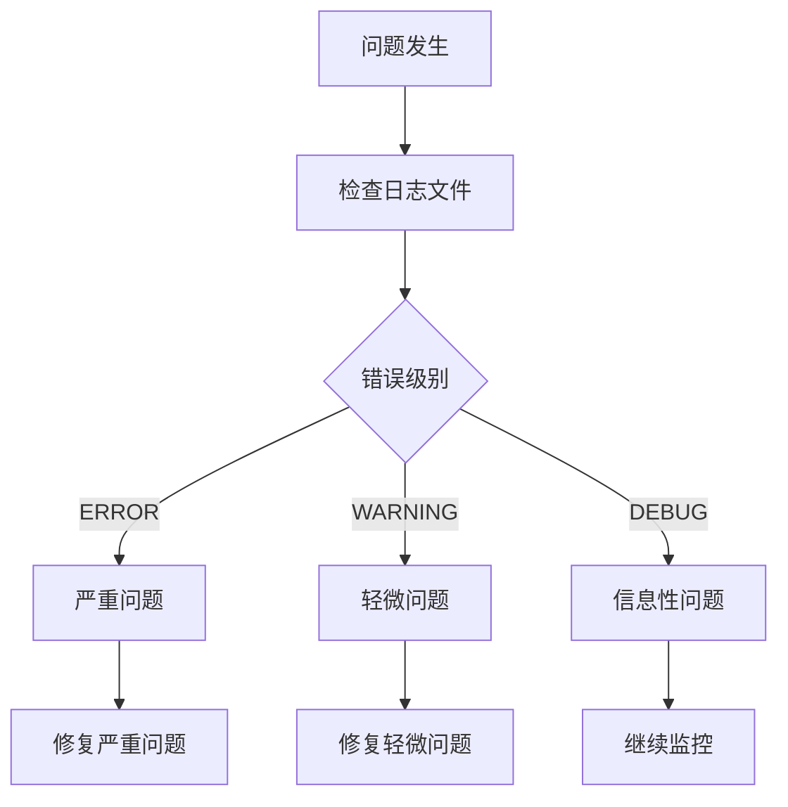

# Flask Web服务器

<cite>
**本文引用的文件**
- [web_server.py](file://web_server.py)
- [FundValuationAPI.py](file://api/FundValuationAPI.py)
- [Logger.py](file://utils/Logger.py)
- [admin.html](file://templates/admin.html)
- [README.md](file://README.md)
- [requirements.txt](file://requirements.txt)
- [启动服务器.bat](file://启动服务器.bat)
- [scripts/启动服务器.bat](file://scripts/启动服务器.bat)
- [config/test_config.json](file://config/test_config.json)
- [scripts/zs_fund_online.py](file://scripts/zs_fund_online.py)
</cite>

## 目录
1. [简介](#简介)
2. [项目结构](#项目结构)
3. [核心组件](#核心组件)
4. [架构概览](#架构概览)
5. [详细组件分析](#详细组件分析)
6. [依赖关系分析](#依赖关系分析)
7. [性能考量](#性能考量)
8. [故障排除指南](#故障排除指南)
9. [结论](#结论)
10. [附录](#附录)

## 简介
本项目是一个基于Flask的Web应用，提供基金实时估值监控和股票K线图查询功能。系统通过爬取基金持仓数据和股票实时行情，计算基金估值，并提供可视化的管理界面。项目采用前后端分离的设计，前端使用HTML模板，后端提供RESTful API接口。

## 项目结构
项目采用模块化组织结构，主要包含以下核心目录：
- `api/`: 核心业务逻辑模块，包含基金估值API
- `utils/`: 工具模块，包含日志记录器
- `templates/`: Jinja2模板文件
- `scripts/`: 辅助脚本工具
- `config/`: 配置文件
- `data/`: 数据文件和JSON配置
- `logs/`: 日志文件

**图表来源**
- [web_server.py](file://web_server.py#L1-L552)
- [FundValuationAPI.py](file://api/FundValuationAPI.py#L1-L537)

**章节来源**
- [README.md](file://README.md#L5-L42)

## 核心组件
项目的核心组件包括Flask应用实例、API服务类、模板渲染系统和日志记录器。

### Flask应用初始化
应用通过Flask类创建，配置了中文支持和JSON编码设置。全局初始化了日志记录器和API实例。

### API服务架构
系统实现了完整的基金估值计算服务，支持单个和批量估值计算，具备并发处理能力。

### 模板渲染系统
使用Jinja2模板引擎，提供管理界面和监控页面的动态渲染。

**章节来源**
- [web_server.py](file://web_server.py#L17-L28)
- [FundValuationAPI.py](file://api/FundValuationAPI.py#L27-L55)

## 架构概览
系统采用分层架构设计，清晰分离了表现层、业务逻辑层和数据访问层。

**图表来源**
- [web_server.py](file://web_server.py#L9-L28)
- [FundValuationAPI.py](file://api/FundValuationAPI.py#L34-L41)

## 详细组件分析

### Flask应用初始化流程
应用启动时执行以下初始化步骤：

1. **日志系统初始化**: 创建Logger实例，配置文件轮转和控制台输出
2. **Flask实例创建**: 初始化Flask应用，设置中文支持
3. **配置文件路径定义**: 指定基金配置文件路径
4. **API实例创建**: 初始化FundValuationAPI，用于基金数据处理

**图表来源**
- [web_server.py](file://web_server.py#L17-L28)

**章节来源**
- [web_server.py](file://web_server.py#L17-L28)

### 路由系统设计
系统定义了完整的路由体系，包括主页路由、管理页面路由和API路由组。

#### 主页路由 (/)
主页路由负责生成监控页面，整合基金配置信息和实时数据。

**图表来源**
- [web_server.py](file://web_server.py#L30-L51)

#### 管理页面路由 (/admin)
管理页面提供基金管理和配置编辑功能的可视化界面。

**章节来源**
- [web_server.py](file://web_server.py#L54-L64)

### API路由组详解

#### 配置管理API
提供基金配置的获取和保存功能，支持完整的CRUD操作。

**图表来源**
- [web_server.py](file://web_server.py#L66-L103)
- [FundValuationAPI.py](file://api/FundValuationAPI.py#L88-L134)

#### 基金管理API
实现完整的基金生命周期管理，包括添加、移除、预览等功能。

**图表来源**
- [web_server.py](file://web_server.py#L362-L443)
- [FundValuationAPI.py](file://api/FundValuationAPI.py#L135-L164)

**章节来源**
- [web_server.py](file://web_server.py#L66-L103)
- [web_server.py](file://web_server.py#L362-L443)

### 请求处理流程
系统采用统一的请求处理模式，所有API都遵循相同的错误处理和响应格式。

**图表来源**
- [web_server.py](file://web_server.py#L69-L79)

### 响应格式规范
所有API响应都采用统一的JSON格式，包含success标志和相应的数据结构。

**章节来源**
- [web_server.py](file://web_server.py#L69-L79)

### 错误处理机制
系统实现了多层次的错误处理机制，确保服务的稳定性和用户体验。

**图表来源**
- [web_server.py](file://web_server.py#L134-L139)

**章节来源**
- [web_server.py](file://web_server.py#L134-L139)

### 模板渲染机制
系统使用Jinja2模板引擎进行动态页面渲染，支持变量传递和条件渲染。

**章节来源**
- [web_server.py](file://web_server.py#L40-L49)
- [admin.html](file://templates/admin.html#L1-L50)

### 静态文件处理
系统通过Flask的内置静态文件服务处理CSS、JavaScript等静态资源。

**章节来源**
- [admin.html](file://templates/admin.html#L1-L50)

## 依赖关系分析

**图表来源**
- [requirements.txt](file://requirements.txt#L1-L4)
- [web_server.py](file://web_server.py#L9-L15)

**章节来源**
- [requirements.txt](file://requirements.txt#L1-L4)

## 性能考量
系统在多个方面进行了性能优化：

### 并发处理
使用ThreadPoolExecutor实现5线程并发处理股票行情获取，显著提升响应速度。

### 数据缓存
- 优先使用本地配置文件中的持仓数据
- 支持强制更新机制
- 自动记录更新时间戳

### 网络请求优化
- 设置合理的超时时间
- 实现重试机制
- 使用会话复用减少连接开销

**章节来源**
- [FundValuationAPI.py](file://api/FundValuationAPI.py#L368-L393)

## 故障排除指南

### 常见问题诊断
1. **依赖安装问题**: 确保requirements.txt中的所有包都已正确安装
2. **端口占用**: 默认端口5000可能被其他程序占用
3. **配置文件错误**: 检查JSON格式的正确性

### 日志分析
系统提供了详细的日志记录，可通过日志文件定位问题：

**图表来源**
- [Logger.py](file://utils/Logger.py#L12-L25)

**章节来源**
- [Logger.py](file://utils/Logger.py#L12-L25)

### 服务器启动问题
使用提供的启动脚本可以简化服务器启动过程：

**章节来源**
- [启动服务器.bat](file://启动服务器.bat#L1-L19)
- [scripts/启动服务器.bat](file://scripts/启动服务器.bat#L1-L23)

## 结论
本Flask Web服务器项目展现了良好的软件工程实践，具有以下特点：

1. **模块化设计**: 清晰的分层架构和职责分离
2. **健壮性**: 完善的错误处理和日志记录机制
3. **性能优化**: 并发处理和数据缓存策略
4. **可维护性**: 标准化的代码结构和文档

项目为开发者提供了完整的Flask应用开发示例，涵盖了从基础路由到复杂业务逻辑的各个方面。

## 附录

### 服务器启动配置
系统支持多种启动方式：

1. **命令行启动**: `python web_server.py`
2. **批处理启动**: 双击启动服务器.bat文件
3. **调试模式**: 启动时自动启用debug=True

### 调试模式设置
调试模式下：
- 自动启用代码热重载
- 显示详细的错误堆栈
- 启用开发工具

**章节来源**
- [web_server.py](file://web_server.py#L541-L552)

### 配置文件格式
系统使用JSON格式存储配置数据，支持灵活的数据结构：

**章节来源**
- [config/test_config.json](file://config/test_config.json#L1-L59)