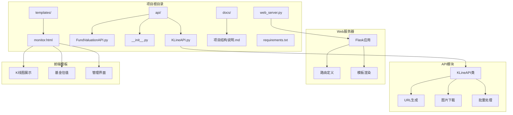
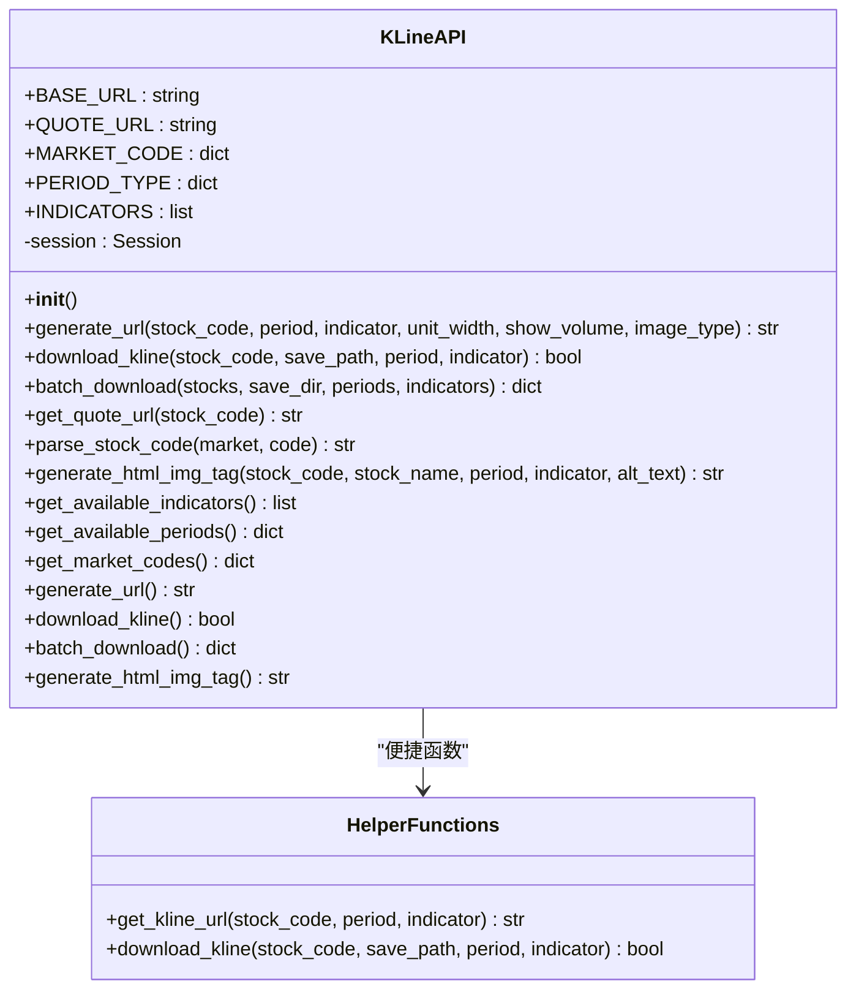
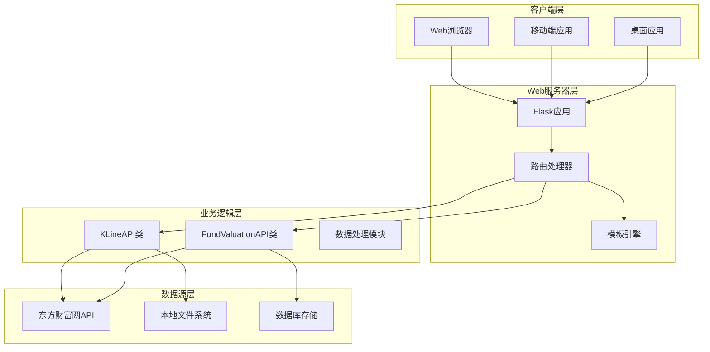
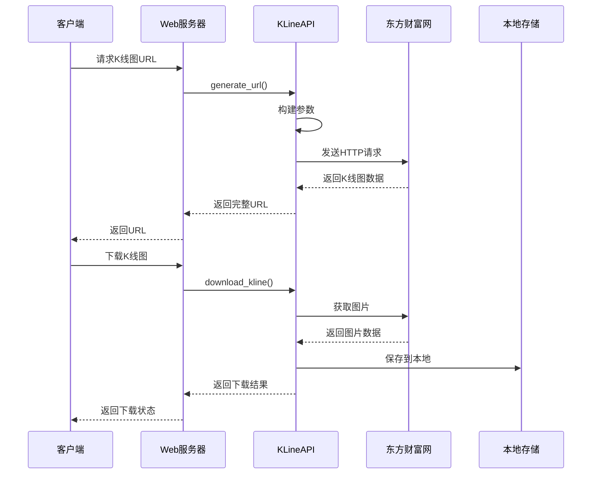
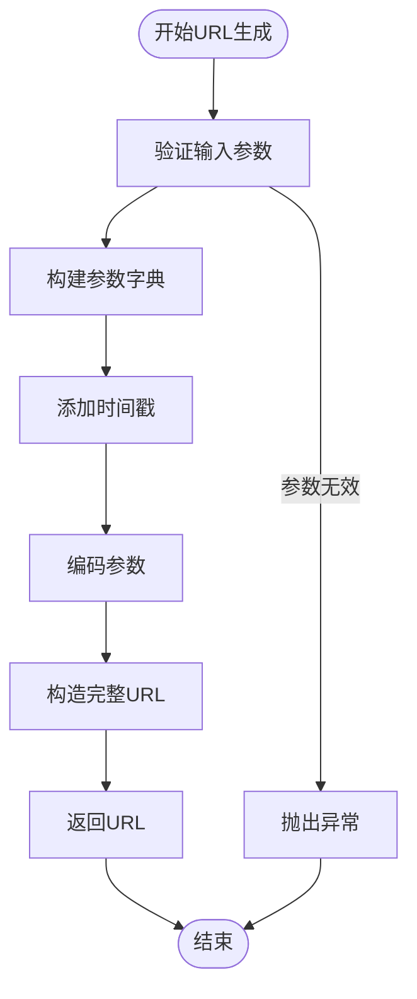
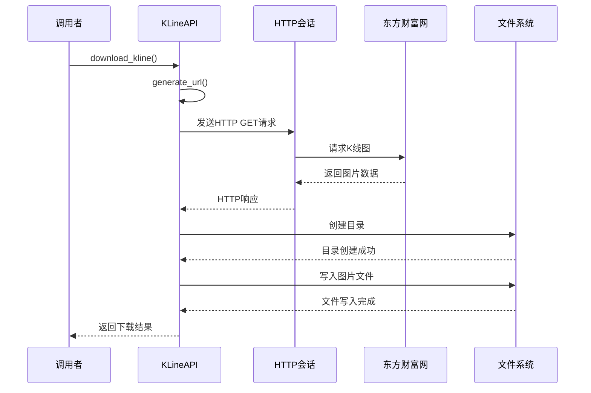
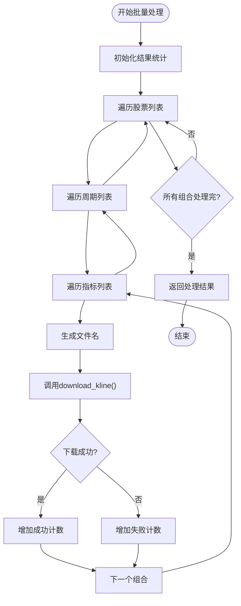
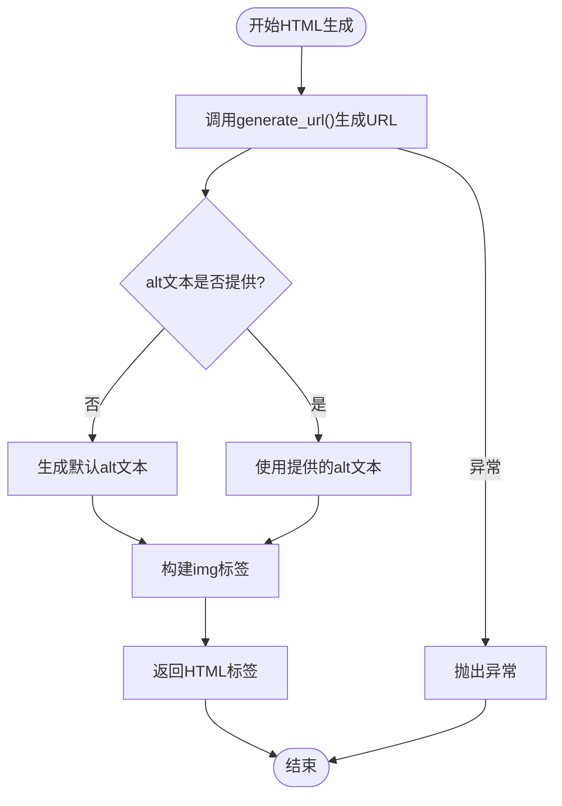
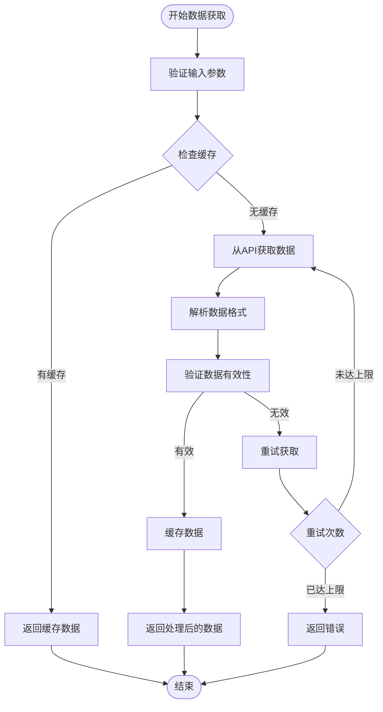
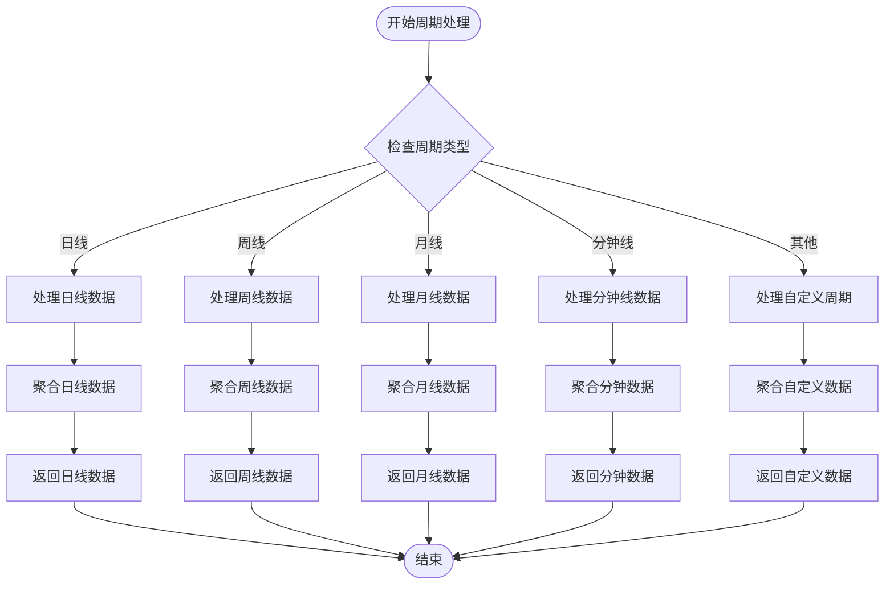

# K线图API模块

<cite>
**本文档引用的文件**
- [KLineAPI.py](file://api/KLineAPI.py)
- [web_server.py](file://web_server.py)
- [README.md](file://README.md)
- [requirements.txt](file://requirements.txt)
- [monitor.html](file://templates/monitor.html)
- [项目结构说明.md](file://docs/项目结构说明.md)
- [__init__.py](file://api/__init__.py)
</cite>

## 目录
1. [简介](#简介)
2. [项目结构](#项目结构)
3. [核心组件](#核心组件)
4. [架构概览](#架构概览)
5. [详细组件分析](#详细组件分析)
6. [技术指标详解](#技术指标详解)
7. [数据处理流程](#数据处理流程)
8. [API使用示例](#api使用示例)
9. [集成指导](#集成指导)
10. [性能考虑](#性能考虑)
11. [故障排除指南](#故障排除指南)
12. [结论](#结论)

## 简介

K线图API模块是基于东方财富网数据源的股票K线图生成和处理工具。该模块提供了完整的K线图获取、下载、URL生成和批量处理功能，支持多种技术指标和时间周期的组合。

该模块采用面向对象设计，通过KLineAPI类封装了所有K线图相关的操作，包括：
- K线图URL生成和参数配置
- K线图图片下载和保存
- 批量处理多个股票的K线图
- HTML图片标签生成
- 市场代码解析和转换

## 项目结构

项目采用模块化架构，K线图API模块位于api目录下，与基金估值API模块并列：



**图表来源**
- [KLineAPI.py](file://api/KLineAPI.py#L1-L345)
- [web_server.py](file://web_server.py#L1-L562)
- [monitor.html](file://templates/monitor.html#L1-L942)

**章节来源**
- [README.md](file://README.md#L1-L193)
- [项目结构说明.md](file://docs/项目结构说明.md#L1-L280)

## 核心组件

### KLineAPI类架构

KLineAPI类是整个模块的核心，提供了完整的K线图处理功能：



**图表来源**
- [KLineAPI.py](file://api/KLineAPI.py#L15-L264)

### 主要配置常量

模块内部维护了关键的配置常量：

| 配置项 | 类型 | 描述 | 示例值 |
|--------|------|------|--------|
| BASE_URL | 字符串 | K线图API基础URL | `http://webquoteklinepic.eastmoney.com/GetPic.aspx` |
| QUOTE_URL | 字符串 | 股票行情页面URL | `https://quote.eastmoney.com/zz` |
| MARKET_CODE | 字典 | 市场代码映射表 | `{'上海': '1', '深圳': '0'}` |
| PERIOD_TYPE | 字典 | K线周期类型映射 | `{'日线': 'D', '周线': 'W'}` |
| INDICATORS | 列表 | 支持的技术指标 | `['MACD', 'KDJ', 'RSI']` |

**章节来源**
- [KLineAPI.py](file://api/KLineAPI.py#L21-L60)

## 架构概览

### 整体架构设计



**图表来源**
- [web_server.py](file://web_server.py#L20-L562)
- [KLineAPI.py](file://api/KLineAPI.py#L15-L67)

### 数据流架构



**图表来源**
- [KLineAPI.py](file://api/KLineAPI.py#L69-L150)
- [web_server.py](file://web_server.py#L54-L58)

## 详细组件分析

### URL生成组件

URL生成是K线图API的核心功能之一，负责构建符合东方财富网API规范的URL。

#### 参数配置详解

| 参数名 | 类型 | 默认值 | 描述 | 有效值示例 |
|--------|------|--------|------|------------|
| nid | 字符串 | 必填 | 股票代码 | `1.000300` |
| type | 字符串 | `'D'` | K线周期 | `'D'`, `'W'`, `'M'`, `'m'` |
| unitWidth | 整数 | `-5` | 图片宽度设置 | `-5`（自适应） |
| ef | 字符串 | `''` | 其他参数 | 空字符串 |
| formula | 字符串 | `'MACD'` | 技术指标 | `'MACD'`, `'KDJ'`, `'RSI'` |
| AT | 整数 | `1` | 是否显示成交量 | `0`或`1` |
| imageType | 字符串 | `'KXL'` | 图片类型 | `'KXL'`（K线图） |
| timespan | 整数 | 当前时间戳 | 时间戳参数 | Unix时间戳 |

#### URL生成流程



**图表来源**
- [KLineAPI.py](file://api/KLineAPI.py#L69-L109)

**章节来源**
- [KLineAPI.py](file://api/KLineAPI.py#L69-L109)

### 图片下载组件

图片下载功能提供了将远程K线图保存到本地文件系统的能力。

#### 下载流程分析



**图表来源**
- [KLineAPI.py](file://api/KLineAPI.py#L111-L149)

#### 错误处理机制

下载功能包含了完善的错误处理机制：

| 错误类型 | 处理方式 | 影响范围 |
|----------|----------|----------|
| 网络连接异常 | 捕获异常并返回False | 单个下载任务失败 |
| 文件权限错误 | 捕获异常并返回False | 文件保存失败 |
| HTTP状态码错误 | 使用raise_for_status()抛出异常 | 下载中断 |
| 超时错误 | 设置timeout参数进行超时控制 | 请求超时 |

**章节来源**
- [KLineAPI.py](file://api/KLineAPI.py#L111-L149)

### 批量处理组件

批量处理功能允许同时处理多个股票、多个周期和多个技术指标的组合。

#### 批量处理算法



**图表来源**
- [KLineAPI.py](file://api/KLineAPI.py#L151-L194)

#### 性能优化策略

批量处理采用了以下优化策略：

1. **进度反馈**：实时显示处理进度和当前处理的组合
2. **结果统计**：分别统计成功和失败的数量
3. **文件命名规范**：统一的文件命名格式便于管理和查找
4. **目录自动创建**：自动创建必要的目录结构

**章节来源**
- [KLineAPI.py](file://api/KLineAPI.py#L151-L194)

### HTML生成组件

HTML生成功能提供了将K线图嵌入网页的能力，支持生成标准的HTML img标签。

#### HTML标签生成逻辑



**图表来源**
- [KLineAPI.py](file://api/KLineAPI.py#L227-L248)

**章节来源**
- [KLineAPI.py](file://api/KLineAPI.py#L227-L248)

## 技术指标详解

### 支持的技术指标

K线API模块支持多种常用的技术分析指标，每种指标都有其特定的计算方法和应用场景：

#### 1. MACD（指数平滑异同移动平均线）

MACD是趋势跟踪型指标，通过计算两条不同周期的指数移动平均线之间的差值来判断趋势方向和强度。

**计算步骤**：
1. 计算12日EMA（指数移动平均）
2. 计算26日EMA
3. 计算MACD线 = EMA(12) - EMA(26)
4. 计算信号线（9日EMA）
5. 计算柱状图 = MACD线 - 信号线

#### 2. KDJ（随机指标）

KDJ是超买超卖型指标，基于最高价、最低价和收盘价的关系来判断买卖时机。

**计算公式**：
- K值 = 100 × [(收盘价 - 最低价) / (最高价 - 最低价)] × 9/10 + K值前一日×1/10
- D值 = K值的3日简单移动平均
- J值 = 3K - 2D

#### 3. RSI（相对强弱指标）

RSI衡量价格变动的速度和变化，用于判断超买或超卖状态。

**计算公式**：
- RS = 平均上涨幅度 / 平均下跌幅度
- RSI = 100 - 100 / (1 + RS)

#### 4. BOLL（布林线）

布林线由三条线组成，用于衡量价格波动性和支撑阻力位。

**组成部分**：
- 中轨：N日简单移动平均
- 上轨：中轨 + 两倍标准差
- 下轨：中轨 - 两倍标准差

#### 5. MA（移动平均线）

移动平均线是基础的趋势分析工具，用于平滑价格波动。

**类型**：
- 简单移动平均（SMA）
- 指数移动平均（EMA）
- 加权移动平均（WMA）

#### 6. VOL（成交量）

成交量指标用于分析价格变动的确认程度。

**相关指标**：
- 成交量均量
- 成交量比率
- 成交量趋势

#### 7. 其他支持指标

除了上述主要指标外，还支持以下技术指标：
- OBV（能量潮）
- WR（威廉指标）
- CCI（顺势指标）
- DMI（趋向指标）

**章节来源**
- [KLineAPI.py](file://api/KLineAPI.py#L48-L60)

### 技术指标选择策略

在实际使用中，应根据不同的分析需求选择合适的技术指标：

| 指标类型 | 适用场景 | 特点 | 注意事项 |
|----------|----------|------|----------|
| 趋势指标 | 趋势判断 | 对趋势敏感 | 容易产生假信号 |
| 摆动指标 | 买卖时机 | 判断超买超卖 | 在横盘市场效果有限 |
| 量价指标 | 确认信号 | 结合成交量分析 | 需要结合其他指标 |
| 波动指标 | 风险管理 | 衡量价格波动 | 适用于布林带等衍生指标 |

## 数据处理流程

### 数据获取流程



### 数据清洗和格式转换

#### 数据清洗步骤

1. **格式验证**：检查股票代码格式是否正确
2. **数值验证**：验证价格、成交量等数值的有效性
3. **时间验证**：检查时间戳的合理性
4. **完整性检查**：确保数据字段的完整性

#### 格式转换规则

| 输入格式 | 输出格式 | 转换规则 |
|----------|----------|----------|
| 股票代码 | 标准格式 | `市场代码.股票代码` |
| 日期格式 | ISO格式 | `YYYY-MM-DD` |
| 价格格式 | 数值格式 | 去除货币符号和千分位 |
| 成交量 | 数值格式 | 转换为标准单位 |

**章节来源**
- [KLineAPI.py](file://api/KLineAPI.py#L208-L225)

### 时间周期处理

#### 支持的周期类型

| 周期名称 | 周期代码 | 描述 | 适用场景 |
|----------|----------|------|----------|
| 日线 | D | 日K线 | 中长期趋势分析 |
| 周线 | W | 周K线 | 周度趋势判断 |
| 月线 | M | 月K线 | 长期趋势分析 |
| 分钟 | m | 分钟线 | 短线交易分析 |
| 5分钟 | m5 | 5分钟线 | 短线交易辅助 |
| 15分钟 | m15 | 15分钟线 | 短线交易分析 |
| 30分钟 | m30 | 30分钟线 | 中短线交易 |
| 60分钟 | m60 | 60分钟线 | 中长线交易分析 |

#### 周期转换逻辑



**图表来源**
- [KLineAPI.py](file://api/KLineAPI.py#L36-L46)

## API使用示例

### 基础使用示例

#### 1. 生成K线图URL

```python
from api.KLineAPI import KLineAPI

# 创建API实例
api = KLineAPI()

# 生成沪深300指数的日线MACD图URL
url = api.generate_url('1.000300', period='D', indicator='MACD')
print(f"K线图URL: {url}")
```

#### 2. 下载K线图到本地

```python
# 下载K线图到指定路径
success = api.download_kline(
    stock_code='1.000300',
    save_path='./charts/hs300_day_macd.png',
    period='D',
    indicator='MACD'
)

if success:
    print("下载成功!")
else:
    print("下载失败!")
```

#### 3. 批量下载多个股票的K线图

```python
# 定义股票列表
stocks = {
    '1.000300': '沪深300',
    '0.399006': '创业板指',
    '1.000016': '上证50'
}

# 批量下载
results = api.batch_download(
    stocks=stocks,
    save_dir='./charts',
    periods=['D', 'W'],
    indicators=['MACD']
)

print(f"批量下载结果: 成功 {results['成功']}, 失败 {results['失败']}")
```

#### 4. 生成HTML图片标签

```python
# 生成HTML img标签
html_tag = api.generate_html_img_tag(
    stock_code='1.000300',
    stock_name='沪深300',
    period='D',
    indicator='MACD'
)

print(f"HTML标签: {html_tag}")
```

### 高级使用示例

#### 1. 自定义参数配置

```python
# 使用自定义参数生成URL
url = api.generate_url(
    stock_code='1.000300',
    period='m60',                    # 60分钟线
    indicator='KDJ',                 # KDJ指标
    unit_width=-5,                   # 自适应宽度
    show_volume=True,               # 显示成交量
    image_type='KXL'                # K线图类型
)
```

#### 2. 市场代码解析

```python
# 解析不同市场的股票代码
shanghai_code = api.parse_stock_code('上海', '000300')
shenzhen_code = api.parse_stock_code('深圳', '399006')

print(f"上海代码: {shanghai_code}")    # 输出: 1.000300
print(f"深圳代码: {shenzhen_code}")    # 输出: 0.399006
```

#### 3. 获取可用配置

```python
# 获取所有可用的技术指标
indicators = api.get_available_indicators()
print(f"可用指标: {indicators}")

# 获取所有可用的K线周期
periods = api.get_available_periods()
print(f"可用周期: {periods}")

# 获取所有市场代码
markets = api.get_market_codes()
print(f"市场代码: {markets}")
```

**章节来源**
- [KLineAPI.py](file://api/KLineAPI.py#L300-L345)

## 集成指导

### Web服务器集成

K线API模块与Web服务器的集成主要体现在以下几个方面：

#### 1. 模块导入和初始化

```python
from flask import Flask, render_template, request, jsonify
from api.KLineAPI import KLineAPI

# 初始化K线API实例
kline_api = KLineAPI()

@app.route('/api/kline/url', methods=['POST'])
def generate_kline_url():
    """生成K线图URL的API接口"""
    try:
        data = request.json
        stock_code = data.get('stock_code')
        period = data.get('period', 'D')
        indicator = data.get('indicator', 'MACD')
        
        url = kline_api.generate_url(stock_code, period, indicator)
        
        return jsonify({
            'success': True,
            'data': {
                'url': url,
                'stock_code': stock_code,
                'period': period,
                'indicator': indicator
            }
        })
    except Exception as e:
        return jsonify({
            'success': False,
            'error': str(e)
        })
```

#### 2. 前端模板集成

在前端模板中，可以直接使用生成的URL来显示K线图：

```html
<!-- 在monitor.html中 -->

<tr>
    
        
            <td>
                
            </td>
        
    
</tr>

```

#### 3. 配置管理

```python
# 在web_server.py中
@app.route('/api/config', methods=['GET'])
def get_config():
    """获取配置信息"""
    try:
        # 读取配置文件
        config = file2json(CONFIG_FILE)
        
        # 获取K线图相关配置
        fund_list = config.get('fund_list', [])
        dict_zs_all = config.get('zs_all', {})
        list_type = config.get('type_all', ['D', 'W', 'M'])
        list_formula = config.get('formula_all', ['MACD'])
        int_unitWidth = config.get('unitWidth', -5)
        
        return jsonify({
            'success': True,
            'data': {
                'fund_list': fund_list,
                'dict_zs_all': dict_zs_all,
                'list_type': list_type,
                'list_formula': list_formula,
                'int_unitWidth': int_unitWidth
            }
        })
    except Exception as e:
        return jsonify({
            'success': False,
            'error': str(e)
        })
```

### 扩展开发指导

#### 1. 新增技术指标支持

要新增技术指标支持，需要修改KLineAPI类中的INDICATORS列表：

```python
# 在KLineAPI类中添加新的指标
INDICATORS = [
    'MACD',  # 指数平滑异同移动平均线
    'KDJ',   # 随机指标
    'RSI',   # 相对强弱指标
    'BOLL',  # 布林线
    'MA',    # 移动平均线
    'VOL',   # 成交量
    'NEW_INDICATOR',  # 新增指标
]
```

#### 2. 自定义市场代码

如果需要支持新的市场，可以扩展MARKET_CODE字典：

```python
# 扩展市场代码映射
MARKET_CODE = {
    '上海': '1',
    '深圳': '0',
    '中证': '2',
    '东财板块': '90',
    '国际': '100',
    '期货': '102',
    '港股': '124',
    '科创板': '125',  # 新增市场
}
```

#### 3. 参数验证增强

可以在generate_url方法中添加更严格的参数验证：

```python
def generate_url(self, stock_code, period, indicator, unit_width=-5, show_volume=True, image_type='KXL'):
    # 参数验证
    if not stock_code or not isinstance(stock_code, str):
        raise ValueError("股票代码必须是非空字符串")
    
    if period not in self.PERIOD_TYPE.values():
        raise ValueError(f"不支持的周期类型: {period}")
    
    if indicator not in self.INDICATORS:
        raise ValueError(f"不支持的技术指标: {indicator}")
    
    # 其余的URL生成逻辑...
```

#### 4. 错误处理优化

可以增强错误处理机制：

```python
def download_kline(self, stock_code, save_path, period='D', indicator='MACD'):
    try:
        # 验证输入参数
        self._validate_input(stock_code, save_path, period, indicator)
        
        # 生成URL并下载
        url = self.generate_url(stock_code, period, indicator)
        response = self.session.get(url, timeout=30)
        response.raise_for_status()
        
        # 保存文件
        self._save_file(save_path, response.content)
        
        return True
        
    except requests.exceptions.RequestException as e:
        print(f"网络请求错误: {e}")
        return False
    except IOError as e:
        print(f"文件操作错误: {e}")
        return False
    except Exception as e:
        print(f"未知错误: {e}")
        return False
```

**章节来源**
- [web_server.py](file://web_server.py#L26-L28)
- [monitor.html](file://templates/monitor.html#L377-L398)

## 性能考虑

### 网络请求优化

#### 1. 连接池管理

K线API使用requests.Session()来管理HTTP连接，这有助于减少TCP连接的建立开销：

```python
def __init__(self):
    """初始化K线API工具"""
    self.session = requests.Session()
    self.session.headers.update({
        'User-Agent': 'Mozilla/5.0 (Windows NT 10.0; Win64; x64) AppleWebKit/537.36'
    })
```

#### 2. 超时设置

所有网络请求都设置了合理的超时时间，防止长时间阻塞：

```python
response = self.session.get(url, timeout=30)
```

#### 3. 重试机制

虽然当前实现没有内置重试机制，但可以在需要时添加：

```python
from requests.adapters import HTTPAdapter
from urllib3.util.retry import Retry

def _create_session_with_retries(self):
    session = requests.Session()
    retry_strategy = Retry(
        total=3,
        backoff_factor=1,
        status_forcelist=[429, 500, 502, 503, 504],
    )
    adapter = HTTPAdapter(max_retries=retry_strategy)
    session.mount("http://", adapter)
    session.mount("https://", adapter)
    return session
```

### 批量处理性能

#### 1. 并发处理

批量下载功能采用顺序处理，对于大量数据可以考虑使用并发处理：

```python
from concurrent.futures import ThreadPoolExecutor
import asyncio

async def batch_download_async(self, stocks, save_dir, periods=['D', 'W', 'M'], indicators=['MACD']):
    """异步批量下载"""
    tasks = []
    for code, name in stocks.items():
        for period in periods:
            for indicator in indicators:
                task = self._download_single_async(code, name, save_dir, period, indicator)
                tasks.append(task)
    
    results = await asyncio.gather(*tasks)
    return results
```

#### 2. 内存管理

对于大量图片下载，需要注意内存使用：

```python
def download_kline_optimized(self, stock_code, save_path, period='D', indicator='MACD'):
    """优化的下载方法，使用流式下载"""
    try:
        url = self.generate_url(stock_code, period, indicator)
        response = self.session.get(url, timeout=30, stream=True)
        response.raise_for_status()
        
        # 使用流式写入，避免大文件占用过多内存
        with open(save_path, 'wb') as f:
            for chunk in response.iter_content(chunk_size=8192):
                if chunk:
                    f.write(chunk)
        
        return True
    except Exception as e:
        print(f"下载失败: {e}")
        return False
```

### 缓存策略

#### 1. URL缓存

可以实现URL级别的缓存来减少重复请求：

```python
import hashlib
import pickle
import os

class KLineAPICache:
    def __init__(self, cache_dir='./cache'):
        self.cache_dir = cache_dir
        os.makedirs(cache_dir, exist_ok=True)
    
    def _get_cache_key(self, stock_code, period, indicator):
        """生成缓存键"""
        return hashlib.md5(f"{stock_code}_{period}_{indicator}".encode()).hexdigest()
    
    def get(self, stock_code, period, indicator):
        """获取缓存"""
        cache_key = self._get_cache_key(stock_code, period, indicator)
        cache_path = os.path.join(self.cache_dir, cache_key)
        
        if os.path.exists(cache_path):
            with open(cache_path, 'rb') as f:
                return pickle.load(f)
        return None
    
    def set(self, stock_code, period, indicator, data):
        """设置缓存"""
        cache_key = self._get_cache_key(stock_code, period, indicator)
        cache_path = os.path.join(self.cache_dir, cache_key)
        
        with open(cache_path, 'wb') as f:
            pickle.dump(data, f)
```

### 内存和资源管理

#### 1. 文件句柄管理

确保所有文件操作都正确关闭：

```python
def download_kline(self, stock_code, save_path, period='D', indicator='MACD'):
    """安全的文件下载"""
    url = self.generate_url(stock_code, period, indicator)
    response = self.session.get(url, timeout=30)
    response.raise_for_status()
    
    # 确保目录存在
    os.makedirs(os.path.dirname(save_path), exist_ok=True)
    
    # 使用with语句确保文件正确关闭
    with open(save_path, 'wb') as f:
        f.write(response.content)
    
    return True
```

#### 2. 资源清理

在类销毁时清理资源：

```python
def __del__(self):
    """清理资源"""
    if hasattr(self, 'session'):
        self.session.close()
```

## 故障排除指南

### 常见问题及解决方案

#### 1. 网络连接问题

**问题症状**：
- 下载失败，返回False
- 网络超时异常
- HTTP状态码错误

**解决方案**：
```python
def troubleshoot_network_issues(self):
    """网络问题诊断"""
    try:
        # 检查网络连接
        response = self.session.get('http://webquoteklinepic.eastmoney.com', timeout=10)
        if response.status_code == 200:
            print("网络连接正常")
        else:
            print(f"网络连接异常，状态码: {response.status_code}")
    except requests.exceptions.ConnectionError:
        print("无法连接到东方财富网")
    except requests.exceptions.Timeout:
        print("请求超时")
    except Exception as e:
        print(f"其他网络错误: {e}")
```

#### 2. 文件权限问题

**问题症状**：
- 保存文件失败
- 权限不足错误
- 目录不存在

**解决方案**：
```python
def check_file_permissions(self, save_path):
    """检查文件权限"""
    import os
    
    # 检查目录是否存在，不存在则创建
    directory = os.path.dirname(save_path)
    if not os.path.exists(directory):
        try:
            os.makedirs(directory)
            print(f"创建目录: {directory}")
        except OSError as e:
            print(f"创建目录失败: {e}")
            return False
    
    # 检查目录权限
    if not os.access(directory, os.W_OK):
        print(f"目录无写入权限: {directory}")
        return False
    
    return True
```

#### 3. API限制问题

**问题症状**：
- 请求被拒绝
- 返回429状态码
- 服务器繁忙

**解决方案**：
```python
import time
from requests.adapters import HTTPAdapter
from urllib3.util.retry import Retry

def handle_rate_limiting(self):
    """处理API限制"""
    retry_strategy = Retry(
        total=3,
        backoff_factor=1,
        status_forcelist=[429, 500, 502, 503, 504],
        # 添加等待时间
        allowed_methods=["HEAD", "GET", "OPTIONS"]
    )
    
    adapter = HTTPAdapter(max_retries=retry_strategy)
    self.session.mount("http://", adapter)
    self.session.mount("https://", adapter)
```

#### 4. 数据格式问题

**问题症状**：
- 解析错误
- 数据类型不匹配
- 缺失字段

**解决方案**：
```python
def validate_kline_data(self, data):
    """验证K线数据格式"""
    required_fields = ['open', 'high', 'low', 'close', 'volume']
    date_field = 'date'
    
    # 检查必需字段
    for field in required_fields:
        if field not in data:
            raise ValueError(f"缺少必需字段: {field}")
    
    # 检查数据类型
    if not isinstance(data['open'], (int, float)):
        raise TypeError("开盘价必须是数字")
    
    if not isinstance(data['date'], str):
        raise TypeError("日期必须是字符串")
    
    # 检查数据范围
    if data['high'] < data['low']:
        raise ValueError("最高价不能小于最低价")
    
    return True
```

### 调试和日志

#### 1. 调试模式

```python
import logging

# 配置调试日志
logging.basicConfig(level=logging.DEBUG)
logger = logging.getLogger(__name__)

def debug_kline_request(self, stock_code, period, indicator):
    """调试K线请求"""
    logger.debug(f"请求参数:")
    logger.debug(f"  股票代码: {stock_code}")
    logger.debug(f"  周期: {period}")
    logger.debug(f"  指标: {indicator}")
    
    url = self.generate_url(stock_code, period, indicator)
    logger.debug(f"生成的URL: {url}")
    
    return url
```

#### 2. 错误追踪

```python
import traceback

def safe_download_kline(self, stock_code, save_path, period='D', indicator='MACD'):
    """安全的下载方法，包含完整的错误追踪"""
    try:
        return self.download_kline(stock_code, save_path, period, indicator)
    except Exception as e:
        print(f"下载失败 - 股票: {stock_code}")
        print(f"错误类型: {type(e).__name__}")
        print(f"错误信息: {str(e)}")
        print("堆栈跟踪:")
        traceback.print_exc()
        return False
```

### 性能监控

#### 1. 请求时间监控

```python
import time

def monitor_request_performance(self, func, *args, **kwargs):
    """监控请求性能"""
    start_time = time.time()
    try:
        result = func(*args, **kwargs)
        end_time = time.time()
        duration = end_time - start_time
        print(f"请求耗时: {duration:.2f}秒")
        return result
    except Exception as e:
        end_time = time.time()
        duration = end_time - start_time
        print(f"请求失败，耗时: {duration:.2f}秒")
        raise e
```

#### 2. 批量处理监控

```python
def monitor_batch_process(self, total_tasks, current_task, success_count, fail_count):
    """监控批量处理进度"""
    progress = (current_task / total_tasks) * 100
    print(f"进度: {progress:.1f}% ({current_task}/{total_tasks})")
    print(f"成功: {success_count}, 失败: {fail_count}")
    print(f"成功率: {(success_count/current_task)*100:.1f}%" if current_task > 0 else "0.0%"})
```

**章节来源**
- [KLineAPI.py](file://api/KLineAPI.py#L111-L149)
- [KLineAPI.py](file://api/KLineAPI.py#L151-L194)

## 结论

K线图API模块是一个功能完整、设计良好的股票K线图处理工具。它通过简洁的接口提供了丰富的功能，包括URL生成、图片下载、批量处理和HTML生成等。

### 主要优势

1. **设计简洁**：采用面向对象设计，接口清晰易用
2. **功能完整**：涵盖了K线图处理的各个方面
3. **扩展性强**：支持自定义技术指标和市场代码
4. **错误处理**：完善的异常处理和错误恢复机制
5. **性能优化**：合理的网络请求和资源管理策略

### 应用场景

该模块适用于以下场景：
- 股票分析平台的数据展示
- 量化交易系统的图表生成
- 金融数据可视化应用
- 技术分析工具的集成

### 发展建议

1. **增加异步支持**：实现异步下载和处理功能
2. **增强缓存机制**：实现智能缓存策略
3. **扩展指标库**：支持更多技术分析指标
4. **优化性能**：实现并发处理和资源池管理
5. **增强监控**：添加详细的性能监控和日志记录

通过持续的优化和扩展，K线图API模块将成为一个更加完善和强大的股票数据处理工具。