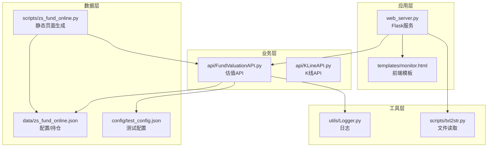
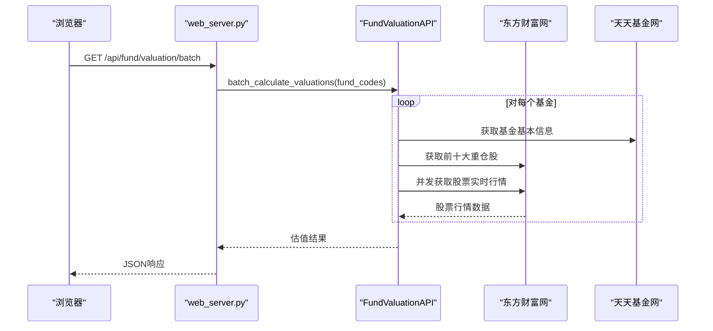
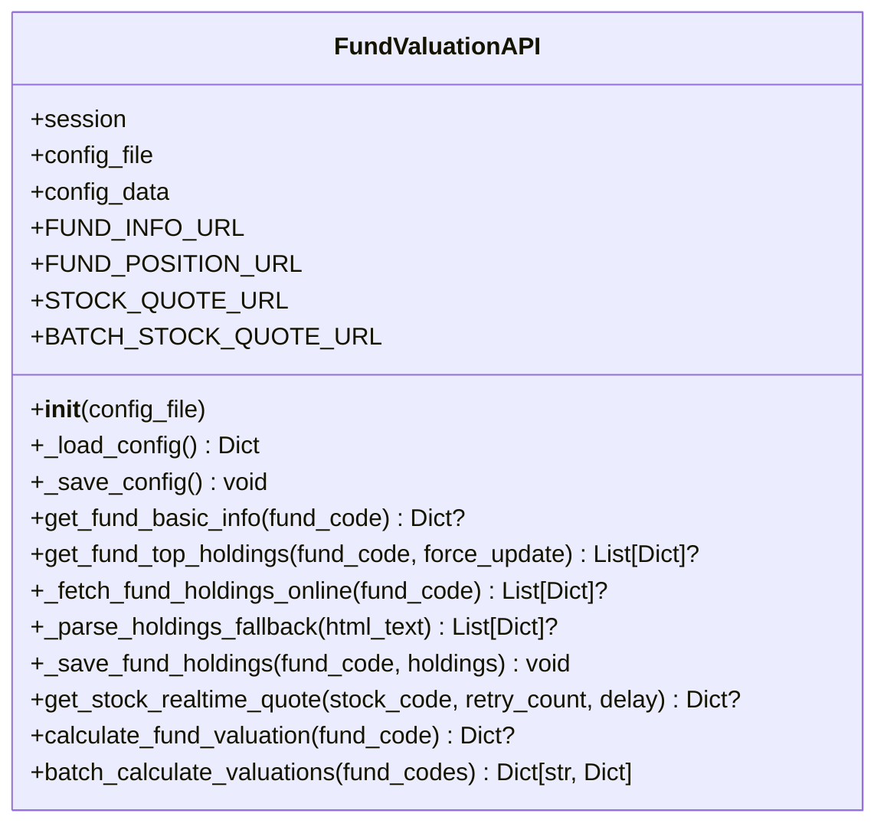
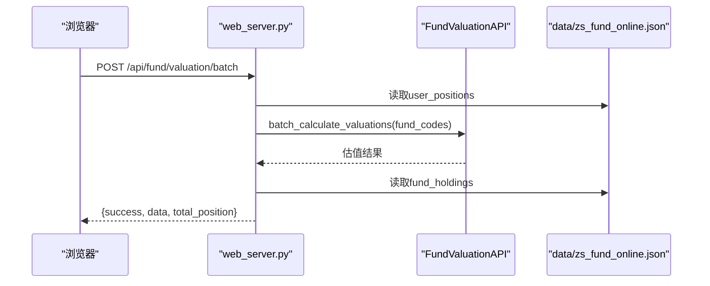
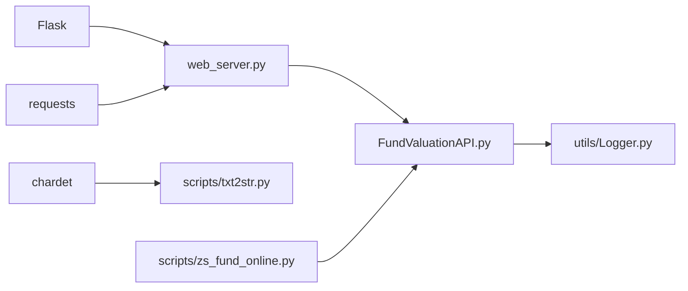

# 基金估值API模块

<cite>
**本文引用的文件**
- [FundValuationAPI.py](file://api/FundValuationAPI.py)
- [web_server.py](file://web_server.py)
- [Logger.py](file://utils/Logger.py)
- [test_config.json](file://config/test_config.json)
- [README.md](file://README.md)
- [requirements.txt](file://requirements.txt)
- [test_fund_config.py](file://tests/test_fund_config.py)
- [zs_fund_online.py](file://scripts/zs_fund_online.py)
- [monitor.html](file://templates/monitor.html)
- [txt2str.py](file://scripts/txt2str.py)
</cite>

## 目录
1. [简介](#简介)
2. [项目结构](#项目结构)
3. [核心组件](#核心组件)
4. [架构概览](#架构概览)
5. [详细组件分析](#详细组件分析)
6. [依赖关系分析](#依赖关系分析)
7. [性能考量](#性能考量)
8. [故障排查指南](#故障排查指南)
9. [结论](#结论)
10. [附录](#附录)

## 简介
本文件为“基金估值API模块”的全面技术文档，面向开发者与运维人员，系统阐述基于前十大重仓股的实时估值算法与实现原理，涵盖API类的构造与配置管理、数据获取流程、估值计算逻辑、并发处理策略、数据缓存机制、错误处理方案，并提供使用示例、性能优化建议与扩展开发指导。该模块既可作为独立库使用，也可集成至Flask Web服务中，提供可视化监控与管理界面。

## 项目结构
项目采用模块化分层设计：
- api：核心业务模块，包含FundValuationAPI与KLineAPI
- utils：通用工具，包含日志Logger
- web_server：Flask Web服务入口，提供REST接口与前端模板渲染
- scripts：辅助脚本，如静态页面生成器
- templates：前端模板，监控页面与管理页面
- data/config：数据与配置文件
- tests：单元测试与功能测试
- docs：项目文档

**图表来源**
- [web_server.py](file://web_server.py#L1-L562)
- [FundValuationAPI.py](file://api/FundValuationAPI.py#L1-L537)
- [Logger.py](file://utils/Logger.py#L1-L86)
- [monitor.html](file://templates/monitor.html#L1-L918)
- [txt2str.py](file://scripts/txt2str.py#L1-L108)
- [zs_fund_online.py](file://scripts/zs_fund_online.py#L1-L281)

**章节来源**
- [README.md](file://README.md#L1-L193)

## 核心组件
- FundValuationAPI：核心估值计算类，负责基金基本信息获取、持仓信息处理、股票实时行情抓取、并发估值计算与批量处理。
- Logger：统一日志记录器，支持文件轮转与控制台输出。
- web_server：Flask服务，提供REST接口与前端模板渲染，集成FundValuationAPI。
- 配置文件：JSON格式，存储基金列表、用户持仓金额、重仓股缓存等。

关键职责与能力：
- 基金基本信息：从天天基金网获取净值、估值、估值时间与涨跌幅。
- 持仓信息：优先从本地配置文件读取，否则联网抓取并缓存。
- 实时行情：从东方财富网获取股票最新价、涨跌幅、昨收等。
- 估值计算：基于前十大重仓股加权涨跌幅估算基金净值变化。
- 并发处理：使用线程池并发请求股票行情，提高吞吐。
- 批量处理：支持批量估值计算与用户持仓金额联动计算。
- 错误处理：完善的异常捕获、超时控制与重试机制。

**章节来源**
- [FundValuationAPI.py](file://api/FundValuationAPI.py#L27-L537)
- [web_server.py](file://web_server.py#L1-L562)
- [Logger.py](file://utils/Logger.py#L1-L86)

## 架构概览
系统采用“Web服务 + 核心API + 工具库 + 配置文件”的分层架构。前端通过AJAX调用后端REST接口，后端调用FundValuationAPI执行计算，数据持久化由配置文件承担。

**图表来源**
- [web_server.py](file://web_server.py#L183-L226)
- [FundValuationAPI.py](file://api/FundValuationAPI.py#L427-L452)

## 详细组件分析

### FundValuationAPI 类
- 构造函数与配置管理
  - 接受可选配置文件路径，初始化HTTP会话与请求头，加载配置并维护内存缓存。
  - 提供配置文件的读取与保存方法，支持断言式容错。
- 基金基本信息获取
  - 调用天天基金网接口，解析JSONP响应，提取净值、估值、时间与涨跌幅。
  - 包含HTTP状态码校验与内容类型校验，防止HTML错误响应。
- 持仓信息处理
  - 优先从配置文件读取；若无或强制更新，则联网抓取并保存。
  - 使用正则解析HTML表格，提供备用解析方案，增强鲁棒性。
- 股票实时行情获取
  - 根据股票代码判断市场（沪/深），构造参数请求实时行情。
  - 带重试机制与延迟退避，避免请求过于频繁。
- 估值计算逻辑
  - 加权平均涨跌幅：对每只重仓股的涨跌幅乘以其持仓比例，合计得到估算涨跌幅。
  - 估算净值：上次净值 × (1 + 估算涨跌幅/100)。
  - 输出包含估算净值、估算涨跌幅、估算时间、重仓股明细与贡献度。
- 并发处理策略
  - 使用ThreadPoolExecutor限制最大并发数，每个线程随机短延迟避免同时请求。
  - 使用as_completed收集结果，保证有序输出。
- 批量处理机制
  - 遍历基金列表逐个计算，聚合成功结果并记录统计信息。
- 辅助函数
  - 快捷函数：快速获取单个基金估值。
  - 格式化打印：美化输出估值结果。

**图表来源**
- [FundValuationAPI.py](file://api/FundValuationAPI.py#L27-L537)

**章节来源**
- [FundValuationAPI.py](file://api/FundValuationAPI.py#L42-L537)

### Web服务集成
- Flask路由
  - 配置读取/保存、基金列表、预览、添加/移除、持仓查看/编辑、估值计算等接口。
  - 批量估值接口整合用户持仓金额，计算单日盈亏与总持仓比例。
- 前端模板
  - monitor.html提供交互界面，支持手动刷新、自动刷新（5分钟）、持仓编辑与弹窗查看。
  - JavaScript侧调用后端接口，异步渲染估值表格与K线图。
- 配置文件
  - data/zs_fund_online.json：包含fund_list、user_positions、fund_holdings等字段。
  - config/test_config.json：测试用配置，演示fund_holdings结构。

**图表来源**
- [web_server.py](file://web_server.py#L183-L226)
- [monitor.html](file://templates/monitor.html#L544-L585)

**章节来源**
- [web_server.py](file://web_server.py#L66-L296)
- [monitor.html](file://templates/monitor.html#L544-L670)

### 日志系统
- Logger类
  - 支持文件轮转（默认10MB，保留5份备份），同时输出到控制台与文件。
  - 提供debug/info/warning/error/critical等日志级别方法。
- 在API中广泛使用日志记录关键步骤与异常，便于问题定位与审计。

**章节来源**
- [Logger.py](file://utils/Logger.py#L1-L86)
- [FundValuationAPI.py](file://api/FundValuationAPI.py#L24-L24)

### 配置与数据流
- 配置文件结构
  - fund_list：监控的基金代码列表
  - user_positions：用户持仓金额（元）
  - fund_holdings：重仓股缓存，包含holdings与update_time
- 数据获取流程
  - 优先使用本地缓存；若无或强制更新则联网抓取并回写配置文件。
  - 持仓比例超过100%时给出警告提示。

**章节来源**
- [test_config.json](file://config/test_config.json#L1-L59)
- [web_server.py](file://web_server.py#L105-L139)

### 使用示例与API调用
- 单个基金估值
  - 通过FundValuationAPI实例调用calculate_fund_valuation
  - 或使用便捷函数get_fund_valuation
- 批量估值
  - 调用batch_calculate_valuations传入基金代码列表
  - Web服务中通过POST /api/fund/valuation/batch获取结果
- 前端交互
  - monitor.html通过AJAX调用后端接口，动态渲染估值表格与K线图

**章节来源**
- [FundValuationAPI.py](file://api/FundValuationAPI.py#L502-L537)
- [web_server.py](file://web_server.py#L183-L226)
- [monitor.html](file://templates/monitor.html#L565-L585)

## 依赖关系分析
- 外部依赖
  - Flask：Web框架
  - requests：HTTP客户端
  - chardet：字符集检测
- 内部依赖
  - FundValuationAPI依赖Logger进行日志记录
  - web_server依赖FundValuationAPI与scripts/txt2str.py进行配置读取
  - scripts/zs_fund_online.py依赖FundValuationAPI生成静态页面

**图表来源**
- [requirements.txt](file://requirements.txt#L1-L4)
- [web_server.py](file://web_server.py#L9-L15)
- [FundValuationAPI.py](file://api/FundValuationAPI.py#L10-L21)
- [txt2str.py](file://scripts/txt2str.py#L1-L6)

**章节来源**
- [requirements.txt](file://requirements.txt#L1-L4)
- [web_server.py](file://web_server.py#L9-L15)

## 性能考量
- 并发优化
  - ThreadPoolExecutor限制最大并发为5，避免对第三方接口造成过大压力。
  - 每个线程随机延迟0-0.2秒，降低同时请求概率。
- 请求限速与重试
  - 股票行情接口设置较短超时，失败时按退避策略重试。
  - 基金基本信息与持仓接口设置合理超时，防止阻塞。
- 缓存策略
  - 优先使用本地配置文件缓存持仓，减少网络请求。
  - 批量处理时复用同一API实例，避免重复初始化。
- 前端性能
  - monitor.html采用5分钟自动刷新，减少不必要的请求。
  - K线图加载完成后记录耗时，便于性能监控。

优化建议：
- 可根据网络环境调整并发数与重试次数。
- 对于高频场景，可引入Redis等外部缓存替代本地JSON文件。
- 增加请求头伪装与代理池，降低被反爬风险。
- 对HTML解析正则进行性能评估，必要时替换为更高效的解析库。

**章节来源**
- [FundValuationAPI.py](file://api/FundValuationAPI.py#L346-L393)
- [monitor.html](file://templates/monitor.html#L471-L483)

## 故障排查指南
常见问题与解决方案：
- HTTP状态码异常
  - 检查目标站点可用性与接口变更，确认User-Agent与Referer设置。
- JSONP解析失败
  - 确认响应内容类型，检查正则匹配是否适配当前HTML结构。
- 持仓比例异常
  - 若超过100%，前端会提示警告；可在配置文件中修正。
- 网络超时或连接失败
  - 调整超时时间与重试次数，检查代理与防火墙设置。
- 配置文件读取失败
  - 检查文件编码与JSON格式，确保路径正确。
- 并发请求过多导致限流
  - 降低并发数或增加延迟，避免触发第三方限流。

**章节来源**
- [FundValuationAPI.py](file://api/FundValuationAPI.py#L102-L133)
- [web_server.py](file://web_server.py#L116-L118)

## 结论
FundValuationAPI模块通过“前十大重仓股加权涨跌幅”实现了对基金净值的近似估算，结合本地缓存与并发优化，在保证实时性的同时兼顾稳定性。配合Flask Web服务与前端模板，提供了完整的可视化监控与管理能力。建议在生产环境中进一步完善缓存策略、限流与反爬措施，并持续关注第三方接口的稳定性与数据质量。

## 附录

### API方法一览
- FundValuationAPI
  - 构造函数：初始化会话与配置
  - get_fund_basic_info：获取基金基本信息
  - get_fund_top_holdings：获取前十大重仓股（支持强制更新）
  - get_stock_realtime_quote：获取股票实时行情（带重试）
  - calculate_fund_valuation：计算单个基金估值
  - batch_calculate_valuations：批量计算估值
  - 辅助函数：get_fund_valuation、print_fund_valuation

**章节来源**
- [FundValuationAPI.py](file://api/FundValuationAPI.py#L88-L452)

### 配置文件字段说明
- fund_list：监控的基金代码数组
- user_positions：用户持仓金额映射（基金代码 -> 金额）
- fund_holdings：重仓股缓存映射（基金代码 -> {holdings[], update_time}）

**章节来源**
- [test_config.json](file://config/test_config.json#L1-L59)
- [README.md](file://README.md#L105-L120)

### 测试与验证
- 单元测试：tests/test_fund_config.py验证配置文件读写与估值流程
- 功能测试：通过web_server的接口验证前端交互与后端计算

**章节来源**
- [test_fund_config.py](file://tests/test_fund_config.py#L1-L63)