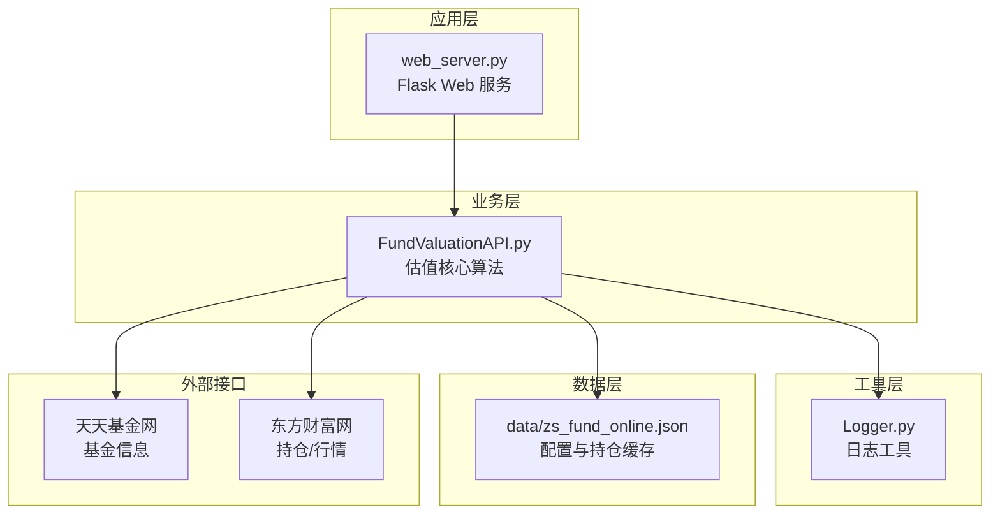
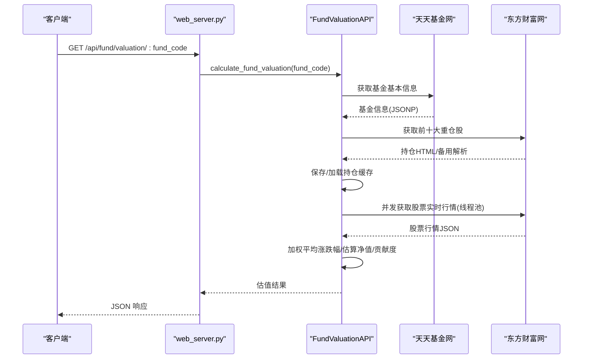
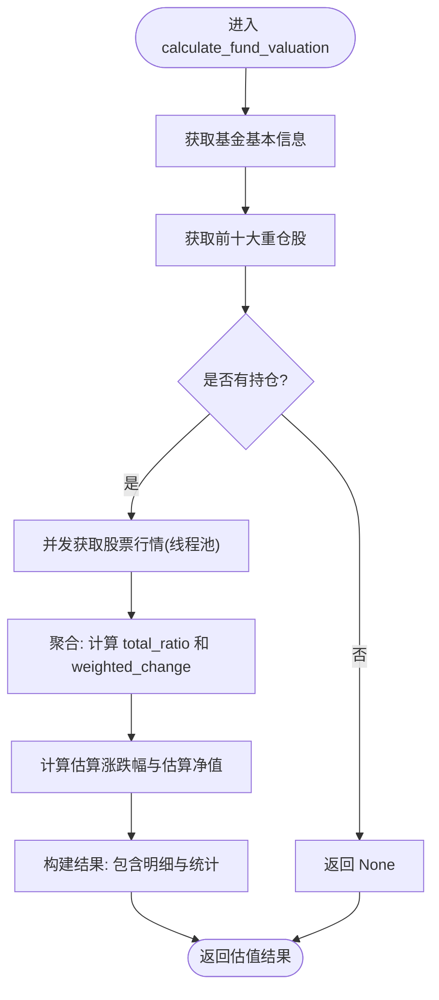
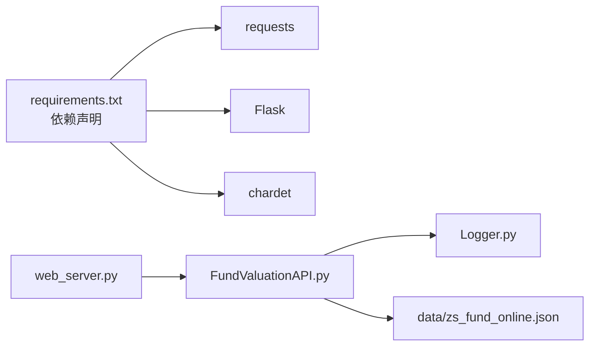

# 基金估值核心算法

<cite>
**本文引用的文件**
- [FundValuationAPI.py](file://api/FundValuationAPI.py)
- [web_server.py](file://web_server.py)
- [Logger.py](file://utils/Logger.py)
- [README.md](file://README.md)
- [基金实时估值功能说明.md](file://docs/基金实时估值功能说明.md)
- [基金估值快速开始.md](file://docs/基金估值快速开始.md)
- [requirements.txt](file://requirements.txt)
- [zs_fund_online.json](file://data/zs_fund_online.json)
</cite>

## 目录
1. [简介](#简介)
2. [项目结构](#项目结构)
3. [核心组件](#核心组件)
4. [架构概览](#架构概览)
5. [详细组件分析](#详细组件分析)
6. [依赖关系分析](#依赖关系分析)
7. [性能考量](#性能考量)
8. [故障排查指南](#故障排查指南)
9. [结论](#结论)
10. [附录](#附录)

## 简介
本文件面向“基金估值核心算法”的技术文档，聚焦于基于前十大重仓股的估值计算原理与实现细节，涵盖：
- 加权平均涨跌幅算法
- 估算净值计算公式
- 贡献度分析方法
- calculate_fund_valuation 方法的并发处理策略、数据聚合与结果计算步骤
- 估值精度影响因素、算法局限性与优化策略
- 数学公式与计算示例
- 算法性能分析与扩展开发指导

## 项目结构
该项目采用模块化设计，核心逻辑集中在 FundValuationAPI，Web 层通过 Flask 提供 REST 接口，日志统一由 Logger 管理，配置文件存储在 data 目录。

**图表来源**
- [web_server.py](file://web_server.py#L1-L582)
- [FundValuationAPI.py](file://api/FundValuationAPI.py#L1-L537)
- [Logger.py](file://utils/Logger.py#L1-L86)
- [README.md](file://README.md#L1-L193)

**章节来源**
- [README.md](file://README.md#L1-L193)
- [web_server.py](file://web_server.py#L1-L582)
- [FundValuationAPI.py](file://api/FundValuationAPI.py#L1-L537)

## 核心组件
- FundValuationAPI：封装基金估值计算的完整流程，包括数据获取、并发处理、加权聚合与结果输出。
- Logger：统一的日志记录器，支持文件轮转与控制台输出。
- Web 服务：提供 REST 接口，调用 FundValuationAPI 完成估值计算与配置管理。

关键职责与边界：
- 数据获取：从天天基金网获取基金基本信息；从东方财富网获取前十大重仓股与实时行情。
- 并发处理：使用线程池并发请求股票行情，控制最大并发数与请求间隔。
- 数值计算：加权平均涨跌幅、估算净值、贡献度分析。
- 结果输出：标准化估值结果，包含明细与统计信息。

**章节来源**
- [FundValuationAPI.py](file://api/FundValuationAPI.py#L27-L537)
- [Logger.py](file://utils/Logger.py#L6-L86)
- [web_server.py](file://web_server.py#L1-L582)

## 架构概览
下图展示了从 Web 请求到数据获取与估值计算的端到端流程。

**图表来源**
- [web_server.py](file://web_server.py#L160-L181)
- [FundValuationAPI.py](file://api/FundValuationAPI.py#L315-L426)
- [FundValuationAPI.py](file://api/FundValuationAPI.py#L88-L134)
- [FundValuationAPI.py](file://api/FundValuationAPI.py#L135-L253)
- [FundValuationAPI.py](file://api/FundValuationAPI.py#L254-L314)

## 详细组件分析

### FundValuationAPI 类与 calculate_fund_valuation 方法
- 职责：封装完整的估值计算流程，包括数据获取、并发请求、加权聚合与结果组装。
- 关键步骤：
  1) 获取基金基本信息（净值、估值、日涨跌幅等）
  2) 获取前十大重仓股（优先本地缓存，否则联网抓取并保存）
  3) 并发获取重仓股实时行情（线程池，最大并发 5，线程内随机延迟避免同时请求）
  4) 计算加权平均涨跌幅与估算净值
  5) 输出包含明细与统计的结构化结果

并发策略要点：
- 使用 ThreadPoolExecutor(max_workers=5)，限制并发度，避免被风控或超时。
- 每个线程内部增加随机延迟，降低瞬时请求峰值。
- 对每个股票行情请求设置重试与延迟策略，增强鲁棒性。

数据聚合与结果计算：
- total_ratio：重仓股持仓比例之和
- weighted_change：加权涨跌幅 = Σ(涨跌幅 × 持仓比例) / 100
- estimated_change：估算涨跌幅（等于加权平均涨跌幅）
- estimated_nav：估算净值 = 上次净值 × (1 + estimated_change / 100)
- 贡献度：某股票贡献度 = 涨跌幅 × 持仓比例 / 100

**图表来源**
- [FundValuationAPI.py](file://api/FundValuationAPI.py#L315-L426)
- [FundValuationAPI.py](file://api/FundValuationAPI.py#L346-L393)

**章节来源**
- [FundValuationAPI.py](file://api/FundValuationAPI.py#L315-L426)

### 加权平均涨跌幅算法与估算净值计算
- 加权平均涨跌幅（估算涨跌幅）：
  - 公式：Σ(股票涨跌幅 × 持仓比例) / 100
  - 说明：以持仓比例为权重，对各重仓股涨跌幅进行加权求和
- 估算净值：
  - 公式：上次净值 × (1 + 估算涨跌幅 / 100)
  - 说明：基于上次净值与估算涨跌幅推导当日估算净值
- 贡献度分析：
  - 公式：某股票贡献度 = 涨跌幅 × 持仓比例 / 100
  - 说明：衡量单只重仓股对基金整体涨跌幅的贡献程度

示例（来自文档示例）：
- 股票A: 涨跌 +2%, 持仓 10% → 贡献 +0.20%
- 股票B: 涨跌 -1%, 持仓 8%  → 贡献 -0.08%
- 股票C: 涨跌 +3%, 持仓 7%  → 贡献 +0.21%
- 总估算涨跌: +0.33%

**章节来源**
- [基金实时估值功能说明.md](file://docs/基金实时估值功能说明.md#L24-L37)
- [FundValuationAPI.py](file://api/FundValuationAPI.py#L395-L414)

### 贡献度分析方法
- 贡献度 = 涨跌幅 × 持仓比例 / 100
- 用途：识别对整体涨跌幅影响最大的重仓股，支持按贡献度排序与可视化
- 在 Web 层可进一步计算用户持仓金额对应的单日盈亏：
  - 持仓比例 = 当前基金持仓 / 总持仓
  - 单日盈亏 = 持仓金额 × 估算涨跌幅%

**章节来源**
- [FundValuationAPI.py](file://api/FundValuationAPI.py#L376-L388)
- [web_server.py](file://web_server.py#L200-L216)

### 数据获取与缓存策略
- 基金基本信息：从天天基金网获取 JSONP 数据，解析为字典
- 前十大重仓股：优先从本地配置文件读取；若无或强制更新，则从东方财富网抓取 HTML，解析为列表并保存
- 股票实时行情：按股票代码构造请求参数，获取 JSON 数据；失败时重试并延迟
- 配置文件：包含 fund_list、user_positions、fund_holdings 等字段，支持手动编辑与自动保存

**章节来源**
- [FundValuationAPI.py](file://api/FundValuationAPI.py#L88-L134)
- [FundValuationAPI.py](file://api/FundValuationAPI.py#L135-L253)
- [FundValuationAPI.py](file://api/FundValuationAPI.py#L254-L314)
- [web_server.py](file://web_server.py#L105-L158)
- [web_server.py](file://web_server.py#L183-L227)

### Web 接口与集成
- 提供估值接口：GET /api/fund/valuation/:fund_code、POST /api/fund/valuation/batch
- 提供配置接口：GET/POST /api/config、GET/PUT /api/fund/holdings/:fund_code
- 批量估值时，结合 user_positions 计算用户总持仓金额、持仓比例与单日盈亏

**章节来源**
- [web_server.py](file://web_server.py#L160-L181)
- [web_server.py](file://web_server.py#L183-L227)
- [web_server.py](file://web_server.py#L66-L103)

## 依赖关系分析
- 外部依赖：requests（HTTP 客户端）、Flask（Web 框架）、chardet（字符编码检测）
- 内部依赖：Logger 为 API 提供日志能力；Web 服务持有 FundValuationAPI 实例
- 配置依赖：data/zs_fund_online.json 作为全局配置与缓存

**图表来源**
- [requirements.txt](file://requirements.txt#L1-L4)
- [web_server.py](file://web_server.py#L1-L582)
- [FundValuationAPI.py](file://api/FundValuationAPI.py#L1-L537)
- [Logger.py](file://utils/Logger.py#L1-L86)
- [README.md](file://README.md#L105-L131)

**章节来源**
- [requirements.txt](file://requirements.txt#L1-L4)
- [README.md](file://README.md#L105-L131)

## 性能考量
- 并发优化：线程池最大并发 5，避免请求过快导致风控或超时；线程内随机延迟进一步降低峰值
- 请求重试与延迟：股票行情获取具备重试与递增延迟策略，提高成功率
- 缓存策略：优先使用本地持仓缓存，减少网络请求；支持强制更新
- I/O 密集型：主要瓶颈在网络请求与解析，CPU 负载较低
- 扩展建议：
  - 引入异步并发（如 asyncio + aiohttp）以进一步提升吞吐
  - 增加请求头伪装与代理池，降低被反爬风险
  - 将热点数据放入内存缓存（如 Redis），减少磁盘 IO
  - 对解析逻辑做缓存与校验，避免重复解析

**章节来源**
- [FundValuationAPI.py](file://api/FundValuationAPI.py#L346-L393)
- [FundValuationAPI.py](file://api/FundValuationAPI.py#L254-L314)
- [README.md](file://README.md#L155-L161)

## 故障排查指南
- 常见问题与定位：
  - 获取不到持仓数据：检查基金代码是否正确、网络是否可达、HTML 解析是否匹配
  - 估值为空：确认基金基本信息获取成功、重仓股数量大于 0、加权比例之和大于 0
  - 持仓比例异常：当总比例超过 100% 时给出警告，需检查数据源或手动修正
  - 股票停牌/无行情：部分股票可能无实时数据，导致贡献度缺失
- 调试建议：
  - 将日志级别调整为 debug，查看详细请求与解析过程
  - 分别单独调用 get_fund_basic_info、get_fund_top_holdings、get_stock_realtime_quote 进行隔离测试
  - 使用备用解析方案（_parse_holdings_fallback）验证 HTML 结构变化

**章节来源**
- [FundValuationAPI.py](file://api/FundValuationAPI.py#L135-L253)
- [FundValuationAPI.py](file://api/FundValuationAPI.py#L254-L314)
- [web_server.py](file://web_server.py#L105-L158)
- [Logger.py](file://utils/Logger.py#L12-L28)

## 结论
本项目通过“前十大重仓股 + 加权平均涨跌幅”的简单而有效的估值模型，在数据来源公开、实现简洁的前提下，提供了实时估算净值的能力。其核心优势在于：
- 算法直观、易于理解与扩展
- 并发优化与缓存策略提升了性能与稳定性
- Web 接口与配置文件使系统具备良好的可运维性

局限性与改进方向：
- 仅基于前十大重仓股，忽略其他资产与持仓滞后
- 依赖第三方数据源，存在接口变更与风控风险
- 建议引入异步并发、代理池与更强的数据校验机制

## 附录

### 数学公式与计算示例
- 估算涨跌幅 = Σ(股票涨跌幅 × 持仓比例) / 100
- 估算净值 = 上次净值 × (1 + 估算涨跌幅 / 100)
- 贡献度 = 涨跌幅 × 持仓比例 / 100

示例（来自文档）：
- 股票A: +2%, 10% → 贡献 +0.20%
- 股票B: -1%, 8%  → 贡献 -0.08%
- 股票C: +3%, 7%  → 贡献 +0.21%
- 总估算涨跌: +0.33%

**章节来源**
- [基金实时估值功能说明.md](file://docs/基金实时估值功能说明.md#L24-L37)

### Web 接口一览
- GET /api/fund/valuation/:fund_code → 单个基金估值
- POST /api/fund/valuation/batch → 批量估值并返回用户持仓信息
- GET /api/fund/holdings/:fund_code → 获取重仓股
- PUT /api/fund/holdings/:fund_code → 更新重仓股
- GET/POST /api/config → 获取/保存配置
- GET /api/fund/list → 获取基金列表
- GET /api/fund/preview/:fund_code → 预览重仓股（不添加到监控）

**章节来源**
- [web_server.py](file://web_server.py#L160-L181)
- [web_server.py](file://web_server.py#L183-L227)
- [web_server.py](file://web_server.py#L105-L158)
- [web_server.py](file://web_server.py#L66-L103)
- [web_server.py](file://web_server.py#L259-L297)