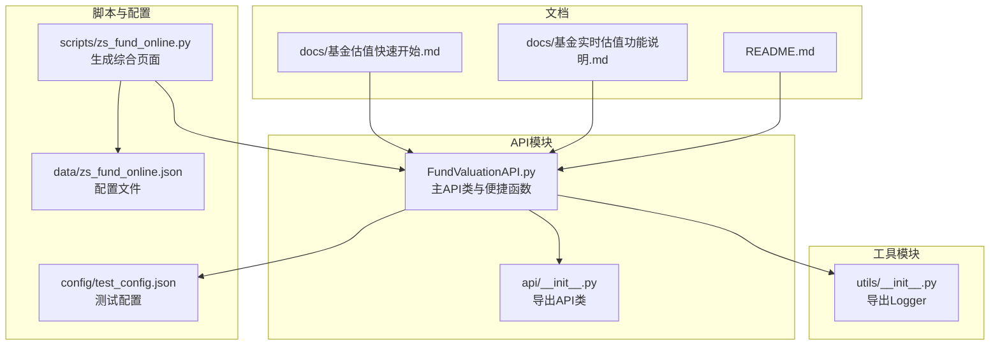
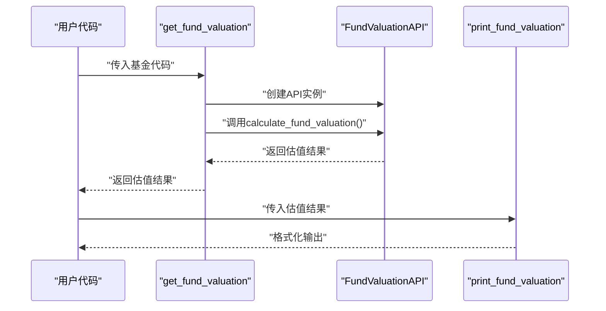
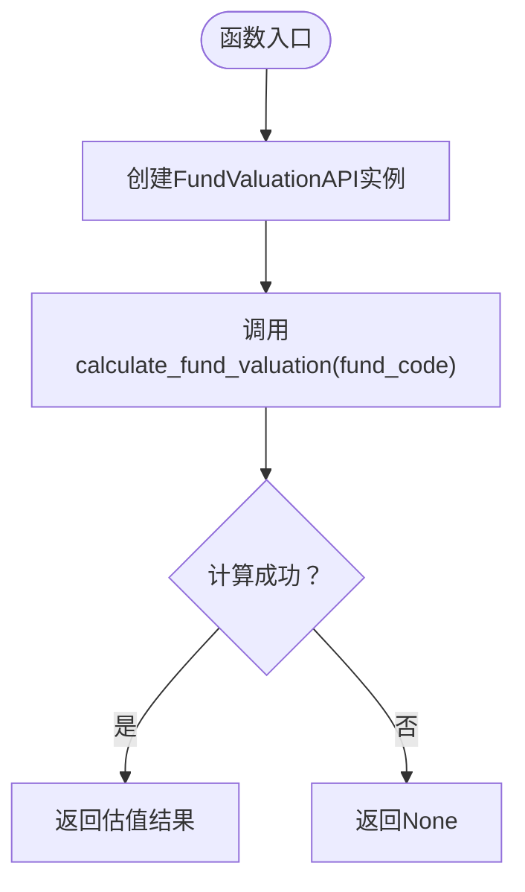
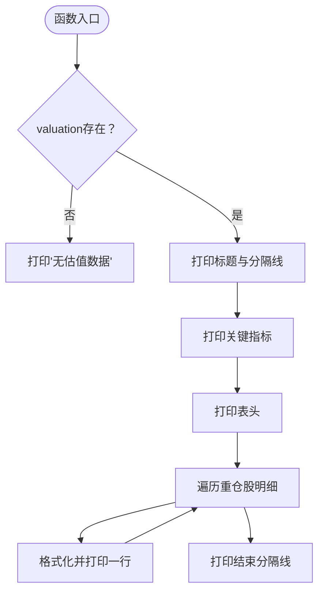
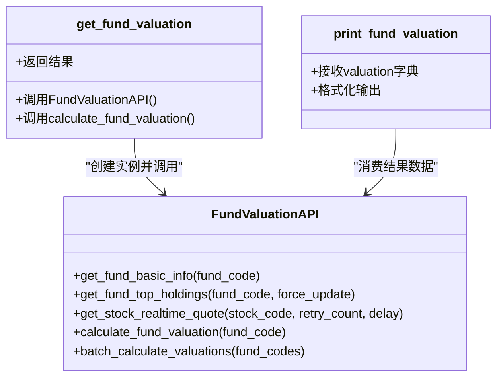
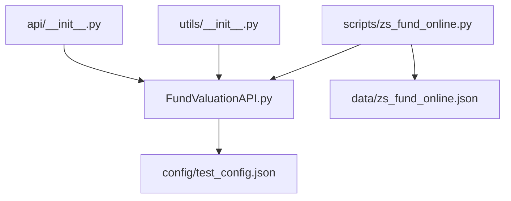

# 工具函数与便捷接口

<cite>
**本文引用的文件**
- [FundValuationAPI.py](file://api/FundValuationAPI.py)
- [__init__.py](file://api/__init__.py)
- [utils/__init__.py](file://utils/__init__.py)
- [README.md](file://README.md)
- [基金估值快速开始.md](file://docs/基金估值快速开始.md)
- [基金实时估值功能说明.md](file://docs/基金实时估值功能说明.md)
- [test_config.json](file://config/test_config.json)
- [zs_fund_online.json](file://data/zs_fund_online.json)
- [zs_fund_online.py](file://scripts/zs_fund_online.py)
</cite>

## 目录
1. [简介](#简介)
2. [项目结构](#项目结构)
3. [核心组件](#核心组件)
4. [架构概览](#架构概览)
5. [详细组件分析](#详细组件分析)
6. [依赖关系分析](#依赖关系分析)
7. [性能考量](#性能考量)
8. [故障排除指南](#故障排除指南)
9. [结论](#结论)
10. [附录](#附录)

## 简介
本文件聚焦于工具函数与便捷接口，重点解释两个核心便捷函数：
- get_fund_valuation：快速获取单个基金估值的便捷函数，简化调用流程，直接返回估值结果。
- print_fund_valuation：格式化输出函数，提供清晰的数据展示格式、布局设计和可读性优化。

文档将阐述这两个工具函数与主API类的关系与调用链路，并给出使用示例、最佳实践、错误处理、数据验证与性能考虑，以及如何根据实际需求定制输出格式与扩展功能。

## 项目结构
项目采用模块化组织，核心逻辑集中在 api/FundValuationAPI.py，工具函数位于同一文件内，便于直接导入使用；utils 提供日志工具；scripts 提供页面生成脚本；docs 提供使用说明与功能文档。

**图表来源**
- [FundValuationAPI.py](file://api/FundValuationAPI.py#L1-L537)
- [__init__.py](file://api/__init__.py#L1-L11)
- [utils/__init__.py](file://utils/__init__.py#L1-L10)
- [zs_fund_online.py](file://scripts/zs_fund_online.py#L1-L200)
- [zs_fund_online.json](file://data/zs_fund_online.json#L1-L242)
- [test_config.json](file://config/test_config.json#L1-L59)
- [README.md](file://README.md#L1-L193)
- [基金估值快速开始.md](file://docs/基金估值快速开始.md#L1-L353)
- [基金实时估值功能说明.md](file://docs/基金实时估值功能说明.md#L1-L473)

**章节来源**
- [README.md](file://README.md#L1-L193)
- [FundValuationAPI.py](file://api/FundValuationAPI.py#L1-L537)

## 核心组件
- FundValuationAPI：主API类，负责获取基金基本信息、持仓信息、股票实时行情，并计算基金估值；支持批量估值与配置文件缓存。
- get_fund_valuation：便捷函数，封装了创建API实例与调用估值计算的完整流程，适合快速获取单个基金的估值结果。
- print_fund_valuation：便捷函数，对估值结果进行格式化输出，提供清晰的标题、摘要与明细表格，增强可读性。

**章节来源**
- [FundValuationAPI.py](file://api/FundValuationAPI.py#L455-L499)

## 架构概览
便捷函数与主API类的关系如下：
- get_fund_valuation内部创建FundValuationAPI实例并调用calculate_fund_valuation，返回估值结果。
- print_fund_valuation接收calculate_fund_valuation返回的结果，按照统一格式进行打印。

**图表来源**
- [FundValuationAPI.py](file://api/FundValuationAPI.py#L455-L499)

**章节来源**
- [FundValuationAPI.py](file://api/FundValuationAPI.py#L455-L499)

## 详细组件分析

### get_fund_valuation 便捷函数
- 设计目的：简化调用流程，减少样板代码，让用户只需传入基金代码即可获得估值结果。
- 使用场景：
  - 快速查看单个基金的实时估值。
  - 在脚本或自动化任务中直接获取结果，无需显式创建API实例。
- 调用链路：get_fund_valuation -> FundValuationAPI -> calculate_fund_valuation。
- 返回值：估值结果字典，若失败返回None。

**图表来源**
- [FundValuationAPI.py](file://api/FundValuationAPI.py#L455-L467)

**章节来源**
- [FundValuationAPI.py](file://api/FundValuationAPI.py#L455-L467)
- [基金实时估值功能说明.md](file://docs/基金实时估值功能说明.md#L68-L79)

### print_fund_valuation 格式化输出函数
- 功能特性：
  - 标题与分割线：使用等宽分隔线突出主题，包含基金名称与代码。
  - 关键指标：展示上次净值、估算净值、估算涨跌幅、估算时间、重仓股数量与合计持仓比例。
  - 明细表格：列头包含股票代码、名称、持仓比例、最新价、涨跌幅、贡献度，逐行打印重仓股明细。
  - 可读性优化：对齐格式、符号对齐（正负号）、固定宽度列，便于快速浏览。
- 输出格式定制：
  - 可通过修改print_fund_valuation内部的字符串格式化部分实现自定义布局。
  - 若需要导出到文件或HTML，可将输出逻辑抽象为模板渲染或写入函数。

**图表来源**
- [FundValuationAPI.py](file://api/FundValuationAPI.py#L470-L499)

**章节来源**
- [FundValuationAPI.py](file://api/FundValuationAPI.py#L470-L499)
- [基金实时估值功能说明.md](file://docs/基金实时估值功能说明.md#L81-L98)

### 与主API类的关系与调用链路
- get_fund_valuation依赖FundValuationAPI类的calculate_fund_valuation方法，后者负责完整的数据获取与计算流程。
- print_fund_valuation不依赖API类，仅消费calculate_fund_valuation返回的数据结构，因此可独立于API类使用。
- 在批量场景下，用户可直接使用FundValuationAPI.batch_calculate_valuations获取多只基金的估值，再对每个结果调用print_fund_valuation进行格式化输出。

**图表来源**
- [FundValuationAPI.py](file://api/FundValuationAPI.py#L455-L499)

**章节来源**
- [FundValuationAPI.py](file://api/FundValuationAPI.py#L455-L499)

## 依赖关系分析
- 导出关系：api/__init__.py导出FundValuationAPI与KLineAPI，便于外部导入。
- 工具依赖：便捷函数位于FundValuationAPI.py内，直接依赖该模块内的API类与日志工具。
- 配置依赖：批量计算时可通过配置文件指定基金列表与用户持仓，影响最终输出与计算结果。

**图表来源**
- [__init__.py](file://api/__init__.py#L1-L11)
- [utils/__init__.py](file://utils/__init__.py#L1-L10)
- [FundValuationAPI.py](file://api/FundValuationAPI.py#L1-L537)
- [zs_fund_online.py](file://scripts/zs_fund_online.py#L1-L200)
- [zs_fund_online.json](file://data/zs_fund_online.json#L1-L242)
- [test_config.json](file://config/test_config.json#L1-L59)

**章节来源**
- [__init__.py](file://api/__init__.py#L1-L11)
- [utils/__init__.py](file://utils/__init__.py#L1-L10)
- [FundValuationAPI.py](file://api/FundValuationAPI.py#L1-L537)
- [zs_fund_online.py](file://scripts/zs_fund_online.py#L1-L200)
- [zs_fund_online.json](file://data/zs_fund_online.json#L1-L242)
- [test_config.json](file://config/test_config.json#L1-L59)

## 性能考量
- 并发优化：FundValuationAPI.calculate_fund_valuation内部使用线程池并发获取股票实时行情，最大5个线程，显著提升批量请求效率。
- 请求重试与延迟：股票行情获取支持重试与递增延迟，降低请求失败概率。
- 超时控制：各HTTP请求设置合理超时时间，避免阻塞。
- 缓存策略：优先使用配置文件中的持仓数据，减少网络请求；支持强制更新以保证数据新鲜度。

**章节来源**
- [FundValuationAPI.py](file://api/FundValuationAPI.py#L315-L426)
- [FundValuationAPI.py](file://api/FundValuationAPI.py#L254-L314)
- [README.md](file://README.md#L155-L156)

## 故障排除指南
- 常见问题与解决：
  - 获取不到持仓数据：检查基金代码是否正确，确认该基金存在公开持仓信息。
  - 估值为空：检查网络连接，确认数据源可用；查看日志文件定位具体错误。
  - 持仓股票很少：解析失败或数据源结构变化，查看日志并检查备用解析方案。
  - 估值不准确：持仓数据可能存在滞后，等待季报更新；仅基于前十大重仓股计算，不包含全部持仓。
- 调试模式：可将日志级别调整为debug以获取更详细的日志信息，便于排查问题。

**章节来源**
- [基金实时估值功能说明.md](file://docs/基金实时估值功能说明.md#L410-L428)
- [FundValuationAPI.py](file://api/FundValuationAPI.py#L63-L86)

## 结论
便捷函数get_fund_valuation与print_fund_valuation有效简化了用户的使用流程，前者专注于“快速获取”，后者专注于“格式化展示”。它们与主API类形成清晰的职责分离：API类负责复杂的数据获取与计算，便捷函数负责简化调用与美化输出。配合合理的错误处理、日志记录与缓存策略，能够在保证性能的同时提供良好的用户体验。

## 附录

### 使用示例与最佳实践
- 快速查看单个基金：
  - 使用get_fund_valuation获取估值结果，再调用print_fund_valuation进行格式化输出。
- 对比多个基金：
  - 使用FundValuationAPI.batch_calculate_valuations获取批量结果，按估算涨跌幅排序后输出。
- 保存到CSV：
  - 将批量结果写入CSV文件，便于后续分析与归档。
- 定时监控：
  - 使用定时任务定期调用批量计算，并对大幅波动的基金发出提醒。

**章节来源**
- [基金估值快速开始.md](file://docs/基金估值快速开始.md#L57-L117)
- [FundValuationAPI.py](file://api/FundValuationAPI.py#L501-L537)

### 错误处理与数据验证
- 错误处理：
  - get_fund_valuation返回None时，应进行判空处理并给出友好提示。
  - print_fund_valuation对空输入进行保护，避免异常。
- 数据验证：
  - 基金代码格式验证（6位数字）。
  - 持仓比例总和验证（超过100%警告）。
  - 联网验证基金是否存在。

**章节来源**
- [FundValuationAPI.py](file://api/FundValuationAPI.py#L477-L479)
- [README.md](file://README.md#L163-L167)

### 性能优化建议
- 合理设置请求间隔，避免过于频繁请求。
- 使用缓存策略减少网络请求，提高响应速度。
- 批量处理时利用并发线程池，但注意不要超过数据源的承受能力。

**章节来源**
- [README.md](file://README.md#L175-L179)
- [FundValuationAPI.py](file://api/FundValuationAPI.py#L367-L369)

### 定制输出格式与扩展功能
- 定制输出格式：
  - 修改print_fund_valuation内部的字符串格式化，调整列宽、对齐方式与显示字段。
  - 将输出逻辑抽象为模板渲染或写入函数，支持导出到HTML、Markdown或CSV。
- 扩展功能：
  - 在FundValuationAPI中增加更多指标（如成交量、市盈率等）。
  - 支持更多数据源与解析规则，提升兼容性。
  - 增加邮件或消息推送功能，对大幅波动的基金进行提醒。

**章节来源**
- [FundValuationAPI.py](file://api/FundValuationAPI.py#L470-L499)
- [基金实时估值功能说明.md](file://docs/基金实时估值功能说明.md#L323-L339)