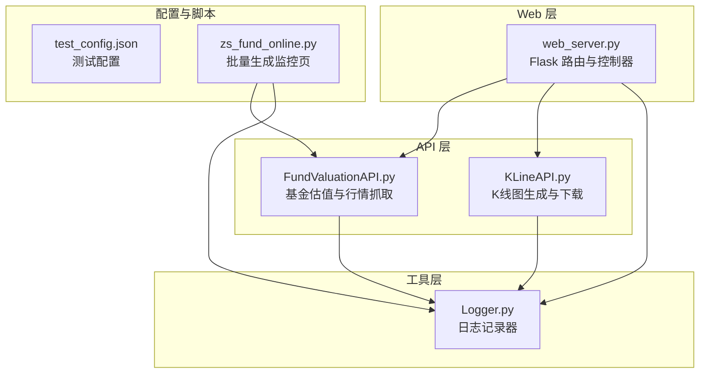
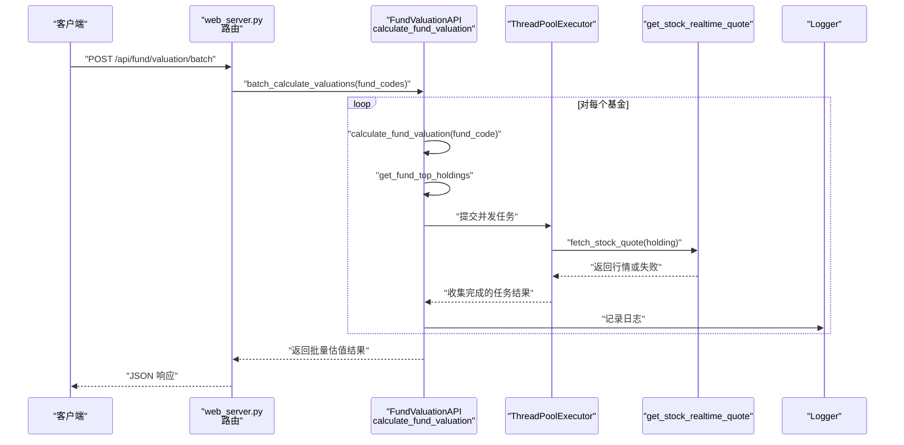
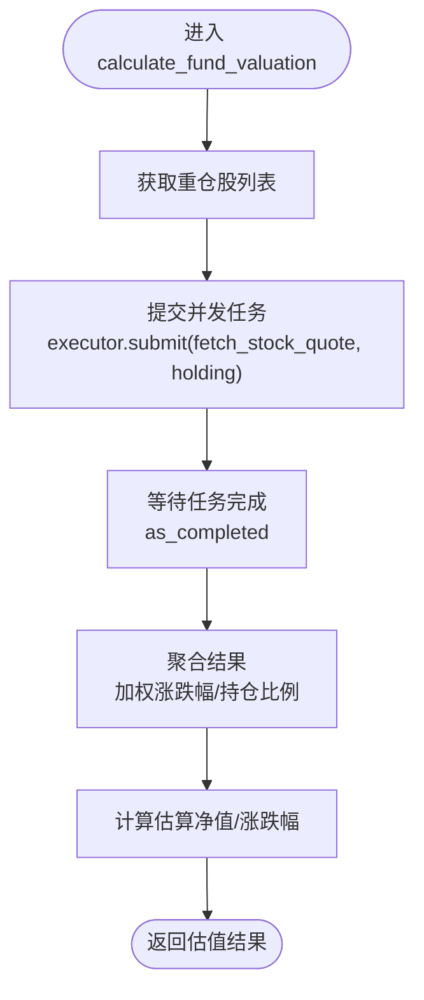
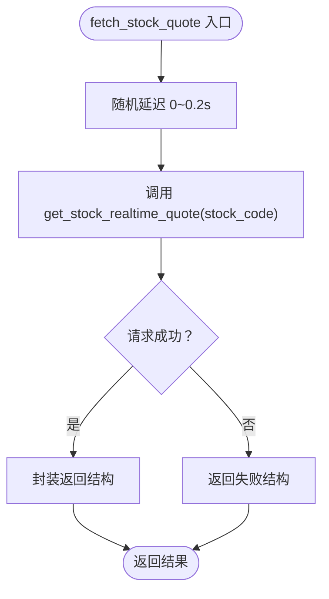
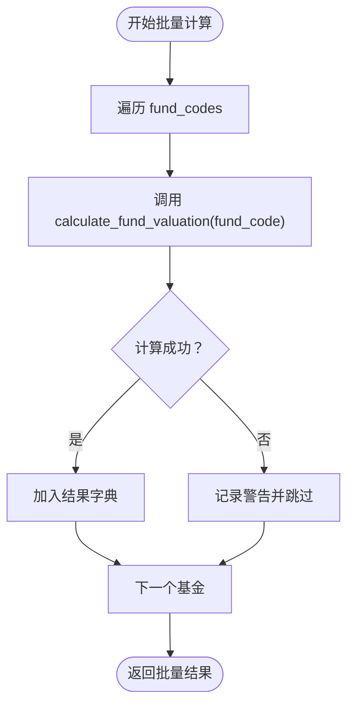
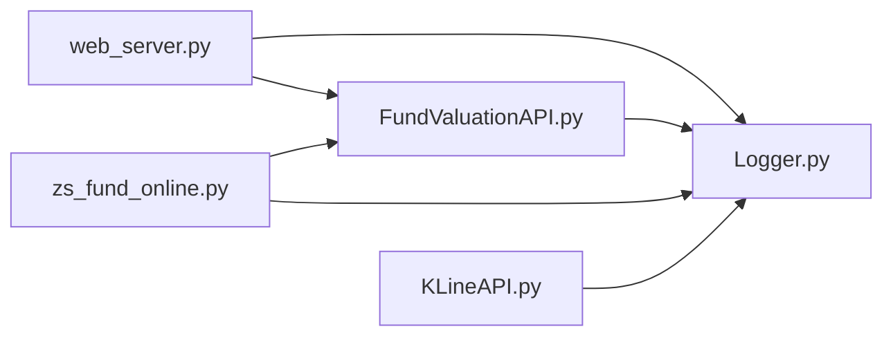

# 并发处理机制

<cite>
**本文引用的文件**
- [web_server.py](file://web_server.py)
- [FundValuationAPI.py](file://api/FundValuationAPI.py)
- [KLineAPI.py](file://api/KLineAPI.py)
- [Logger.py](file://utils/Logger.py)
- [README.md](file://README.md)
- [test_config.json](file://config/test_config.json)
- [zs_fund_online.py](file://scripts/zs_fund_online.py)
</cite>

## 目录
1. [简介](#简介)
2. [项目结构](#项目结构)
3. [核心组件](#核心组件)
4. [架构总览](#架构总览)
5. [详细组件分析](#详细组件分析)
6. [依赖关系分析](#依赖关系分析)
7. [性能考量](#性能考量)
8. [故障排查指南](#故障排查指南)
9. [结论](#结论)
10. [附录](#附录)

## 简介
本文件聚焦于项目中的并发处理机制，围绕以下目标展开：
- ThreadPoolExecutor 的使用方式、线程池配置参数与并发控制策略
- fetch_stock_quote 内部函数的设计思路（线程安全、资源竞争规避、性能优化）
- 批量计算 batch_calculate_valuations 的实现原理（任务分配、结果收集、错误处理）
- 随机延迟机制的作用与实现，以及请求频率与响应速度的平衡
- 并发性能调优建议与最佳实践

## 项目结构
该项目采用“Web 服务 + API 封装 + 工具模块”的分层组织方式，其中并发处理主要体现在 API 层的股票行情并发抓取与批量估值计算中。

**图表来源**
- [web_server.py](file://web_server.py#L1-L582)
- [FundValuationAPI.py](file://api/FundValuationAPI.py#L1-L537)
- [KLineAPI.py](file://api/KLineAPI.py#L1-L345)
- [Logger.py](file://utils/Logger.py#L1-L86)
- [test_config.json](file://config/test_config.json#L1-L59)
- [zs_fund_online.py](file://scripts/zs_fund_online.py#L1-L281)

**章节来源**
- [web_server.py](file://web_server.py#L1-L582)
- [FundValuationAPI.py](file://api/FundValuationAPI.py#L1-L537)
- [KLineAPI.py](file://api/KLineAPI.py#L1-L345)
- [Logger.py](file://utils/Logger.py#L1-L86)
- [test_config.json](file://config/test_config.json#L1-L59)
- [zs_fund_online.py](file://scripts/zs_fund_online.py#L1-L281)

## 核心组件
- 线程池执行器：在基金估值计算中使用 ThreadPoolExecutor 进行并发抓取股票行情，限制并发度以平衡吞吐与稳定性。
- fetch_stock_quote 内部函数：封装单只股票行情获取逻辑，包含随机延迟与重试机制，避免集中请求导致的限流或失败。
- 批量计算 batch_calculate_valuations：遍历基金列表顺序计算，内部仍使用线程池并发抓取每只重仓股行情，实现“外层串行、内层并发”的混合模式。
- 随机延迟与退避：在请求间引入随机延迟与指数退避，降低请求峰值，提高成功率与稳定性。
- 日志与错误处理：统一的日志记录器与异常捕获，便于定位并发场景下的问题。

**章节来源**
- [FundValuationAPI.py](file://api/FundValuationAPI.py#L345-L426)
- [FundValuationAPI.py](file://api/FundValuationAPI.py#L427-L452)
- [FundValuationAPI.py](file://api/FundValuationAPI.py#L254-L314)
- [Logger.py](file://utils/Logger.py#L1-L86)

## 架构总览
下图展示了 Web 请求到并发抓取再到结果聚合的整体流程。

**图表来源**
- [web_server.py](file://web_server.py#L183-L226)
- [FundValuationAPI.py](file://api/FundValuationAPI.py#L427-L452)
- [FundValuationAPI.py](file://api/FundValuationAPI.py#L315-L426)
- [FundValuationAPI.py](file://api/FundValuationAPI.py#L254-L314)
- [Logger.py](file://utils/Logger.py#L1-L86)

## 详细组件分析

### ThreadPoolExecutor 使用与线程池配置
- 并发入口：在 calculate_fund_valuation 中，针对每只重仓股创建并发任务，使用 ThreadPoolExecutor 控制并发度。
- 线程池大小：max_workers=5，兼顾吞吐与资源占用，避免过度并发导致外部接口限流或自身内存压力。
- 任务提交：executor.submit(fetch_stock_quote, holding)，将每个持仓项作为独立任务提交。
- 结果收集：使用 as_completed 按完成顺序收集结果，保证响应及时性。
- 资源释放：with 上下文确保线程池在任务完成后正确关闭。

**图表来源**
- [FundValuationAPI.py](file://api/FundValuationAPI.py#L345-L426)

**章节来源**
- [FundValuationAPI.py](file://api/FundValuationAPI.py#L345-L426)

### fetch_stock_quote 设计思路与线程安全
- 单任务职责单一：fetch_stock_quote 接收单个持仓项，负责该持仓对应的股票行情抓取与包装。
- 线程安全考虑：
  - 使用独立的会话对象（requests.Session）在 API 类中共享，避免全局状态污染。
  - 每个线程内的局部变量（如 stock_code、position_ratio）不共享，天然线程安全。
  - 日志记录器在各模块中独立初始化，避免跨线程共享状态。
- 资源竞争规避：
  - 在任务内部引入随机延迟（0~0.2秒），避免多个线程在同一时刻发起请求，降低集中请求风险。
  - 外层线程池限制并发度，防止过多线程争抢网络连接或外部接口配额。
- 性能优化技巧：
  - 使用 as_completed 按完成顺序收集结果，减少整体等待时间。
  - 对于失败任务，返回结构化失败信息，便于上层聚合与统计。
  - 重试机制与退避策略在 get_stock_realtime_quote 中实现，降低偶发失败的影响。

**图表来源**
- [FundValuationAPI.py](file://api/FundValuationAPI.py#L349-L366)
- [FundValuationAPI.py](file://api/FundValuationAPI.py#L254-L314)

**章节来源**
- [FundValuationAPI.py](file://api/FundValuationAPI.py#L349-L366)
- [FundValuationAPI.py](file://api/FundValuationAPI.py#L254-L314)

### 批量计算 batch_calculate_valuations 实现原理
- 外层串行：遍历基金列表，逐个调用 calculate_fund_valuation，保证顺序与可追踪性。
- 内层并发：在每个基金的估值计算中，使用线程池并发抓取重仓股行情，提升单基金处理效率。
- 结果收集：将成功计算的基金估值放入字典，键为基金代码，值为估值结果；失败的基金计入日志但不影响整体流程。
- 错误处理：对单个基金的失败进行记录与跳过，保证批量任务的鲁棒性。

**图表来源**
- [FundValuationAPI.py](file://api/FundValuationAPI.py#L427-L452)

**章节来源**
- [FundValuationAPI.py](file://api/FundValuationAPI.py#L427-L452)

### 随机延迟机制与请求频率平衡
- 作用：降低请求峰值，避免短时间内大量并发请求被外部接口限流或触发风控。
- 实现方式：
  - 任务内部随机延迟：fetch_stock_quote 内部引入 0~0.2 秒的随机延迟，使各线程错峰请求。
  - 重试退避：get_stock_realtime_quote 中对每次重试增加延迟，避免连续失败导致的雪崩效应。
- 平衡策略：
  - 并发度（max_workers）与延迟参数需结合外部接口的限流策略与自身资源情况调整。
  - 对于高延迟或不稳定网络环境，可适当增大延迟或减少并发度。

**章节来源**
- [FundValuationAPI.py](file://api/FundValuationAPI.py#L354-L355)
- [FundValuationAPI.py](file://api/FundValuationAPI.py#L254-L314)

### Web 层集成与批量估值 API
- Web 路由：/api/fund/valuation/batch 接收基金代码数组，调用 FundValuationAPI.batch_calculate_valuations。
- 结果增强：在 Web 层根据用户配置（user_positions）补充持仓金额、持仓比例与单日盈亏等信息，再统一返回给前端。
- 错误处理：统一捕获异常并返回结构化错误信息，便于前端展示与调试。

**章节来源**
- [web_server.py](file://web_server.py#L183-L226)

## 依赖关系分析
- web_server.py 依赖 FundValuationAPI 进行估值计算，并通过 Logger 记录运行日志。
- FundValuationAPI 依赖 requests.Session 进行 HTTP 请求，依赖 Logger 记录日志。
- KLineAPI 也依赖 requests.Session 与 Logger，但未直接参与并发抓取。
- 脚本 zs_fund_online.py 直接调用 FundValuationAPI.batch_calculate_valuations 生成静态监控页。

**图表来源**
- [web_server.py](file://web_server.py#L1-L582)
- [FundValuationAPI.py](file://api/FundValuationAPI.py#L1-L537)
- [KLineAPI.py](file://api/KLineAPI.py#L1-L345)
- [Logger.py](file://utils/Logger.py#L1-L86)
- [zs_fund_online.py](file://scripts/zs_fund_online.py#L1-L281)

**章节来源**
- [web_server.py](file://web_server.py#L1-L582)
- [FundValuationAPI.py](file://api/FundValuationAPI.py#L1-L537)
- [KLineAPI.py](file://api/KLineAPI.py#L1-L345)
- [Logger.py](file://utils/Logger.py#L1-L86)
- [zs_fund_online.py](file://scripts/zs_fund_online.py#L1-L281)

## 性能考量
- 并发度选择：max_workers=5 在多数场景下能显著提升吞吐，同时避免过度并发导致的失败率上升。可根据网络环境与外部接口限流策略动态调整。
- 随机延迟与退避：有效降低请求峰值，提高成功率；建议在高峰期适当增大延迟范围或减少并发度。
- 结果收集策略：as_completed 按完成顺序收集，有利于缩短首包时间；若需要严格按输入顺序返回，可改为 futures.as_completed 并排序。
- 超时与重试：get_stock_realtime_quote 的超时与重试参数需与外部接口 SLA 匹配，避免因单点超时拖慢整体。
- 日志开销：在高并发场景下，日志输出可能成为瓶颈，建议在生产环境中降低日志级别或启用异步日志。

[本节为通用性能建议，不直接分析具体文件]

## 故障排查指南
- 并发失败与超时
  - 现象：部分股票行情获取失败或超时。
  - 排查：检查 get_stock_realtime_quote 的超时与重试参数设置；确认外部接口状态；观察日志中是否有“HTTP 非 200”或“返回 HTML 非 JSON”的提示。
- 请求限流
  - 现象：短时间内大量失败或被拒绝。
  - 排查：检查随机延迟与并发度设置；适当降低 max_workers 或增大延迟范围。
- 结果不一致
  - 现象：不同时间多次计算结果差异较大。
  - 排查：确认外部接口数据更新频率；检查 get_fund_top_holdings 的缓存策略与强制更新逻辑。
- 日志定位
  - 使用 Logger 统一记录 INFO/ERROR 级别日志，结合日志文件定位具体失败任务与错误原因。

**章节来源**
- [FundValuationAPI.py](file://api/FundValuationAPI.py#L88-L134)
- [FundValuationAPI.py](file://api/FundValuationAPI.py#L165-L214)
- [FundValuationAPI.py](file://api/FundValuationAPI.py#L254-L314)
- [Logger.py](file://utils/Logger.py#L1-L86)

## 结论
本项目在并发处理方面采用了“外层串行、内层并发”的混合策略：外层对多个基金进行顺序处理，内层对每只重仓股使用固定规模的线程池并发抓取行情。通过随机延迟与退避重试机制，有效降低了请求峰值与失败率；通过 as_completed 的结果收集策略，提升了整体响应速度。配合统一的日志记录与健壮的错误处理，系统在保证稳定性的同时实现了较好的性能表现。

[本节为总结性内容，不直接分析具体文件]

## 附录
- 相关文档与特性说明
  - README 中明确指出“使用 ThreadPoolExecutor 并发获取股票行情，5线程并发处理，性能提升5倍”，体现了并发优化的核心价值。
  - 项目结构说明文档中提到“并发优化（ThreadPoolExecutor 5线程）”。

**章节来源**
- [README.md](file://README.md#L155-L156)
- [README.md](file://README.md#L105-L105)