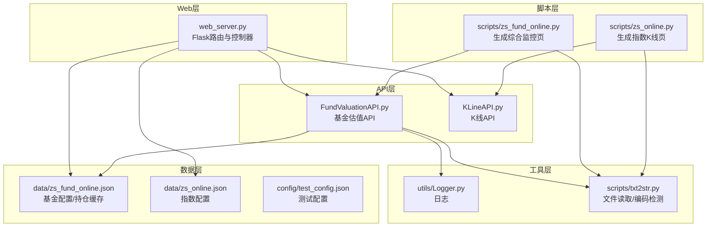
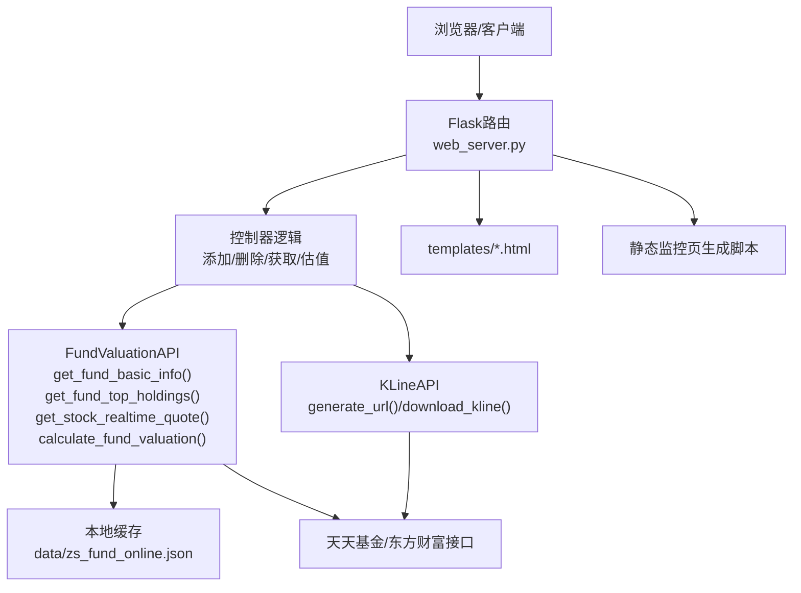
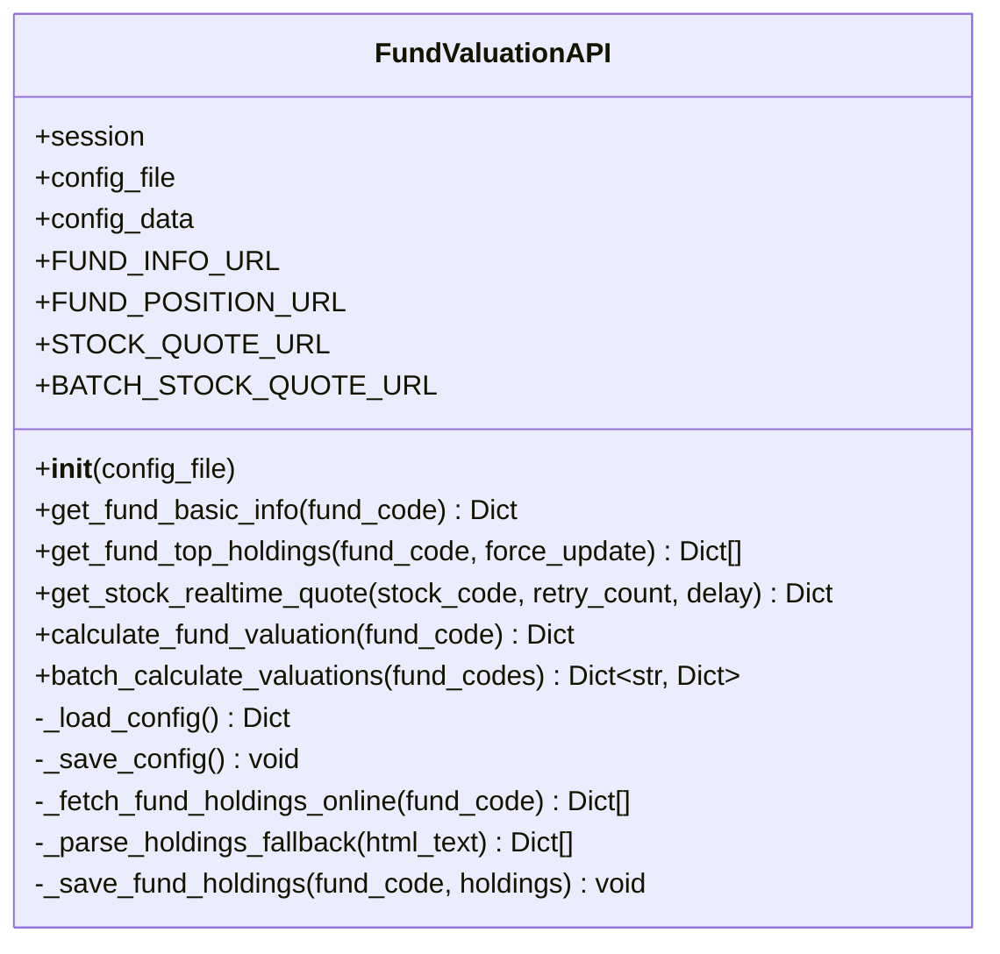
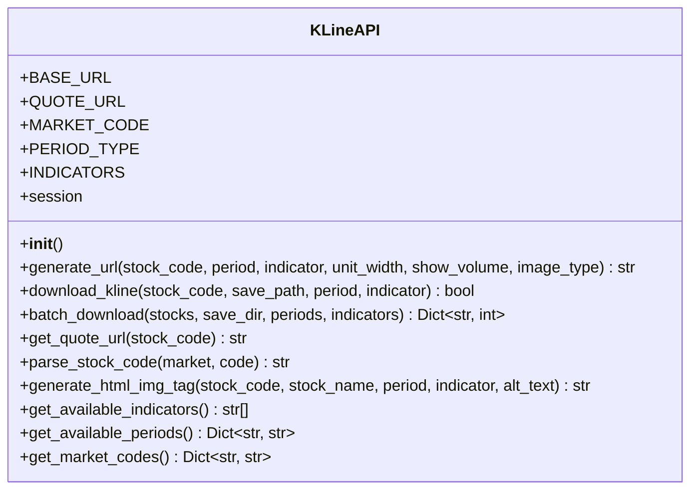
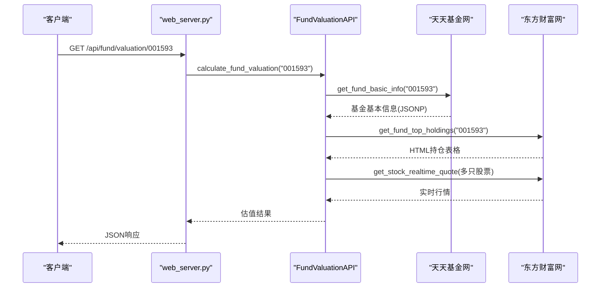
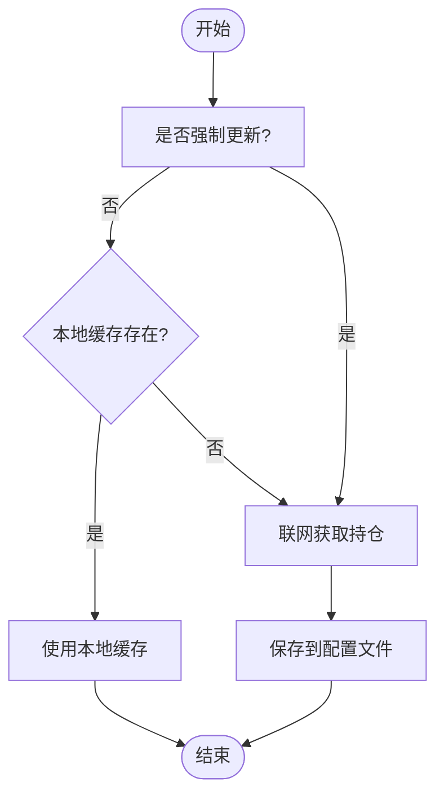
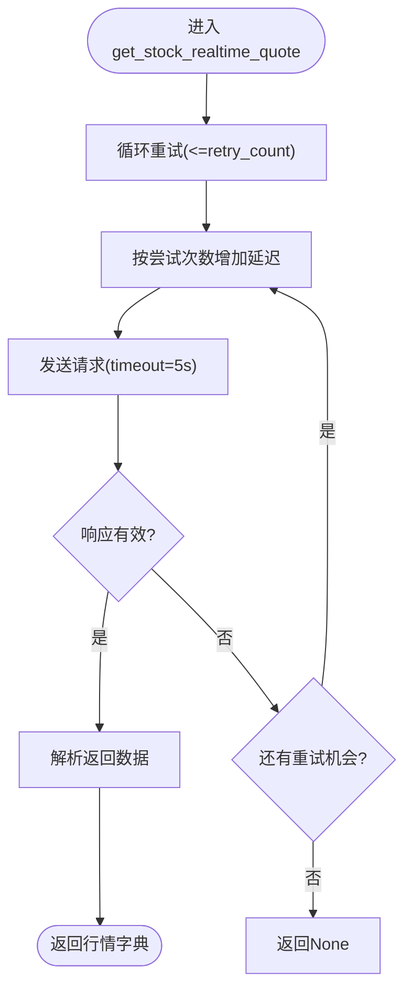
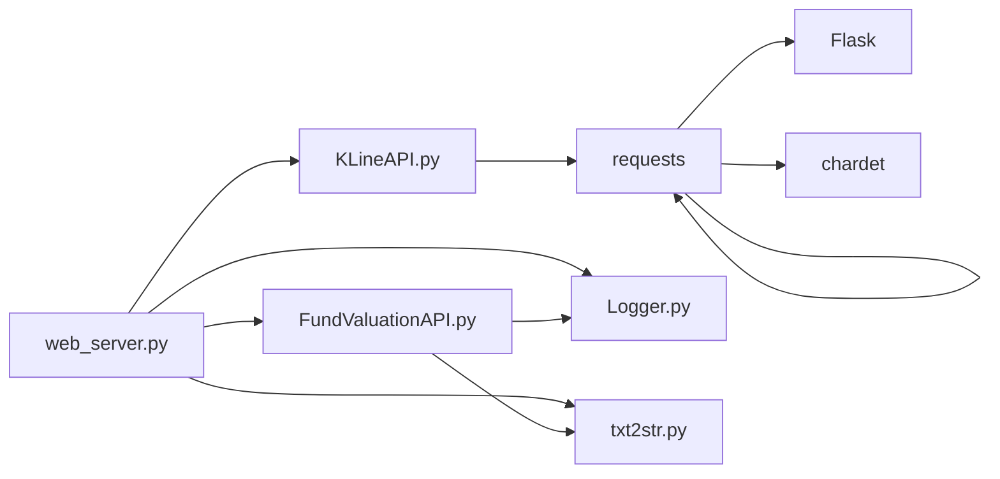

# 数据源集成与处理

<cite>
**本文引用的文件**
- [README.md](file://README.md)
- [web_server.py](file://web_server.py)
- [FundValuationAPI.py](file://api/FundValuationAPI.py)
- [KLineAPI.py](file://api/KLineAPI.py)
- [Logger.py](file://utils/Logger.py)
- [txt2str.py](file://scripts/txt2str.py)
- [zs_fund_online.py](file://scripts/zs_fund_online.py)
- [zs_online.py](file://scripts/zs_online.py)
- [test_config.json](file://config/test_config.json)
- [requirements.txt](file://requirements.txt)
- [zs_fund_online.json](file://data/zs_fund_online.json)
- [zs_online.json](file://data/zs_online.json)
</cite>

## 目录
1. [简介](#简介)
2. [项目结构](#项目结构)
3. [核心组件](#核心组件)
4. [架构总览](#架构总览)
5. [详细组件分析](#详细组件分析)
6. [依赖关系分析](#依赖关系分析)
7. [性能考量](#性能考量)
8. [故障排查指南](#故障排查指南)
9. [结论](#结论)
10. [附录](#附录)

## 简介
本项目是一个基于Flask的Web应用，提供基金实时估值监控与股票K线图查询功能。数据源主要来自：
- 基金基本信息与估值：天天基金网（fundgz.1234567.com.cn）
- 基金持仓信息：东方财富网（fundf10.eastmoney.com）
- 股票实时行情：东方财富网（push2.eastmoney.com）
- K线图：东方财富网（webquoteklinepic.eastmoney.com）

系统支持：
- 基金列表管理、预览-确认添加机制
- 基金前十大重仓股实时行情并发抓取与估值计算
- 股票/指数K线图生成与下载
- 配置文件管理与本地缓存
- 日志记录与错误处理

## 项目结构
项目采用“模块化+脚本化”的组织方式：
- api：核心业务API模块（基金估值、K线）
- utils：通用工具（日志）
- scripts：数据生成与脚本工具
- data：配置与数据文件
- config：测试配置
- templates/docs：前端模板与文档
- tests：单元测试

**图表来源**
- [web_server.py](file://web_server.py#L1-L582)
- [FundValuationAPI.py](file://api/FundValuationAPI.py#L1-L537)
- [KLineAPI.py](file://api/KLineAPI.py#L1-L345)
- [Logger.py](file://utils/Logger.py#L1-L86)
- [txt2str.py](file://scripts/txt2str.py#L1-L108)
- [zs_fund_online.py](file://scripts/zs_fund_online.py#L1-L281)
- [zs_online.py](file://scripts/zs_online.py#L1-L79)
- [zs_fund_online.json](file://data/zs_fund_online.json#L1-L1356)
- [zs_online.json](file://data/zs_online.json#L1-L58)

**章节来源**
- [README.md](file://README.md#L1-L193)
- [web_server.py](file://web_server.py#L1-L582)

## 核心组件
- FundValuationAPI：负责基金基本信息、持仓信息获取与估值计算；支持本地缓存与并发行情抓取。
- KLineAPI：负责K线图URL生成、图片下载与批量处理。
- Logger：统一日志记录，支持文件轮转。
- txt2str：配置文件读取与编码检测。
- web_server：Flask路由与业务编排，调用API并返回JSON响应。
- 脚本工具：生成静态监控页与指数K线页。

**章节来源**
- [FundValuationAPI.py](file://api/FundValuationAPI.py#L27-L537)
- [KLineAPI.py](file://api/KLineAPI.py#L15-L345)
- [Logger.py](file://utils/Logger.py#L6-L86)
- [txt2str.py](file://scripts/txt2str.py#L1-L108)
- [web_server.py](file://web_server.py#L1-L582)

## 架构总览
系统采用三层架构：
- 表现层：Flask路由与模板渲染
- 业务层：API模块封装数据源与计算逻辑
- 数据层：本地JSON配置文件与临时HTML输出

**图表来源**
- [web_server.py](file://web_server.py#L100-L582)
- [FundValuationAPI.py](file://api/FundValuationAPI.py#L88-L537)
- [KLineAPI.py](file://api/KLineAPI.py#L69-L345)
- [zs_fund_online.py](file://scripts/zs_fund_online.py#L180-L281)

## 详细组件分析

### FundValuationAPI 组件
职责与能力：
- 基金基本信息获取：调用天天基金网JS接口，解析JSONP，提取净值、估值、涨跌幅等字段。
- 基金前十大重仓股获取：从东方财富网HTML中解析表格，支持备用解析规则。
- 股票实时行情获取：调用东方财富推送接口，带重试与延迟控制。
- 估值计算：并发抓取重仓股行情，按持仓比例加权估算涨跌幅与净值。
- 本地缓存：优先读取配置文件中的持仓数据，未命中或强制更新时联网抓取并保存。

关键方法与流程：
- get_fund_basic_info：构造URL，校验响应类型，解析JSONP，返回标准化字典。
- get_fund_top_holdings：优先本地缓存，否则联网抓取并保存；支持force_update。
- get_stock_realtime_quote：带重试与延迟，构造secid，解析返回字段。
- calculate_fund_valuation：获取基本信息与持仓，线程池并发抓取行情，加权计算估值。
- 批量估值：batch_calculate_valuations，遍历列表逐个计算。

**图表来源**
- [FundValuationAPI.py](file://api/FundValuationAPI.py#L27-L537)

**章节来源**
- [FundValuationAPI.py](file://api/FundValuationAPI.py#L88-L537)

### KLineAPI 组件
职责与能力：
- 生成K线图URL：根据代码、周期、指标、单位宽度等参数拼接URL。
- 下载K线图：支持单张与批量下载，自动创建目录。
- HTML标签生成：生成img标签便于嵌入页面。
- 市场代码映射与周期/指标常量：提供便捷查询。

**图表来源**
- [KLineAPI.py](file://api/KLineAPI.py#L15-L345)

**章节来源**
- [KLineAPI.py](file://api/KLineAPI.py#L69-L345)

### web_server 路由与业务编排
- 配置管理：GET/POST /api/config，读取与保存配置文件。
- 基金管理：预览、添加、删除、更新持仓与用户持仓金额。
- 估值接口：GET /api/fund/valuation/<fund_code>、POST /api/fund/valuation/batch。
- 持仓接口：GET /api/fund/holdings/<fund_code>，支持force_update。
- K线接口：POST /api/kline/url（便捷函数在KLineAPI中）。
- 监控页：生成静态监控页与查看生成结果。

**图表来源**
- [web_server.py](file://web_server.py#L160-L181)
- [FundValuationAPI.py](file://api/FundValuationAPI.py#L315-L426)

**章节来源**
- [web_server.py](file://web_server.py#L66-L582)

### 数据缓存策略与本地存储
- 本地缓存位置：data/zs_fund_online.json 中的 fund_holdings 字段。
- 读取优先级：若未强制更新且本地存在，则优先使用缓存。
- 写入策略：联网获取成功后，保存到配置文件并记录更新时间。
- 配置文件结构：包含 fund_list、user_positions、fund_holdings 等键。

**图表来源**
- [FundValuationAPI.py](file://api/FundValuationAPI.py#L135-L163)
- [FundValuationAPI.py](file://api/FundValuationAPI.py#L235-L252)
- [zs_fund_online.json](file://data/zs_fund_online.json#L239-L239)

**章节来源**
- [FundValuationAPI.py](file://api/FundValuationAPI.py#L135-L252)
- [zs_fund_online.json](file://data/zs_fund_online.json#L192-L238)

### 错误处理、重试机制与超时控制
- FundValuationAPI：
  - get_fund_basic_info：校验HTTP状态码与Content-Type，解析JSONP失败时返回None。
  - get_fund_top_holdings：备用解析规则，失败返回None。
  - get_stock_realtime_quote：带重试与延迟，异常捕获后返回None。
  - calculate_fund_valuation：异常捕获并记录日志，返回None。
- web_server：对各路由异常捕获，返回统一JSON结构。
- Logger：统一日志记录，支持文件轮转。

**图表来源**
- [FundValuationAPI.py](file://api/FundValuationAPI.py#L254-L313)

**章节来源**
- [FundValuationAPI.py](file://api/FundValuationAPI.py#L100-L133)
- [FundValuationAPI.py](file://api/FundValuationAPI.py#L185-L214)
- [FundValuationAPI.py](file://api/FundValuationAPI.py#L254-L313)
- [web_server.py](file://web_server.py#L134-L139)
- [Logger.py](file://utils/Logger.py#L12-L56)

### 数据格式转换与编码处理
- 配置文件读取：scripts/txt2str.py 使用chardet自动检测编码，失败回退到gbk。
- JSON解析：统一使用json.loads，异常时记录错误并退出。
- 字符串/数值转换：提供辅助函数（is_num、try2float、try2int）。

**章节来源**
- [txt2str.py](file://scripts/txt2str.py#L17-L108)

### API端点定义与请求参数
- 基金相关
  - GET /api/fund/list：获取基金列表与基本信息
  - GET /api/fund/preview/<fund_code>：预览基金持仓（强制联网）
  - GET /api/fund/holdings/<fund_code>?force_update=false：获取持仓，支持强制更新
  - PUT /api/fund/holdings/<fund_code>：更新持仓
  - POST /api/fund/add：添加基金（预览-确认）
  - DELETE /api/fund/remove/<fund_code>：移除基金
  - PUT /api/fund/position/<fund_code>：更新用户持仓金额
  - GET /api/fund/valuation/<fund_code>：单个基金估值
  - POST /api/fund/valuation/batch：批量估值
- 估值相关
  - GET /api/valuation/batch：批量估值（web_server聚合）
- K线相关
  - POST /api/kline/url：生成K线图URL（便捷函数在KLineAPI中）

**章节来源**
- [README.md](file://README.md#L132-L149)
- [web_server.py](file://web_server.py#L105-L582)

## 依赖关系分析
- 运行时依赖：Flask、requests、chardet
- 模块间依赖：
  - web_server 依赖 FundValuationAPI、KLineAPI、Logger、txt2str
  - FundValuationAPI 依赖 requests、re、json、datetime、Logger
  - KLineAPI 依赖 requests、typing、datetime、os
  - scripts/txt2str 依赖 chardet、json、os

**图表来源**
- [requirements.txt](file://requirements.txt#L1-L4)
- [web_server.py](file://web_server.py#L9-L18)
- [FundValuationAPI.py](file://api/FundValuationAPI.py#L10-L21)
- [KLineAPI.py](file://api/KLineAPI.py#L9-L12)

**章节来源**
- [requirements.txt](file://requirements.txt#L1-L4)
- [web_server.py](file://web_server.py#L9-L18)
- [FundValuationAPI.py](file://api/FundValuationAPI.py#L10-L21)
- [KLineAPI.py](file://api/KLineAPI.py#L9-L12)

## 性能考量
- 并发优化：FundValuationAPI 在估值计算中使用线程池并发抓取重仓股行情，最大5线程，降低总耗时。
- 请求节流：每只股票请求前随机延迟0-0.2秒，避免同时请求。
- 缓存优先：优先使用本地缓存，减少网络请求。
- 超时控制：HTTP请求设置timeout，防止阻塞。
- 批量处理：提供批量估值与K线批量下载，提高效率。

**章节来源**
- [FundValuationAPI.py](file://api/FundValuationAPI.py#L346-L392)
- [FundValuationAPI.py](file://api/FundValuationAPI.py#L268-L312)
- [KLineAPI.py](file://api/KLineAPI.py#L151-L194)

## 故障排查指南
- 基金基本信息获取失败
  - 检查HTTP状态码与Content-Type，确认返回非HTML。
  - 若解析JSONP失败，返回None，需检查接口变更。
- 持仓信息获取失败
  - HTML解析失败时启用备用解析规则。
  - 网络异常或反爬虫导致失败，检查代理与User-Agent。
- 股票行情获取失败
  - 重试机制与延迟控制，确认timeout设置合理。
  - secid构造是否正确（市场前缀与股票代码）。
- 配置文件读取失败
  - 使用txt2str的编码检测与回退策略。
  - JSON解析异常时，检查文件格式与编码。
- 日志定位
  - 使用Logger记录详细错误信息，定位问题节点。

**章节来源**
- [FundValuationAPI.py](file://api/FundValuationAPI.py#L100-L133)
- [FundValuationAPI.py](file://api/FundValuationAPI.py#L185-L233)
- [FundValuationAPI.py](file://api/FundValuationAPI.py#L268-L313)
- [txt2str.py](file://scripts/txt2str.py#L92-L108)
- [Logger.py](file://utils/Logger.py#L12-L56)

## 结论
本项目通过清晰的模块划分与稳健的错误处理机制，实现了从数据源抓取、本地缓存、并发计算到Web呈现的完整闭环。FundValuationAPI与KLineAPI分别承担了核心的数据集成与可视化职责，配合web_server的路由编排与脚本工具的静态页面生成，满足了日常监控与查询需求。建议后续可引入更完善的重试与熔断策略、缓存失效与一致性保障机制，以及更细粒度的指标监控与告警。

## 附录

### API端点一览（摘要）
- 基金列表：GET /api/fund/list
- 预览持仓：GET /api/fund/preview/<fund_code>
- 获取持仓：GET /api/fund/holdings/<fund_code>?force_update=false
- 更新持仓：PUT /api/fund/holdings/<fund_code>
- 添加基金：POST /api/fund/add
- 移除基金：DELETE /api/fund/remove/<fund_code>
- 更新用户持仓金额：PUT /api/fund/position/<fund_code>
- 单个估值：GET /api/fund/valuation/<fund_code>
- 批量估值：POST /api/fund/valuation/batch
- 生成K线URL：POST /api/kline/url（便捷函数在KLineAPI中）

**章节来源**
- [README.md](file://README.md#L132-L149)
- [web_server.py](file://web_server.py#L105-L582)