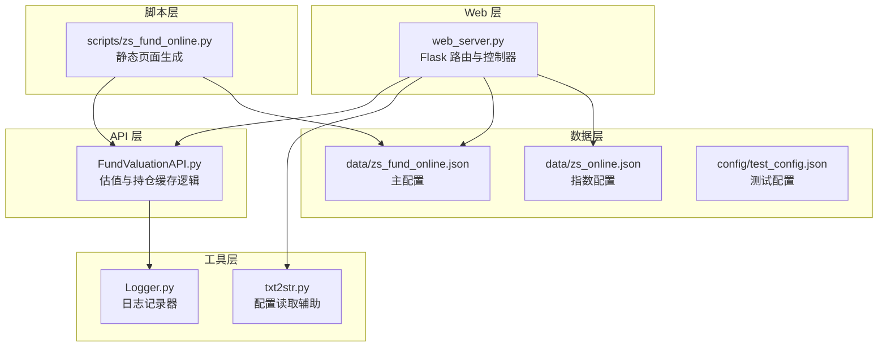
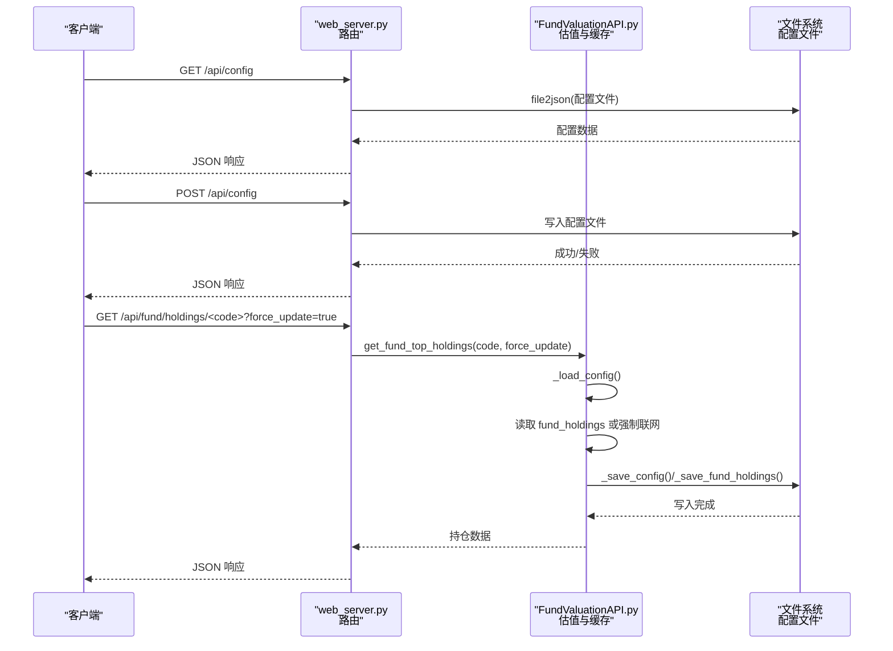
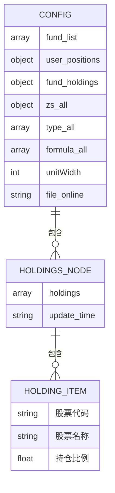
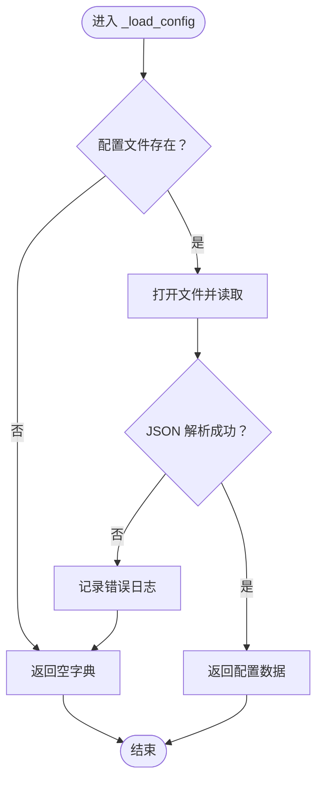
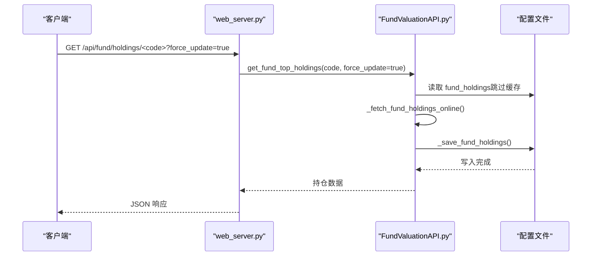
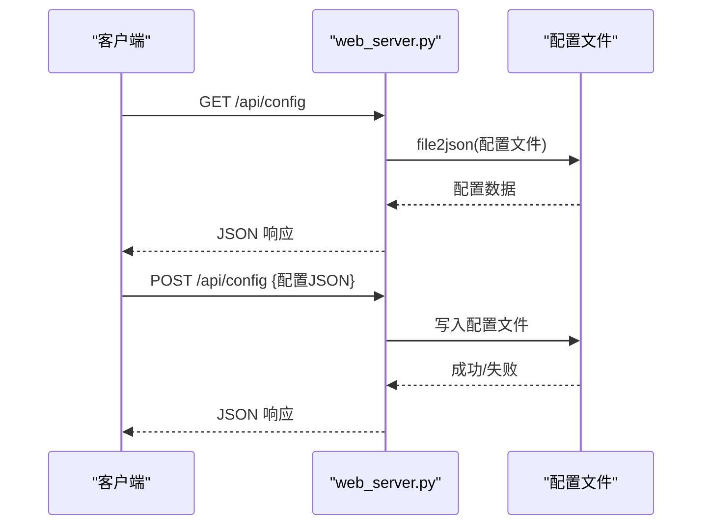
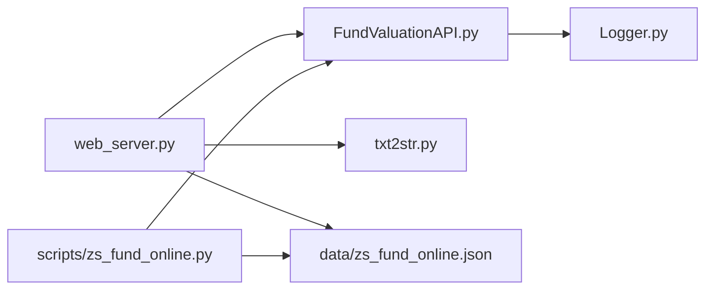

# 配置管理与缓存

<cite>
**本文引用的文件**
- [README.md](file://README.md)
- [web_server.py](file://web_server.py)
- [FundValuationAPI.py](file://api/FundValuationAPI.py)
- [Logger.py](file://utils/Logger.py)
- [txt2str.py](file://scripts/txt2str.py)
- [test_fund_config.py](file://tests/test_fund_config.py)
- [zs_fund_online.py](file://scripts/zs_fund_online.py)
- [test_config.json](file://config/test_config.json)
- [zs_fund_online.json](file://data/zs_fund_online.json)
- [zs_online.json](file://data/zs_online.json)
</cite>

## 目录
1. [简介](#简介)
2. [项目结构](#项目结构)
3. [核心组件](#核心组件)
4. [架构概览](#架构概览)
5. [详细组件分析](#详细组件分析)
6. [依赖关系分析](#依赖关系分析)
7. [性能考量](#性能考量)
8. [故障排查指南](#故障排查指南)
9. [结论](#结论)
10. [附录](#附录)

## 简介
本文件面向“配置管理与缓存”主题，系统性梳理本项目的配置文件结构、数据格式与存储策略，深入解析配置读写方法（_load_config/_save_config）的实现原理、异常处理与数据验证机制；阐述持仓信息缓存策略（优先本地缓存、强制联网更新、更新时间记录）、_force_update 参数的作用与使用场景、缓存失效与清理机制；并提供配置文件最佳实践、安全考虑、扩展开发指导，以及配置迁移、备份恢复与故障诊断的实用方案。

## 项目结构
项目采用模块化组织，核心围绕 Flask Web 服务、基金估值 API、日志工具与脚本工具展开：
- Web 层：提供配置读取/保存、基金列表、估值计算、持仓管理等接口
- API 层：封装基金基本信息、持仓信息、股票行情获取与估值计算
- 工具层：日志记录、配置文件读取辅助
- 数据层：配置 JSON 文件（基金列表、用户持仓、持仓缓存、指数配置）
- 脚本层：静态页面生成工具

**图表来源**
- [web_server.py](file://web_server.py#L1-L582)
- [FundValuationAPI.py](file://api/FundValuationAPI.py#L1-L537)
- [Logger.py](file://utils/Logger.py#L1-L86)
- [txt2str.py](file://scripts/txt2str.py#L1-L108)
- [zs_fund_online.py](file://scripts/zs_fund_online.py#L1-L281)
- [zs_fund_online.json](file://data/zs_fund_online.json#L1-L1358)
- [zs_online.json](file://data/zs_online.json#L1-L58)
- [test_config.json](file://config/test_config.json#L1-L59)

**章节来源**
- [README.md](file://README.md#L1-L193)
- [web_server.py](file://web_server.py#L1-L582)

## 核心组件
- 配置文件与数据模型
  - 主配置文件：data/zs_fund_online.json，包含 fund_list、user_positions、fund_holdings、指数配置等
  - 指数配置文件：data/zs_online.json，包含指数列表、图表参数等
  - 测试配置文件：config/test_config.json，演示 fund_holdings 结构
- 配置读取工具：scripts/txt2str.py 提供 file2json 辅助函数，统一处理编码检测与 JSON 解析
- Web 接口：web_server.py 提供配置读取/保存、基金列表、估值计算、持仓管理等 API
- 估值与缓存：api/FundValuationAPI.py 实现 _load_config/_save_config、持仓缓存策略与 _force_update 逻辑
- 日志：utils/Logger.py 提供旋转日志记录器，便于问题定位

**章节来源**
- [README.md](file://README.md#L105-L130)
- [txt2str.py](file://scripts/txt2str.py#L92-L108)
- [web_server.py](file://web_server.py#L66-L103)
- [FundValuationAPI.py](file://api/FundValuationAPI.py#L56-L87)
- [Logger.py](file://utils/Logger.py#L1-L86)

## 架构概览
下图展示配置管理与缓存在系统中的交互流程：Web 层通过路由调用 API 层，API 层负责配置读取/保存与持仓缓存；配置文件作为持久化介质，承载用户配置与缓存数据。

**图表来源**
- [web_server.py](file://web_server.py#L66-L103)
- [FundValuationAPI.py](file://api/FundValuationAPI.py#L56-L87)
- [FundValuationAPI.py](file://api/FundValuationAPI.py#L135-L163)
- [FundValuationAPI.py](file://api/FundValuationAPI.py#L235-L252)

**章节来源**
- [web_server.py](file://web_server.py#L66-L103)
- [FundValuationAPI.py](file://api/FundValuationAPI.py#L56-L87)
- [FundValuationAPI.py](file://api/FundValuationAPI.py#L135-L163)
- [FundValuationAPI.py](file://api/FundValuationAPI.py#L235-L252)

## 详细组件分析

### 配置文件结构设计与数据格式
- 主配置文件（data/zs_fund_online.json）
  - fund_list：监控的基金代码列表
  - user_positions：用户对各基金的持仓金额（元），用于计算单日盈亏
  - fund_holdings：缓存的基金前十大重仓股信息，包含 holdings 列表与 update_time
  - 指数配置：zs_all、type_all、formula_all、unitWidth 等，用于生成 K 线图
  - 注释与示例：_comment 中包含字段说明与使用示例
- 测试配置文件（config/test_config.json）
  - 展示 fund_holdings 的结构，便于单元测试与演示
- 指数配置文件（data/zs_online.json）
  - 包含指数列表与默认图表参数，供静态页面生成脚本使用

**图表来源**
- [zs_fund_online.json](file://data/zs_fund_online.json#L1-L240)
- [test_config.json](file://config/test_config.json#L1-L59)

**章节来源**
- [README.md](file://README.md#L105-L130)
- [zs_fund_online.json](file://data/zs_fund_online.json#L1-L240)
- [test_config.json](file://config/test_config.json#L1-L59)
- [zs_online.json](file://data/zs_online.json#L1-L58)

### 配置读写方法实现原理（_load_config 与 _save_config）
- _load_config
  - 作用：从配置文件加载 JSON 数据，若文件不存在或解析失败，返回空字典并记录错误日志
  - 异常处理：捕获文件读取与 JSON 解析异常，保证系统稳定运行
  - 编码处理：通过 scripts/txt2str.py 的 file2json 统一处理编码检测，避免乱码导致解析失败
- _save_config
  - 作用：将内存中的配置数据写回配置文件，使用缩进格式化输出，便于人工阅读
  - 异常处理：捕获写入异常并记录错误日志，防止因磁盘或权限问题中断服务
- Web 层保存配置
  - /api/config POST：接收前端提交的 JSON，写入配置文件并重建 API 实例以使新配置生效

**图表来源**
- [FundValuationAPI.py](file://api/FundValuationAPI.py#L56-L71)
- [txt2str.py](file://scripts/txt2str.py#L92-L108)

**章节来源**
- [FundValuationAPI.py](file://api/FundValuationAPI.py#L56-L87)
- [web_server.py](file://web_server.py#L82-L103)
- [txt2str.py](file://scripts/txt2str.py#L92-L108)

### 持仓信息缓存策略与 _force_update 参数
- 缓存策略
  - 优先使用本地缓存：get_fund_top_holdings 默认从配置文件的 fund_holdings 读取
  - 强制联网更新：当 force_update=True 或本地无缓存时，调用网络接口获取最新持仓
  - 自动保存：从网络获取后自动写入配置文件，更新 update_time
- _force_update 参数
  - 使用场景：手动刷新、首次运行、缓存异常、需要强制同步最新数据
  - 控制流：在 get_fund_top_holdings 中根据 force_update 决定是否读取缓存或联网
- 缓存更新时机
  - 首次获取：无缓存时自动联网并保存
  - 手动刷新：通过 API 查询参数 force_update=true
  - 版本管理：通过 update_time 字段记录最近一次更新时间，便于前端展示与审计
- 缓存失效与清理
  - 失效：删除配置文件中对应基金的 fund_holdings 条目或整条记录
  - 清理：移除基金时，web_server.py 会同步清理 user_positions、fund_holdings 等关联数据

**图表来源**
- [web_server.py](file://web_server.py#L105-L140)
- [FundValuationAPI.py](file://api/FundValuationAPI.py#L135-L163)
- [FundValuationAPI.py](file://api/FundValuationAPI.py#L235-L252)

**章节来源**
- [FundValuationAPI.py](file://api/FundValuationAPI.py#L135-L163)
- [FundValuationAPI.py](file://api/FundValuationAPI.py#L235-L252)
- [web_server.py](file://web_server.py#L105-L140)

### 数据验证机制
- 基金代码格式验证：6 位数字
- 基金存在性验证：通过网络接口校验
- 持仓比例验证：计算前十大重仓股累计比例，超过 100% 输出警告
- 配置文件编码与格式验证：file2json 统一处理编码检测与 JSON 解析，失败时记录错误并退出

**章节来源**
- [web_server.py](file://web_server.py#L299-L358)
- [web_server.py](file://web_server.py#L113-L118)
- [txt2str.py](file://scripts/txt2str.py#L92-L108)

### 配置文件读取与保存流程（Web 层）
- 读取配置：/api/config GET 使用 file2json 读取配置文件
- 保存配置：/api/config POST 接收 JSON，写入配置文件并重建 FundValuationAPI 实例

**图表来源**
- [web_server.py](file://web_server.py#L66-L103)
- [txt2str.py](file://scripts/txt2str.py#L92-L108)

**章节来源**
- [web_server.py](file://web_server.py#L66-L103)
- [txt2str.py](file://scripts/txt2str.py#L92-L108)

### 静态页面生成与配置联动
- 脚本通过读取配置文件，批量计算基金估值并生成静态 HTML 页面
- 生成前对已有输出文件进行备份，避免覆盖历史数据

**章节来源**
- [zs_fund_online.py](file://scripts/zs_fund_online.py#L1-L281)

## 依赖关系分析
- web_server.py 依赖 FundValuationAPI 进行估值与持仓管理，依赖 txt2str.py 进行配置读取
- FundValuationAPI 依赖 requests 进行网络请求，依赖 Logger 记录日志
- 配置文件作为共享数据源，被 web_server.py 与脚本共同读取

**图表来源**
- [web_server.py](file://web_server.py#L1-L582)
- [FundValuationAPI.py](file://api/FundValuationAPI.py#L1-L537)
- [Logger.py](file://utils/Logger.py#L1-L86)
- [txt2str.py](file://scripts/txt2str.py#L1-L108)
- [zs_fund_online.py](file://scripts/zs_fund_online.py#L1-L281)

**章节来源**
- [web_server.py](file://web_server.py#L1-L582)
- [FundValuationAPI.py](file://api/FundValuationAPI.py#L1-L537)
- [Logger.py](file://utils/Logger.py#L1-L86)
- [txt2str.py](file://scripts/txt2str.py#L1-L108)
- [zs_fund_online.py](file://scripts/zs_fund_online.py#L1-L281)

## 性能考量
- 并发获取股票行情：FundValuationAPI 使用线程池并发请求，限制最大线程数以平衡性能与请求频率
- 缓存优先策略：优先使用本地缓存减少网络请求，降低延迟与外部依赖
- 日志轮转：Logger 使用 RotatingFileHandler，避免日志文件过大影响性能

**章节来源**
- [FundValuationAPI.py](file://api/FundValuationAPI.py#L368-L393)
- [FundValuationAPI.py](file://api/FundValuationAPI.py#L24-L24)
- [Logger.py](file://utils/Logger.py#L12-L56)

## 故障排查指南
- 配置文件读取失败
  - 现象：/api/config GET 返回错误或空数据
  - 排查：检查文件编码、JSON 格式；确认路径正确；查看日志
  - 参考：txt2str.py 的 file2json 对编码与格式的处理
- 保存配置失败
  - 现象：/api/config POST 返回错误
  - 排查：检查磁盘空间、文件权限；确认 JSON 结构合法；查看日志
  - 参考：web_server.py 的保存逻辑与异常处理
- 持仓缓存未更新
  - 现象：前端显示旧数据
  - 排查：确认是否使用了 force_update=true；检查配置文件中 fund_holdings 是否存在；查看 update_time
  - 参考：FundValuationAPI 的 get_fund_top_holdings 与 _save_fund_holdings
- 基金不存在或无法访问
  - 现象：添加/预览基金时报错
  - 排查：确认基金代码格式与有效性；检查网络连通性；查看日志
  - 参考：web_server.py 的验证逻辑与 FundValuationAPI 的基础信息获取
- 日志定位
  - 使用 Logger 的 info/warning/error/critical 级别输出，结合日志轮转文件定位问题

**章节来源**
- [txt2str.py](file://scripts/txt2str.py#L92-L108)
- [web_server.py](file://web_server.py#L82-L103)
- [FundValuationAPI.py](file://api/FundValuationAPI.py#L56-L87)
- [FundValuationAPI.py](file://api/FundValuationAPI.py#L135-L163)
- [FundValuationAPI.py](file://api/FundValuationAPI.py#L235-L252)
- [Logger.py](file://utils/Logger.py#L1-L86)

## 结论
本项目通过清晰的配置文件结构、完善的配置读写与异常处理、稳健的持仓缓存策略与 _force_update 参数，实现了配置管理与缓存的高效协同。结合日志与测试用例，系统具备良好的可观测性与可维护性。建议在生产环境中进一步强化权限控制、备份策略与自动化监控，以提升稳定性与安全性。

## 附录

### 配置文件最佳实践
- 保持 JSON 格式规范与 UTF-8 编码
- 合理使用注释与示例，便于维护与协作
- 定期备份配置文件，避免意外丢失
- 在多人协作场景中，约定字段命名与更新流程

### 安全考虑
- 限制配置文件读写权限，避免未授权修改
- 对外暴露的 API 接口需增加鉴权与限流
- 日志中避免输出敏感信息，必要时脱敏处理

### 扩展开发指导
- 新增配置字段时，同步更新 _load_config/_save_config 与 Web 接口
- 新增缓存节点时，明确更新策略与清理规则
- 为关键流程增加单元测试与集成测试，保障变更质量

### 配置迁移、备份恢复与故障诊断
- 配置迁移：导出当前配置，修改目标环境路径与参数，导入新配置
- 备份恢复：定期复制配置文件；恢复时先停止服务，替换文件后重启
- 故障诊断：结合日志轮转文件与单元测试用例，定位问题根因

**章节来源**
- [test_fund_config.py](file://tests/test_fund_config.py#L1-L67)
- [README.md](file://README.md#L1-L193)