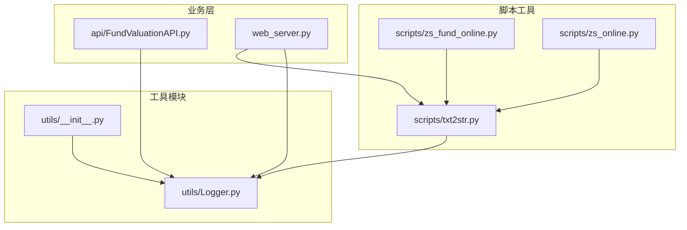
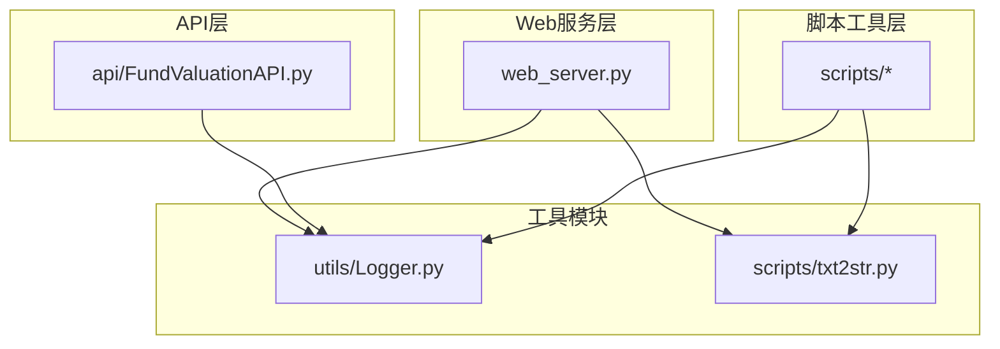
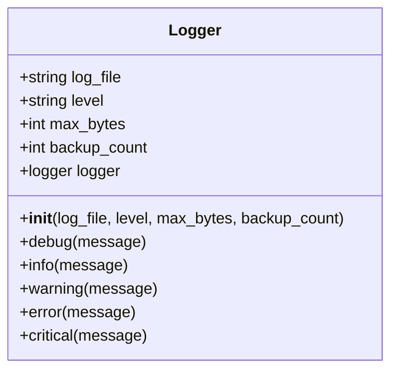
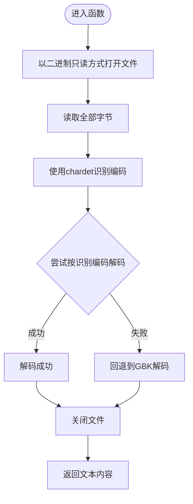
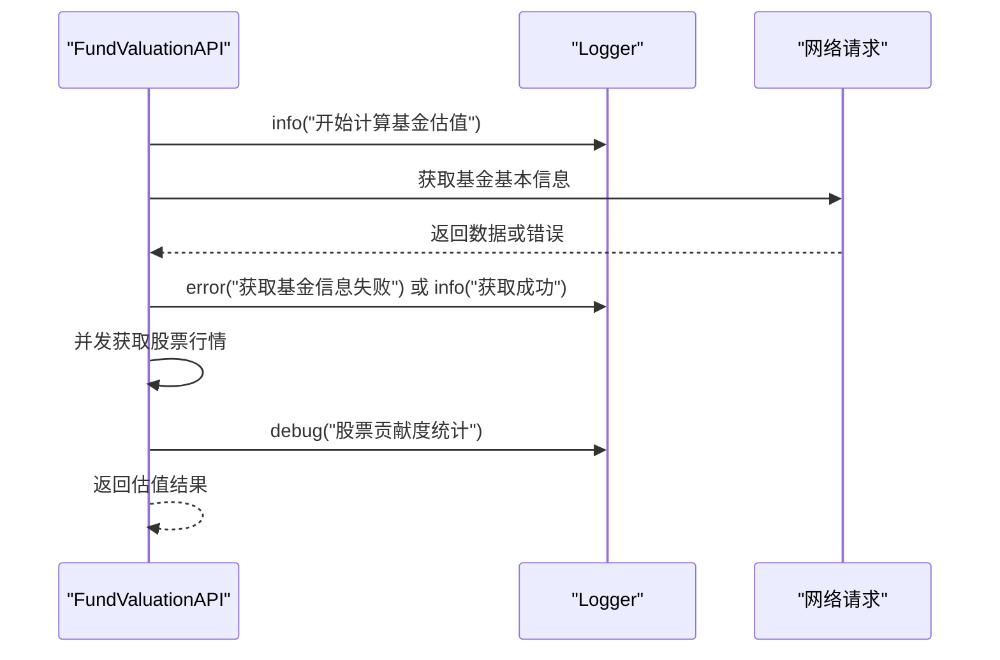
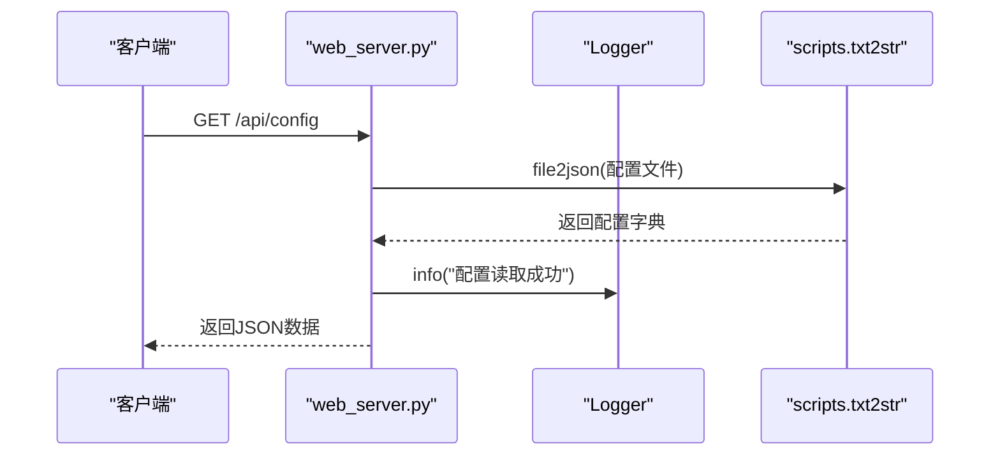
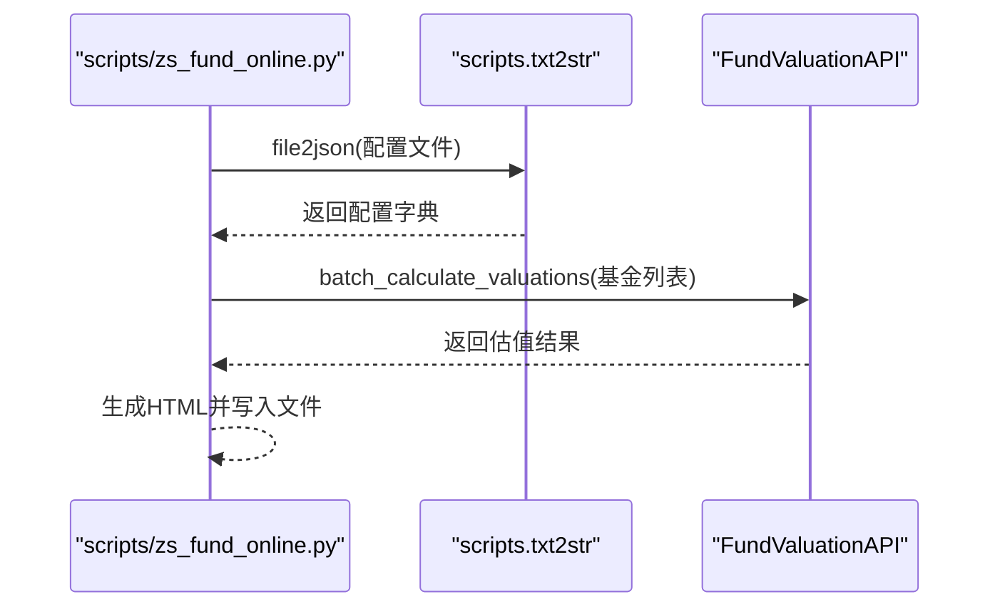
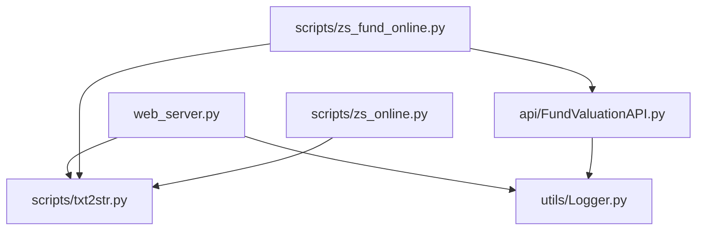

# 工具模块

<cite>
**本文引用的文件**
- [utils/Logger.py](file://utils/Logger.py)
- [utils/__init__.py](file://utils/__init__.py)
- [scripts/txt2str.py](file://scripts/txt2str.py)
- [api/FundValuationAPI.py](file://api/FundValuationAPI.py)
- [web_server.py](file://web_server.py)
- [scripts/zs_fund_online.py](file://scripts/zs_fund_online.py)
- [scripts/zs_online.py](file://scripts/zs_online.py)
- [README.md](file://README.md)
- [requirements.txt](file://requirements.txt)
</cite>

## 目录
1. [简介](#简介)
2. [项目结构](#项目结构)
3. [核心组件](#核心组件)
4. [架构总览](#架构总览)
5. [详细组件分析](#详细组件分析)
6. [依赖分析](#依赖分析)
7. [性能考量](#性能考量)
8. [故障排查指南](#故障排查指南)
9. [结论](#结论)
10. [附录](#附录)

## 简介
本文件面向“工具模块”的综合技术文档，重点涵盖以下内容：
- Logger日志系统的实现与使用：日志级别配置、文件轮转管理、输出格式与控制台同步输出。
- txt2str脚本工具的功能与应用场景：文本文件到字符串的编码识别与解码、JSON文件读取、辅助数据处理与类型转换。
- 工具模块在整个系统中的作用与依赖关系：在API层、Web服务层、脚本工具层的集成方式与调用点。
- 使用示例与最佳实践：如何在其他模块中集成与使用这些工具。
- 扩展与定制指导：如何根据需求修改和增强工具功能。

## 项目结构
工具模块位于 utils 与 scripts 两个子目录中，分别提供日志工具与文本处理工具。Logger作为通用日志基础设施，被API层与Web服务层广泛使用；txt2str作为文本/JSON处理工具，被脚本工具与Web服务层调用。

**图表来源**
- [utils/Logger.py](file://utils/Logger.py#L1-L86)
- [utils/__init__.py](file://utils/__init__.py#L1-L10)
- [scripts/txt2str.py](file://scripts/txt2str.py#L1-L108)
- [api/FundValuationAPI.py](file://api/FundValuationAPI.py#L1-L537)
- [web_server.py](file://web_server.py#L1-L562)
- [scripts/zs_fund_online.py](file://scripts/zs_fund_online.py#L1-L281)
- [scripts/zs_online.py](file://scripts/zs_online.py#L1-L30)

**章节来源**
- [README.md](file://README.md#L1-L193)

## 核心组件
- Logger日志系统：提供统一的日志记录能力，支持文件轮转、控制台输出、格式化输出与日志级别控制。
- txt2str文本处理工具：提供文本文件编码识别与解码、JSON文件读取、基础数值类型判断与转换等实用函数。

**章节来源**
- [utils/Logger.py](file://utils/Logger.py#L1-L86)
- [scripts/txt2str.py](file://scripts/txt2str.py#L1-L108)

## 架构总览
工具模块在系统中的定位如下：
- Logger作为基础设施，贯穿API层与Web服务层，统一记录运行日志。
- txt2str作为数据处理工具，被Web服务层用于读取配置文件，被脚本工具层用于生成静态页面与处理配置。

**图表来源**
- [web_server.py](file://web_server.py#L1-L562)
- [api/FundValuationAPI.py](file://api/FundValuationAPI.py#L1-L537)
- [scripts/txt2str.py](file://scripts/txt2str.py#L1-L108)
- [utils/Logger.py](file://utils/Logger.py#L1-L86)

## 详细组件分析

### Logger日志系统
Logger类封装了标准库logging，提供以下能力：
- 日志级别配置：支持 debug、info、warning、error、critical。
- 文件轮转：基于RotatingFileHandler，限制单文件大小与备份数量。
- 控制台输出：同时输出到控制台，便于开发调试。
- 格式化输出：统一的时间戳、模块名、级别与消息格式。
- 避免重复添加handler：初始化时检测已有handler，防止重复注册。

**图表来源**
- [utils/Logger.py](file://utils/Logger.py#L6-L76)

使用要点与最佳实践：
- 在模块内创建独立的Logger实例，避免跨模块共享同一logger导致配置冲突。
- 根据环境调整日志级别：开发阶段使用较低级别（如debug），生产环境使用较高级别（如info）。
- 合理设置max_bytes与backup_count，平衡磁盘占用与历史日志保留。
- 在多进程或多线程场景下，注意日志文件的并发写入安全，建议使用单一logger实例并由框架统一调度。

**章节来源**
- [utils/Logger.py](file://utils/Logger.py#L12-L56)
- [api/FundValuationAPI.py](file://api/FundValuationAPI.py#L23-L24)
- [web_server.py](file://web_server.py#L17-L18)

### txt2str文本处理工具
txt2str提供以下核心功能：
- 编码识别与解码：自动识别文本编码，若失败则回退到GBK，保证跨平台兼容。
- JSON文件读取：读取JSON配置文件并解析为Python对象。
- 辅助类型转换：判断字符串是否为数字并转换为int/float，提供默认值。
- UDL配置解析：从UDL文件提取连接参数键值对。

**图表来源**
- [scripts/txt2str.py](file://scripts/txt2str.py#L17-L30)

使用要点与最佳实践：
- 在读取外部配置文件时，优先使用file2json，它会自动处理编码问题并给出明确错误提示。
- 对于需要解析的文本文件，先调用getcontext获取文本，再进行后续处理，避免直接操作文件句柄。
- 在脚本工具中，通过sys.path.insert将项目根目录加入路径，确保能正确导入utils.Logger与scripts.txt2str。

**章节来源**
- [scripts/txt2str.py](file://scripts/txt2str.py#L1-L108)
- [scripts/zs_fund_online.py](file://scripts/zs_fund_online.py#L14-L23)
- [scripts/zs_online.py](file://scripts/zs_online.py#L14-L21)

### 在API层的集成
API层通过导入Logger创建专用日志器，用于记录网络请求、数据解析、错误处理等关键事件。例如：
- 配置文件加载失败、保存失败、网络请求异常、解析HTML失败等均通过log记录。
- 并发获取股票行情时，记录每只股票的贡献度与日志级别为debug，便于性能分析与问题定位。

**图表来源**
- [api/FundValuationAPI.py](file://api/FundValuationAPI.py#L98-L133)
- [api/FundValuationAPI.py](file://api/FundValuationAPI.py#L340-L425)

**章节来源**
- [api/FundValuationAPI.py](file://api/FundValuationAPI.py#L23-L24)
- [api/FundValuationAPI.py](file://api/FundValuationAPI.py#L63-L86)
- [api/FundValuationAPI.py](file://api/FundValuationAPI.py#L325-L425)

### 在Web服务层的集成
Web服务层同样使用Logger记录请求处理过程与错误信息，并通过txt2str读取配置文件：
- 初始化日志器，记录路由访问、配置读取、数据保存等事件。
- 使用file2json读取data/zs_fund_online.json，解析基金列表、用户持仓、重仓股等配置。
- 在批量估值接口中，结合用户持仓计算单日盈亏等衍生指标。

**图表来源**
- [web_server.py](file://web_server.py#L66-L80)
- [web_server.py](file://web_server.py#L18-L18)
- [scripts/txt2str.py](file://scripts/txt2str.py#L92-L99)

**章节来源**
- [web_server.py](file://web_server.py#L17-L18)
- [web_server.py](file://web_server.py#L66-L80)
- [web_server.py](file://web_server.py#L183-L226)

### 在脚本工具层的集成
脚本工具通过sys.path.insert将项目根目录加入路径，从而导入txt2str与Logger：
- 读取JSON配置，解析指数列表、周期、指标、输出文件路径等。
- 生成静态HTML页面，包含基金估值与K线图，便于离线查看与分享。

**图表来源**
- [scripts/zs_fund_online.py](file://scripts/zs_fund_online.py#L14-L33)
- [scripts/zs_fund_online.py](file://scripts/zs_fund_online.py#L180-L185)

**章节来源**
- [scripts/zs_fund_online.py](file://scripts/zs_fund_online.py#L14-L33)
- [scripts/zs_online.py](file://scripts/zs_online.py#L14-L21)

## 依赖分析
- Logger依赖标准库logging与logging.handlers.RotatingFileHandler，确保日志文件轮转与编码安全。
- txt2str依赖chardet进行编码识别，依赖json进行JSON解析，依赖sys/os进行路径与系统交互。
- Web服务层依赖txt2str进行配置读取，依赖Logger进行日志记录。
- API层依赖Logger进行日志记录，依赖requests进行网络请求。
- 脚本工具层依赖txt2str进行配置读取，依赖FundValuationAPI进行估值计算。

**图表来源**
- [utils/Logger.py](file://utils/Logger.py#L1-L3)
- [scripts/txt2str.py](file://scripts/txt2str.py#L1-L6)
- [web_server.py](file://web_server.py#L10-L12)
- [api/FundValuationAPI.py](file://api/FundValuationAPI.py#L10-L17)
- [scripts/zs_fund_online.py](file://scripts/zs_fund_online.py#L14-L17)
- [scripts/zs_online.py](file://scripts/zs_online.py#L14-L16)

**章节来源**
- [requirements.txt](file://requirements.txt#L1-L4)

## 性能考量
- Logger文件轮转：合理设置max_bytes与backup_count，避免频繁轮转造成I/O开销。
- txt2str编码识别：chardet的识别过程有一定CPU开销，建议仅在必要时调用，且对大文件谨慎使用。
- API层并发：在获取股票行情时使用线程池并发，减少总体等待时间，但需注意请求频率与目标服务器限流策略。
- Web服务层：配置读取与JSON解析应尽量避免在高频请求路径中重复执行，可考虑缓存策略。

## 故障排查指南
- 日志文件未生成或权限不足：检查日志文件路径与目录权限，确保程序有写入权限。
- 日志级别过高导致信息缺失：调整Logger初始化时的level参数，开发阶段使用较低级别。
- 编码错误导致读取失败：使用txt2str的file2json或getcontext函数，它们会自动处理常见编码问题并给出错误提示。
- 配置文件格式错误：file2json会在解析失败时记录错误并退出，检查JSON语法与字段完整性。
- 网络请求异常：在API层的日志中查找HTTP状态码与异常堆栈，确认目标接口可用性与参数正确性。

**章节来源**
- [utils/Logger.py](file://utils/Logger.py#L12-L24)
- [scripts/txt2str.py](file://scripts/txt2str.py#L92-L99)
- [api/FundValuationAPI.py](file://api/FundValuationAPI.py#L98-L133)

## 结论
工具模块为整个系统提供了统一的日志记录与文本/JSON处理能力。Logger确保了运行时信息的一致性与可追踪性；txt2str保障了跨平台文本与配置文件的稳定读取。通过在API层、Web服务层与脚本工具层的协同使用，工具模块有效支撑了系统的稳定性与可维护性。建议在后续开发中继续沿用统一的日志规范与数据处理流程，以降低耦合并提升扩展性。

## 附录
- 使用示例路径参考：
  - Logger初始化与使用：[utils/Logger.py](file://utils/Logger.py#L12-L24)、[api/FundValuationAPI.py](file://api/FundValuationAPI.py#L23-L24)、[web_server.py](file://web_server.py#L17-L18)
  - txt2str文件读取：[scripts/txt2str.py](file://scripts/txt2str.py#L92-L99)、[web_server.py](file://web_server.py#L66-L80)、[scripts/zs_fund_online.py](file://scripts/zs_fund_online.py#L22-L23)
- 最佳实践清单：
  - 在每个模块内创建独立的Logger实例，避免全局共享。
  - 使用file2json统一读取配置文件，确保编码与格式一致。
  - 在高频请求路径中避免重复解析与I/O操作，必要时引入缓存。
  - 对外暴露的API应记录关键事件与错误，便于问题定位与审计。