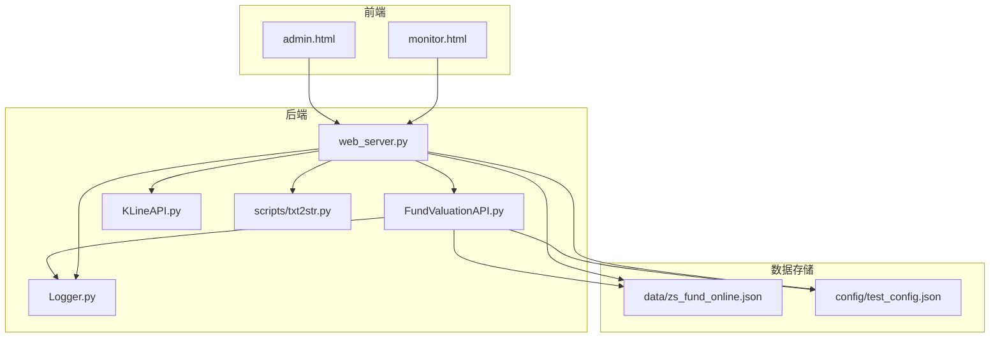
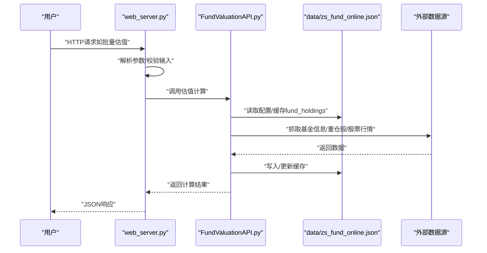
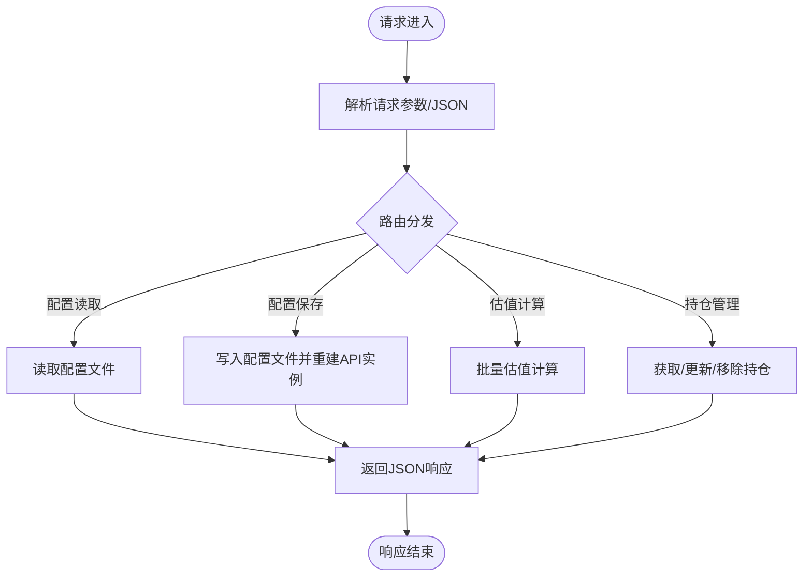
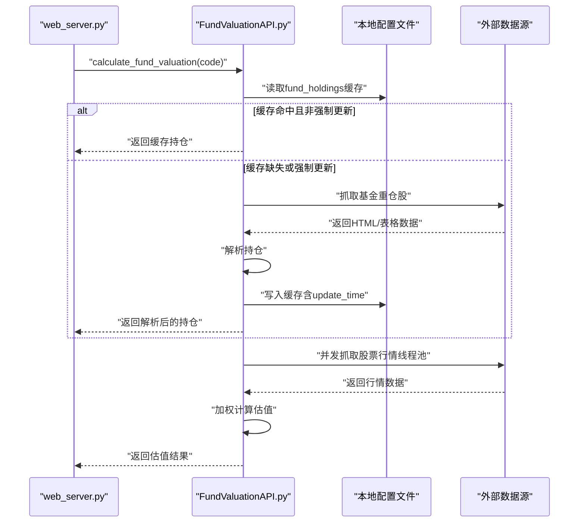
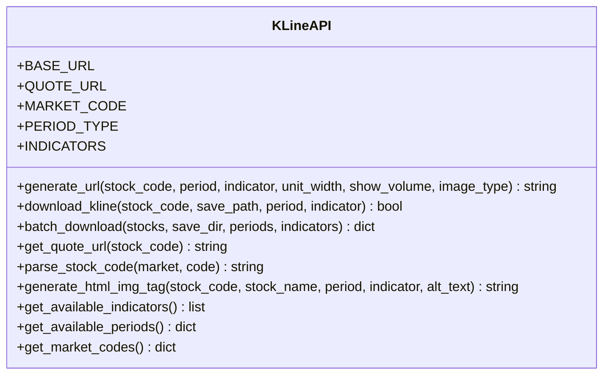
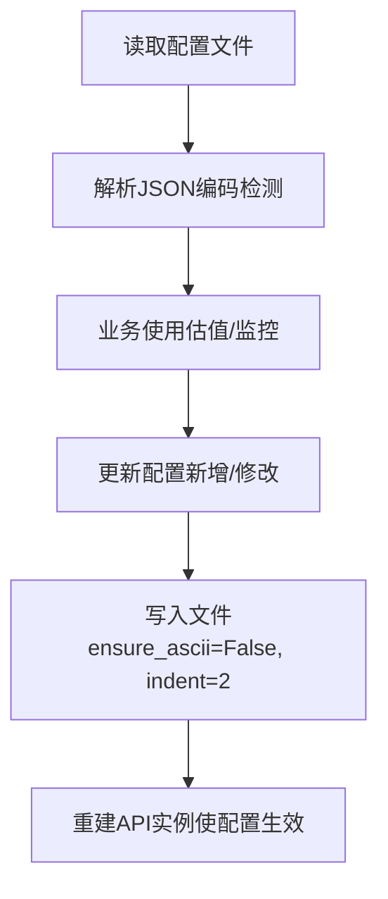
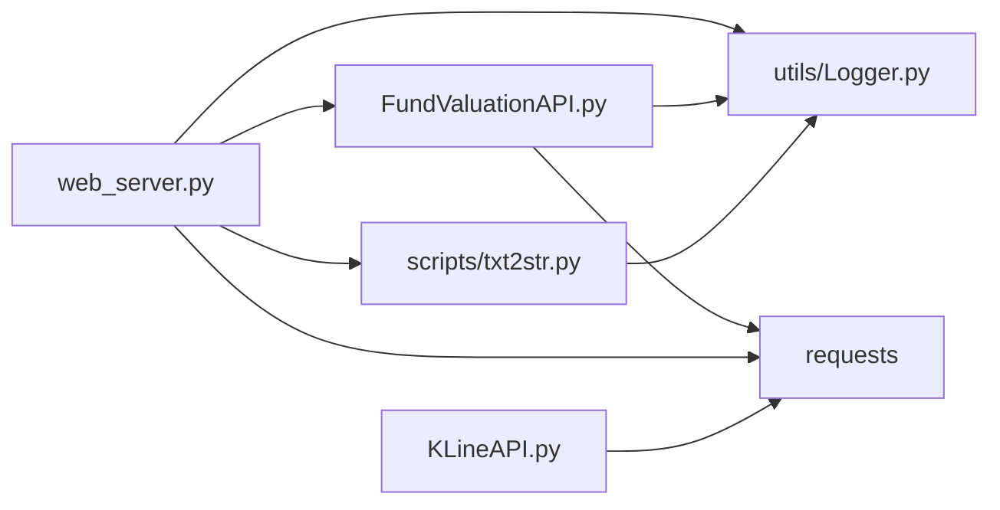

# 数据流设计

<cite>
**本文引用的文件**
- [web_server.py](file://web_server.py)
- [FundValuationAPI.py](file://api/FundValuationAPI.py)
- [KLineAPI.py](file://api/KLineAPI.py)
- [txt2str.py](file://scripts/txt2str.py)
- [Logger.py](file://utils/Logger.py)
- [admin.html](file://templates/admin.html)
- [monitor.html](file://templates/monitor.html)
- [zs_fund_online.json](file://data/zs_fund_online.json)
- [test_config.json](file://config/test_config.json)
- [test_fund_config.py](file://tests/test_fund_config.py)
- [requirements.txt](file://requirements.txt)
- [README.md](file://README.md)
</cite>

## 目录
1. [简介](#简介)
2. [项目结构](#项目结构)
3. [核心组件](#核心组件)
4. [架构总览](#架构总览)
5. [详细组件分析](#详细组件分析)
6. [依赖关系分析](#依赖关系分析)
7. [性能考量](#性能考量)
8. [故障排查指南](#故障排查指南)
9. [结论](#结论)
10. [附录](#附录)

## 简介
本文件面向系统数据流设计，围绕“从用户请求到数据响应”的完整链路进行深入剖析，涵盖请求接收、数据处理、业务计算、结果返回、配置文件读写、缓存策略与数据同步、数据验证与错误传播机制，并提供数据流图与时序图帮助开发者理解系统处理逻辑。

## 项目结构
该项目采用Flask Web框架，前端模板由Jinja2渲染，核心业务逻辑集中在API模块，数据持久化通过本地JSON文件实现，日志统一由工具模块提供。

图表来源
- [web_server.py](file://web_server.py#L1-L582)
- [FundValuationAPI.py](file://api/FundValuationAPI.py#L1-L537)
- [KLineAPI.py](file://api/KLineAPI.py#L1-L345)
- [txt2str.py](file://scripts/txt2str.py#L1-L108)
- [Logger.py](file://utils/Logger.py#L1-L86)
- [admin.html](file://templates/admin.html#L1-L1049)
- [monitor.html](file://templates/monitor.html#L1-L942)
- [zs_fund_online.json](file://data/zs_fund_online.json#L1-L1356)
- [test_config.json](file://config/test_config.json#L1-L59)

章节来源
- [README.md](file://README.md#L1-L193)

## 核心组件
- Web服务器层：负责路由、请求解析、响应封装、模板渲染与配置文件读写。
- 基金估值API层：负责基金基本信息、重仓股获取、并发行情抓取、估值计算与缓存写入。
- K线API层：负责K线图URL生成、图片下载、批量处理与HTML标签生成。
- 工具与脚本：日志记录、配置文件读取、静态页面生成脚本。
- 配置与数据：JSON配置文件承载基金列表、用户持仓、重仓股缓存与更新时间。

章节来源
- [web_server.py](file://web_server.py#L1-L582)
- [FundValuationAPI.py](file://api/FundValuationAPI.py#L1-L537)
- [KLineAPI.py](file://api/KLineAPI.py#L1-L345)
- [txt2str.py](file://scripts/txt2str.py#L1-L108)
- [Logger.py](file://utils/Logger.py#L1-L86)
- [zs_fund_online.json](file://data/zs_fund_online.json#L1-L1356)

## 架构总览
系统采用“Web层-业务层-API层-数据层”的分层架构：
- Web层：Flask路由与模板渲染，负责HTTP请求/响应与UI交互。
- 业务层：调用API层执行业务逻辑，组装响应数据。
- API层：封装第三方数据源访问与本地缓存策略。
- 数据层：本地JSON文件作为持久化存储，txt2str提供安全的文件读取与编码检测。

图表来源
- [web_server.py](file://web_server.py#L183-L226)
- [FundValuationAPI.py](file://api/FundValuationAPI.py#L427-L452)
- [FundValuationAPI.py](file://api/FundValuationAPI.py#L135-L163)
- [FundValuationAPI.py](file://api/FundValuationAPI.py#L315-L425)
- [FundValuationAPI.py](file://api/FundValuationAPI.py#L235-L252)
- [zs_fund_online.json](file://data/zs_fund_online.json#L1-L1356)

## 详细组件分析

### Web服务器（请求-响应与模板）
- 路由职责：
  - 配置读取/保存：/api/config（GET/POST）
  - 基金管理：/api/fund/list、/api/fund/preview、/api/fund/add、/api/fund/remove、/api/fund/holdings、/api/fund/valuation、/api/fund/valuation/batch、/api/fund/position
  - 监控页面：/、/admin、/api/generate/monitor、/api/monitor/view
- 请求处理：
  - GET/POST参数解析、查询参数（force_update）处理、JSON请求体解析。
  - 错误捕获与统一返回结构（success/error/message/data）。
- 模板渲染：
  - monitor.html根据配置动态生成K线图表格；admin.html提供管理界面。
- 配置文件读写：
  - file2json封装了编码检测与JSON解析；保存时使用ensure_ascii=False与indent美化。

图表来源
- [web_server.py](file://web_server.py#L66-L102)
- [web_server.py](file://web_server.py#L183-L226)
- [web_server.py](file://web_server.py#L105-L158)
- [web_server.py](file://web_server.py#L455-L512)
- [txt2str.py](file://scripts/txt2str.py#L92-L99)

章节来源
- [web_server.py](file://web_server.py#L1-L582)
- [admin.html](file://templates/admin.html#L528-L766)
- [monitor.html](file://templates/monitor.html#L567-L609)
- [txt2str.py](file://scripts/txt2str.py#L1-L108)

### 基金估值API（业务计算与缓存）
- 核心流程：
  - 获取基金基本信息（JSONP解析）
  - 获取重仓股（优先本地缓存，否则联网抓取并写回）
  - 并发获取股票实时行情（线程池+随机延迟）
  - 加权计算估算净值与涨跌幅
  - 结果写入响应并记录日志
- 缓存策略：
  - 本地缓存节点：fund_holdings（含holdings与update_time）
  - 读取顺序：强制更新开关决定是否走缓存
  - 写入时机：联网获取成功后立即写入
- 错误处理：
  - HTTP状态码与Content-Type校验
  - JSONP解析失败、网络异常、解析异常均记录日志并返回None

图表来源
- [FundValuationAPI.py](file://api/FundValuationAPI.py#L135-L163)
- [FundValuationAPI.py](file://api/FundValuationAPI.py#L165-L214)
- [FundValuationAPI.py](file://api/FundValuationAPI.py#L235-L252)
- [FundValuationAPI.py](file://api/FundValuationAPI.py#L315-L425)

章节来源
- [FundValuationAPI.py](file://api/FundValuationAPI.py#L1-L537)
- [zs_fund_online.json](file://data/zs_fund_online.json#L239-L238)

### K线API（K线图生成与下载）
- 功能点：
  - URL生成：组合参数（周期、指标、单位宽度等）
  - 图片下载：保存到本地
  - 批量下载：遍历股票、周期、指标组合
  - HTML标签生成：便于嵌入监控页面
- 参数与常量：
  - 周期类型、技术指标、市场代码映射
  - 基础URL与行情URL

图表来源
- [KLineAPI.py](file://api/KLineAPI.py#L15-L264)

章节来源
- [KLineAPI.py](file://api/KLineAPI.py#L1-L345)

### 配置文件结构与读写流程
- 结构要点：
  - fund_list：监控的基金代码列表
  - user_positions：用户对各基金的持仓金额（用于单日盈亏计算）
  - fund_holdings：重仓股缓存（含holdings与update_time）
  - zs_all/type_all/formula_all/unitWidth：K线图配置（用于静态页面生成）
- 读取流程：
  - txt2str.file2json：自动检测编码并解析JSON
  - web_server中多次使用file2json读取配置
- 写入流程：
  - web_server.save_config：POST保存配置并重建FundValuationAPI实例
  - FundValuationAPI._save_config：内部保存配置

图表来源
- [txt2str.py](file://scripts/txt2str.py#L92-L99)
- [web_server.py](file://web_server.py#L82-L102)
- [FundValuationAPI.py](file://api/FundValuationAPI.py#L73-L86)

章节来源
- [zs_fund_online.json](file://data/zs_fund_online.json#L1-L1356)
- [test_config.json](file://config/test_config.json#L1-L59)
- [test_fund_config.py](file://tests/test_fund_config.py#L1-L67)

### 数据验证与错误传播
- 前端验证：
  - 基金代码格式（6位数字）
  - 持仓金额非负校验
- 后端验证：
  - 基金存在性校验（联网查询）
  - 持仓比例总和校验（>100%给出警告）
  - HTTP状态码与Content-Type校验
- 错误传播：
  - 统一返回结构：success/error/message/data
  - 异常捕获与日志记录，便于定位问题

章节来源
- [web_server.py](file://web_server.py#L362-L452)
- [web_server.py](file://web_server.py#L514-L548)
- [web_server.py](file://web_server.py#L105-L158)
- [FundValuationAPI.py](file://api/FundValuationAPI.py#L98-L133)

## 依赖关系分析
- 运行时依赖：Flask、requests、chardet
- 模块依赖：
  - web_server依赖FundValuationAPI、txt2str、Logger
  - FundValuationAPI依赖requests、json、re、Logger
  - KLineAPI依赖requests、typing、datetime、os
  - txt2str依赖chardet、json、os、sys、Logger

图表来源
- [requirements.txt](file://requirements.txt#L1-L4)
- [web_server.py](file://web_server.py#L9-L18)
- [FundValuationAPI.py](file://api/FundValuationAPI.py#L10-L24)
- [KLineAPI.py](file://api/KLineAPI.py#L9-L12)
- [txt2str.py](file://scripts/txt2str.py#L1-L14)

章节来源
- [requirements.txt](file://requirements.txt#L1-L4)

## 性能考量
- 并发优化：FundValuationAPI使用线程池并发抓取股票行情，限制最大并发数，降低整体延迟。
- 缓存优先：优先使用本地缓存减少网络请求，提高响应速度。
- 自动刷新：监控页面5分钟自动刷新，兼顾实时性与性能。
- 批量处理：批量估值接口一次性返回多个基金结果，减少往返开销。

章节来源
- [FundValuationAPI.py](file://api/FundValuationAPI.py#L367-L393)
- [monitor.html](file://templates/monitor.html#L494-L507)

## 故障排查指南
- 常见问题与定位：
  - 配置文件编码错误：使用txt2str.file2json进行编码检测与解析。
  - 网络请求失败：检查HTTP状态码、Content-Type与异常日志。
  - 基金不存在或数据为空：确认基金代码正确与外部数据源可用。
  - 持仓比例异常：关注总和>100%的警告提示。
- 日志定位：
  - Logger提供文件与控制台双重输出，便于问题追踪。
- 排查步骤：
  - 检查web_server与FundValuationAPI的日志文件
  - 使用测试脚本验证配置文件读写与估值流程

章节来源
- [Logger.py](file://utils/Logger.py#L1-L86)
- [test_fund_config.py](file://tests/test_fund_config.py#L1-L67)

## 结论
本系统通过清晰的分层架构与完善的缓存策略，实现了从用户请求到数据响应的高效闭环。配置文件作为核心数据载体，结合本地缓存与并发优化，在保证性能的同时提升了用户体验。建议在生产环境中进一步增强限流与熔断策略，并完善监控告警体系。

## 附录
- API接口清单与用途概览（节选）
  - GET /api/config：读取配置
  - POST /api/config：保存配置
  - GET /api/fund/valuation/batch：批量估值
  - GET /api/fund/holdings/<fund_code>：获取持仓
  - PUT /api/fund/holdings/<fund_code>：更新持仓
  - POST /api/fund/add：添加基金
  - DELETE /api/fund/remove/<fund_code>：移除基金
  - PUT /api/fund/position/<fund_code>：修改用户持仓金额

章节来源
- [README.md](file://README.md#L132-L149)