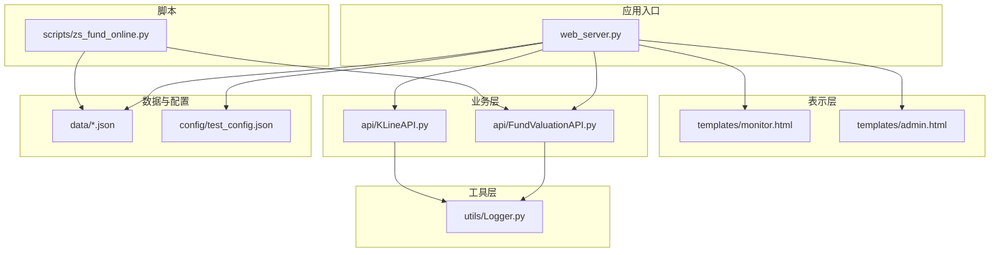
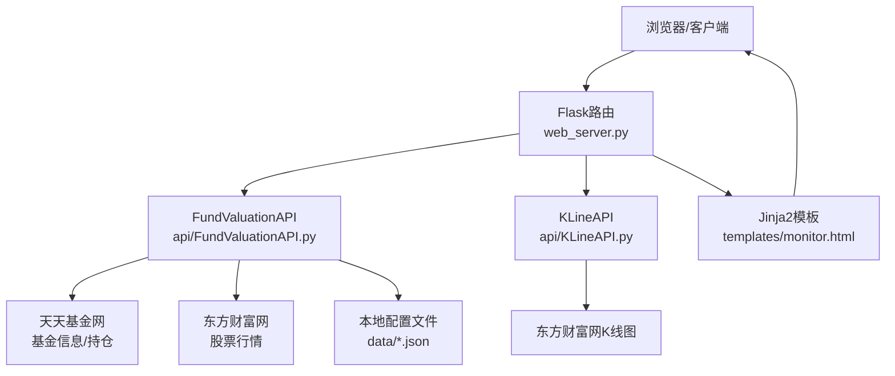
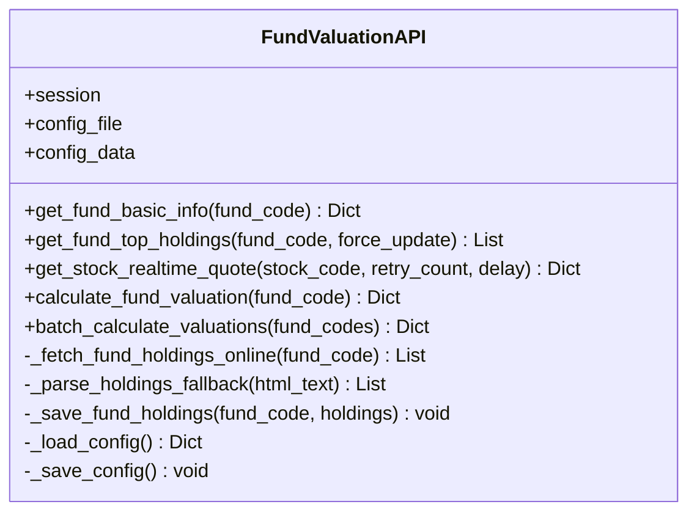
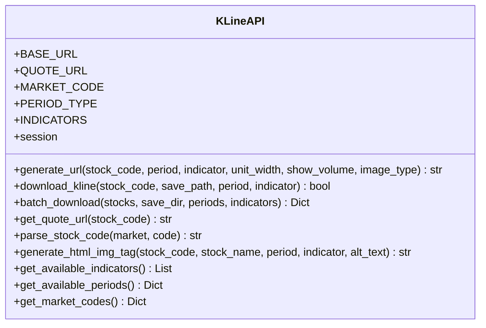
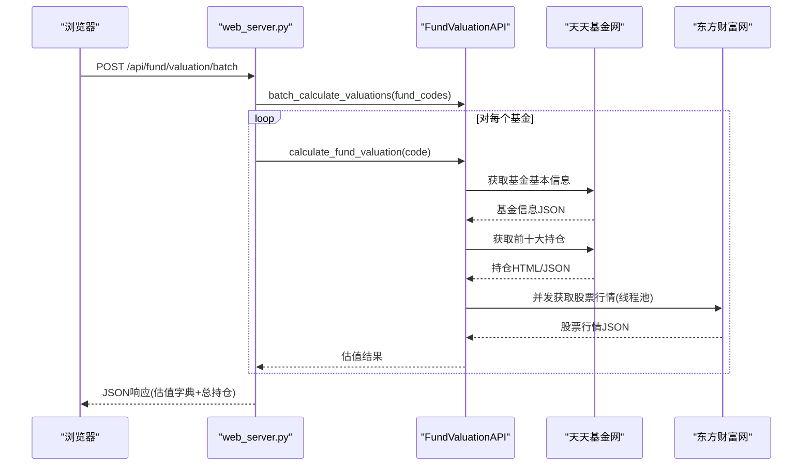
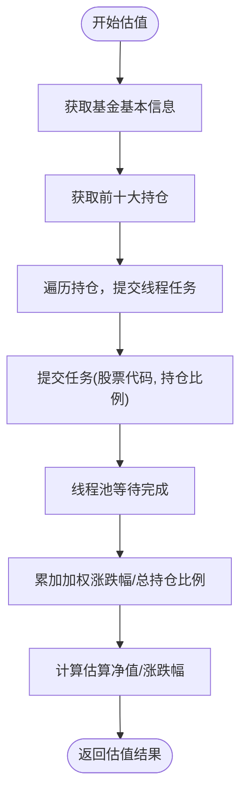
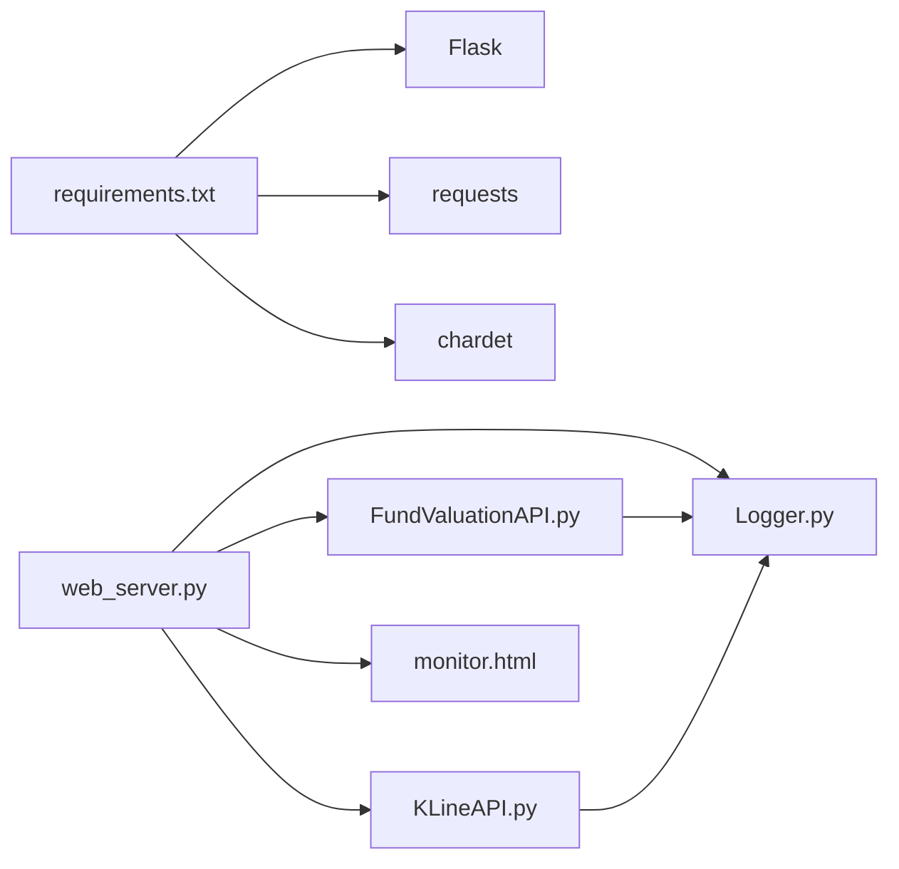
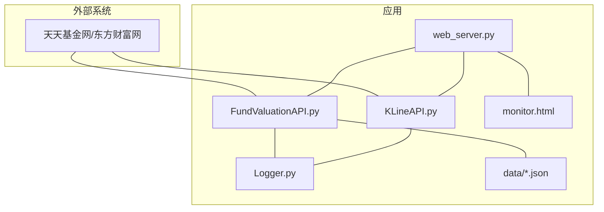

# 核心架构

<cite>
**本文引用的文件**
- [web_server.py](file://web_server.py)
- [FundValuationAPI.py](file://api/FundValuationAPI.py)
- [KLineAPI.py](file://api/KLineAPI.py)
- [Logger.py](file://utils/Logger.py)
- [monitor.html](file://templates/monitor.html)
- [README.md](file://README.md)
- [requirements.txt](file://requirements.txt)
- [test_config.json](file://config/test_config.json)
- [zs_fund_online.py](file://scripts/zs_fund_online.py)
</cite>

## 目录
1. [简介](#简介)
2. [项目结构](#项目结构)
3. [核心组件](#核心组件)
4. [架构总览](#架构总览)
5. [详细组件分析](#详细组件分析)
6. [依赖关系分析](#依赖关系分析)
7. [性能考量](#性能考量)
8. [故障排查指南](#故障排查指南)
9. [结论](#结论)
10. [附录](#附录)

## 简介
本系统是一个基于Flask的Web应用，提供“基金实时估值监控”和“股票K线图查询”两大能力。系统采用经典的MVC分层思想：
- 表示层（View）：由Flask路由与Jinja2模板组成，负责渲染监控页与管理页。
- 控制层（Controller）：由Flask路由处理器承担，负责接收请求、调用业务逻辑、组织响应。
- 业务层（Model/Service）：由API模块（FundValuationAPI、KLineAPI）承担，负责数据抓取、计算与缓存。

系统通过并发线程池优化网络请求性能，通过本地配置文件实现数据缓存与持久化，支持用户对基金进行添加、移除、编辑与批量估值计算，并在前端页面中以可视化形式呈现。

## 项目结构
项目采用按功能域划分的模块化组织方式：
- api：核心业务API模块（FundValuationAPI、KLineAPI）
- utils：通用工具（Logger）
- templates：前端模板（monitor.html、admin.html）
- scripts：辅助脚本（生成静态监控页）
- data/config/docs/tests：数据、配置、文档与测试
- web_server.py：Flask应用入口与路由控制器

**图表来源**
- [web_server.py](file://web_server.py#L1-L552)
- [FundValuationAPI.py](file://api/FundValuationAPI.py#L1-L537)
- [KLineAPI.py](file://api/KLineAPI.py#L1-L345)
- [Logger.py](file://utils/Logger.py#L1-L86)
- [monitor.html](file://templates/monitor.html#L1-L918)
- [test_config.json](file://config/test_config.json#L1-L59)
- [zs_fund_online.py](file://scripts/zs_fund_online.py#L1-L281)

**章节来源**
- [README.md](file://README.md#L5-L42)
- [requirements.txt](file://requirements.txt#L1-L4)

## 核心组件
- Flask Web Server（web_server.py）：应用入口，定义路由、模板渲染、配置读写、调用API模块。
- FundValuationAPI：基金估值与持仓管理的核心业务模块，负责抓取基金信息、解析持仓、并发获取股票行情、计算估值。
- KLineAPI：K线图URL生成与下载工具，封装东方财富K线接口。
- Logger：统一日志记录器，支持文件轮转与控制台输出。
- monitor.html：前端监控页面模板，负责展示估值、K线图、交互操作与自动刷新。
- 配置与数据：JSON配置文件承载基金列表、用户持仓、历史持仓缓存等。

**章节来源**
- [web_server.py](file://web_server.py#L1-L552)
- [FundValuationAPI.py](file://api/FundValuationAPI.py#L1-L537)
- [KLineAPI.py](file://api/KLineAPI.py#L1-L345)
- [Logger.py](file://utils/Logger.py#L1-L86)
- [monitor.html](file://templates/monitor.html#L1-L918)
- [test_config.json](file://config/test_config.json#L1-L59)

## 架构总览
系统遵循MVC模式，Flask作为控制器与视图层，API模块作为业务层。数据流从HTTP请求进入，经路由处理，调用API模块执行业务逻辑，API模块通过网络抓取与本地缓存协同工作，最终返回JSON响应给前端或直接渲染模板。

**图表来源**
- [web_server.py](file://web_server.py#L66-L502)
- [FundValuationAPI.py](file://api/FundValuationAPI.py#L88-L452)
- [KLineAPI.py](file://api/KLineAPI.py#L69-L264)
- [monitor.html](file://templates/monitor.html#L320-L398)

## 详细组件分析

### FundValuationAPI 设计与实现
- 职责边界
  - 基金基本信息获取（净值、估算、涨跌幅）
  - 基金前十大重仓股解析与缓存
  - 股票实时行情并发抓取与重试
  - 基金估值计算（加权涨跌幅、估算净值）
  - 批量估值与便捷函数
- 关键实现点
  - 配置文件读写：优先使用本地缓存，支持强制联网更新；保存持仓与更新时间。
  - 并发策略：ThreadPoolExecutor(max_workers=5)，每个线程随机短延迟，避免瞬时高并发。
  - 错误处理：对网络异常、解析失败、数据为空等情况进行日志记录与降级处理。
  - 数据校验：对JSONP响应类型判断、HTML返回拦截、持仓比例总和预警。
- 数据结构
  - 基金信息字典：包含代码、名称、净值、估算、时间、涨跌幅等字段。
  - 持仓列表：每项包含股票代码、名称、持仓比例。
  - 估值结果：包含估算净值、估算涨跌幅、估算时间、重仓股明细等。

**图表来源**
- [FundValuationAPI.py](file://api/FundValuationAPI.py#L27-L452)

**章节来源**
- [FundValuationAPI.py](file://api/FundValuationAPI.py#L88-L452)

### KLineAPI 设计与实现
- 职责边界
  - 生成K线图URL（支持周期、指标、成交量开关、单位宽度等参数）
  - 下载K线图到本地
  - 批量下载多股票、多周期、多指标的K线图
  - 生成HTML图片标签
  - 提供市场代码、周期、指标的映射与查询
- 关键实现点
  - URL参数构建：nid、type、unitWidth、formula、AT、imageType、timespan等。
  - 下载流程：会话保持、超时控制、目录创建、二进制写入。
  - 批量流程：三层循环遍历股票、周期、指标，统计成功/失败计数。
- 数据结构
  - URL参数字典
  - 下载结果字典（成功/失败计数）

**图表来源**
- [KLineAPI.py](file://api/KLineAPI.py#L15-L264)

**章节来源**
- [KLineAPI.py](file://api/KLineAPI.py#L69-L264)

### Web Server（Flask 控制器）与前端交互
- 路由职责
  - 页面路由：首页监控页、管理页
  - 配置路由：读取/保存配置
  - 基金路由：列表、预览、添加、移除、持仓查看/编辑、估值计算
  - K线路由：生成K线URL（保留接口）
- 前端交互
  - monitor.html：展示估值表格、K线图、自动刷新（5分钟）、手动刷新、弹窗编辑持仓、总持仓汇总。
  - JavaScript：fetch批量估值、并发请求、错误提示、性能监控、K线图加载监控。
- 数据流
  - 前端发起批量估值请求，后端调用FundValuationAPI.batch_calculate_valuations，返回估值字典与用户持仓金额，前端动态渲染。

**图表来源**
- [web_server.py](file://web_server.py#L183-L227)
- [FundValuationAPI.py](file://api/FundValuationAPI.py#L427-L452)
- [monitor.html](file://templates/monitor.html#L544-L585)

**章节来源**
- [web_server.py](file://web_server.py#L54-L502)
- [monitor.html](file://templates/monitor.html#L414-L670)

### 并发处理机制（ThreadPoolExecutor）
- 实现位置：FundValuationAPI.calculate_fund_valuation 中使用 concurrent.futures.ThreadPoolExecutor(max_workers=5)
- 设计动机：股票行情接口为独立REST API，单次请求耗时受网络与目标站点限速影响，通过并发显著降低总耗时。
- 线程策略：每个线程随机延迟0-0.2秒，避免同时请求导致限流；线程池上限5，兼顾吞吐与资源占用。
- 结果聚合：使用 as_completed 收集结果，累加加权涨跌幅与总持仓比例，计算估算净值与估算涨跌幅。

**图表来源**
- [FundValuationAPI.py](file://api/FundValuationAPI.py#L315-L426)

**章节来源**
- [FundValuationAPI.py](file://api/FundValuationAPI.py#L346-L393)

### 数据缓存策略
- 本地缓存优先：get_fund_top_holdings 默认从配置文件读取，若无或强制更新才联网抓取。
- 缓存内容：fund_holdings 中存储 holdings 列表与 update_time。
- 配置持久化：_save_config 将内存中的 config_data 写回 JSON 文件。
- 优势：减少对外部接口依赖，提高响应速度，支持离线浏览与低频刷新场景。

**章节来源**
- [FundValuationAPI.py](file://api/FundValuationAPI.py#L135-L163)
- [FundValuationAPI.py](file://api/FundValuationAPI.py#L235-L252)

### 日志与错误处理
- 日志模块：Logger 使用 RotatingFileHandler，支持文件轮转与控制台输出，便于生产环境追踪问题。
- 错误处理：网络异常、解析失败、数据为空、HTML返回等情况均有日志记录与降级处理。
- 前端错误提示：路由层捕获异常并返回统一JSON结构，前端根据 success 字段决定UI反馈。

**章节来源**
- [Logger.py](file://utils/Logger.py#L12-L56)
- [web_server.py](file://web_server.py#L134-L140)
- [FundValuationAPI.py](file://api/FundValuationAPI.py#L131-L134)

## 依赖关系分析
- 运行时依赖：Flask、requests、chardet
- 模块间依赖：
  - web_server.py 依赖 FundValuationAPI、Logger、模板
  - FundValuationAPI 依赖 requests、re、json、datetime、Logger
  - KLineAPI 依赖 requests、typing、datetime、os
  - monitor.html 依赖 web_server.py 提供的数据与路由

**图表来源**
- [requirements.txt](file://requirements.txt#L1-L4)
- [web_server.py](file://web_server.py#L9-L18)

**章节来源**
- [requirements.txt](file://requirements.txt#L1-L4)
- [web_server.py](file://web_server.py#L9-L18)

## 性能考量
- 并发优化：线程池并发获取股票行情，显著缩短批量估值耗时。
- 缓存策略：本地缓存持仓数据，减少网络请求与解析成本。
- 前端性能：K线图加载监控与性能日志，便于定位慢图与失败图。
- 网络限速：线程随机延迟与重试机制，避免触发目标站点限流。
- 扩展建议：
  - 引入Redis/本地数据库缓存热点数据
  - 增加重试与熔断策略
  - 增加异步队列处理批量任务
  - 增加指标监控与告警

[本节为通用性能讨论，无需具体文件分析]

## 故障排查指南
- 常见问题
  - 基金代码格式错误：需为6位数字
  - 基金不存在或网络不可达：路由层返回错误信息
  - 持仓比例超过100%：前端与后端均给出警告
  - K线图加载失败：检查网络与目标站点可用性
- 排查步骤
  - 查看日志：web_server.log 与各模块日志文件
  - 检查配置：data/zs_fund_online.json 是否存在且格式正确
  - 验证网络：FundValuationAPI 与 KLineAPI 的目标站点连通性
  - 重试机制：FundValuationAPI 的股票行情重试与延迟策略
- 相关实现参考
  - 基金添加/移除/预览/编辑等路由的错误处理与日志记录
  - FundValuationAPI 的异常捕获与降级返回

**章节来源**
- [web_server.py](file://web_server.py#L362-L443)
- [web_server.py](file://web_server.py#L445-L502)
- [FundValuationAPI.py](file://api/FundValuationAPI.py#L254-L314)

## 结论
该系统以Flask为核心，结合自研API模块与前端模板，实现了“基金实时估值监控”和“K线图查询”的完整闭环。通过并发线程池与本地缓存策略，系统在性能与稳定性之间取得良好平衡。建议后续引入更完善的缓存与监控体系，进一步提升可运维性与扩展性。

[本节为总结性内容，无需具体文件分析]

## 附录

### 系统边界图

**图表来源**
- [web_server.py](file://web_server.py#L1-L552)
- [FundValuationAPI.py](file://api/FundValuationAPI.py#L1-L537)
- [KLineAPI.py](file://api/KLineAPI.py#L1-L345)
- [Logger.py](file://utils/Logger.py#L1-L86)
- [monitor.html](file://templates/monitor.html#L1-L918)

### API 路由概览
- 基金相关
  - GET /api/fund/list：获取基金列表
  - GET /api/fund/preview/<fund_code>：预览基金持仓
  - GET /api/fund/holdings/<fund_code>：获取基金持仓
  - POST /api/fund/add：添加基金
  - DELETE /api/fund/remove/<fund_code>：移除基金
  - PUT /api/fund/holdings/<fund_code>：更新持仓
  - PUT /api/fund/position/<fund_code>：更新用户持仓金额
  - GET /api/fund/valuation/<fund_code>：单个基金估值
  - POST /api/fund/valuation/batch：批量估值
- K线相关
  - POST /api/generate/monitor：生成静态监控页（兼容）
  - POST /api/kline/url：生成K线URL（保留接口）

**章节来源**
- [web_server.py](file://web_server.py#L66-L502)
- [README.md](file://README.md#L134-L149)