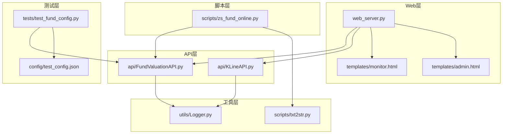
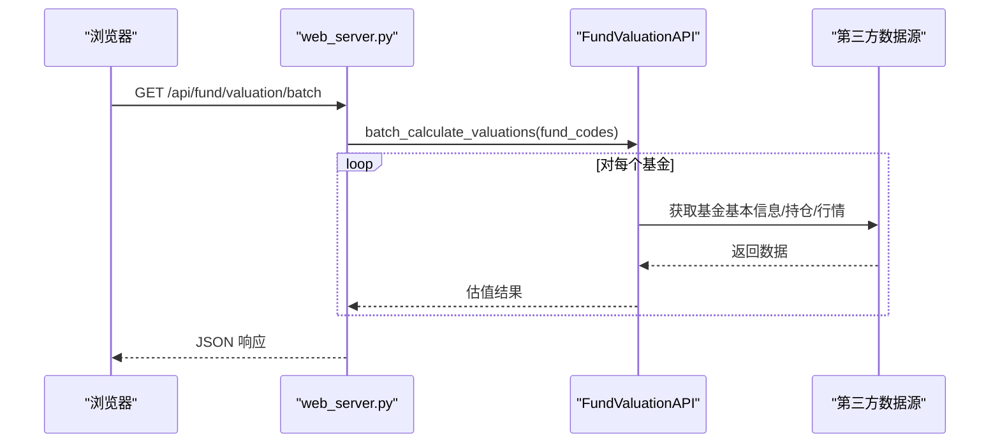
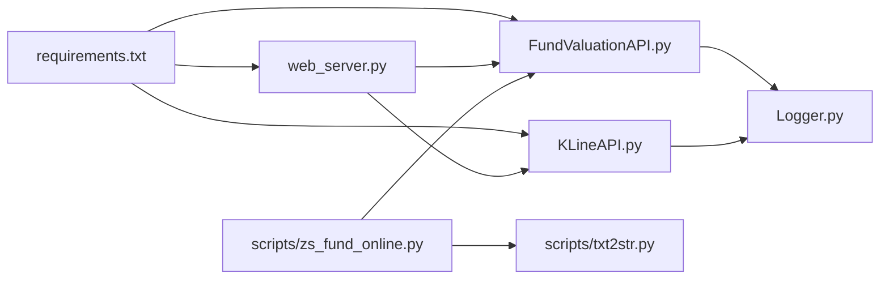

# 测试与质量保证

<cite>
**本文引用的文件**
- [README.md](file://README.md)
- [requirements.txt](file://requirements.txt)
- [web_server.py](file://web_server.py)
- [api/FundValuationAPI.py](file://api/FundValuationAPI.py)
- [api/KLineAPI.py](file://api/KLineAPI.py)
- [utils/Logger.py](file://utils/Logger.py)
- [scripts/txt2str.py](file://scripts/txt2str.py)
- [scripts/zs_fund_online.py](file://scripts/zs_fund_online.py)
- [templates/monitor.html](file://templates/monitor.html)
- [templates/admin.html](file://templates/admin.html)
- [tests/test_fund_config.py](file://tests/test_fund_config.py)
- [config/test_config.json](file://config/test_config.json)
</cite>

## 目录
1. [简介](#简介)
2. [项目结构](#项目结构)
3. [核心组件](#核心组件)
4. [架构总览](#架构总览)
5. [详细组件分析](#详细组件分析)
6. [依赖关系分析](#依赖关系分析)
7. [性能考量](#性能考量)
8. [故障排查指南](#故障排查指南)
9. [结论](#结论)
10. [附录](#附录)

## 简介
本测试与质量保证文档面向“基金估值与K线监控系统”，目标是建立完善的测试体系与质量控制流程，覆盖单元测试、集成测试、性能测试、错误处理与边界条件测试，并提供测试环境搭建、测试数据准备、代码质量检查标准与工具使用、以及持续集成与自动化测试的配置方法。文档旨在帮助开发者在功能正确性与性能稳定性方面达到预期标准。

## 项目结构
系统采用分层架构：
- Web 层：Flask 应用，提供 REST API 与前端模板渲染
- API 层：FundValuationAPI（基金估值）、KLineAPI（K线图）
- 工具层：Logger（日志）、txt2str（配置读取）
- 脚本层：生成静态监控页、数据处理
- 测试层：单元测试与配置文件行为验证

**图表来源**
- [web_server.py](file://web_server.py#L1-L552)
- [api/FundValuationAPI.py](file://api/FundValuationAPI.py#L1-L537)
- [api/KLineAPI.py](file://api/KLineAPI.py#L1-L345)
- [utils/Logger.py](file://utils/Logger.py#L1-L86)
- [scripts/txt2str.py](file://scripts/txt2str.py#L1-L108)
- [scripts/zs_fund_online.py](file://scripts/zs_fund_online.py#L1-L281)
- [templates/monitor.html](file://templates/monitor.html#L1-L918)
- [templates/admin.html](file://templates/admin.html#L1-L1049)
- [tests/test_fund_config.py](file://tests/test_fund_config.py#L1-L63)
- [config/test_config.json](file://config/test_config.json#L1-L59)

**章节来源**
- [README.md](file://README.md#L1-L193)
- [requirements.txt](file://requirements.txt#L1-L4)

## 核心组件
- FundValuationAPI：负责基金基本信息、前十大重仓股、股票实时行情获取与估值计算；支持本地缓存与并发优化
- KLineAPI：负责生成K线图URL、下载图片、批量处理
- Logger：统一日志记录，支持文件轮转
- web_server：Flask 路由与业务接口，调用 API 层并渲染模板
- 配置与脚本：配置文件读取、静态页面生成

**章节来源**
- [api/FundValuationAPI.py](file://api/FundValuationAPI.py#L27-L537)
- [api/KLineAPI.py](file://api/KLineAPI.py#L15-L345)
- [utils/Logger.py](file://utils/Logger.py#L6-L86)
- [web_server.py](file://web_server.py#L1-L552)

## 架构总览
系统通过 Flask 提供 REST API，前端模板通过 AJAX 调用 API 获取数据；API 层通过 requests 访问第三方数据源，内部使用 Logger 记录日志。配置文件用于持久化基金列表、用户持仓与持仓缓存。

**图表来源**
- [web_server.py](file://web_server.py#L183-L226)
- [api/FundValuationAPI.py](file://api/FundValuationAPI.py#L427-L452)

## 详细组件分析

### FundValuationAPI 单元测试设计
- 测试目标
  - 基金基本信息获取（含异常与HTTP类型校验）
  - 前十大重仓股获取（本地缓存优先、强制更新回退）
  - 股票实时行情获取（重试机制、延迟策略）
  - 估值计算（加权涨跌幅、并发线程池、异常保护）
  - 批量估值（聚合结果、失败容忍）

- 测试策略
  - 使用真实基金代码（如 001593）验证端到端流程
  - 验证配置文件读写与缓存逻辑
  - 断言关键字段：估算净值、估算涨跌幅、重仓股数量、持仓比例合计
  - 边界：空持仓、异常响应、网络超时、HTML响应类型

- 测试场景
  - 首次运行：从网络获取并保存到配置文件
  - 二次运行：从配置文件读取，验证缓存命中
  - 强制更新：删除配置中对应基金的持仓节点，触发联网更新

- 错误处理
  - HTTP 状态码非 200、响应类型为 HTML、解析失败、网络异常
  - 返回 None 或错误信息，避免中断整体流程

- 性能关注
  - 并发线程池大小、请求间隔、重试次数与延迟
  - 日志记录关键耗时点，便于性能分析

**章节来源**
- [tests/test_fund_config.py](file://tests/test_fund_config.py#L1-L63)
- [config/test_config.json](file://config/test_config.json#L1-L59)
- [api/FundValuationAPI.py](file://api/FundValuationAPI.py#L88-L452)

### KLineAPI 单元测试设计
- 测试目标
  - URL 生成（周期、指标、单位宽度、成交量开关）
  - 图片下载（保存路径、目录创建、异常捕获）
  - 批量下载（统计成功/失败）
  - HTML 图片标签生成
  - 市场代码映射与可用指标/周期查询

- 测试策略
  - 生成不同参数组合的 URL，断言参数拼接正确
  - 下载失败场景（网络异常、权限问题）验证返回 False
  - 批量下载统计结果

**章节来源**
- [api/KLineAPI.py](file://api/KLineAPI.py#L69-L194)

### web_server 集成测试设计
- 测试目标
  - 配置读取/保存 API（GET/POST /api/config）
  - 基金列表、预览、添加、移除、持仓查看/编辑、估值计算
  - K线图 URL 生成 API（POST /api/kline/url）
  - 静态页面生成（/api/generate/monitor）

- 测试策略
  - 使用 Flask 测试客户端发起请求，断言 JSON 结构与字段
  - 验证错误分支：无效基金代码、不存在的基金、配置文件读写失败
  - 前端交互：monitor.html 与 admin.html 的 AJAX 调用链路

- 场景
  - 添加新基金：预览-确认-添加全流程
  - 移除基金：清理配置与相关数据
  - 批量估值：返回用户持仓金额、比例、单日盈亏

**章节来源**
- [web_server.py](file://web_server.py#L66-L538)
- [templates/monitor.html](file://templates/monitor.html#L544-L640)
- [templates/admin.html](file://templates/admin.html#L550-L766)

### Logger 与日志质量
- 日志级别：info、error 等
- 文件轮转：单文件最大大小、备份数量
- 输出：文件与控制台双重输出，格式包含时间、模块、级别、消息

**章节来源**
- [utils/Logger.py](file://utils/Logger.py#L12-L76)

### 配置与脚本测试
- 配置文件读取：txt2str.file2json
- 静态页面生成：scripts/zs_fund_online.py 调用 FundValuationAPI 批量估值与 K 线图 URL 生成

**章节来源**
- [scripts/txt2str.py](file://scripts/txt2str.py#L92-L99)
- [scripts/zs_fund_online.py](file://scripts/zs_fund_online.py#L180-L226)

## 依赖关系分析
- 运行时依赖：Flask、requests、chardet
- 模块间耦合：web_server 依赖 API 层；API 层依赖 Logger；脚本依赖 API 与配置读取

**图表来源**
- [requirements.txt](file://requirements.txt#L1-L4)
- [web_server.py](file://web_server.py#L9-L18)
- [api/FundValuationAPI.py](file://api/FundValuationAPI.py#L19-L24)
- [api/KLineAPI.py](file://api/KLineAPI.py#L9-L13)
- [scripts/zs_fund_online.py](file://scripts/zs_fund_online.py#L14-L17)

**章节来源**
- [requirements.txt](file://requirements.txt#L1-L4)

## 性能考量
- 并发优化：FundValuationAPI 使用 ThreadPoolExecutor 并发获取股票行情，线程池上限与随机延迟减少请求风暴
- 缓存策略：优先使用本地配置文件中的持仓数据，降低外部依赖
- 前端性能监控：monitor.html 中内置性能监控函数，记录基金刷新、K线图加载与页面总加载时间
- 超时与重试：网络请求设置超时与重试，避免阻塞
- 日志采样：关键路径记录耗时，便于定位瓶颈

**章节来源**
- [api/FundValuationAPI.py](file://api/FundValuationAPI.py#L367-L425)
- [templates/monitor.html](file://templates/monitor.html#L418-L446)

## 故障排查指南
- 常见错误与定位
  - HTTP 非 200 或响应为 HTML：检查数据源可用性与解析逻辑
  - 配置文件编码/格式错误：使用 txt2str.file2json 读取并检查
  - 网络超时/重试失败：调整重试次数与延迟，检查代理与防火墙
  - 日志定位：通过 Logger 输出的模块名与时间戳快速定位问题

- 建议排查步骤
  - 启用 debug 日志级别，观察关键函数调用
  - 逐步缩小范围：先验证单个 API 调用，再验证完整流程
  - 使用最小化测试数据（单个基金/股票）验证

**章节来源**
- [api/FundValuationAPI.py](file://api/FundValuationAPI.py#L98-L133)
- [scripts/txt2str.py](file://scripts/txt2str.py#L92-L99)
- [utils/Logger.py](file://utils/Logger.py#L12-L28)

## 结论
本系统具备清晰的分层架构与可扩展的测试框架。通过单元测试覆盖核心算法与边界条件、集成测试验证端到端流程、性能测试评估并发与缓存效果、以及完善的日志与错误处理机制，能够有效保障功能正确性与性能稳定性。建议在 CI 中引入自动化测试与代码质量检查，持续改进测试覆盖率与质量门禁。

## 附录

### 单元测试实现方法与测试覆盖率
- FundValuationAPI
  - 基本信息获取：断言返回字典包含关键键值，异常时返回 None
  - 持仓获取：断言从配置文件读取与联网获取两种路径
  - 行情获取：断言重试与延迟策略生效，异常时返回 None
  - 估值计算：断言估算净值与涨跌幅合理，重仓股明细存在
  - 批量估值：断言聚合结果与失败容忍
- KLineAPI
  - URL 生成：断言参数拼接与默认值
  - 下载：断言保存路径、目录创建、异常返回 False
  - 批量下载：断言统计结果
- 测试覆盖率建议
  - 使用 pytest 与 coverage.py，目标：函数级语句覆盖率≥80%，分支覆盖率≥70%
  - 对异常路径与边界条件单独标注覆盖率

**章节来源**
- [tests/test_fund_config.py](file://tests/test_fund_config.py#L1-L63)
- [api/FundValuationAPI.py](file://api/FundValuationAPI.py#L88-L452)
- [api/KLineAPI.py](file://api/KLineAPI.py#L69-L194)

### 集成测试设计思路与测试场景
- 场景一：添加基金（预览-确认-添加）
  - 预览：校验基金代码格式、联网验证、返回前十大重仓股
  - 确认：POST /api/fund/add，断言配置文件更新与持仓初始化
  - 验证：GET /api/fund/list 与 /api/fund/holdings
- 场景二：移除基金
  - DELETE /api/fund/remove，断言配置清理与重新加载
- 场景三：批量估值
  - POST /api/fund/valuation/batch，断言返回用户持仓金额、比例、单日盈亏
- 场景四：K线图
  - POST /api/kline/url 生成 URL，前端模板渲染图片

**章节来源**
- [web_server.py](file://web_server.py#L299-L442)
- [web_server.py](file://web_server.py#L445-L501)
- [web_server.py](file://web_server.py#L183-L226)

### 性能测试执行方法与性能指标
- 方法
  - 使用 locust 或自定义脚本模拟多用户并发请求
  - 关注：平均响应时间、P95/P99 延迟、吞吐量、错误率
  - 前端：monitor.html 的性能监控函数输出日志
- 指标
  - 基金估值刷新：总耗时、平均耗时/基金
  - K线图加载：总耗时、图片数量、失败数量
  - 页面总加载时间

**章节来源**
- [templates/monitor.html](file://templates/monitor.html#L418-L446)

### 错误处理测试与边界条件测试
- 错误处理
  - HTTP 非 200、响应类型为 HTML、解析异常、网络超时
  - 配置文件读取失败、JSON 解析异常
- 边界条件
  - 空持仓、持仓比例合计为 0、单只股票极端涨跌幅
  - 非法基金代码、不存在的基金、强制更新失败
  - 配置文件缺失或损坏

**章节来源**
- [api/FundValuationAPI.py](file://api/FundValuationAPI.py#L98-L133)
- [scripts/txt2str.py](file://scripts/txt2str.py#L92-L99)

### 测试环境搭建与测试数据准备
- 环境
  - Python 3.7+，安装 requirements.txt
  - 启动 Flask 服务：python web_server.py 或使用启动脚本
- 测试数据
  - 使用真实基金代码（如 001593）进行端到端测试
  - 配置文件：config/test_config.json，包含 fund_holdings 节点
  - 前端模板：monitor.html 与 admin.html 通过 AJAX 调用 API

**章节来源**
- [README.md](file://README.md#L46-L66)
- [config/test_config.json](file://config/test_config.json#L1-L59)

### 代码质量检查标准与工具使用
- 标准
  - PEP8 风格，函数/变量命名规范，注释完整
  - 日志级别恰当，错误处理明确
- 工具
  - flake8/pylint：语法与风格检查
  - mypy：类型注解检查
  - pytest + coverage.py：单元测试与覆盖率
  - black/isort：代码格式化与导入排序

[本节为通用实践建议，不直接分析具体文件]

### 持续集成与自动化测试配置
- 建议流水线
  - 代码提交触发：flake8/mypy + pytest + coverage
  - 通过后部署到测试环境，执行集成测试
  - 生成覆盖率报告与测试报告
- 触发方式
  - GitHub Actions/GitLab CI：定义 YAML 任务
  - Docker 化：固定依赖版本，确保一致性

[本节为通用实践建议，不直接分析具体文件]