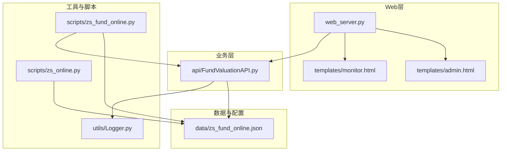
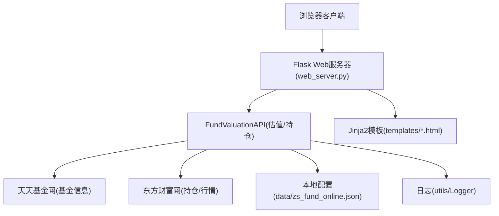
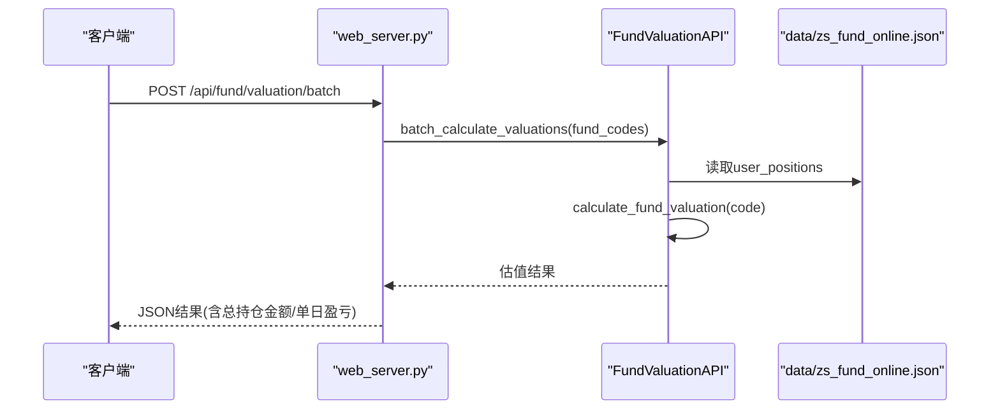
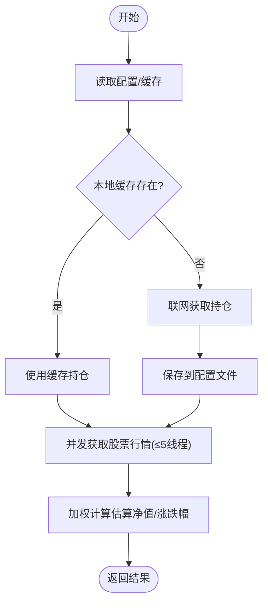
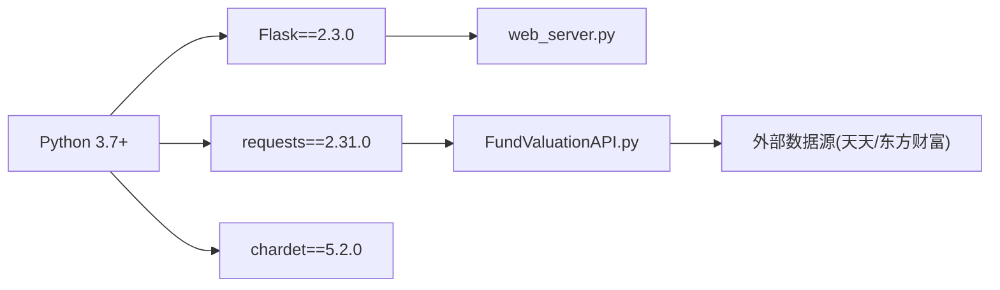

# 部署与维护

<cite>
**本文引用的文件**   
- [README.md](file://README.md)
- [requirements.txt](file://requirements.txt)
- [web_server.py](file://web_server.py)
- [启动服务器.bat](file://启动服务器.bat)
- [api/FundValuationAPI.py](file://api/FundValuationAPI.py)
- [utils/Logger.py](file://utils/Logger.py)
- [data/zs_fund_online.json](file://data/zs_fund_online.json)
- [templates/monitor.html](file://templates/monitor.html)
- [templates/admin.html](file://templates/admin.html)
- [scripts/zs_fund_online.py](file://scripts/zs_fund_online.py)
- [scripts/zs_online.py](file://scripts/zs_online.py)
- [docs/项目结构说明.md](file://docs/项目结构说明.md)
- [docs/基金估值快速开始.md](file://docs/基金估值快速开始.md)
- [tests/test_fund_config.py](file://tests/test_fund_config.py)
</cite>

## 目录
1. [简介](#简介)
2. [项目结构](#项目结构)
3. [核心组件](#核心组件)
4. [架构总览](#架构总览)
5. [详细组件分析](#详细组件分析)
6. [依赖分析](#依赖分析)
7. [性能考虑](#性能考虑)
8. [故障排除指南](#故障排除指南)
9. [结论](#结论)
10. [附录](#附录)

## 简介
本指南面向系统管理员与运维工程师，提供“基金估值与K线监控系统”的完整部署与维护方案。内容涵盖生产环境部署步骤、Windows启动脚本使用、依赖包管理、系统监控与日志管理、性能优化、安全与访问控制、备份与灾难恢复，以及常见问题排查与维护操作。

## 项目结构
项目采用Flask Web应用 + 前端模板 + API模块 + 工具与脚本的分层组织方式。核心文件与职责如下：
- web_server.py：Flask Web服务器入口，提供REST API与页面渲染。
- api/FundValuationAPI.py：基金估值与持仓数据获取、并发计算的核心API。
- utils/Logger.py：日志工具，支持滚动日志与多级别输出。
- data/zs_fund_online.json：系统配置与用户持仓数据文件。
- templates/monitor.html、templates/admin.html：前端监控与管理页面模板。
- scripts/：生成静态监控页面与指数K线图的脚本。
- docs/：项目文档与快速开始说明。
- tests/：配置文件读写与缓存行为的测试样例。

**图示来源**
- [web_server.py](file://web_server.py#L1-L552)
- [api/FundValuationAPI.py](file://api/FundValuationAPI.py#L1-L537)
- [utils/Logger.py](file://utils/Logger.py#L1-L86)
- [data/zs_fund_online.json](file://data/zs_fund_online.json#L1-L1356)
- [templates/monitor.html](file://templates/monitor.html#L1-L918)
- [templates/admin.html](file://templates/admin.html#L1-L1049)
- [scripts/zs_fund_online.py](file://scripts/zs_fund_online.py#L1-L281)
- [scripts/zs_online.py](file://scripts/zs_online.py#L1-L79)

**章节来源**
- [docs/项目结构说明.md](file://docs/项目结构说明.md#L1-L280)

## 核心组件
- Web服务器与路由
  - 提供首页、管理页、配置读取/保存、基金列表、估值计算、持仓查看/编辑、K线图生成等接口。
  - 默认监听0.0.0.0:5000，支持跨主机访问。
- 基金估值API
  - 从天天基金网与东方财富网抓取数据；支持本地缓存与强制联网更新；并发获取股票行情；加权计算估算净值与涨跌幅。
- 日志系统
  - 自动滚动日志，支持INFO级别；日志文件位于logs目录。
- 前端模板
  - monitor.html：实时估值与K线图展示；admin.html：管理后台，支持添加/移除基金、编辑持仓、批量估值等。
- 生成脚本
  - zs_fund_online.py：生成包含估值与K线的静态HTML页面；zs_online.py：生成仅含K线的静态页面。

**章节来源**
- [web_server.py](file://web_server.py#L54-L552)
- [api/FundValuationAPI.py](file://api/FundValuationAPI.py#L27-L537)
- [utils/Logger.py](file://utils/Logger.py#L6-L86)
- [templates/monitor.html](file://templates/monitor.html#L1-L918)
- [templates/admin.html](file://templates/admin.html#L1-L1049)
- [scripts/zs_fund_online.py](file://scripts/zs_fund_online.py#L1-L281)
- [scripts/zs_online.py](file://scripts/zs_online.py#L1-L79)

## 架构总览
系统采用前后端分离的Web架构：前端模板负责展示，后端Flask提供REST API与页面渲染；业务逻辑集中在FundValuationAPI，数据持久化在本地JSON配置文件中；日志由Logger统一管理。

**图示来源**
- [web_server.py](file://web_server.py#L9-L27)
- [api/FundValuationAPI.py](file://api/FundValuationAPI.py#L34-L41)
- [data/zs_fund_online.json](file://data/zs_fund_online.json#L1-L1356)
- [utils/Logger.py](file://utils/Logger.py#L12-L56)

## 详细组件分析

### Web服务器与路由
- 路由概览
  - GET /：渲染监控主页面。
  - GET /admin：渲染管理页面。
  - GET/POST /api/config：读取/保存配置。
  - GET/PUT /api/fund/holdings/<fund_code>：查看/更新持仓。
  - GET /api/fund/valuation/<fund_code>：单基估算。
  - POST /api/fund/valuation/batch：批量估算并合并用户持仓金额。
  - GET /api/fund/list：获取监控列表。
  - GET /api/fund/preview/<fund_code>：预览基金持仓（不入库）。
  - POST /api/fund/add：添加基金（预览-确认机制）。
  - DELETE /api/fund/remove/<fund_code>：移除基金。
  - PUT /api/fund/position/<fund_code>：修改用户持仓金额。
  - POST /api/generate/monitor：生成静态监控页面（兼容旧功能）。
- 启动与访问
  - 默认监听0.0.0.0:5000，启动后自动打开浏览器访问。
- 配置文件
  - CONFIG_FILE固定为data/zs_fund_online.json。

**图示来源**
- [web_server.py](file://web_server.py#L183-L227)
- [api/FundValuationAPI.py](file://api/FundValuationAPI.py#L427-L452)
- [data/zs_fund_online.json](file://data/zs_fund_online.json#L192-L203)

**章节来源**
- [web_server.py](file://web_server.py#L54-L552)

### 基金估值API
- 数据来源
  - 基金基本信息：天天基金网。
  - 持仓数据：东方财富网。
  - 股票实时行情：东方财富网。
- 核心流程
  - 获取基金基本信息。
  - 获取前十大重仓股（优先本地缓存，否则联网抓取并保存）。
  - 并发获取股票实时行情（线程池，最多5线程）。
  - 加权计算估算净值与涨跌幅。
- 错误处理
  - 对HTTP状态码、响应类型进行校验；对解析异常与网络异常进行捕获与日志记录。
- 并发与性能
  - ThreadPoolExecutor并发请求，降低整体延迟。
  - 随机短延迟避免请求过于集中。

**图示来源**
- [api/FundValuationAPI.py](file://api/FundValuationAPI.py#L135-L426)

**章节来源**
- [api/FundValuationAPI.py](file://api/FundValuationAPI.py#L27-L537)

### 日志系统
- Logger类
  - 支持INFO级别日志，自动创建RotatingFileHandler（默认10MB，保留5个备份）。
  - 同时输出到文件与控制台。
- 使用位置
  - web_server.py与FundValuationAPI.py均使用Logger记录运行日志。

**章节来源**
- [utils/Logger.py](file://utils/Logger.py#L6-L86)
- [web_server.py](file://web_server.py#L17-L18)
- [api/FundValuationAPI.py](file://api/FundValuationAPI.py#L23-L24)

### 前端模板与交互
- monitor.html
  - 展示基金实时估值、K线图；支持手动刷新与自动刷新（5分钟）。
  - 前端JavaScript统计页面加载与K线图加载耗时，便于性能监控。
- admin.html
  - 提供基金添加/移除、持仓查看/编辑、批量估值、生成监控页面等管理功能。
  - 添加流程采用“预览-确认”机制，避免误添加。

**章节来源**
- [templates/monitor.html](file://templates/monitor.html#L414-L535)
- [templates/admin.html](file://templates/admin.html#L528-L766)

### 生成脚本
- scripts/zs_fund_online.py
  - 读取配置，批量计算估值，生成包含估值与K线的静态HTML页面。
- scripts/zs_online.py
  - 仅生成K线图的静态HTML页面。

**章节来源**
- [scripts/zs_fund_online.py](file://scripts/zs_fund_online.py#L1-L281)
- [scripts/zs_online.py](file://scripts/zs_online.py#L1-L79)

## 依赖分析
- Python依赖
  - Flask==2.3.0
  - requests==2.31.0
  - chardet==5.2.0
- 运行环境
  - Python 3.7+
- 外部数据源
  - 天天基金网、东方财富网（基金信息、持仓、股票行情、K线图）。

**图示来源**
- [requirements.txt](file://requirements.txt#L1-L4)
- [README.md](file://README.md#L46-L55)

**章节来源**
- [requirements.txt](file://requirements.txt#L1-L4)
- [README.md](file://README.md#L46-L55)

## 性能考虑
- 并发优化
  - FundValuationAPI使用ThreadPoolExecutor并发获取股票行情，线程数上限为5，减少总体等待时间。
- 请求节流
  - 每个线程内随机短延迟，避免请求过于集中导致被限流。
- 缓存策略
  - 优先使用本地缓存的持仓数据；支持强制联网更新；自动记录更新时间。
- 前端性能监控
  - monitor.html记录页面加载、K线图加载与估值刷新耗时，便于定位性能瓶颈。

**章节来源**
- [api/FundValuationAPI.py](file://api/FundValuationAPI.py#L367-L393)
- [templates/monitor.html](file://templates/monitor.html#L418-L446)

## 故障排除指南
- 依赖安装失败
  - 使用requirements.txt安装依赖，确保网络可达。
  - 若网络受限，可使用国内镜像源安装。
- 启动失败
  - 端口占用：默认端口5000被占用时，修改web_server.py中的端口配置。
  - 权限问题：在Windows下以管理员权限运行启动脚本。
- 数据获取异常
  - 检查网络连通性与代理设置。
  - 外部站点返回HTML而非JSON时，API会记录错误并返回None。
- 日志排查
  - 查看logs目录下的日志文件，定位错误发生的时间与上下文。
- 配置问题
  - data/zs_fund_online.json格式错误会导致读取失败；可通过tests/test_fund_config.py验证配置读写与缓存行为。

**章节来源**
- [requirements.txt](file://requirements.txt#L1-L4)
- [web_server.py](file://web_server.py#L541-L552)
- [api/FundValuationAPI.py](file://api/FundValuationAPI.py#L98-L133)
- [utils/Logger.py](file://utils/Logger.py#L12-L56)
- [tests/test_fund_config.py](file://tests/test_fund_config.py#L1-L63)

## 结论
本指南提供了从环境准备、依赖安装、启动与访问、配置管理、监控与日志、性能优化、安全与访问控制、备份与灾难恢复到故障排除的全生命周期运维参考。建议在生产环境中结合监控告警与自动化巡检，确保系统稳定运行。

## 附录

### 生产环境部署步骤
- 准备环境
  - 安装Python 3.7+。
  - 准备防火墙放行端口5000（或自定义端口）。
- 安装依赖
  - pip install -r requirements.txt
- 配置系统
  - 编辑data/zs_fund_online.json，设置fund_list与user_positions。
  - 确认日志目录logs存在且具备写权限。
- 启动服务
  - 方式一：双击启动服务器.bat。
  - 方式二：python web_server.py。
  - 方式三：在scripts目录下运行启动服务器.bat。
- 访问系统
  - 浏览器访问http://localhost:5000。

**章节来源**
- [README.md](file://README.md#L46-L70)
- [启动服务器.bat](file://启动服务器.bat#L1-L23)
- [web_server.py](file://web_server.py#L541-L552)

### Windows启动脚本使用与参数
- 启动脚本
  - 启动服务器.bat：自动切换到项目根目录，延时后启动Python服务，并自动打开浏览器。
- 参数说明
  - 无命令行参数；若需自定义端口，可在web_server.py中修改app.run(host, port)。

**章节来源**
- [启动服务器.bat](file://启动服务器.bat#L1-L23)
- [web_server.py](file://web_server.py#L541-L552)

### 依赖包管理（requirements.txt）
- 安装
  - pip install -r requirements.txt
- 升级
  - pip install --upgrade -r requirements.txt
  - 或逐项升级：pip install Flask==<version> requests==<version> chardet==<version>

**章节来源**
- [requirements.txt](file://requirements.txt#L1-L4)

### 系统监控与日志管理最佳实践
- 日志轮转
  - 使用Logger的RotatingFileHandler，单文件默认10MB，保留5个备份。
- 日志级别
  - 生产环境建议INFO级别；调试阶段可临时调整为DEBUG。
- 监控指标
  - 前端monitor.html记录页面加载与K线图加载耗时；可结合Nginx/Apache访问日志进行总量与错误率统计。
- 告警
  - 建议接入系统日志收集平台，对ERROR级别日志进行告警。

**章节来源**
- [utils/Logger.py](file://utils/Logger.py#L12-L56)
- [templates/monitor.html](file://templates/monitor.html#L418-L446)

### 性能优化配置与调优
- 并发线程数
  - ThreadPoolExecutor默认5线程；可根据CPU核数与网络状况适度调整。
- 请求超时与重试
  - FundValuationAPI中对网络请求设置了超时与重试，可根据网络质量调整。
- 缓存策略
  - 优先使用本地缓存，减少对外部站点依赖；定期清理过期缓存。

**章节来源**
- [api/FundValuationAPI.py](file://api/FundValuationAPI.py#L367-L393)

### 安全配置与访问控制
- 默认监听0.0.0.0:5000，建议在生产环境绑定内网IP或通过反向代理限制外网访问。
- 反向代理（Nginx/Apache）可提供HTTPS、访问限速、IP白名单等能力。
- 避免在公网直接暴露管理接口，建议通过VPN或内网访问。

**章节来源**
- [web_server.py](file://web_server.py#L551-L552)

### 备份与灾难恢复
- 配置备份
  - 定期备份data/zs_fund_online.json。
- 日志备份
  - 定期归档logs目录下的日志文件。
- 恢复流程
  - 停止服务 → 恢复配置文件 → 启动服务 → 验证估值与K线图正常。

**章节来源**
- [docs/项目结构说明.md](file://docs/项目结构说明.md#L270-L276)