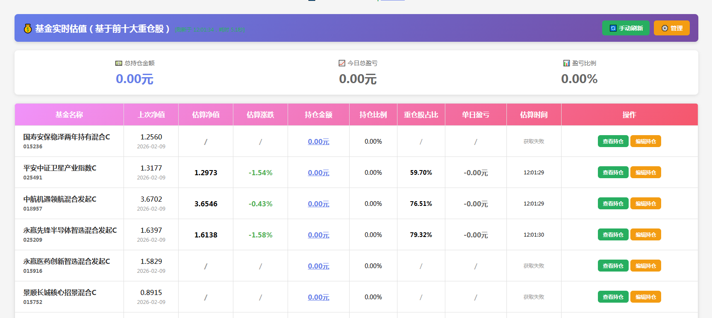
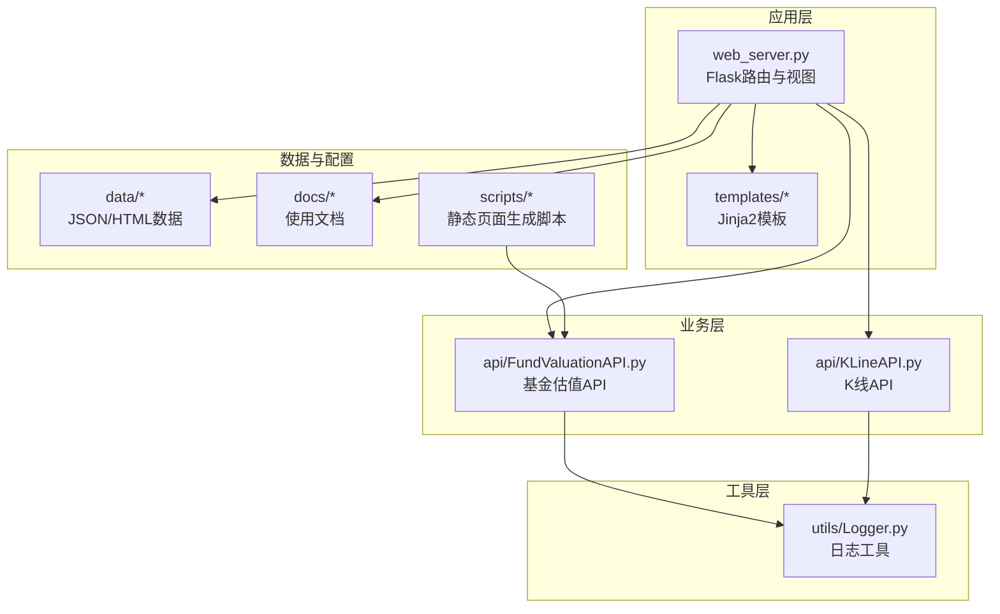
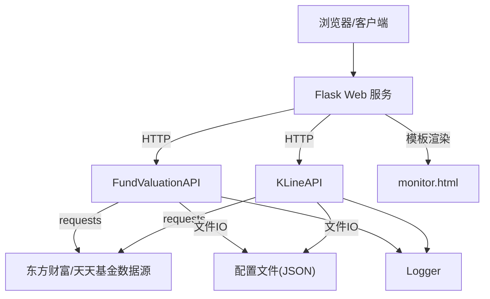
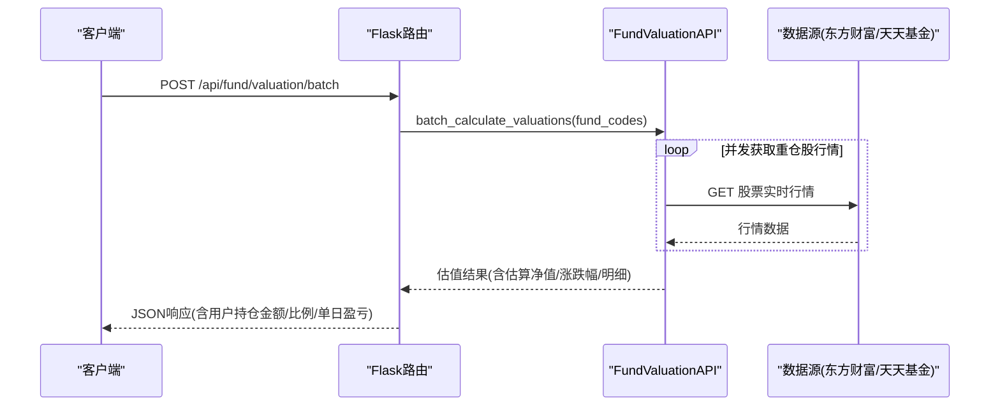
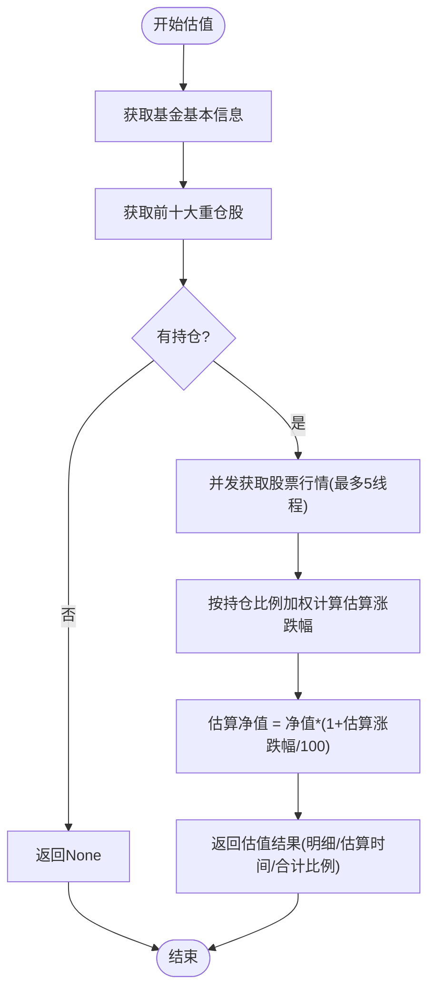
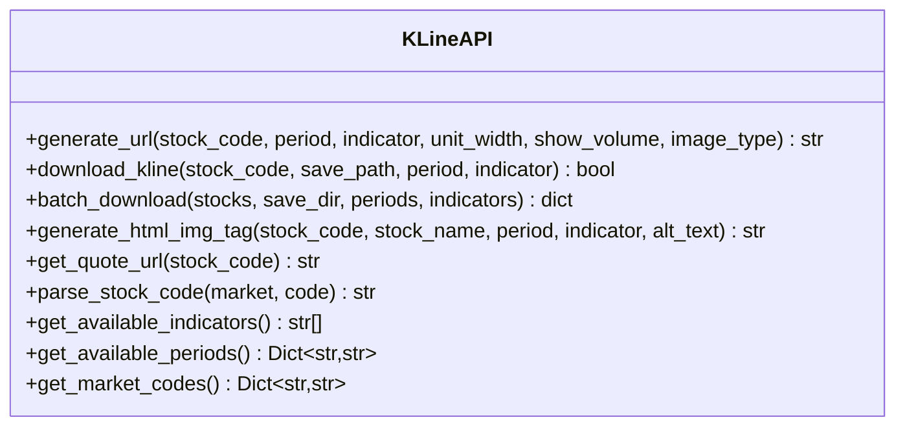
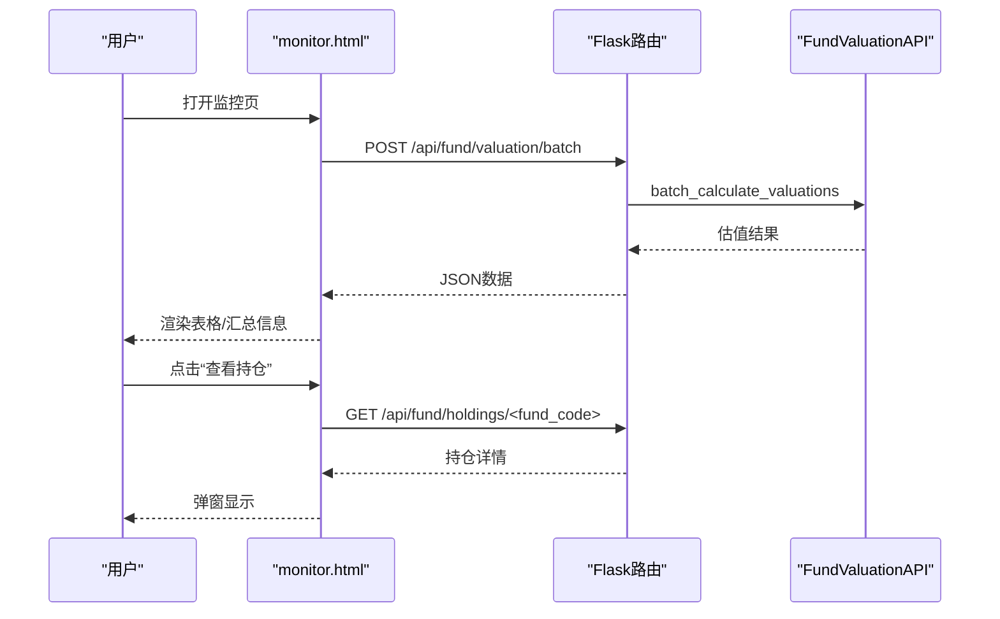
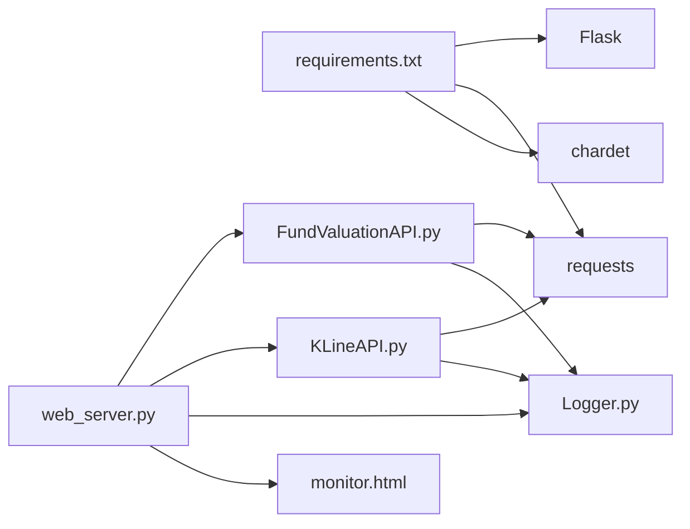

# 项目概述

<cite>
**本文引用的文件**
- [README.md](file://README.md)
- [web_server.py](file://web_server.py)
- [requirements.txt](file://requirements.txt)
- [api/FundValuationAPI.py](file://api/FundValuationAPI.py)
- [api/KLineAPI.py](file://api/KLineAPI.py)
- [utils/Logger.py](file://utils/Logger.py)
- [templates/monitor.html](file://templates/monitor.html)
- [scripts/zs_fund_online.py](file://scripts/zs_fund_online.py)
- [docs/基金估值快速开始.md](file://docs/基金估值快速开始.md)
</cite>

## 目录
1. [简介](#简介)
2. [项目结构](#项目结构)
3. [核心组件](#核心组件)
4. [架构总览](#架构总览)
5. [详细组件分析](#详细组件分析)
6. [依赖关系分析](#依赖关系分析)
7. [性能考量](#性能考量)
8. [故障排查指南](#故障排查指南)
9. [结论](#结论)
10. [附录](#附录)

## 简介
本项目是一个基于 Flask 的 Web 应用，提供“基金实时估值监控”和“股票K线图查询”两大核心能力。系统通过抓取公开数据源（天天基金网、东方财富网等），对基金前十大重仓股进行实时行情聚合，估算当日净值与涨跌幅；同时支持生成并展示股票/指数的多周期K线图，满足个人投资者对组合表现与市场走势的可视化监控需求。
- 主界面如下所示：

- 核心目标：以较低成本实现“轻量化、可配置、可扩展”的金融数据监控平台
- 主要特性：
  - 基金实时估值（基于前十大重仓股）
  - 预览-确认添加机制，降低误操作风险
  - 并发优化的批量估值计算
  - K线图URL生成与批量下载
  - 前端自动刷新与交互式管理

- 适用场景：
  - 个人投资者关注组合表现
  - 小型投研团队进行快速监控
  - 教学与学习金融数据采集与前端集成

- 技术栈：Python 3.7+、Flask、requests、chardet

**章节来源**
- file://README.md#L1-L193

## 项目结构
项目采用“模块化+模板化”的组织方式，核心模块包括：
- api：业务API封装（基金估值、K线图）
- utils：通用工具（日志）
- templates：前端模板（监控页、管理页）
- scripts：辅助脚本（静态页面生成）
- data/config/docs/tests：数据与配置、文档、测试
- web_server.py：Flask Web 服务入口

**图表来源**
- [web_server.py](file://web_server.py#L1-L552)
- [api/FundValuationAPI.py](file://api/FundValuationAPI.py#L1-L537)
- [api/KLineAPI.py](file://api/KLineAPI.py#L1-L345)
- [utils/Logger.py](file://utils/Logger.py#L1-L86)
- [templates/monitor.html](file://templates/monitor.html#L1-L918)
- [scripts/zs_fund_online.py](file://scripts/zs_fund_online.py#L1-L281)

**章节来源**
- file://README.md#L5-L42

## 核心组件
- Flask Web 服务（web_server.py）
  - 提供监控页、管理页渲染与REST API
  - 管理配置文件（基金列表、用户持仓、指数配置等）
  - 调用 FundValuationAPI 执行估值计算
- 基金估值API（FundValuationAPI）
  - 获取基金基本信息、前十大重仓股
  - 并发抓取股票实时行情，加权计算估算净值与涨跌幅
  - 支持本地缓存与强制联网更新
- K线API（KLineAPI）
  - 生成东方财富K线图URL，支持多种周期与技术指标
  - 提供批量下载与HTML图片标签生成
- 日志工具（Logger）
  - 基于RotatingFileHandler的日志记录，支持控制台输出
- 前端模板（monitor.html）
  - 展示估值表格、K线图、弹窗编辑持仓
  - 自动5分钟刷新与性能监控

**章节来源**
- file://web_server.py#L1-L552
- file://api/FundValuationAPI.py#L1-L537
- file://api/KLineAPI.py#L1-L345
- file://utils/Logger.py#L1-L86
- file://templates/monitor.html#L1-L918

## 架构总览
系统采用“Web 服务 + 业务API + 工具库 + 前端模板”的分层架构。Flask 负责路由与渲染，业务API负责数据抓取与计算，工具库提供日志与通用能力，前端模板负责用户交互与展示。

**图表来源**
- [web_server.py](file://web_server.py#L1-L552)
- [api/FundValuationAPI.py](file://api/FundValuationAPI.py#L1-L537)
- [api/KLineAPI.py](file://api/KLineAPI.py#L1-L345)
- [utils/Logger.py](file://utils/Logger.py#L1-L86)
- [templates/monitor.html](file://templates/monitor.html#L1-L918)

## 详细组件分析

### Flask Web 服务（web_server.py）
- 路由职责
  - 页面：/（监控页）、/admin（管理页）
  - 配置：/api/config（GET/POST）
  - 基金：/api/fund/list、/api/fund/preview/<fund_code>、/api/fund/add、/api/fund/remove/<fund_code>、/api/fund/holdings/<fund_code>（GET/PUT）、/api/fund/position/<fund_code>（PUT）
  - 估值：/api/fund/valuation/<fund_code>（GET）、/api/fund/valuation/batch（POST）
  - K线：/api/kline/url（POST，由前端直接使用KLineAPI生成URL）
- 关键流程
  - 监控页生成：读取配置，渲染 monitor.html
  - 批量估值：调用 FundValuationAPI.batch_calculate_valuations，合并用户持仓金额，计算总持仓与单日盈亏
  - 基金管理：预览-确认添加、编辑持仓、移除基金、更新持仓金额
- 错误处理与日志：统一使用 Logger 输出到 logs/web_server.log

**图表来源**
- [web_server.py](file://web_server.py#L183-L227)
- [api/FundValuationAPI.py](file://api/FundValuationAPI.py#L427-L452)

**章节来源**
- file://web_server.py#L54-L552

### 基金估值API（FundValuationAPI）
- 数据来源
  - 基金基本信息：天天基金网
  - 基金持仓：东方财富网（前十大重仓股）
  - 股票实时行情：东方财富网（批量/单个接口）
- 核心方法
  - get_fund_basic_info：解析JSONP，提取净值、估值、涨跌幅等
  - get_fund_top_holdings：优先本地缓存，否则联网抓取并保存
  - get_stock_realtime_quote：带重试与延迟，返回最新价、涨跌幅等
  - calculate_fund_valuation：并发获取行情，按持仓比例加权估算
  - batch_calculate_valuations：批量估值，聚合结果
- 并发策略
  - ThreadPoolExecutor(max_workers=5)，每个线程随机延迟，避免同时请求触发风控
- 数据验证
  - 基金代码格式校验（6位数字）
  - 持仓比例合计验证（>100%给出警告）

**图表来源**
- [api/FundValuationAPI.py](file://api/FundValuationAPI.py#L315-L426)

**章节来源**
- file://api/FundValuationAPI.py#L27-L537

### K线API（KLineAPI）
- 功能
  - generate_url：生成东方财富K线图URL（支持周期、指标、成交量开关、单位宽度等）
  - download_kline：下载K线图到本地
  - batch_download：批量下载多个股票、周期、指标的K线图
  - generate_html_img_tag：生成HTML图片标签
- 周期与指标
  - 周期：日线(D)、周线(W)、月线(M)、分钟(m/m5/m15/m30/m60)
  - 指标：MACD、KDJ、RSI、BOLL、MA、VOL、OBV、WR、CCI、DMI

**图表来源**
- [api/KLineAPI.py](file://api/KLineAPI.py#L15-L264)

**章节来源**
- file://api/KLineAPI.py#L1-L345

### 前端模板（monitor.html）
- 功能
  - 渲染监控页：基金估值表格、K线图网格
  - 自动刷新：每5分钟轮询估值接口
  - 交互：手动刷新、查看/编辑持仓、联网更新、管理入口
  - 性能监控：记录页面加载、K线图加载、估值刷新耗时
- 关键交互
  - 加载估值：POST /api/fund/valuation/batch
  - 查看持仓：GET /api/fund/holdings/<fund_code>
  - 编辑持仓：PUT /api/fund/holdings/<fund_code>
  - 联网更新：GET /api/fund/holdings/<fund_code>?force_update=true
  - 修改持仓金额：PUT /api/fund/position/<fund_code>

**图表来源**
- [templates/monitor.html](file://templates/monitor.html#L544-L640)
- [web_server.py](file://web_server.py#L183-L227)
- [api/FundValuationAPI.py](file://api/FundValuationAPI.py#L427-L452)

**章节来源**
- file://templates/monitor.html#L1-L918

### 日志工具（Logger）
- 特性
  - 支持文件与控制台双重输出
  - 日志轮转（单文件最大10MB，保留5个备份）
  - 可配置日志级别（debug/info/warning/error/critical）
- 使用
  - FundValuationAPI 与 KLineAPI 初始化时创建日志器
  - web_server.py 也使用 Logger 记录服务日志

**章节来源**
- file://utils/Logger.py#L1-L86

## 依赖关系分析
- 运行时依赖
  - Flask、requests、chardet
- 模块间依赖
  - web_server.py 依赖 FundValuationAPI、KLineAPI、Logger、Jinja2模板
  - FundValuationAPI 依赖 requests、re、json、concurrent.futures
  - KLineAPI 依赖 requests、typing、datetime、os
  - Logger 依赖 logging、logging.handlers、os

**图表来源**
- [requirements.txt](file://requirements.txt#L1-L4)
- [web_server.py](file://web_server.py#L1-L552)
- [api/FundValuationAPI.py](file://api/FundValuationAPI.py#L1-L537)
- [api/KLineAPI.py](file://api/KLineAPI.py#L1-L345)
- [utils/Logger.py](file://utils/Logger.py#L1-L86)

**章节来源**
- file://requirements.txt#L1-L4
- file://web_server.py#L1-L552

## 性能考量
- 并发优化
  - FundValuationAPI 使用 ThreadPoolExecutor(max_workers=5) 并发获取股票行情，显著提升批量估值效率
- 请求节流
  - 每个线程随机延迟0-0.2秒，避免同时请求触发风控
- 缓存策略
  - 优先使用本地缓存的持仓数据；支持强制联网更新
- 前端刷新
  - 监控页每5分钟自动刷新，减少人工干预
- 日志轮转
  - 避免日志文件过大影响性能

**章节来源**
- file://api/FundValuationAPI.py#L367-L393
- file://utils/Logger.py#L12-L56

## 故障排查指南
- 常见问题
  - 基金代码格式错误：需为6位数字
  - 基金不存在或无法访问：确认代码正确、网络正常
  - 无法获取持仓：可能是数据源限制或节假日
  - K线图加载失败：检查网络与数据源可用性
- 排查步骤
  - 查看日志：logs/web_server.log、logs/FundValuationAPI.log、logs/KLineAPI.log
  - 确认依赖安装：pip install flask requests chardet
  - 检查配置文件：data/zs_fund_online.json、data/zs_online.json
  - 使用文档：docs/基金估值快速开始.md、docs/Web界面使用说明.md
- 建议
  - 调整超时与重试参数
  - 控制刷新频率，避免过于频繁
  - 对于持仓比例异常（>100%）进行人工核对

**章节来源**
- file://README.md#L175-L181
- file://docs/基金估值快速开始.md#L323-L349

## 结论
本项目以 Flask 为核心，结合 FundValuationAPI 与 KLineAPI，构建了一个轻量、易用且可扩展的金融数据监控平台。通过并发优化与本地缓存策略，系统在保证实时性的同时兼顾性能与稳定性。前端模板提供直观的交互体验，适合个人投资者与小型团队日常使用。对于进阶用户，可在现有架构基础上扩展更多数据源、指标与可视化能力。

[本节不涉及具体文件分析，故无“章节来源”]

## 附录

### 快速开始（基于仓库内容）
- 安装依赖
  - pip install flask requests chardet
- 启动服务
  - 方式一：双击 启动服务器.bat
  - 方式二：python web_server.py
- 访问系统
  - http://localhost:5000

**章节来源**
- file://README.md#L44-L70
- file://requirements.txt#L1-L4
- file://web_server.py#L541-L552

### API一览（基于仓库内容）
- 基金相关
  - GET /api/fund/list：获取基金监控列表
  - GET /api/fund/preview/<fund_code>：预览基金持仓（不添加）
  - GET /api/fund/holdings/<fund_code>：获取基金持仓（支持force_update）
  - PUT /api/fund/holdings/<fund_code>：更新基金持仓
  - POST /api/fund/add：添加基金（预览-确认）
  - DELETE /api/fund/remove/<fund_code>：移除基金
  - PUT /api/fund/position/<fund_code>：修改用户持仓金额
  - GET /api/fund/valuation/<fund_code>：单个基金估值
  - POST /api/fund/valuation/batch：批量估值（含用户持仓金额/比例/单日盈亏）
- K线相关
  - POST /api/kline/url：生成K线图URL（由前端直接使用KLineAPI）

**章节来源**
- file://README.md#L132-L149
- file://web_server.py#L105-L539

### 设计理念与价值主张
- 设计理念
  - 低门槛：提供一键启动与简单配置
  - 可靠性：并发与缓存策略保障稳定性
  - 可扩展：模块化设计便于新增数据源与指标
- 核心价值
  - 为个人用户提供“看得见、管得着”的组合监控工具
  - 为学习者提供可运行、可理解的金融数据采集与前端集成范例

[本节不涉及具体文件分析，故无“章节来源”]